# 1. Indice

- [1. Indice](#1-indice)
- [2. Principi di base delle applicazioni](#2-principi-di-base-delle-applicazioni)
	- [2.1. Client-Server](#21-client-server)
	- [2.2. Peer-To-Peer (P2P)](#22-peer-to-peer-p2p)
	- [2.3. Comunicazione tra processi](#23-comunicazione-tra-processi)
	- [2.4. Sockets](#24-sockets)
- [3. Applicazioni client-server](#3-applicazioni-client-server)
	- [3.1. Protocolli Internet](#31-protocolli-internet)
	- [3.2. Web e `HTTP`](#32-web-e-http)
		- [3.2.1. Formato messaggi `HTTP`](#321-formato-messaggi-http)
		- [3.2.2. Cookies](#322-cookies)
		- [3.2.3. Proxy Servers](#323-proxy-servers)
		- [3.2.4. `HTTP+`](#324-http)
	- [3.3. Email e protocolli](#33-email-e-protocolli)
	- [3.4. DNS](#34-dns)
		- [3.4.1. Record del `DNS`](#341-record-del-dns)
		- [3.4.2. Registrazione di un nuovo record di dominio](#342-registrazione-di-un-nuovo-record-di-dominio)
- [4. Applicazioni Peer-To-Peer (P2P)](#4-applicazioni-peer-to-peer-p2p)
	- [4.1. Confronto P2P e client-server](#41-confronto-p2p-e-client-server)
	- [4.2. Protocollo BitTorrent](#42-protocollo-bittorrent)
- [5. Applicazioni di comunicazione in tempo reale](#5-applicazioni-di-comunicazione-in-tempo-reale)
	- [5.1. Streaming](#51-streaming)
		- [5.1.1. CDN](#511-cdn)
	- [5.2. Socket-API](#52-socket-api)


<div class="stop"></div>

# 2. Principi di base delle applicazioni

Nel mondo di oggi esistono milioni di milioni di applicazioni.

Per quanto queste applicazioni si occupino di campi completamente diversi, tutte seguono tutta una serie di regole e protocolli comuni.

Le applicazioni girano **solo** sugli _host_, e va sottolineato che per avere un _app_ distribuita è necessario che ci siano almeno due _host_ che comunicano utilizzando la rete.
I dispositivi del _Network Core_ non realizzano i livelli di **trasporto** e **applicazione**.

Le applicazioni possono essere strutturate secondo due modelli fondamentali:
- [**Client-Server**](#21-client-server)
- [**Peer-2-Peer**](#22-peer-2-peer)

## 2.1. Client-Server

In questo modello, storicamente più il primo, si hanno due interpreti:
- **client**: richiede un servizio (_browser_)
- **server**: fornisce un servizio (_web-server_)

Quello che è importante sottolineare è che i due ruoli **_sono nettamente distinti_**.
Da questo ne discendono diverse conseguenze.

<div class="flexbox" markdown="1">

|                                  **Server**                                   |                    **Client**                    |
| :---------------------------------------------------------------------------: | :----------------------------------------------: |
| Deve essere noto come raggiungere il servizio in un indirizzo `IP` permanente | Deve essere in grado di comunicare con il server |
|               Deve essere sempre disponibile su una porta nota                |    Potrebbe essere connesso non continuamente    |
|               Deve essere sempre disponibile e ricco di risorse               |        Può avere indirizzi `IP` dinamici         |
|          Per questioni di _data-scaling_ si trova in _data centers_           |  Non comunica direttamente con un altro client   |

</div>


## 2.2. Peer-To-Peer (P2P)

Questo diverso protocollo di comunicazione permette di evitare l'esigenza di avere un server sempre attivo.

Infatti si permette la comunicazione tra due _host_ diversi, che possono agire sia da _client_ che da _server_.

I pari (_peers_) richiedono servizi da altri _peers_ (spesso file), in modo che da quel momento in poi anch'essi possano fornirlo.
In questo modo si ha una _self scalability_.

Questa architettura risente però del fatto che i _peers_ non sono connessi costantemente, né utilizzano `IP` permanenti. Questo rende la gestione del modello molto complesso.

## 2.3. Comunicazione tra processi

Definiamo un **Processo**:
> È un programma che viene eseguito al'interno di un _host_

Si dividono in:
- **Processi client**: processi che iniziano la comunicazione
- **Processi server**: processi che attendono di essere contattati


All'interno dello stesso host, due processi possono comunicare tra di loro utilizzando _comunicazioni inter-processo_, definite dal sistema operativo.

Affinché due processi di _host_ diversi possano comunicare, lo fanno scambiandosi messaggi.

In applicazione `P2P` le applicazioni hanno sia _processi client_ che _processi server_.

## 2.4. Sockets

Per poter scambiare messaggi si utilizzano le _socket_.

Le _socket_ sono strutture fisicamente reali, che gestiscono le comunicazioni come se fossero delle porte.
I processi che inviano messaggi li fanno uscire dalla _socket_. Questi processi si affidano sull'infrastruttura "dall'altro lato della porta" per consegnar ecorrettamente il messaggio all'altro _socket_.

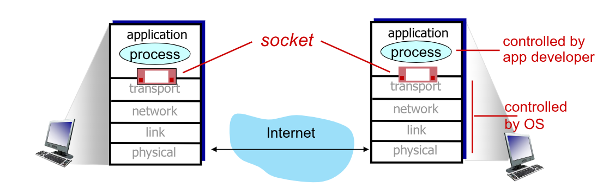


Quando un messaggio viene inviato attraverso una `SEND`, questa sfrutta le _socket_ per riuscire a inviare e trasmetterlo.

Per ricevere i messaggi ogni processi deve avere un **identificatore**, che nei dispositivi _host_ è:
- `IP` **unico** a `32bit` (`IPv4`) o `64bit` (`IPv6`) definisce il calcolatore
- _Numero di porta_ associato al processo dell'host

# 3. Applicazioni client-server

Esistono tantissipi tipi diversi di applicazioni, e ognuna di esse segue uno o più protocolli di riferimento che permetteno la corretta trasmissione dei messaggi tra le due.

Un protocollo di livello applicazione definisce il formato dei messaggi che l'applicazione invia e riceve.
La sintassi del messaggio comprende:
- Tipo del messaggio scambiato: `Request` in caso di richieste o `Response` per le risposte
- Sintassi del messaggio: quali campi sono presenti e come sono delineati
- Semantica del messaggio: comprende il significato dell'informazioni nei campi
- Regole di comportamento: sanciscono come l'applicazione deve comportarsi prima, durante e dopo lo scambio del messaggio.

Di questi protocolli ce ne sono tanti, di diverse forme:
- _Open Protocols_: sono protocolli messi a disposizione di chiunque, definiti attraverso `RFC` ufficiali o testi di riferimento non ufficiali. Permettono l'interoperabilità. Alcuni esemppi sono l'`HTTP` e l'`SMTP`
- _Protocolli proprietari_: sono protocolli privati esclusivi degli ideatori. Un esempio era il protocollo utilizzato da Skype

Per sviluppare un applicazione dobbiamo prima capire come i dati vengono trasferiti. Infatti alcune applicazioni hanno necessità di garanzie sull'**integrità dei dati**. Se infatti durante l'invio di un file si verificassero molti errori, il file risulterebbe _corrotto_, incorretto o addirittura inutilizzabile. Altre applicazioni invece non necessitano la correttezza al 100% dei dati ma tollerano alcuni errori. Un esempio sono le applicazioni che si occupano di trasmissione di audio e/o video, dove piccole perdite dei dati non influiscono sulla qualità del prodotto finale.

È inoltre importante stabilire le esigenze sul _delay_ di invio e ricezione messaggi.
Per applicazioni _real-time_, come i _live streaming_ o giochi online, è richiesto infatti un _delay_ basso per essere efficace, per applicazioni _asincrone_ invece è tollerabile anche un _delay_ più ampio.

Anche il _throughput_ per alcune app, come ad esempio quelle multimediali o di streaming, è necessario rispetti un certo minimo per renderle efficaci. Altre app invece, dette **elastiche**, possono utilizzare qualsiasi _throughput_.

Ultimo, ma non meno importante, è invece la **sicurezza** che l'applicazione richiede. Alcune applicazioni infatti maneggiano informaizoni sensibili per i quali vogliamo che i dati siano sempre al sicuro, altre invece che non maneggiano alcuna informazione si possono accontentare di sicurezze minori.

Una tabella che mostra alcuni requisiti per applicazioni comuni è la seguente:

<div class="flexbox" markdown="1">

|        Applicazione         | Perdita Dati |                    Throughput                     | Sensibilità al delay |
| :-------------------------: | :----------: | :-----------------------------------------------: | :------------------: |
| Trasferimento file/Download |      No      |                     Elastico                      |       Nessuna        |
|            email            |      No      |                     Elastico                      |       Nessuna        |
|        Documenti Web        |      No      |                     Elastico                      |       Nessuna        |
|    Audio/Video real-time    |  Tollerante  | audio: `5Kbps`-`1Mbps`<br>video: `10Kbps`-`5Mbps` |        `10ms`        |
|    Streaming Audio/Video    |  Tollerante  | audio: `5Kbps`-`1Mbps`<br>video: `10Kbps`-`5Mbps` |      pochi `ms`      |
|     Giochi Interattivi      |  Tollerante  |                      `Kbps+`                      |        `10ms`        |
|   Messaggistica di testo    |      No      |                     Elastico                      |       Nessuna        |

</div>

## 3.1. Protocolli Internet

I servizi di comunicazione su internet sono il protocollo `TCP` e quello `UDP`.

<div class="grid2">
<div class="top">
<div class="p"><code>Servizio `TCP`</code></div>

È un protocollo di trasporto **affidabile** nei processi di invio e ricezione.

Permette di controllare il flusso di comunicazioni, così da non sovraccaricare di messaggi il ricevitore.

Implementa servizi di controllo delle congestioni, ... quando il network è sovraccaricato.

Non da garanzie sul delay, sul throughput minimo né sulla sicurezza, ma si orienta sulla connessione: è infatti necessario un setup tra i processi client e quelli server.

</div>
<div class="top">
<div class="p"><code>Servizio `UDP`</code></div>

È un servizio di trasferimento "non affidabile", ovvero che non prevede l'affidabilità delle comunicazioni. I dati possono arrivare non in ordine o affetti da errore.

Non prevede affidabilità, controllo di flusso e di congestione, di delay, di throughput né di sicurezza.

Anche se sembra che questo servizio sia praticamente inutile e inefficace, questo è ampiamente utilizzato, poiché **_permette comunicazioni delle informaizoni più rapide e semplici_**.

</div>
</div>

Di seguito vediamo quale protocollo utilizzano comunemente le applicazioni web:

<div class="flexbox" markdown="1">

|        Applicazione         |          Application Layer Protocol           | Protocollo di trasporto |
| :-------------------------: | :-------------------------------------------: | ----------------------: |
| Trasferimento file/Download |                 FTP [RFC 959]                 |                   `TCP` |
|           e-mail            |                SMTP [RFC 5321]                |                   `TCP` |
|        Documenti Web        |              HTTP 1.1 [RFC 7320]              |                   `TCP` |
|     Telefonia Internet      | SIP [RFC 3261], RTP [RFC 3550] o proprietario |           `UDP` o `TCP` |
|    Streaming Audio/Video    |             HTTP [RFC 7320], DASH             |           `TCP` o `UDP` |
|     Giochi Interattivi      |            WOW, FPS (proprietario)            |           `UDP` o `TCP` |
</div>

I _socket_ `TCP` e `UDP` di base non forniscono alcuna _encryption_, infatti trasmettono anche dati sensibili, come le password, come `cleartext`.

Per poter garantire l'encriptazione dei dati si utilizza il servizio `TLS` (_Transport Layer Security_). Questo servizio permette di utilizzare connessioni `TCP` criptate che garantiscono non solo l'integrità dei dati, ma anche un autenticazione end-point.

Il protocollo deve però essere implementato dalle applicazioni, che utilizzano librerie `TLS` sulle connessioni `TCP`.

Inoltre fornisce delle `TLS socket API` che criptano il `cleartext` fornito alla _socket_ prima di inviarlo su internet. Vedremo meglio come funziona più avanti.

## 3.2. Web e `HTTP`

Prima di vedere le applicazioni web facciamo prima un breve ripasso.

Le pagine web consistono di **oggetti**, che possono essere salvati su web server differenti. Questi oggetti possone essere file `HTML`, immagini `JPEG`, _applet_ `Java`, file audio `mp3`, ...

In genrale:
> Una pagina web consiste in un file `HTML` di base che include diversi riferimenti ad oggetti, recuperabili attraverso `URL`
$$
\underbrace{\text{www.someschool.edu}}_{\textit{host name}}\text{/}\underbrace{\text{someDept/pic.gif}}_{\textit{path name}}
$$

La sigla `HTTP` sta per _hypertext transfer protocol_, ed è un protocollo di livello **applicazione**.
Si basa sul modello _client/server_:
- _client_: tipicamente un browser che richiede, riceve e mostrare gli _Web object_
- _server_: tipicamente un web server che invia _Web object_ in risposta alle richieste

Il protocollo `HTTP` utilizza comunicazioni `TCP`. In particolare il client, quando fa una richiesta, inizializza la connessione `TCP` (ovvero crea un _socket_) al server nella porta `80`. Il server accetta la connessione `TCP` del client, e viene invializzato uno scambio di messaggi `HTTP` tra il _browser_ (`HTTP client`) e il _web server_ (`HTTP server`).
Al termine la connessione `TCP` viene chiusa.

Questo protocollo si dice _stateless_, infatti il server **non salva alcuna informazione sulle precedenti richieste di un client**.
Infatti i protocolli che mantengono uno stato sono più complessi, in quanto richiedono non solo il salvataggio degli stati con ciascuno dei client, ma anche unasincronizzazione tra le informazioni del client e del server qual'ora uno dei due crashasse e gli stati diventassero incosistenti.

Le connessioni `HTTP` si classificano in due tipologie
<div class="grid2">
<div class="top">
<div class="p"><code>HTTP non persistente</code></div>

Questa tipologia:
1. Apre una connessione `TCP`
2. Invia **al massimo _un oggetto_** attraverso la connessione
3. Chiude la connessione `TCP`

Questo implica che l'invio di più oggetti richiede tante connessioni quanti sono gli oggetti.

</div>
<div class="top">
<div class="p"><code>HTTP persistente</code></div>

Questa tipologia invece:
1. Apre la connessione `TCP` con il server
2. Invia **_più oggetti_** tra il client e il server sulla medesima connessione `TCP`
3. Chiude la connessione `TCP`

</div>
</div>

Le due tipologie hanno un'importante influenza sul tempo di risposta delle richieste.

Definiamo il `RTT` (_Round Trip Time_):
> È il tempo necessario ad un piccolo pacchetto per andare dal client al server e poi tornare

Nel caso di `HTTP non persistente`, per ogni oggetto abbiamo:
- 1 `RTT` per inizializzare la connessione `TCP`
- 1 `RTT` per la richiesta `HTTP` e l'attesa dei primi byte della risposta
- Tempo di trasmissione de file/oggetto

In totale il tempo di risposta è $2\text{RTT} + \text{tempo di trasmissione oggetto}$

Con questo approccio l'unico modo per migliorare le prestazioni è effettuare **più connessioni `TCP` parallele** per ognuno degli oggetti da recuperare.

Utilizzando invece connessioni `HTTP presistenti` (`HTTP1.1`) ilserver lascia la connessione aperta dopo aver inviato la prima risposta. Di conseguenza i messaggi `HTTP` tra gli stessi client/server sono inviati sulla stessa connessione, ogni qual volta che il client incontra il riferimento ad un nuovo oggetto. Abbiamo quindi che nel caso minimo abbiamo un sono `RTT` per tutti gli oggetti, _dimezzando il tempo di risposta_.

### 3.2.1. Formato messaggi `HTTP`

Esistono due tipi di messaggi `HTTP`: `request` e `response`

Le `request HTTP` sono scritte in formato `ASCII`.

<div class="grid3">
<div class="">

Ogni riga è divisa dai caratteri `\r\n` di ritorno a carrello e nuova riga

La prima riga rappresenta la _request line_ che può utilizzare tre comandi:
- `GET`: per inviare dati al server. Include i dati dell'user direttamente nell'`URL` della richiesta `HTTP`, inserite subito dopo il carattere `?`
  - `www.somesite.com/animalsearch?monkeys&banana`
- `POST`: invia oltre la pagina web anche gli input di un form, inviati in un corpo identità chiamato `HTTP POST request message`
- `HEAD`: richiede solamente gli header, senza gli oggetti. È spesso utilizzato durante le fasi implementative
- `PUT`: permette di caricare nuovi file/oggetti al server rimpiazzando completamente il file che esiste nell'`URL` specificato con il contenuto della `POST HTTP request message`

Successivamente abbiamo gli le righe di _header_ che contengono diverse informazioni.

Gli ultimi caratteri sono i 4 caratteri `\r\n\r\n`.

</div>
<div class="">

Un esempio:
```log
GET /index.html HTTP/1.1\r\n
Host: www-net.cs.umass.edu\r\n
User-Agent: Firefox/3.6.10\r\n
Accept: text/html,application/xhtml+xml\r\n
Accept-Language: en-us,en\r\n
Accept-Encoding: gzip,deflate\r\n
Connection: keep-alive\r\n
\r\n
```
</div>
<div>
<figure class="100">
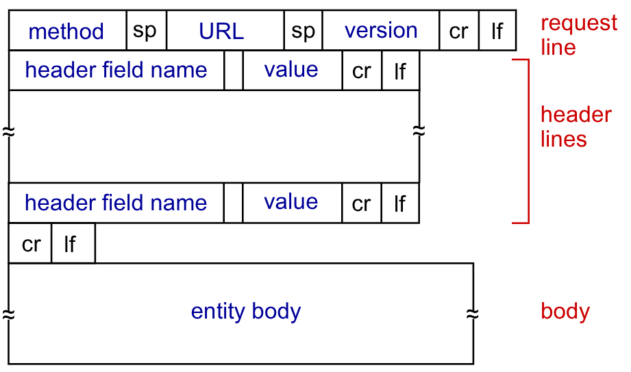
<figcaption>

Il formato generale
</figcaption>
</figure>
</div>
</div>

Anche le `HTTP response` sono scritte in caratteri `ASCII`:
```log
HTTP/1.1 200 OK\r\n
Date: Sun, 26 Sep 2010 20:09:20 GMT\r\n
Server: Apache/2.0.52 (CentOS)\r\n
Last-Modified: Tue, 30 Oct 2007 17:00:02
GMT\r\n
Content-Length: 2652\r\n
Keep-Alive: timeout=10, max=100\r\n
Connection: Keep-Alive\r\n
Content-Type: text/html\r\n
\r\n
data data data data data ...
```

Nella prima riga troviamo subito lo **status code**. Questo codice compare in ogni risposta nell'architettura _client-server_.

Ogni codice ha un significato, alcuni sono:
- `200 OK`: richiesta completata con successo. L'oggetto richiesto si trova dopo nel messaggio
- `301 Moved Permanently`: oggetto della richiesta spostato, la nuova locazione è specificata dopo nel messaggio (sezione `Location: `)
- `400 Bad Request`: `HTTP request` non compresa dal server
- `404 Not Found`: documento richiesto non trovato su questo server
- `505 HTTP Version Not Supported`

È possibile provare a inviare delle richieste a dei server direttamente dalla shell attraverso il comando `telnet`:
```bash
# Apriamo una connessione TCP alla porta 80 del sito gaia.cs.umass.edu
telnet gaia.cs.umass.edu 80

# da adesso tutto quello che scriveremo sarà inviato alla porta 80 del webserver
# possiamo scrivere una richiesta GET
GET /kurose_ross/interactive/index.php HTTP/1.1
Host: gaia.cs.umass.edu

# Dopo aver effettuato un doppio invio questa breve richiesta GET viene effettuata al server
```
La risposta del server è questa:
> HTTP/1.1 200 OK
> Date: Wed, 01 Oct 2025 14:05:18 GMT
> Server: Apache/2.4.6 (CentOS) OpenSSL/1.0.2k-fips PHP/7.4.33 mod_perl/2.0.11 Perl/v5.16.3
> X-Powered-By: PHP/7.4.33
> Set-Cookie: DevMode=0
> Transfer-Encoding: chunked
> Content-Type: text/html; charset=UTF-8
>
> 398b
>
> &lt;!DOCTYPE HTML&gt;
> &lt;html&gt;
> ...


### 3.2.2. Cookies

Ricordando che le interazioni tramite `HTTP GET/` sono _stateless_, non abbiamo alcuna nozione per effettuare scambi a più step di messaggi `HTTP` per completare una **trasazione**.

Si utilizzano quindi i _Cookies_. I _Cookies_ permettono di rendere **stateful** il protocollo _stateless_.

In questo modo, quando l'utente lo desidera, è possibile conservare lo stato attraverso gli step della transizione.
Permettono inoltre di recuperare le transizione parzialmente completate.

Il meccanismo dei cookies ha 4 componenti:
- Inserimento della **cookie header line** del messaggio `HTTP response`
- Inserimento della **cookie header line** del messaggio `HTTP request`
- Salvataggio del **cookie** nell'_host client_, gestiti nel file dei _cookie_ dal _browser_
- Salvataggio dei cookie assegnati all'interno del _website_ attraverso un database

Adesso le comunicazioni hanno una forma simile a questa:

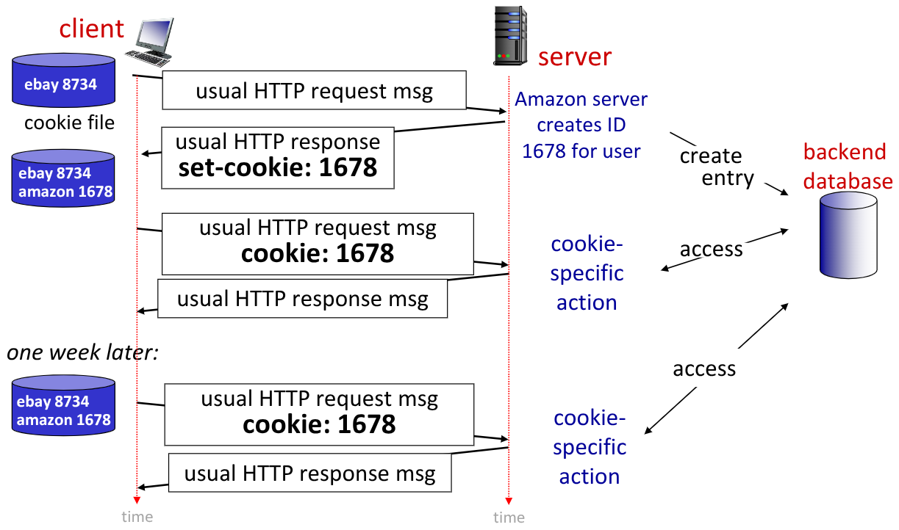

I _cookie_ possono essere utilizzati per diversi scopi:
- Concessione di autorizzazioni
- Mantenimento di carrelli di acquisti
- Raccomandazioni e preferenze
- User sessione state
- ...

Il meccanismo dei cookie non è l'unico con il quale è possibile mantenere lo stato. Infatti è possibile implementare anche diversi _endpoints protocol_ per ottenere lo stesso risultato.

I _cookies_ permettono ai siti di apprendere molte informazioni relative all'utente che naviga su un dato sito. In particolare esistono i _third party persistent cookies_ che sono dei _cookies di tracciamento_ che permettono di associare ad un itente un identità comune tracciabile attraverso diversi siti web.

### 3.2.3. Proxy Servers

I tempi di risposta nelle applciazioni devono rispettare dei vincoli di tempo sotto i quali è impossibile andare.

Si è cercato quindi di dei metodi per soddisfare le richieste dei _client_ senza contattare direttamente **il server di origine**.

Per fare ciò si utilizza un protoccolo simile a quello utilizzato nei processori. Infatti anche in questo caso possiamo applciare i principi di località, spaziale e temporale.

Ha quindi senso pensare ad una _web cache_ che permette di evitare le richieste già effettuate in precedenza.

In questo modo, l'utente configura il proprio browser a consultare una _Web Cache_ (**Proxy**), che verrà adesso consultata per tutte le richieste:
- Se gli oggetti richiesti sono nella cache vengono restituiti immediatamente, tagliando di molto i tempi di risposta
- Se gli oggetti non sono presenti, il _server proxy_ effettua la richiesta al server di origine e salva localmente la risposta prima di restituirla al _client_.

I **proxy** agiscono:
- da client quanto effettuano le richiesta ai server originali
- da server quando inviano le informazioni già ottenute al client

Tipicamente queste _web cache_ sono installate direttamente dalle `ISP`

Grazie al _proxy_ si raggiungono diversi vantaggi:
- Diminuisce il tempo di risposta al _client_, data proprio la vicinanza
- Diminuisce il traffico all'access link degli `ISP`
- Diminuisce il traffico su internet, diminuendo le probabilità di congestione

Può capitare che la copia contenuta nel **proxy** sia obsoleta, poiché il server ha aggiornato la sua versione della pagina.

Si utilizzano in questi casi le `conditional GET`. permettono di inviare l'oggetto solo se la versione contenuta dal server è più recente di quella contenuta in cache.
Questo è possibile con l'introduzione di un nuovo parametro `if-modified-since: <date>`.
È infatti sufficiente inserire come argomento la data della versione della copia contenuta, e il server risponderà:
- Con l'oggetto se è stato aggiornato più recentemente
- Con risposta `HTTP/1.0 304 Not Modified`

### 3.2.4. `HTTP+`

Fin'ora abbiamo parlato dello _standard_ `HHTP1.0`.

Nella versione `1.1` venne aggiornato l'algoritmo di _scheduling_ introducendo l'algoritmo `FCFS` (_FIrst-Come-First-Serve_).
In questo modo è stata introdotta la possibilità di effettuare richieste `GET` **multiple e in pipeline**.

Infatti adesso il server risponde in ordine, tuttavia si verificano problem idi `HOL blocking` (_Head-of-Line blocking_), dove oggetti più massicci possono bloccare oggetti più piccoli.
Inoltre i processi di recupero pacchetti persi, bloccano la trasmissione degli oggetti.

Con l'introduzione di `HTTP/2` ([RFC 7540,2015]) è stata aumentata la flessibilità con il quale i _server_ inviano gli oggetti al client.
Con questo protocollo tutti gli oggetti vengono **divisi in _frame_**. In questo modo è possibile per il server comunicare i gli oggetti in base alla priorità che il client gli assegna. 
Dividendo infatti gli oggetti in frame, il server invia ogni frame in base alla priorità, magari interromplendo l'invio di un oggetto con l'invio di un altro.

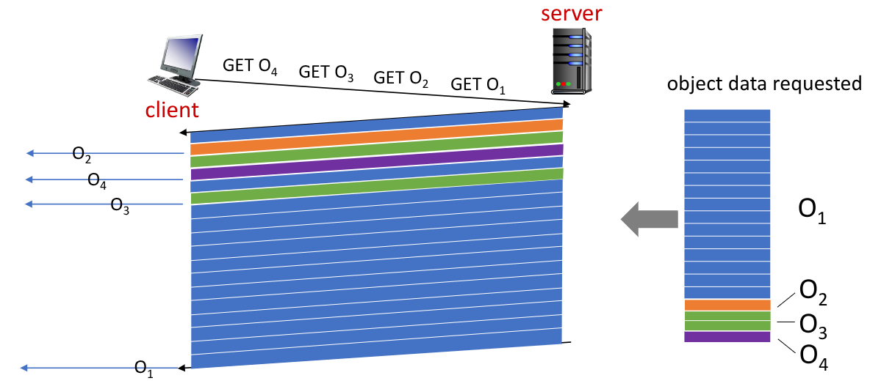

Il protocollo `HTTP/2` opera ancora sul protocollo `TCP`, che quindi non fornisce alcun mezzo di sicurezza.

Oggi stiamo transitando verso `HTTP/3` che invece aggiunge nativamente la sicurezza, migliora il controllo in caso di errori e congestioni. Per fare ciò si utilizzano connessioni `UDP`, che permette di evitare di aprire le connessioni.

Più informazioni su questo metodo si vedranno nei corsi magistrali.

## 3.3. Email e protocolli

Quando parliao di posta elettronica ci sono 3 attori principali:
- L'user agent
- I server di posta elettronica
- Il _Simple Mail Transfer Protocol_ `SMTP`

L'user agent corrisponde al software che permette di accedere e inviare la posta elettronica.

I mail server contengono i messaggi (codificati in `7-bit ASCII`) in entrata all'interno della _mailbox_.
I messaggi, quando vengono inviati, vengono inseriti in una coda di messaggi da mandare.
LO stesso _mail server_ si comporta da:
- Client: quando invia dei messaggi che ha ricevuto
- Server: quando riceve dei messaggi inviati da altri _web server_

Il protocollo con il quale i server comunicano con i client si chiama `SMTP`.
Si basa sul protocollo `TCP`, inizialmente utilizzando la porta `25`. La connessione è diretta, i due _mail server_ che comunicano affrontano tre fasi di scambio durante la fase di trasferimento:
- _Handshake_
- Trasferimento vero e proprio
- _Chiusura_

L'interazione è di tipo _command/response_:
- I **commands** sono rappresentato da `ASCII text`
- Le **response** sono in un formato che comprende codice di status e descrizione

Facciamo quindi un esempio per vedere come avviene il trasferimento di posta elettronica tra **Alice** e **Bob**:

1. **Alice** utilizza un _user agent_ (gmail, Outlook, ...) per scrivere un messaggio a `bob@some.edu`
2. L'_UA_ invia il messaggio al **proprio mail server**, posizionandolo nella _message queue_
3. Il mail server di **Alice** si comporta da client inizializzando una connessione `TCP`, seguendo il protocollo `SMTP`, con il _mail server_ di **Bob**
4. I messaggi vengono trasferiti sulla connessione
5. Il _mail server_ di **Bob** conserva i messaggi trasferiti nella _mailbox_ di **Bob**
6. Quando **Bob** aprirà il suo _UA_ troverà i messaggi che potrà leggere


Possiamo immaginare che il protocollo `SMTP` sia qualcosa del genere (S server, C client):
```log
S: 220 hamburger.edu
C: HELO crepes.fr
S: 250  Hello crepes.fr, pleased to meet you 
C: MAIL FROM: <alice@crepes.fr> 
S: 250 alice@crepes.fr... Sender ok 
C: RCPT TO: <bob@hamburger.edu> 
S: 250 bob@hamburger.edu ... Recipient ok 
C: DATA 
S: 354 Enter mail, end with "." on a line by itself 
C: Do you like ketchup? 
C: How about pickles? 
C: . 
S: 250 Message accepted for delivery 
C: QUIT 
S: 221 hamburger.edu closing connection
```


Oggi la porta `25` non è più utilizzata per motivi di sicurezza, tuttavia alcuni _mail server_ consentono ancora comunicazioni su quella porta.
Con questi _mail server_ è possibile provare a connettersi anche dalla shell:
```bash
telnet <server_name> 25
```

Il protocollo `SMTP` e quello `HTTP` sono simili:

<div class="flexbox" markdown="1">

|                           |                                 `SMTP`                                 |                       `HTTP`                        |
| :------------------------ | :--------------------------------------------------------------------: | :-------------------------------------------------: |
| **Comportamento**         |                           _command/response_                           |                 _request/response_                  |
| **Tipo** di comunicaizone |                                 _push_                                 |                       _pull_                        |
| **Comunicazione**         |                              persistente                               |
| **Formato Oggetti**       | Più oggetti inviati in un singolo messaggio, codifica to `7-bit ASCII` | Ogni messaggio incapsulato in un messaggio apposito |

</div>

Il protocollo `STMP` è definito in `RFC 531`, mentre la sintassi del messaggio è definita da `RFC 822`:
- **Header** line
  - To:
  - From:
  - Subject:
  - ....
- **Corpo del messaggio**: codificato solo con caratteri `ASCII`

Il protocollo `SMTP` in realtà descrive solo il protocollo di comunicazione per inviare i messaggi ai _mail server_ del destinatario, non al suo _user agent_. Infatti se l'_UA_ fosse spento sarebbe impossibile inviarvi messaggi, andando a perderli.

Per recuperare le mail dal proprio _mail server_ esistono altri due protocolli:
- `IMAP` (_Internet Mail Access Protocol_): definito in `RFC 3501`, i messaggi rimangono salvati sul server. Il protocollo permette il recupero, l'eliminazione e l'incartellamento dei messaggi sul server. Sull'_UA_ si hanno dei riferimenti ai messaggi nella _mailbox_.  Più client diversi vedono quindi sempre tutta la stessa posta.
- `POP`: i messaggi vengono _"poppati"_, ovvero estratti dal _mail server_, spostandoli permanentemente su un _client_. Con questo protocollo se un _client_ accede al _mail server_ dopo un'altro, non vede la posta già visualizzato dal primo.

Oggi esistono tantissime interfacce web basate su `SMTP`/`IMAP`(`POP`) per inviare e reucperare le email. (gmail, Hotmail, Yahoo!Mail,)

## 3.4. DNS

Il `DNS` (_Domain Name System_) è ciò che permette alle personi di tradurre gli _URL_ in indirizzi `IP`.

Precedentemente avevamo già visto come sul web ogni host e router sia identificato dagli indirizzi `IP` su `32bit` (o `128bit` nelle versioni moderne, ma non li affronteremo). Tuttavia, come umani, siamo più avvezzi a ricordare dei **nomi simbolici** piuttosto che delle **sequenze di numeri**.

Il `DNS` implementa un **database distribuito**, basato sulla gerarchia dei _nomi di dominio_. Un dominio può rappresentare un'organizzazione (tipicamente americana) privata, in questo caso chiamati _Top-Level Domain_ `TLD`, oppure di uno stato (_Country Code TLD_) `CCTLD`.
In questo modo si riduce l'univocità solo all'interno del dominio di riferimento. L'ente che si occupa di gestire l'assegnazione dei nomi all'interno dei domini è l'`ICANN` (_Internet Corporation for Assigned Names and Numbers_). Per farlo essa mantiene un registro dei nomi (sottodomini) registrati all'interno del dominio di riferimento.

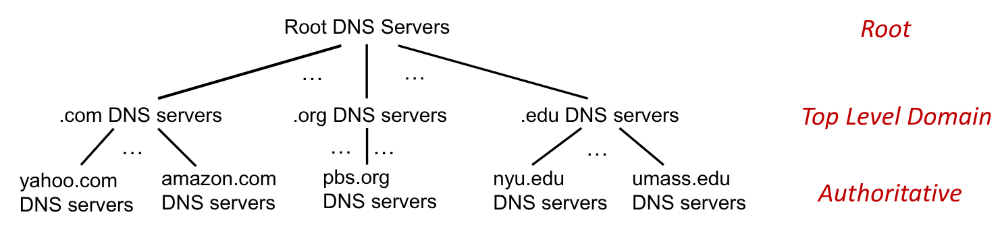


Il `DNS` fa parte del livello applicazione: sono infatti gli _host_ che effettuano le richieste con i **nomi simbolici**, ed è quindi necessario ancora prima di effettuare la richiesta vera e propria di effettuare la _resolve_ del nome in un indirizzo.

Questo step comporta però un elevata complessità sul _Network Edge_. Proprio per questo non esiste un unico server `DNS` centrale, che provocerebbe:
- La creazione di un singolo _point of failure_
- La creazione di un enorme volume di traffico (infatti un server locale può andare in contro a più di `600B` queries)
- Il difficile mantenimento di un database enorme e distante dai vari _client_

Il `DNS` si occupa quindi di:
- Tradurre _hostname_ in indirizzi `IP`
- _host aliasing_: permette di avere più _hostname_ per lo stesso indirizzo `IP`
- _mail server aliasing_
- Distribuire il carico sui vari web server. Il `DNS` è replicato sui vari server in maniera furba. Infatti, per non avere copie enormi dello stesso database, si fa in modo che più _hostname_ diversi, che avrebbero traduzioni diverse, puntino tutte allo stesso webserver. Quest'ultimo si occuperà di ritradurre l'_hostname_ secondo il proprio `DNS`, che stavolta potrebbe essere per quegli indirizzi più specifico.


Se un client vuole trovare l'`IP` di `www.amazon.com`, possiamo approssimare la sua ricerca come:
- Query al server di _root_ per trovare il `DNS` server per traduzioni `.com`
- Query al server `DNS` dei `.com` per trovare il server `DNS` per `amazon.com`
- Query al server `DNS` di `amazon.com` per trovare l'`IP`di `www.amazon.com`

Esistono 13 server di _root_ sparsi per il mondo (nessuno in Italia), ognuno implementato da _server factory_. 
Questi server sono in realtà contattati come _last-resort_ dai server di dominio che non riescono ad effettuare la traduzione.
Questi hanno però un **_importanza incredibile_** per il funzionamento di internet.

I server `DNS` si dicono **authoritative** se sanno tradurre l'_url_ in indirizzo `IP` invece di rimandare ad altri `DNS` server.
I server `TLD` sono **authorative** per i domini come: `.com`, `.org`, `.net`, `.edu`, `.aero`, `.jobs`, `.museums` e tutti i `CCTLD` come: `.it`, `.uk`, `.fr`, `.ca`, `.jp`, `.cn`.

Esiste un `local DNS server` che potrebbe non rispettare la gerarchia (in realtà cc'è anche un secondario per affidabilità). Sono forniti dagli `ISP` (o dalle organizzazioni private), e sono conosciuti anche sotto al nome di _default name server_.

Il suo ruolo è quello di agire da _proxy_, quando un host richiede un a traduzione, il risultato viene prima salvato nella _cache_ dal `lDNSs`, così da non dover rieffettuare la richiesta in un secondo momento.

Esistono due modi per effettuare le richieste di traduzione. Immaginiamo di avere:
- host: `enineering.nyu.edu`
- host: `gaia.cs.umass.edu`

<div class="grid2">
<div class="top">
<div class="p">Query Iterativa</div>


Quando si effettua una richiesta il `lDNSs` (se questo non ha la traduzione), lui chiede al server di _root_.
Se il _root_ non ha la traduzione ritorna al `lDNSs` l'indirizzo `IP` del `DNSs .edu`
Il `lDNSs` chiede quindi a `DNSs .edu`, anche lui non **authorative**, che lo rimanda al `DNSs umass.edu`

La richiesta del `lDNSs` a `DNSs umass.edu` può essere **authorative** che restituisce finalmente l'indirizzo `IP`, che viene prima salvato e poi inviato al _client_, che solo adesso più aprire la connessione `TCP`.

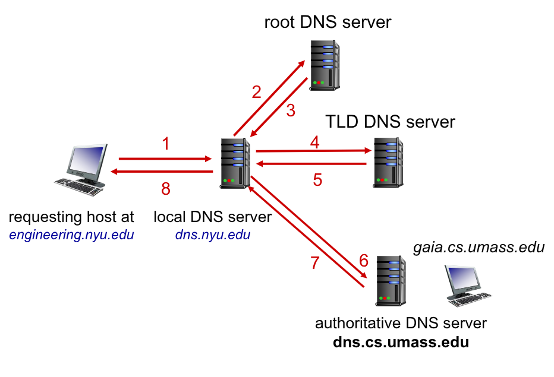


</div>
<div class="top">
<div class="p">Query Ricorsiva</div>

Funziona in maniera simile a quella delle query iterative, ma sono i `DNSs` stessi a effettuare le richieste per i livelli inferiori.

In questa orchitettura sono quindi necessari più _cache level_ per ogni `DNSs` così da diminuirne il carico.

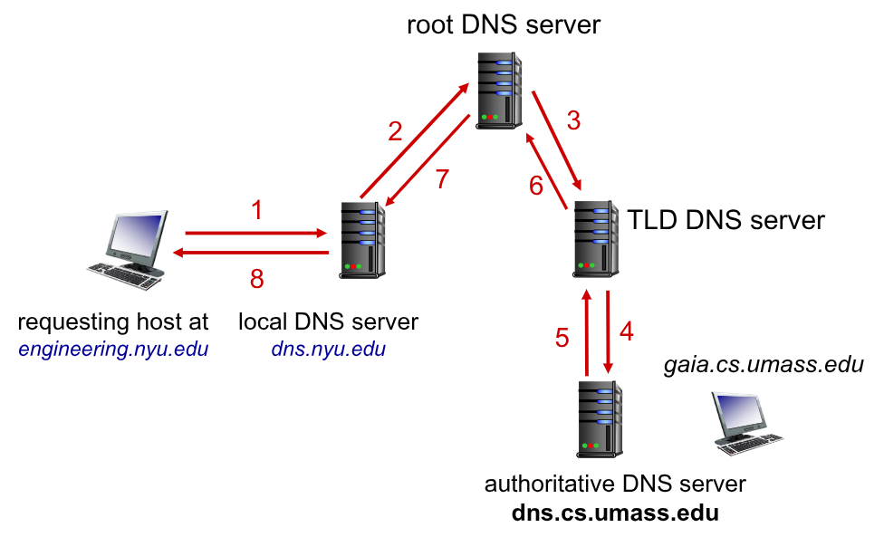

</div>
</div>

Quando un `DNSs` impara una nuova traduzione, la salva in locale su una sua _cache_ interna. Un entrata di questa _cache_ **scade**, ovvero viene rimossa, dopo un _time-to-live_ `TTL`.

È quindi possibile che le entrate locali di un `DNSs` possano tutte essere scadute, oppure non aggiornate correttamente con la traduzione attuale (in caso di cambio di `IP` da parte di un host già cachato)

I meccanismi di aggiornamento e di notifica sono descritti dallo standard `IETF` nel `RFC 2136`.

### 3.4.1. Record del `DNS`

Abbiamo detto che il `DNS` è un database disribuito che conserva _resource records_ `RR`.
Il loro formato è il seguente:
<div class="p"><code>(name, value, type, ttl)</code></div><br>

A seconda del `type` gli altri parametri (tranne il `ttl`) hanno significati diversi:

<div class="flexbox" markdown="1">

| **Type** |                 **Name**                  |                    **Value**                    |
| :------: | :---------------------------------------: | :---------------------------------------------: |
|   `A`    |                _hostname_                 |                  `IP` address                   |
|   `NS`   |                  dominio                  | _hostname_ del `DNSs authoritative` del dominio |
| `CNAME`  | alias del nome _canonico_ (`www.ibm.com`) | nome _canonico_ (`servereast.backup2.ibm.com`)  |
|   `MX`   |                     /                     | È il nome del `mailserver` associato al `name`  |

</div>

Sia le _richieste_ che le _risposte_ a `DNS query` hanno lo stesso formato:

<div class="grid2">
<div class="">

La prima riga è chiamata _header_ e contiene due informazioni:
- `identification`: sono `16bit` che identificano la query. La _risposta_  utilizzerà lo stesso numero
- `flags`: indica alcuni dettagli della richiesta (se è richiesta/risposta, se vorrebbe un algoritmo di traduzione ricorsiva e se è disponibile, se la richiesta è di tipo **authorative**, ...)

Sono presenti poi altre 4 sezioni di `16bit` che identificano il numero di:
- _Question_: nomi e tipi per la query
- _Answers_: la risposta `RR` della query
- _Authority_: record per server **authorative**
- _Additional Info_: altre informazioni che possono essere comode da utilizzare

</div>
<div class="">
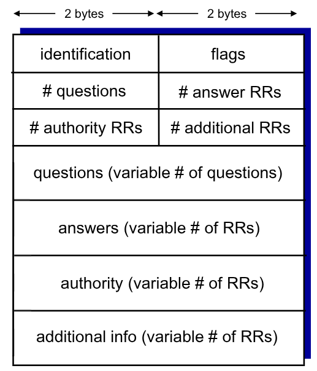

</div>
</div>

Sui sistemi windows è presente il comando:
```bash
nslookup
```

Che permette di richiedere traduzioni 

### 3.4.2. Registrazione di un nuovo record di dominio

Ipotiziamo di voler creare una nuova azienda `Network Utopia` e di voler registrarne il sito web.

Il primo passo è quello di selezionare il dominio di riferimento top-level.
Successivamente è necessario registrarsi in un `DNS registratore` (ad esempio _Network Solution_) fornendo nome di dominio e indirizzo IP del server **authoritative** (sia primario che secondario)

Il registratore inserisce i seguenti record nel server TLD:
- `(networkutopia.com, dns1.networkutopia.com, NS)` traduzione di alias per il `DNSs authoritative`
- `(dns1networkutopia.com, 212.212.212.1, A)`

È quindi necessario attivare un server **authoritative** localmente all'indirizzo `212.212.212.1` che traduca:
- Record `A` per `www.networkutopia.com`
- Record `MX` per `networkutopia.com`

# 4. Applicazioni Peer-To-Peer (P2P)

Sono applicazioni che seguono una filosofia diversa da quella del _client-server_. Infatti non c'è più una chiara distinzione tra _client_ e _server_, ma i singoli _host_ (chiamati **peer**) possono comportarsi in uno o in un altro in momenti diversi.

A differenza del modello _client-server_ i _peer_ non necessitano di essere costantemente disponibili, né di essere disponibili in indirizzi `IP` statici.

Le applicazioni `P2P` sono diverse, alcuni esempi:
- **Condivisione di contenuti**: i _peer_ mettono a disposizione file per essere condivisi. Per poterlo fare però è necessario essere a conoscenza di dove si trova il file desiderato
- **Messaggistica Istantanea**: è necessario avere mappati gli indirizzi `IP` degli username. Quando un utente va online comunica il proprio `IP` così che gli altri utenti possano reperirlo per la comunicazione

Per tutte le applicazioni `P2P` è quindi **necessario** avere un _indice_ che mappi le informazioni relativi agli indirizzi `IP` degli altri _peer_. Devono quindi essere fornite anche operazioni che permettano ad un _peer_ di cercare e/o aggiornare le informazioni.

Gli indici sono contenuti in _database_ basati su _hash_ `(key, value)` $\to$ `Led Zeppelin IV, 203.17.123.38`.

I _peer_ possono effettuare query a partire dalla chiave, o inserire intere coppie.

In questo modo si ha un indice centralizzato accessibile tramite _Hash table distribuite_

L'indice centralizzato può essere fornito da uno o più server, come ad esempio in `Napster` (un sistema **_ILLEGALE_** per la condivisione di musica).
In questi casi quando un utente diventa attivo, l'applicazione notifica l'indice con il suo indirizzo `IP` e i suoi file disponibili.

L'approccio in questi casi è ibrido:
- La distribuzione dei file è `P2P`
- La ricerca degli indirizzi `IP` è _client-server_

Prendendo sempre come esempio `Napster`, abbiamo che l'indice centralizzato si trova a `napster.com`. Questo però ha due svantaggi che avevamo già visto: il _single-point of failure_ e il _performance bottleneck_.

Un altro approccio completamente **_decentralizzato_** è quello del **Query Flooding**.
Introdotto nella versione originate di `Gnutella` (`LimeWire`). Si basa su un network di overlay rappresentabile come un _grafo_. Il grafo ha come nodi i _peers_ attivi, e come _edges_ le connessioni `TCP` tra i _peer_.

Il modello di _query flooding_  si basa su fatto che se un peer non ha l'oggetto richiesto da un _peer_ può propagare la stessa domanda agli altri _peer_ ai quali è collegato, attraversto risposte _unicast_. Quando viene trovato un _peer_ con i contenuti richiesti è **solo il _peer_ iniziale** che scarica i contenuti.
Questo approccio è _scalabile_, e spesso introduce un limite al _flooding_, riducendo il traffico e diminuendo le probabilità di localizzare il contenuto finale.

Esiste poi un ulteriore metodo che combina le migliori _feature_ degli approcci precedenti, si chiama **Overlay Gerarchico**. Venne prodotto in `FastTrack` ed è anche utilizzato dal moderno `Gnutella`.
Non ha un _server centrale_ ma introduce delle gerarchie tra gli _peer_.
Vengono introdotti i **Super Nodes** `SN`, che sono _peer_ selezionati, con un ampia banda e un ampia disponibilità. I _peer_ comuni effettuano le richieste ai _super-peer_, che contengono gli indici dei _peer locali_. Se il `SN` ha la risposta la fornisce, altrimenti effettua anch'egli una query al suo `SN` di riferimento.
Alla fine il primo _peer_ scaricerà i file dal _peer_ che li mette a disposizione.

Questi ultimi due metodi distribuiti si definisce come **il più vicino** il _peer più vicino in ordine di successione_.
Asintoticamente, con $n$ _peer_ vanno inviati in media $O(n)$ messaggi.

## 4.1. Confronto P2P e client-server

Abbiamo quindi visto entrambe le tecnologie, ma come variano i tempi e le _performance_ tra i due?

<div class="grid2">
<div class="">

Poniamoci il problema di distribuire su una rete, con sufficientemente banda, un file di dimensione $F$ da un server con capacità di _upload_ $u_s$ a $N$ _peers_, sapendo che per ogni _peer_:
- $d_i$: capacità di _download_
- $u_i$: capacità di _upload_
</div>
<div class="">
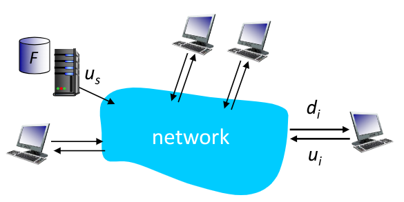
</div>
</div>

Nel caso di architetture _client-server_, quest'ultimo deve inviare $N$ copie dello stesso file.
Sapendo che il tempo per inviare una copia è $F \over u_s$, in totale il tempo di invio sarà $N \frac{F}{u_s}$.
D'altra parte ogni client deve scaricare la risorsa. Il _client_ più lento impiegherà un tempo di $F \over d_{min}$.

Il tempo totale per distribuire a tutti i _client_ il file sarà:
$$
D_{cs} \ge \max{\Biggl\{N\frac{F}{u_s}, \frac{F}{d_min}\Biggr\}}
$$

Ipotizzando invece un approccio _P2P_, il "server" che contine il file dovrà caricare solamente una copia, impiegando un tempo di $F \over u_s$.

I _client_ dovranno comunque scaricare il file, impiegando sempre un tempo di $F \over d_{min}$

Tutti i _client_ nel complesso dovranno scaricare $NF$ bit, e per farlo impiegheranno un tempo di $\frac{NF}{u_s + \sum{u_i}}$.

In totale il tempo necessario sarà:
$$
D_{P2P} \ge \max{\Biggl\{\frac{F}{u_s}, \frac{F}{d_min}, \frac{NF}{u_s + \sum_i^N{u_i}}\Biggr\}}
$$

Nel caso di _client-server_ abbiamo che il tempo cresce linearmente con il numero di _client_, mentre nel caso di _P2P_ invece la crescita lineare cresce sì con il numero di _client_, ma è attenutata dalla loro capacità di upload complessiva.

Ipotizzando:
- $u_i = u$
- ${F\over u} = 1h$
- $u_s = 10u$
- $d_{min} \ge u_s$

Possiamo tracciare il seguente grafico:
<figure class="">
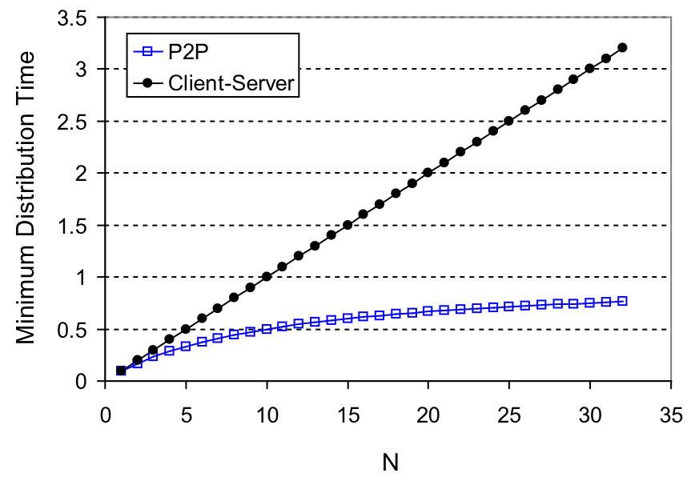
<figcaption>

In casi generici il tempo per il _P2P_ tende asintoticamente ad un valore di $F \over \overline{u}$
</figcaption>
</figure>


## 4.2. Protocollo BitTorrent

È il protocollo più utilizzato per le comunicazioni _P2P_. Non ha uno standard, ma è descritto in un articolo pubblico non ufficiale, preso comunque come _standard di fatto_.

I file vengono divisi in porzioni (_chunk_) di `256Kb`.
I _peer_ non vanno più a scambiarsi interi file, ma _chunk_ di esso. In questo protocollo non ci si preoccupa del'ordine dei vari _chunk_, che potrebbero, e tendenzialmente lo fanno, arrivare sfusi.
Il protocollo rende la comunicazione _multi-P2P_, vediamo quindi perché.
Prima di fare ciò definiamo:
> **_Torrent_**: l'insieme di _peer_ che in un certo istante partecipano alla condivisione di un dato file

Nel **torrent**, in un certo istante troviamo tre tipi di _peer_:
- **Leachers**: coloro che devono ancora completare di scaricare il file
- **Feeders**: coloro che hanno completato il _download_ del file. Potrebbero egoisticamente uscire dal torrent, ma decidono, altruisticamente, di rimanere per alimentare 
- **Free Riders**: sono coloro che sono solo interessati a scaricare i file, senza fornire la possibilità di caricare i loro file

Con l'introduzione dei **torrent** si introducono anche un **tracker**, che ha come compito quello di tracciare i _peer_ che in un certo istante fanno parte del _torrent_.


Quando un _peer_ desidera ottenere un file, per prima cosa deve ottenere l'`IP` del _tracker_, richiedendolo ad un **Torrent Server** specificando il contenuto che desidera.
Questo restituisce un _metafile_ `.torrent` nel quale si trova anche l'`IP` del _tracker_.

A questo punto il _tracker_ viene contattato, e questi inserisce il _peer_ nel torrent restituendogli una lista contenente gli `IP` degli altri dispositivi nel torrent.

A questo punto il _peer_ cerca di effettuare connessioni `TCP` con tutti gli altri _peer_ nella lista.
Statisticamente non riesce a creare una connessione con tutti i _peer_, ma questo non importa finché viene raggiunto un certo numero base.
I _peer_ con i quali si riesce a instaurare una connessione vengono chiamati **_vicini_**.

Il _peer_ chiede ai suoi vicini quali _chunk_ possiedono, e comincia a richiederli partendo dal **più raro** (_Rarest First_), evitando di chiedere più volte lo stesso _chunk_ e quelli che potrebbe già possiede.
Infatti, se ci fosse una copia presente solo in un vicino, se questi dovesse uscire metterebbe in attesa a tempo indeterminato.

Mentre il _peer_ scarica i _chunk_ dai suoi vicini, questi potrebbero richiedergli altri _chunk_. Poiché queste richieste potrebbero essere troppe da seguire, si opera una graduatoria secondo la poiltica _tit-for-tat_.

Si decide di dare priorità a quei vicini che, nell'unità di tempo, mi inviano più dati. Questo scoraggia i _Free Riders_, e incentiva i vari _peers_ di contribuire al torrent.

In particolare si inviano dati ai **_top-four providers_**, che tendenzialmente sono coloro che hanno una capacità di carico simile a quella del _peer_. Per ovviare a questa limitazione, ogni 30 secondi si seleziona casualmente un altro **vicino** e vi si inviano dei _chunk_, sperando che questo abbia una velocità di trasmissione maggiore a quella dell'attuale _top-four_.


# 5. Applicazioni di comunicazione in tempo reale

Oggi la maggior parte della banda di Internet è utilizzata per lo _streaming_ di contenuti audio e video, sia registrati che live.

Nel 2020 l'80% del traffico era occupato dai distributori di contenuti (Netflix, YouTube, Amazon Prime Video, ...).

Queste applicazioni hanno infatti platee di utenti **_molto grandi_**, anche nell'ordine del _miliardo_.
Per riuscire a raggiungere tutti questi utenti, molto diversi tra di loro per tipo di dispositivi e capacità di rete (che potrebbe variare da istante a istante per lo stesso utente), si utilizza **_un'infrastruttura application-level distribuita_**.

L'utilizzo di un singolo mega-server comporterebbe problemi di _single-point-of-failure_, di _sovraccarico_ e andrebbe a punire gli utenti fisicamente più distanti dal server e quelli meno capaci. Inoltre non permeterebbe nemmeno la scalabilità.

## 5.1. Streaming

I _video_ sono:
> Sequenze di immagini (_frame_) mostrate ad un rateo costante (_frame-rate_)

Un singolo _frame_ è rappresentato come un **array di pixel**, ognuno rappresentato da una seguenza di 8bit.

Per diminuire il numero di bit da inviare si sfruttano le correlazioni presenti nelle sequenze video:
- **Correlazione Spaziale**: due pixel vicini statisticamente sufficientemente simili da poter essere considerati uguali. È quindi sufficiente inviare due valori per una sequenza di pixel: il colore e quanti pixel consecutivi lo hanno.
- **Correlazione Temporale**: due frame successivi avranno molti pixel uguali, quindi possiamo concentrarci ad inviare solamente i valori di coloro che sono effettivamente cambiati

Esistono due tipi di codifica del video:
- `CBR` (_Constant Bit Rate_): il rateo di encoding è fisso
  - `MPEG 1`: utilizzato nei CD-ROM, p fisso a `1.5Mbps`
- `VBR` (_Variable Bit Rate_): il rateo di encoding è cambia a seconda delle situazioni


Lo _streaming_ di un video è caratterizzato dalla visualizzazione di tale, prima che sia stato comlpetamente scaricato.

In un mondo ideale, i video registrati a `30fps` vengono raccolti dal server e inviati con lo stesso rate. Il client li ottiene, dopo un certo delay, con lo stesso rate di invio e può visualizzarli senza problemi.

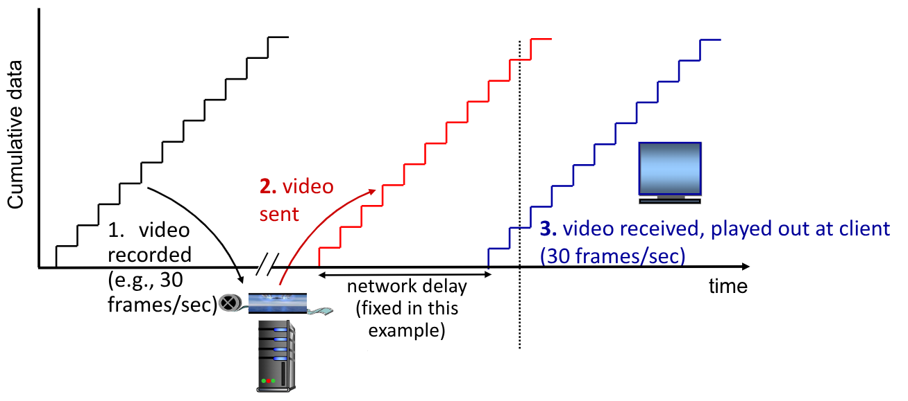

Nella realtà invece questo non accade, infatti l'utente potrebbe effettuare operazioni di pausa, fast-forward, rewind, saltare nel video. Inoltre alcuni pacchetti potrebbero essere persi, e potrebbe esserene necessario il reinvio. La variazione del _delay_ all'interno della rete viene chiamata **jitter**

Per ovviare al **jitter**, si introduce un _**client playout delay**_. Si permette infatti al client di vedere il video solo dopo che è passato questo _delay_ dall'arrivo del primo pacchetto, cercando quindi di compensare in questo modo il _jitter_ perettendogli una visualizzazione `CBR` attraverso la _bufferizzazione del video_.

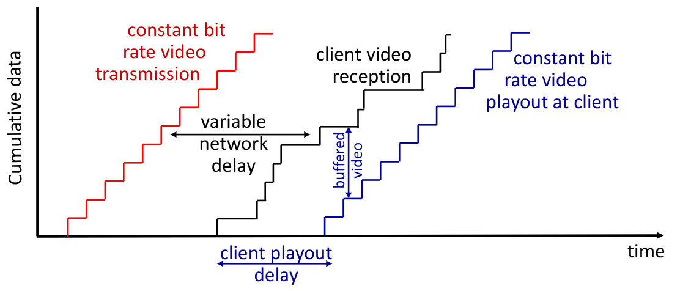

Una tecnica che migliora la qualità dello streaming multimediale è il `DASH` (_**D**ynamic, **A**daptive **S**treaming over **H**TTP_).

In questo protocollo il _server_ divide il file video in diversi _chunk_ che vengono salvati e codificati a ratei diversi.
Viene introdotto quindi un **manifest file** che fornisce gli `URL` per i vari _chunk_.
Il _client_ si occupa di misurare periodicamente la banda della connessione _client-server_. A seconda del suo valore consulta il **manifest file** richiedende un _chunk_ alla volta, cercando di massimizzare il numero di bit data la banda in quel momento, scegliendo da diversi ratei in momenti diversi.

Questa tecnica rende il _client_ in grado di determinare:
- **Quando richiedere un _chunk_**, per evitare overflow, buffer starvation, ...
- **Quale qualità di codifica richiedere**: cercando di massimizzarla a seconda della banda
- **Dove richiedere il _chunk_**: può essere richiesto dal server più "vicino" o che possiede una banda più alta

Lo streaming video moderno è quindi un unione di **codifica**, `DASH` e **playout buffering**.

### 5.1.1. CDN

I `CDN` sono _Content Distribution Networks_, e si occupano di decidere come effettuare lo streaming di milioni di video a centinaia di migliaia di utenti in simultanea.

L'idea di un unico grosso "mega-server" non funziona per gli stessi motivi per il quale non ha funzionato fin'ora (_single-point-of-failure_, _congestion_, elevata distanza) e ma inoltre perché avrebbe da inviare più copie dello stesso video attraverso lo stesso link, rischiando di saturare la connessione in uscita.

Si utilizzano quindi i `CDN`, che permettono di distribuire le informazioni, salvandole e rendendole disponibili in più _sites_ geograficamente distributi.

Esistono due approcci per svilluppare un `CDN`:
- **Enter deep**: carica più server `CDN` all'interno di diverse reti di accesso. Questo li "avvicina" agli utenti, ma è molto costoso. Un esempio è _Akamai_, che nel 2015 aveva più di 240.000 server distribuiti su più di 120 stati
- **Bring Home**: crea un numero minore di cluster più grandi. Questi cluster si trovano in `POPs` vicini alle reti di accesso, ma non all'interno. Un esempio di servizio che utilizza questa infrastruttura è _Limelight_

I `CDN` salvano copie dei contenuti all'interno dei nodi `CDN`. Quando un utente iscritto al servizio richiede un contenuto, viene direzionato ai server più vicini che contengono una copia. L'utente potrebbe inoltre richiedere copie diverse a server diversi, per ovviare la congestione dei percorsi.

Facciamo un esempio, ipotizzando che un client (Bob) richieda un video a `netcinema` per un servizio che mette a disposizione contenuti appoggiandosi ad un'altra azienda (`KingCDN`) che invece possiede i video sui propri server.

Bob richiede al webserver di `netcinema.com` la pagina web, l'url fornito viene girato al DNS locale che troverà il DNS authorative di `netcinema` che restituisce il `CNAME` per il `DNS auth` di `KingCDN` che fornirà lui l'`IP` del server finale (di proprietà di `KingCDN.com`).
L'utente si collegherà quindi a questo server, ignaro del fatto che quello che crede essere su un sito, si trova sul sevrer di un altro.

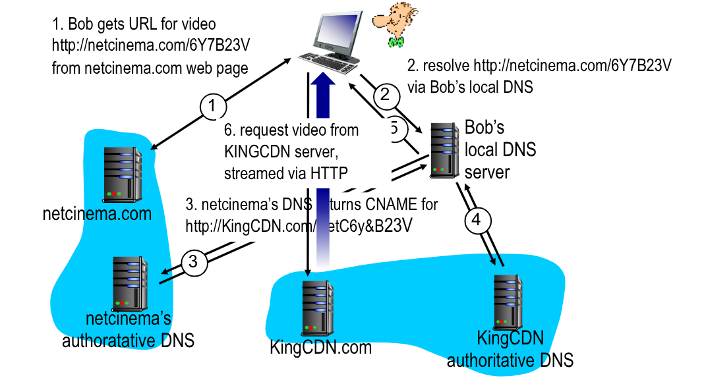

Un altro modo per distribuire i servizi è sfruttare il cloud. Un esempio di azienda che fa così è _Netflix_:

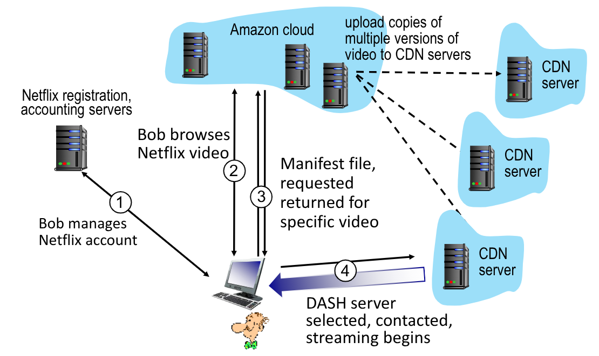

## 5.2. Socket-API

Ricordiamo che un _socket_ è una porta di accesso per la comunicazione end-to-end tra due processi attraverso un protocollo.

Esistono due tipi di socket, ognuno che sfrutta un protocollo diverso:
- `UDP`: fornisce datagrammi non sempre affidabili
- `TCP`: più affidabile, orientato allo streaming dei dati ordinati

I `socket UDP` non richiedono una connessione _client-server_, non richiedono handshake di connessione, ma il mittente assegna esplicitamente un destinazione `IP:port` a ciascun pacchetto. Il ricevente starà in ascolto su quella porta estraendo i pacchetti in arrivo. Questo trasferimento può avvenire in ordine casuale e potrebbe soffrire di perdita di pacchetti.

Vedremo più a fondo come sviluppare client e server nelle lezioni di laboratorio.