# 1. Indice

- [1. Indice](#1-indice)
- [2. Interconnessione di Reti](#2-interconnessione-di-reti)
	- [2.1. Modello di Servizio](#21-modello-di-servizio)
	- [2.2. Router](#22-router)
		- [2.2.1. Circuiti di Commutazione (switching fabrics)](#221-circuiti-di-commutazione-switching-fabrics)
			- [2.2.1.1. Switching via memoria](#2211-switching-via-memoria)
			- [2.2.1.2. Switching via bus](#2212-switching-via-bus)
			- [2.2.1.3. Switching via rete interconnesse](#2213-switching-via-rete-interconnesse)
	- [2.3. Port Queuing e Buffer Management](#23-port-queuing-e-buffer-management)
	- [2.4. Algoritmi di Schedulazione](#24-algoritmi-di-schedulazione)
		- [2.4.1. First-Come-First-Served - FCFS](#241-first-come-first-served---fcfs)
		- [2.4.2. Priorità](#242-priorità)
		- [2.4.3. Round-Robin - RR](#243-round-robin---rr)
		- [2.4.4. Weighted-Fair-Queuing - WFQ](#244-weighted-fair-queuing---wfq)
	- [2.5. Network Neutrality](#25-network-neutrality)
	- [2.6. Protocollo IP](#26-protocollo-ip)
		- [2.6.1. Formato Datagram](#261-formato-datagram)
		- [2.6.2. Frammentazione e Riassemblaggio](#262-frammentazione-e-riassemblaggio)
		- [2.6.3. IP Addressing](#263-ip-addressing)
		- [2.6.4. Classi di indirizzi](#264-classi-di-indirizzi)
			- [2.6.4.1. Classless InterDomanin Routing - `CIDR`](#2641-classless-interdomanin-routing---cidr)
		- [2.6.5. Ottenere un indirizzo host - `DHCP`](#265-ottenere-un-indirizzo-host---dhcp)
		- [2.6.6. Ottenere un indirizzo di rete](#266-ottenere-un-indirizzo-di-rete)
	- [2.7. Scarsità di indirizzi](#27-scarsità-di-indirizzi)
		- [2.7.1. Network Address Translation - `NAT`](#271-network-address-translation---nat)
		- [2.7.2. IPv6](#272-ipv6)
	- [2.8. Address Resolution Protocol - ARP](#28-address-resolution-protocol---arp)
	- [2.9. Protocollo ICMP](#29-protocollo-icmp)
	- [2.10. Generalized Forwarding](#210-generalized-forwarding)
	- [2.11. Middlebox](#211-middlebox)
- [3. La clessidra di internet](#3-la-clessidra-di-internet)

# 2. Interconnessione di Reti

I servizi del _network level_ permettono l'**internetwork**, ovvero tutti quei passaggi che permettono a più rete indipendenti, _anche di tipo diverso_, di comunicare tra loro in modo **_trasparente_**.

<div class="grid2">
<div class="">

Al momento di una trasmissione:
- Il trasmettitore incapsula il _segmento_ all'interno del **datagramma** passandolo al _link layer_
- Il ricevitore "spacchetta" in datagramma trasmettendo il _segmento_ al _transport layer_

I protocolli di livello _network_ si trovano **in tutti i dispositivi internet**.

Il **_router_** esamina i campi nell'header del _datagramma IP_ e lo direziona eseguendo **forwarding**.

</div>
<div class="">
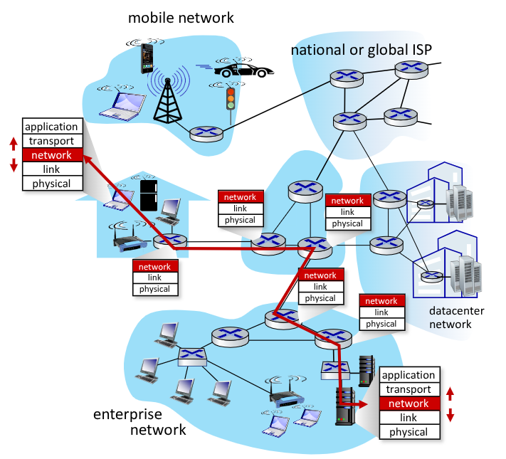
</div>
</div>

Il _network layer_ ha due funzioni principali:
- **Forwarding**: ovvero spostare i pacchetti dal link di entrata di un router verso il corretto link di uscita
- **Routing**: determina come instradare un pacchetto per farlo arrivare alla destinazione. Vedremo come questo percorso viene calcolato attraverso _algoritmi di routing_.

Il protocollo opera su due piani diversi.

Il primo piano è il **_piano dei dati_**, che è locale per ogni _router_. Questo piano determina, a partire dalla **_tabella di forwarding_**, a quale porta inoltrare il datagramam in entrata.

Il secondo è il **_piano di controllo_**, che ha una logica _network-wide_. Determina come il datagramma deve essere nistradato attraverso i _router_ cos' da percorrere "il percorso più breve", scrivendo la **_tabella di forwarding_**.

Questo piano può creare la tabella attraverso diversi approcci. Il primo approccio è attraverso **Algoritmi di routing tradizionali** implementati nei singoli _router_, che operano atrtaverso lo scambio di informaizoni tra _router_ adiacenti.

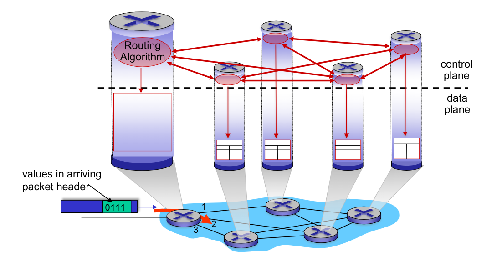

Un secondo approccio è il **Networking software-defined** che sono implementati il server remoti che opera nel cloud, e calcola i percorsi in maniera centralizzata.

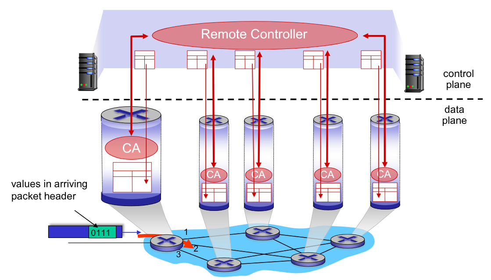


## 2.1. Modello di Servizio

Il _serivce model_ di internet è basato sul **_best effort_**. Quetso non fornisce alcuna garanzia su:
- Corretta spedizione dei datagrammi a destinazione
- Ordine di arrivo e controlli di tempo
- Banda disponibile per un flusso _end-to-end_

Negli anni sono stati definiti diversi _service models_:

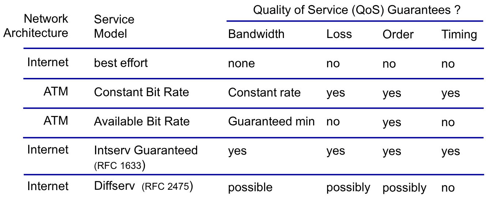

Anche se può sembrare che vi siano diversi modelli migliori sulla carta rispetto al **best-effort**, la sua semplicità ha permesso ad Internet di essere ampiamente sviluppato e adottato.
L'ampia fornitura di banda permette alle applicazioni _real-time_ di essere "abbastanza buone" per "la maggior parte del tempo".
Questa banda è otttenuta attraverso servizi dell'_application-layer_ distribuiti e replicati.


## 2.2. Router


<div class="grid2">
<div class="">

Un _router_ è un **_calcolatore dedicato_** che fa forwarding dei datagram che gli arrivano.
È fornito di:
- Porte di ingresso
- Porte di uscita
- Data and Control Plane
- Meccanismi che permettono il forwarding

Questi servizi sono eseguiti su microcontrollori dedicati.
</div>
<div class="">
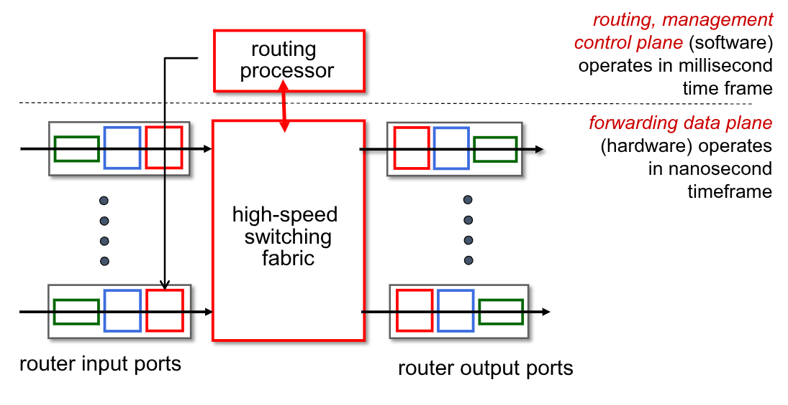
</div>
</div>

Le porte di input sono composte da 3 parti principali:

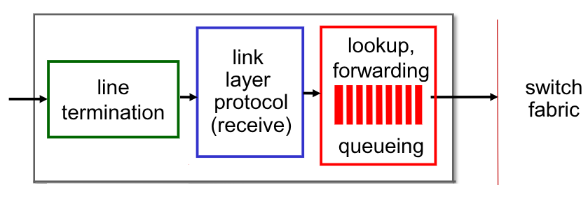

Il **line termination** implementa il _physical layer_, ovvero la ricezione fisica dei bit.

Il **link layer protocol** implementa, come dice il nome, il _link layer_.

I servizi di **lookup, forwarding e queueing** forniscono al circuito di commutazione (_switch fabric_) i pacchetti da istradare, associandoli alle informaizoni per poterlo fare correttamente.

Il servizio di _lookup_ controlla il contenuto dei campi _header_ per recuperare informazioni relative alla destinazion del pacchetto.
Successivamente, queste informazioni vengoo confrontate dal servizio di _forwarding_ con _forwarding table_, per determinare quale delle porte di uscita del _router_ va selezionata.

Il _forwarding_ si differenzia in:
- **Destination-Based**: fa un inoltro basandosi esclusivamente sull'indirizzo IP del destinatario
- **Generalized**: recupera diverse informazioni dall'_header_ per stabilire il _forwarding_

Un esempio di _forwarding table for destination-based forwarding_ è il seguente:

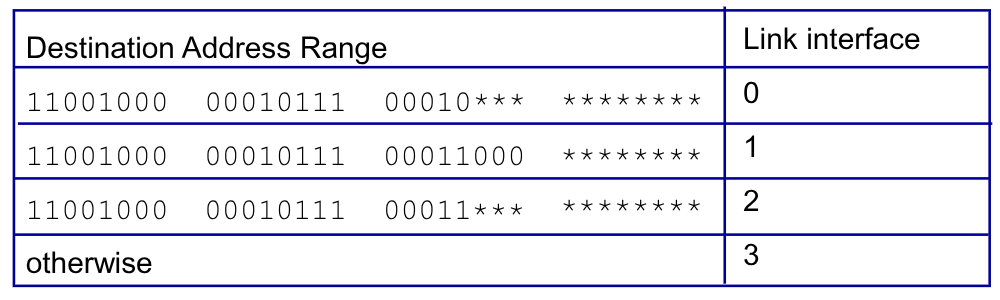

Il servizio di _queueing_ è necessario qual'ora l'arrivo del datagramma sia più veloce dell'inoltro allo _switch fabric_, e si creassero delle code.

### 2.2.1. Circuiti di Commutazione (switching fabrics)

Permettono di trasferire un pacchetto dal link di entrata all'uscita.

Da questo circuito dipende il **_switching rate_**, ovvero la velocità con la quale i _router_ possono trasferire pacchetti dagli input agli output.

Ipotizzando che tutti gli $N$ link di entrata abbiano un bit rate di $R$ bps, idealmente vorremo un _rate_ di $N\cdot R$ bps.
Vedremo che questo valore è impossibile a causa di _overhead_ e inoltri multipli da diversi _link_ di entrata verso lo stesso _link_ di uscita, che quindi geenra concorrenza.

Vi sono diversi metodi per implementare la _switching fabric_ alcuni più complessi, altri più semplici. Noi vedremo i circuiti basati su:
- **Memoria condivisa**
- **Bus**
- **Conessioni interlacciate**

#### 2.2.1.1. Switching via memoria

<div class="grid2">
<div class="">

Era la metodologia utilizzata nella prima generazione di _router_.

In questa architettura troviamo una **memoria condivisa** nella quale vengono copiati dal microcontrollore i datagrammi in entrata.

Succesivamente, lo stesso microcontrollore, si occuperà di copiare il messaggio nella porta di uscita corretta.

Questo tipo di router ha un _throughput_ tra i più bassi possibile, in quanto non solo soffre di una **banda limitata**, ma è rallentanto ulteriormente dalla necessità di effettuare un **doppio accesso in memoria**.

</div>
<div class="">
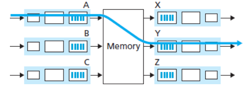
</div>
</div>


#### 2.2.1.2. Switching via bus

<div class="grid2">
<div class="">

Si basa su una specie di rete ethernet in miniatura. Tutte le porte sono collegate ad un bus comune con accessi mutualmenti esclusivi o arbitrati per l'accesso multiplo, **senza alcun intervento da parte del processore di routing**.

Si rende questa modalità possibile appendendo davanti all'header uno _switch-internal label_ che permette al circuito di capire in autonomia (tramite le maschere alle porte), dove instradare il messaggio.

Il link di output si occuperà di rimuovere questa label aggiuntiva prima di inoltrare il pachetto verso il prossimo _router_.

Questo tipo di switching limita il _throughput_ per via del _bottleneck_ provocato dal singolo bus, che non permette a più link di entrata di inoltrare verso le uscite più messaggi in parallelo.

Questa tecnologia è comunque sufficientemente veloce per la maggior parte dei _router di accesso_, arrivando in alcuni router, come il `Cisco 6500`, a comunicazioni sul bus di `32Gbps`.

</div>
<div class="">
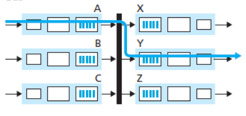
</div>
</div>


#### 2.2.1.3. Switching via rete interconnesse

<div class="grid2">
<div class="">

Perette di ovviare alla limitazione della banda dovuta ad un unico _bus_ condiviso, attraverso una interconnessione di bus più complessa.
Alcuni esempi di reti di interconnessione utilizzati sono i _crossbar_ (come in figura sulla destra). Dati $N$ link di entrata e $N$ link di uscita, sono presenti $2N$ bus per il collegamento.

Ogni _bus_ erticale interseca tutti i _bus_ orizzontali in dei punti chiamati _crosspoints_, che possono essere opportunamente aperti o chiusi dal controllore del circuito, secondo una logica che fa parte del circuito stesso.

Se un pacchetto deve essere inviato dal link `A` verso il link `Y` il controllore chiudera il _crosspoint_ di intersezione tra i due link diretti (come in figura).

Quello che possiamo notare immediatamente è che questa interconnessione permette di avere matrici di _bus_ che possono sfruttare comunicazioni in parallelo, aumentando notevolmente il _throughput_.

Nell'esempio a destra possiamo notare come una comunicazione da `B` a `X` sia perfettamente possibile anche mentre quella da `A` a `Y` è in atto.

Tuttavia la _crossbar_ non risolve problemi di concorrenza sulla porta di uscita, in quanto una comunicazione da `C` a `Y` non sarebbe possibile in parallelo a quella da `A` a `Y`.

Altre tecnologie che ovviano a questo problema sono ad esempio i _multistage switch_, che permettono a più pacchetti diretti sulla stessa uscita di arrivarvi senza problemi.
In questi casi però è fondamentale una buona implementazione del _queuing_.

</div>
<div class="">

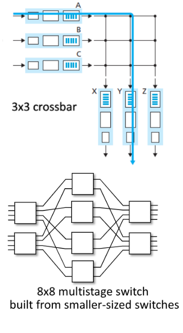

</div>
</div>


Ovviamente possiamo mettere in parallelo più _fabrics_ così da implementare ulteriormente il _throughput_, come nei `Cisco CRS router`:


## 2.3. Port Queuing e Buffer Management

Se a _switch fabric_ fosse più lenta di tutte le input port combinate, potrebbero verificarsi degli accumuli di pacchetti in coda sulle porte di ingresso.

Questo problema si chiama **_Head-Of-the-Line blocking_** `HOL`, ovvero quando il datagramma testa alla coda trova il suo percorso occupate e non permette agli altri pacchetti successivi (potenzialmente instradabili) di passare.

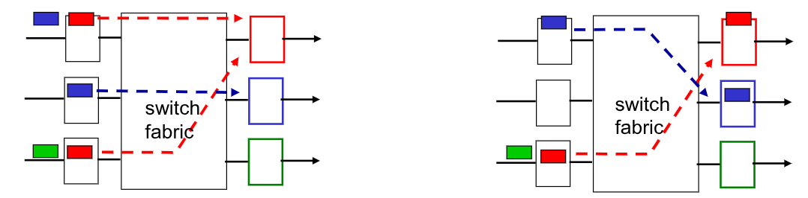

Questa logica pu avvenire anche nelle porte di uscita, nel caso in cui la _switch fabric_ inoltri più datagram di quanti la porta di uscita riesca a gestire.

In entrambi i casi dobbiamo implementare un `buffer`, che però può saturarsi costringendoci a scelgiere una politica di **_gestione delle perdite_**.

Dobbiamo quindi seguire una **_gestione del buffer_**:
- **_Drop_**: scegliamo di "perdere" un pacchetto quando il buffer è pieno. Questo può essere:
	- **Tail Drop**: rimuove i nuovi pacchetti in arrivo
	- **Priority Drop**: rimuove i pacchetti a seconda di una priorità
- **_Marking_**: permette di inviare dei pacchetti speciali per segnalare la congestione al nodo sorgente, così da fargli abbassare il _rate_.

In _internet_ si gestisce il _buffer_ attraverso il **_drop_**.

## 2.4. Algoritmi di Schedulazione

Il _packet scheduling_ permette di decidere qual'è il prossimo pacchetto da inviare attraverso il _link_.

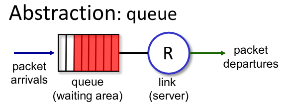

Vediamo alcuni esempi.

### 2.4.1. First-Come-First-Served - FCFS

È il più semplice algoritmo che possiamo pensare.

Si basa sul trasmettere i pacchetti **_in ordine di arrivo_**.

Questo algoritmo tratta **_tutti i pacchetti in modo uguale_**. Nella realtà però abbiamo applicazioni diverse, ogniuna con necessità diverse.

### 2.4.2. Priorità

Implementa più code a priorità differenziata, ognuna gestita con `FCFS`.

Si predilige la coda con priorità più alta, e inoltrando quelli nella coda a priorità minore solo se l'altra è vuota.

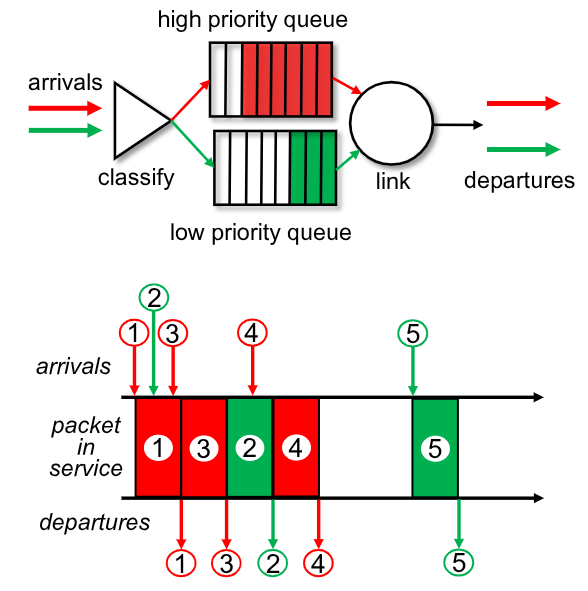

### 2.4.3. Round-Robin - RR

È un `RR` implementato su più code diverse. Invia un pacchetto alla volta da una coda diversa alla volta

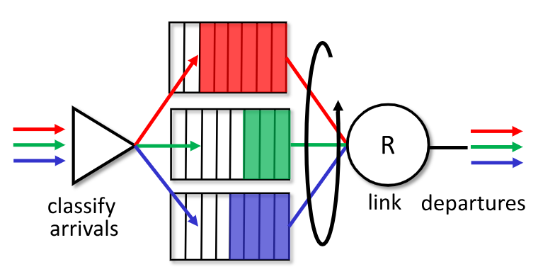

### 2.4.4. Weighted-Fair-Queuing - WFQ

È una generalizzazione del `RR` che **_tratta ogniuna coda attraverso un peso_** `wi`.

Ogni classe $i$ ha un peso $w_i$ e prende un tempo sul totale di $\frac{w_i}{\sum_j{w_j}}$.

Questo permette anche di fornire una garanzia di banda minima.

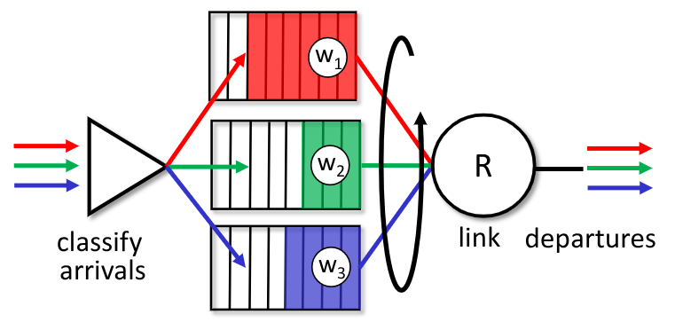


## 2.5. Network Neutrality

È un problema rilevante discusso da molti studiosi.

Affronta il problema della rete da diversi punti di vista:
- **Tecnico**: come un `ISP` dovrebbe allocare/condividere le sue risorse?
- **Sociale e Economico**: dovrebbe proteggere la "libertà di parola" incoraggiando "innovazione" e "competizione, trattando tutti "alla stessa maniera"? Oppure dovremmo fornire ad ogniuno "le risorse che necessita, anche se più di un altro"
- **Legale**: dovrebbe forzare regole e politiche?

Diversi stati hanno diversi punti di vista sulla _newutralità della rete_

## 2.6. Protocollo IP

È il protocollo di livello network utilizzato su _internet_.

All'interno di ogni _host_ definisce:
- Il formato dei datagram
- Il formato di indirizzamento a livello di internet
- Le regole di instradamento

Si avvale anche dei protocolli:
- `ICMP` (_Internet Control Media Protocol_), che permette di fare _error reporting_ e _router signaling_.
- `ARP`: lo vedremo più avanti

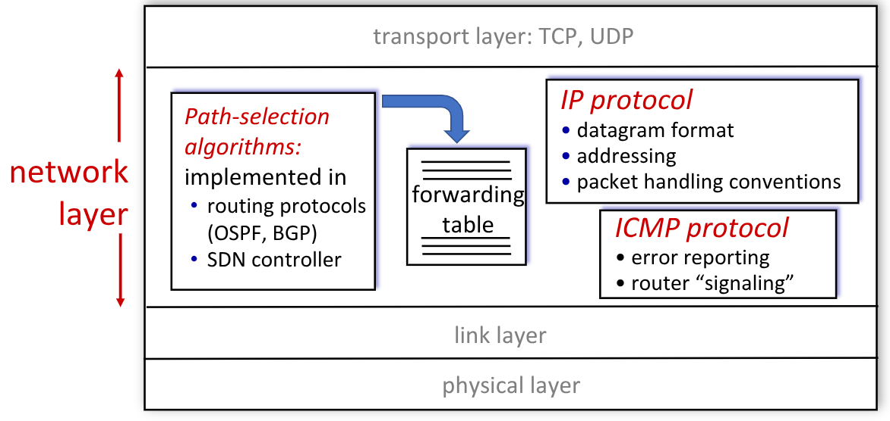

### 2.6.1. Formato Datagram

<div class="grid2">
<div class="">

Il datagram del _network layer_ è più complesso di quelli visti fin'ora, e presenta tanti campi:
- **IP protocol version number** (`4bit`): deve essere inserita la versione `4`.
- **Header length** (`4bit`): indica la lunghezza dell'header in `Byte`. Tipicamente è `20 Byte`, ma potrebbe essere più ampio
- **Type of Service** (`8bit`): permette di implementare diversi servizi, come livelli di servizi (priorità) attraverso i primi `6bit`. Il bit `6` e `7`, se implementati, servono ai _router_ per le notifiche di congestione, anche se questo meccanismo non viene utilizzato.
- **Lunghezza complessiva del datagram** (`16 bit`): indica la lunghezza complessiva del datagram in `Byte`. La dimensione massima è quindi di `64KB`.
- **Indentificatore** (`16bit`): descritto nella prossima sezione
- **Flags** (`3bit`): descritto nella prossima sezione
- **Fragment Offset** (`13bit`): descritto nella prossima sezione
- **Time-To-Live** (`8bit`): va da `1` a `255` ed è decrementato ad ogni _hop_ dal router. Se arriva a `0` il router scarta il pacchetto. Serve per evitare che il datagram possa finire in cicli infiniti che occupano solamente banda.
- **Upper Layer** (`8bit`): serve a specificare se il protocollo è `TCP` o `UDP`
- **Header Checksum** (`16bit`): serve per l'_error detection_
- **Indirizzo IP Sorgente** (`32bit`)
- **Indirizzo IP Destinatario** (`32bit`)
- **Campi opzionali** (`32bit`): sono ad esempio _timestamps_, _route taken_ in caso di routing statici (oggi non utilizzati), ...
- **Payload**: effettivi dati da inoltrare. Hanno una dimensione variabile

</div>
<div class="">
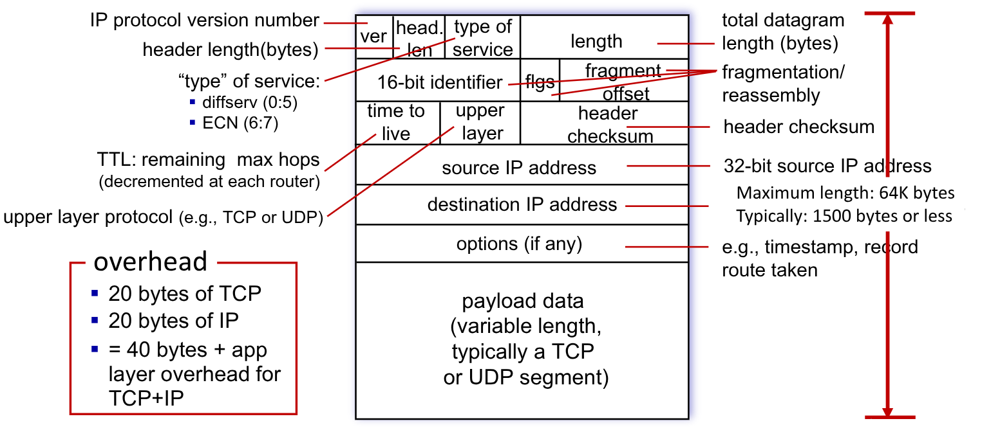
</div>
</div>

La dimensione minima dell'header del datagramma `IP` è di `20 Bytes`, qualora non fossero presenti i campi opzionali.

Ricordando che nel caso l'header del _frame_ `TCP` era anch'esso di `20 Byte`, otteniamo che la dimensione minima dell'overhead considerando solo questi due livelli è di `40 Byte`.

### 2.6.2. Frammentazione e Riassemblaggio

<div class="grid2">
<div class="">

Nella _seconda parola_ troviamo i campi che si occupano di **_gestire la frammentazione_**.

La _frammentazione_ è un meccanismo necessario per risolvere un problema dei _network links_ . Questi infatti hanno una `MTU` (_Maximum Transfer Size_) che sancisce il più grande _link-level frame_ che sono in grado di trasferire.

Inoltre, diversi tipi di _link_ possono avere diversi `MTU`.

Per poter consegnare grossi datagrammi `IP`, quello che si fa è _frammentarli_ in diversi frammenti così da permetterne la trasmissione.

Chi riceve i vari frammenti però necessita di diverse informazioni per poter **riassemblare** correttamente i vari frammenti nel messaggio originale.
</div>
<div class="">
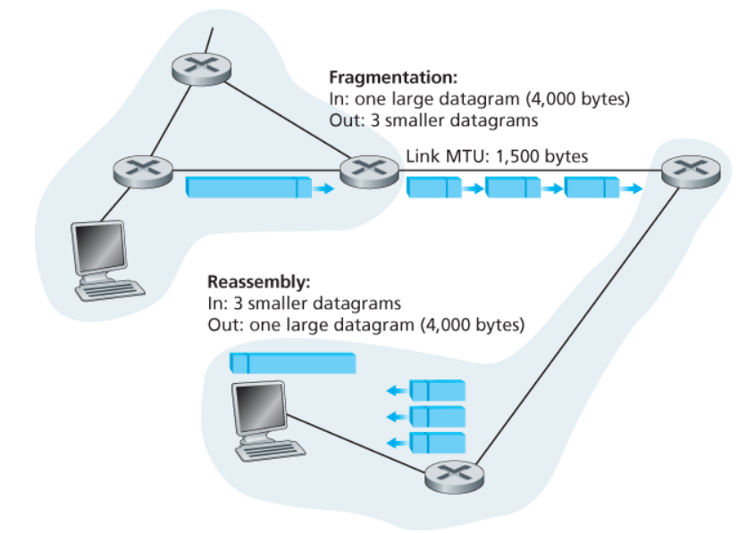
</div>
</div>

<div class="grid2">
<div class="">

Queste informazioni sono contenute proprio nella seconda parola:
- **Indentificatore** (`16bit`): sono `16 bit` che indicano univocamente il datagram originale. Rimane invariato in tutti i frammenti dello stesso datagram
- **Flags** (`3bit`): sono bit che servono a gestire la frammentazione:
  - **Res** (_Null bit_): non è utilizzato
  - **DF** (_Don't Fragment_): Se `1` indica che il datagramma _non dovrebbe essere frammentato_. È principalmente utilizzato per testare la `MTU` di una rete, in quanto molti protocolli lo mantengono a `0`.
  - **MF** (_More Fragments_): se `0` indica che è l'ultimo frammento del messaggio, `1` altrimenti. Se un frammento con `MF = 1` viene riframmentato anche i nuovi frammenti _avranno tutti_ `MF = 1`
- **Fragment Offset** (`13bit`): risolve il problema della sequenziazione, indicando la posizione nel messaggio originale del primo bit del frammento. Per riuscire a indicare tutte le posizioni (che possono essere espresse su `16bit` dal campo lunghezza), viene inserito prendendo come unità `8 Byte`, ovvero `posizione/8`.	
</div>
<div class="">
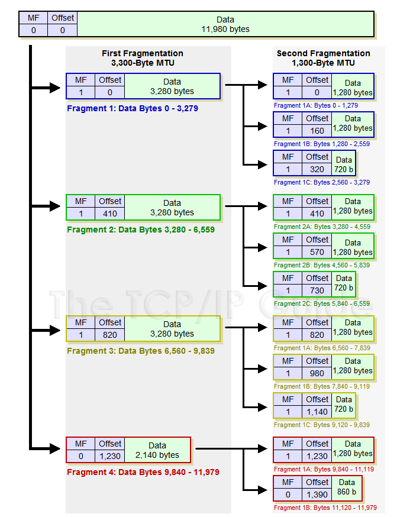
</div>
</div>

### 2.6.3. IP Addressing

Abbiamo visto come gli indirizzi `IPv4` sono rappresentati da una stringa di `32bit`, resa leggibile per l'occhio umano tramite _notazione puntata_.

<div class="grid2">
<div class="">

L'indirizzo `IP`, a differenza dell'indirizzo `MAC` che è univoco per ogni `NIC` e non fornisce indicazioni sulla locazione del dispositivo, è "logicamente" diviso in _due parti_:
- La prima indica la _sottorete_. I dispositivi che si trovano nella stessa sottorete hanno **_gli stessi bit alti_**
- La seconda indica l'_host_.

Una sottorete è così definita:
> L'insieme dei nodi che possono raggiungersi fisicamente senza passare da un _router_. Ovvero tutti i nodi che condividono la prima parte dell'indirizzo _IP_
</div>
<div class="">
<figure class="">
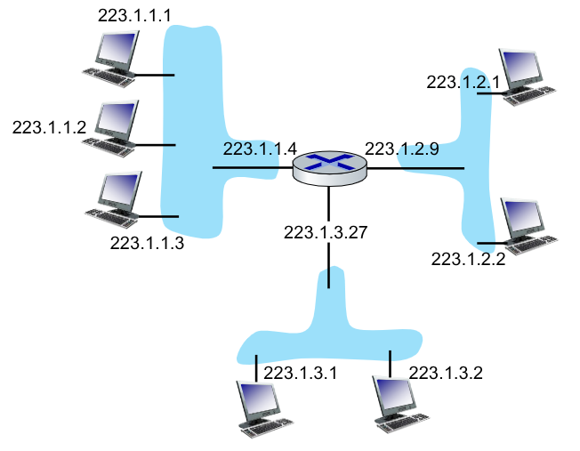
<figcaption>

Rete `223.1.X.X` composta da tre sottoreti `223.1.1.X`, `223.1.2.X` e `223.1.3.X`
</figcaption>
</figure>
</div>
</div>

Per generare una nuova sottorete si **separano le varie interfaccie** dal proprio router, creando delle reti isolate, ovvero le _sottoreti_.

Gli indirizzi di una sottorete hanno il seguente formato `a.b.c.d`. L'indirizzo di una sottorete è il risultato tra l'`AND` logico tra:
- L'indirizzo di un nodo della sottorete
- La _maschera di sottorete_

Possiamo impropriamente dire che la sottorete rappresenta l'host `0`.

### 2.6.4. Classi di indirizzi

Gli indirizzi delle sottoreti sono caratterizzate in classi. Queste classi si differenziano sulla suddvisione dei bit tra _bit di sottorete_ e _bit di host_:

<div class="flexbox" markdown="1">

| Classe | Bit di sottorete | Bit di Host | Massimo numero di host per una rete |
| :----: | :--------------: | :---------: | :---------------------------------: |
|  `A`   |       `8`        |    `24`     |       $2^24 - 3 \approx 16M$        |
|  `B`   |       `16`       |    `16`     |       $2^16 - 3 \approx 64K$        |
|  `C`   |       `24`       |     `8`     |           $2^8 - 3 = 253$           |

</div>

Vi sono poi altre due classi:
- `D`: riservati al multicast
- `E`: riservati per scopi futuri

Se un organizzazione avesse necessità di avere `15` host, sprecherebbe più di `200` indirizzi utilizzando una rete di classe `C`.
Allo stesso modo, se ad un certo punto diventasse abbastanza rande da avere più di _253 host_, dovrà ottenere una nuova

Durante l'espansione di internet venne studiato che, continuando ad assengare gli indirizzi attraverso le classi, gli indirizzi `IP` sarebbero **termianti entro la metà degli anni '80**.

Questa "crisi" generò diverse idee:
- `IPv6`: ampliare il numero di `bit`
- `NAT`: si vedrà meglio [in un capitolo successivo](#-nat)
- `CIDR`

#### 2.6.4.1. Classless InterDomanin Routing - `CIDR`

Pronunciato _cider_, permette di assegnare gli indirizzi nel modo più efficiente possibile, assegnando ad ogni _subnet_ solamente il numero di _host bit_ ad essa necessari.

Segue il formato `a.b.c.d/x` dove `x` indica il numero di bit dedicati agli _host_.

In questa conformazione è possibile avere un indirizzo come `145.23.4.6/23`.

La maschera di rete viene quindi costruita così: $(2^32 - 1) << x$.

### 2.6.5. Ottenere un indirizzo host - `DHCP`

Vediamo adesso come si fa un _host_ ad ottenere un indirizzo `IP`.

Un _host_ può ottenere un indirizzo `IP` in due modi:
- Recuperandolo da un file di configurazione scritto dall'amministratore di sistema. In `UNIX` questo file si trova tin `/etc/rc.config`. Questa assegnazione è **_hard-coded e permanente_**.
- `DHCP` (_Dynamic Host Configuration Protocol_): fornisce **dinamicamente** gli indirizzi `IP` ottenendoli da un server, per dei tempi 

Il primo metodo ha diversi problemi, uno tra i principali è quello che difficilmente un dispositivo è costantemente connesso in rete. Quindi per tutto il tempo per il quale non è collegato, abbiamo un indirizzo "sprecato" e inutilizzato.

La soluzione utilizzata da _internet_ è quindi quella del `DHCP`.

Il `DHCP` ha anch'egli alcuni problemi da risolvere:
- Deve poter rinnovare l'indirizzo assegnato ad un _host_ qualora continui ad utilizzarlo oltre il tempo limite che gli si era assegnato
- Deve permette il riutilizzo degli indirizzi che non sono più utilizzati
- Deve fornire la possibilità ai dispositivi di unirsi/lasciare la rete

<div class="grid2">
<div class="">

La comunicazione di un nuovo dispositivo si effettua su quattro fasi.
Per ogni fase vediamo anche un _mockup_ di messaggio, ridotto solamente ai campi utili per il nostro studio.

La prima fase è chiamata **DHCP discover**: l'_host_ invia un **_messaggio in broadcast_** dove chiede se è presente un server `DHCP` all'interno della rete.
```log
src: 0.0.0.0, 68
dest.: 255.255.255.255, 67
yiaddr: 0.0.0.0
transaction ID: 654
```

La seconda fase si chiama **DHCP offer**: il server risponde in **_broadcast_** fornendo un indirizzo `IP` da poter utilizzare.
```log
src: 223.1.2.5, 67
dest.: 255.255.255.255, 68
yiaddr: 223.1.2.4
transaction ID: 654
lifetime: 3600 secs
```

La terza fase è chiamata **DHCP request**: l'_host_, **_sempre in broadcast_**, risponde facendo la vera e propria richiesta per l'indirzzo `IP` da utilizzare, diminuendo eventualmente il _lifetime_.
La comunicazione continua ad avvenire in _broadcast_ per due motivi:
1. Il protocollo è stato definito così, quindi funziona così
2. Potrebbero esserci più server `DHCP` che collaborano all'interno di una rete. Mandando il _broadcast_ la richiesta aumenta la probabilità di trovarne uno libero

```log
src: 0.0.0.0, 68
dest.: 255.255.255.255, 67
yiaddr: 223.1.2.4
transaction ID: 655
lifetime: 3600 secs
```

La quarta e ultima fase è la **DCHP ACK**: il server invia un ultimo messaggio, **_sempre in broadcast_** riconfermando l'assegnazione dell'indirizzo
```log
src: 223.1.2.5, 67
dest.: 255.255.255.255, 68
yiaddr: 223.1.2.4
transaction ID: 655
lifetime: 3600 secs
```

Da questo momento in poi il nuovo _host_ comunicherà utilizzando il nuovo indirizzo `IP` assegnatoli.

Le prime due fasi possono non avvenire qual'ora un _host_ avesse già fatto parte precedentemente alla _subnet_.
In questo caso procede direttamente con il terzo step, allegando l'indirizzo `IP` precedentemente assegnatoli.

Se l'indirizzo fosse libero il `DHCP` confermerà il vecchio indirizzo, se invece fosse occupato risponderà con una nuova **DHCP offer**
</div>
<div class="">
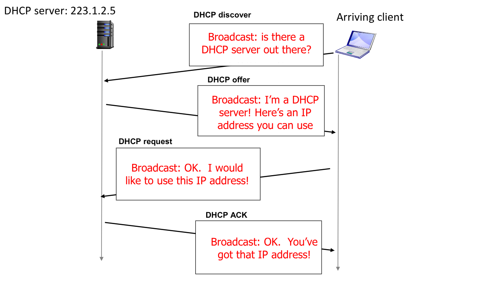
</div>
</div>

Oltre all'indirizzo in realtà il server `DHCP` fornisce altre informazioni, quali:
- Indirizzo dell'_access router_ della rete
- Nome e indirizzo `IP` del server `DNS`
- Maschera di rete


### 2.6.6. Ottenere un indirizzo di rete 

Per quanto riguarda gli indirizzi di _rete_, questi vengono forniti dagli `ISP`.

Gli `ISP` hanno a disposizione blocchi di indirizzi, che porzionano tra le varie reti che gestiscono,

Iporizziamo di avere un `ISP` che ha il blocco `200.23.16.0/20`.

Se dovesse dividere gli indirizzi tra 8 organizzazioni identiche, potrebbe fornire loro `9bit` per gli host (circa 500 host possibili) dividendo il proprio blocco così:
- `200.23.16.0/23`: parto dal blocco di partenza e fornisco 
- `200.23.18.0/23`
- `200.23.20.0/23`
- ....
- `200.23.30.0/23`


'utilizzo degli indirizzi `CIDR` permette anche di diminuire le dimensioni delle _forwarding table_. Infatti è possibile inoltrare i messaggi diretti ad un _host_ prima **_al suo `ISP`_**, che ha un blocco ampio.
In questo modo non è più necessario specificare tutti gli indirizzi delle varie reti nelle tabelle dei _core router_, ma è sufficiente metterne solo uno.
Successivamente sarà l'host stesso a ridirezionare il messaggio nelle varie sottoreti che gestisce.

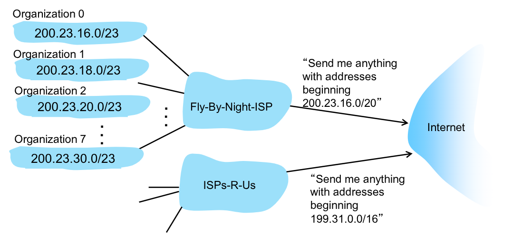

Nel caso in cui un organizzazione cambiasse il proprio `ISP` ma volesse mantenere il proprio indirizzo `IP` sarà quidni sufficiente inserire nella _tabella di forwarding_ del nuovo `ISP` la condizione che sia presente proprio l'indirizzo specifico dell'organizzazione.


Affinché un `ISP` possa ottenere un blocco di indirizzi deve chiedere a sua volta ad un altro `ISP`. 
L'`ISP` gerarchicamente di riferimento è la `ICANN` (_INternet Corporation for Assigned Names and Numbers_) che permette di allocare gli indirizzi `IP` attraverso **5 registri regionali** `RR`.
SI occupa anche di gestire le zone di root `DNS` e della gestione dei vari `TLD`.

## 2.7. Scarsità di indirizzi

Quando venne introdotto lo standard degli indirizzi `IP` a `32bit` ($2^32 \approx 4G$ indirizzi) si pensava che fosse più che sufficiente per tutti i dispositivi.

La storia però ha dimostrato il contrario, infatti `ICANN`  ha assegnato l'ultimo blocco di indirizzi `IPv4` ai `RR` nel 2011

È stato quindi necessario trovare dei metodi per poter ampliare il numero di indirizzi `IP` disponibili.

Sono state proposte diverse soluzioni, noi vedremo quelle che hanno preso piede e che sono attualmente utilizzate:
- `NAT`
- `IPv6`

### 2.7.1. Network Address Translation - `NAT`

Il `NAT` permette di far condividere, dal punto di vista del mondo esterno, a tutti i dispositivi in una stessa rete locale **_un unico indirizzo_** `IPv4`.

Prima di poter spiegare come funzioni il `NAT` dobbiamo dire che esistono alcuni indirizzi `IP` particolari che sonon dedicati a comunicazioni particolari:
- **Indirizzi speciali pubblici**: possono essere utilizzati per ocmunicare sulla internet pubblica
  - `0.0.0.0`: indirizzo utilizzato da nuovi _host_ nella rete che non hanno ancora indirizzo 
  - `255.255.255.255` o `0..01..1` (parte _rete_ settata): indirizzo di _broadcast_
- **Indirizzi speciali privati**: possono essere utilizzati per creare delle interreti **_private_**, non collegate alla rete pubblica
  - `10.0.0.0/8`
  - `172.16.0.0/12`
  - `192.168.0.0/16

Il `NAT` permette di sfruttare questi indirizzi privati per aumentare il numero di indirizzi `IPv4` disponibili.

<div class="grid2">
<div class="">

All'interno delle reti che utilizzano `NAT` i dispositivi credono di essere gli unici nel mondo ad utilizzare quegli indirizzi privati.

Nell'esempio sulla destra possiamo vedere che i dispositivi nella rete credono di essere nella rete `10.0.0.0/24`.

Il router di uscita avrà quidni:
- **Un indirizzo privato**: con la quale più comunicare con gli _host_ interni
- **Un indirizzo pubblico**: con il quale può comunicare con l'esterno

Il problema di questo approccio è che un _host_ interno alla rete privata **non può per definizione comunicare con l'esterno**.

Quello che permette di fare il `NAT` è di **_far comunicare con l'esterno gli host, facendo finta che sia il router a fare le richieste_**. I _NAT-enabled router_ sono infatti visti dalla rete esterna come se fosse un _host_.

Il problema di questo approccio è che se l'host `10.0.0.1, 3345` invia una richiesta all'esterno, il router la inoltra con indirizzo `138.76.29.7, 5001`. Il _webserver_ risponderà quindi a `138.76.29.7, 5001` e non all'_host_ che ha effettuato la richiesta.
È quindi necessario trovare un modo per il _router_ di capire come inoltrare correttamente il messaggio ricevuto all'interno della rete privata.
</div>
<div class="">
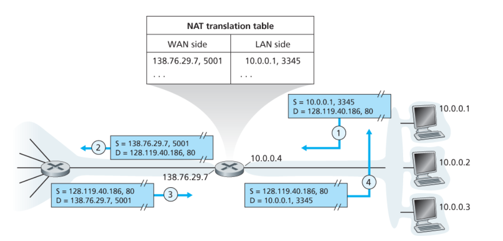

</div>
</div>

Per fare ciò il `NAT` utilizza una _NAT translation table_ composto da 4 colonne:
- `Indirizzo Pubblico`: uguale per tutte le righe
- `Porta Pubblica`: diversa per ogni riga
- `Indirizzo Privato originaria`
- `Porta Privata originaria`

Quando il router riceve una richiesta da `10.0.0.1, 3345`, e decide di inoltrarla come `138.76.29.7, 5001` inserirà il seguente record:

<table><tr>
<td><code>138.76.29.7</code></td>
<td><code>5001</code></td>
<td><code>10.0.0.1</code></td>
<td><code>3345</code></td>
</tr></table>

Questa traduzione permette di rendere _routable_ i mesasggi da e verso la rete, anche se si hanno indirizzi privati.

Il servizio del `NAT` è stato tuttavia criticato per diversi motivi:
- **Viola la stratificazione perfetta**: pur essendo un servizio di livello 3 accede ad informazioni di livello 4 (_transportation_), ovvero il numero di porta
- **È una soluzione di "corto respire"**: dato che è presente una soluzione a lungo tempo, ovvero `IPv6`
- **Viola il principio dell'end-to-end argument**: le informazioni dovrebbero essere viste solo dal richiedente e dal destinatario, e non dovrebbero essere manipolate da terzi

Pone inoltre un problema nelle comunicazioni a server protetti da `NAT`.
In questi casi non è possibile accedere direttamente al server, solo al router che lo "protegge".

È quindi necessario inizalizzare in maniera preventiva la _NAT translation table_ dedicando una o più porte alle comunicazioni con il _server_.

### 2.7.2. IPv6

È la verisone sucessiva a `IPv4`.

Si chiama `v6` perché la `v5` esisteva già ma non aveva avuto successo.

È stato creato perché si è scoperto che lo spazio di indirizzi della versione quattro non era sufficientemente grande.

Risolve anche altre esigenze:
- Aumenta la velocità di _processing_ e _forwarding_, fissando la lunghezza degil header a `40 Byte`, evitando al router di consultare il campo _header-lenght_ per capire quanto è lungo l'header
- Permette di differenziare meglio i "flussi di dati" diversi (comunicazione di dati, audio, video, ...)

<div class="grid2">
<div class="">

Un _datagram IPv6_  segue quindi il seguente formato:
- **Version** (`4bit`): contiene il valore `6`
- **Traddic class** (`8bit`): come il campo `TOS` è utilizzato pe rdare priorità a certi datagrammi all'interno di un "flusso" rispetto ad un altro
- **Flow Label** (`20bit`): identifica il flusso al quale il datagram appartiene
- **Payload Length** (`16bit`): è considerato un `unsigned integer` e indica la dimensione del _payload_
- **Next Header** (`8bit`): identifica quale protocollo utilizzano i dati nel _payload_ (`TCP`, `UDP`, ...)
- **Hop Limit** (`8bit`): equivalente al `TTL` e indica il numero massimo di _hop_ del datagramma prima di venire scartato
- **Indirizzio sorgente** (`128bit`)
- **Indirizzio destinatario** (`128bit`)

</div>
<div class="">
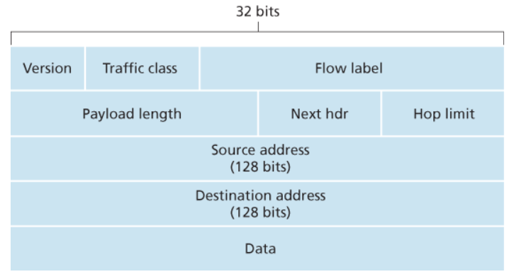
</div>
</div>

Possimao notare come manchino diversi campi all'interno degli _header_ `IPv6`:
- **Informazioni relative alla frammentazione/riassemblaggio**: per ottimizzare i tempi di elaborazione del messaggio. Quello che accade se un _router_ non riesce a instradare il _datagram_ poiché troppo grande lo **_droppa_** inviando al sender un messaggio di notifica `ICMP` _"Packet Too Big"_ . Il _sender_ si occuperà di reinviare il messaggio in _datagram più piccoli_.
- **Informazioni sul _checksum_**: per ottiimzzare i tempi di elaborazione del messaggio. Banalmente, cambiare il `TTL` ad ogni passo implica anche il ricalcolare il `CRC`.
- **Opzioni aggiuntive**: erano già poco utilizzate negli indirizzi `IPv4` e si è deciso di rimuoverli poiché anche presenti negli _header_ del livello _transportation_

La transizione da `IPv4` a `IPv6` non è avvenuta in un unca notte, e ancora oggi, dopo 25 anni, siamo in transizione.

Per permettere tuttavia ai "vecchi" router `IPv4` di comunicare con i nuovi _router_ `IPv6` sono state utilizzate diverse tecniche.

La prima tecnica è quella del **_Tunneling_**. I datgrammi `IPv6` vengono trasportati come **_datagram `IPv4`_** (_pacchetto nel pacchetto_).

<figure class="">

<figcaption>

Per questa soluzione è necessario che ci siano dei router specifici che possono comunicare sia con `IPv4` che `IPv6`.
</figcaption>
</figure>

L'altra opzione, è quella di dotare **tutti i** _router_ `IPv6` anche delle funzionalità `IPv4`. Il router sceglierà il protocollo di inoltro a seconda del tipo di messaggio che gli viene inoltrato.


Ogni anno Google effettua un indagine per stimare gli acessi ai propri servizi in `IPv4` o `IPv6`, consultabile [a questo link](https://www.google.com/intl/en/ipv6/statistics.html).

Al 30 ottobre 2025 poco più del $45\%$ degli accessi ai servizi google è effettuato in `IPv6`.


Regionalmente la situazione è molto differenziata:

<figure class="">
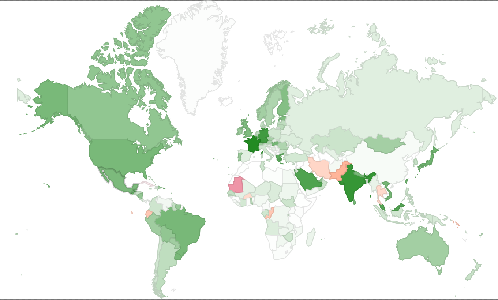
<figcaption>

Dallo studio si evince che l'Italia è tra le ultime in classifica, con solo un adozione del circa $18.17\%$.
A confronto la Francia, prima al mondo, è all'$86.7\%$ seguita dall'India al $78.73\%$, e dalla Germania al $75.09\%$.
Gli Stati Uniti hanno un utilizzo al $52.47\%$.
</figcaption>
</figure>


Un'indagine `NIST` dice che solo $\frac{1}{3}$ delle reti governative statunitensi sono capaci di comunicare tramite reti `IPv6`.

## 2.8. Address Resolution Protocol - ARP

Fin'ora abbiamo dato per scontato che un dispositivo che deve comunicare con un altro ne conosca tutti i dettagli.

Tuttavia è molto più probabile che un _host_ `A` conosca sì l'indirizzo `IP` di un altro _host_ `B`, ma che non ne conosca il `MAC`.

Il protocollo `ARP` permette di determinare l'indirizzo `MAC` di un altro _host_ conoscendone solamente l'indirizzo `IP`.

Per fare ciò ogni nodo `IP` (_router_ e _host_) possiedono una **_`ARP table`_**.

La tabella `ARP` permette di mappare gli indirizzi `MAC` e gli indirizzi `IP` in una struttura `< IP_address, MAC_address, TTL >`. Il `TTL`, tipicamente 20 minuti, indica il tempo oltre il quale rimuovere un entrata dalla tabella.

Nel caso di reti locali, qual'ora non esista ancora l'entrata nella `ARP table`, il mittente `A` invia un `ARP query packet` in _broadcast_, contenente l'indirizzo `IP` di `B`.
Il dispositivo `B` che riceve il pacchetto, risponde con il proprio indirizzo `MAC` direttamente ad `A`.

Una _cache_ interna ad `A` salverà la nuova entrata nella tabella che poi comincierà a trasmettere.

Questa soluzione è _plug-and-play_, e non necessita di interventi terzi.

Nel caso di reti distribuite la situazioen è un po' più complessa.
`A` creerà un datagramma `IP` con mittente `A` e destinazione `B`. Utilizzando il protocollo `ARP` otterrà l'indirizzo `MAC` del **_router di accesso_** `R`.

`A` invierà quindi il messaggio che conterrà:
- Indirizzo `IP` di `B`
- Indirizzo `MAC` di `R`

Quando `R` otterrà il pacchetto da inoltrare, farà lui una richiesta `ARP` sulla rete successiva a partire dall'indirizzo `IP` di `B`. Procederà quidni a modificare il contenuto dell'indirizzo `MAC` di destinazione con la nuova corrispondenza e inoltrerà il messaggio.

Questo accade finché il pacchetto non raggiunge l'ultima rete, dalla quale, tramite richiesta `ARP` otterrà l'effettivo `MAC` di `B`. Il router finale inoltrerà quindi correttamente il messaggio.

## 2.9. Protocollo ICMP

È utilizzato dagli _host_ e dai _router_ per counicare informazioni di _livello network_, ad esempio errori (ad esempio _unreachable host_) oppure inviare messaggi di `echo request` o `echo reply` (usati ad esempio dal comando `ping`)

Funzionalmente il protocollo `ICMP` sta **_sopra il protocollo `IP`_**, poiché i messaggi `ICMP` vengono incapsulati dentro datagrammi `IP`.

Un messaggio `ICMP` contiene:
- Tipo del messaggio
- Codice del messaggio
- Header e `8 Byte` del messaggio `IP` che ha causato la notifica

Alcuni esempi di tipologie di messaggi

<div class="flexbox" markdown="1">

| Type  | Code  |        description        |
| :---: | :---: | :-----------------------: |
|  `0`  |  `0`  |    echo reply (`ping`)    |
|  `3`  |  `0`  | dest. network unreachable |
|  `3`  |  `1`  |   dest host unreachable   |
|  `3`  |  `2`  | dest protocol unreachable |
|  `3`  |  `3`  |   dest port unreachable   |
|  `3`  |  `6`  |   dest network unknown    |
|  `3`  |  `7`  |     dest host unknown     |
|  `4`  |  `0`  | source quench (not used)  |
|  `8`  |  `0`  |   echo request (`ping`)   |
|  `9`  |  `0`  |    route advertisement    |
| `10`  |  `0`  |     router discovery      |
| `11`  |  `0`  |        TTL expired        |
| `12`  |  `0`  |       bad IP header       |

</div>

## 2.10. Generalized Forwarding

Inizialmente si utilizzava esclusivamente il _destination based forwarding_, dove la scelta di instradamento avveniva ad ogni router basandosi solo sull'indirizzo finale del pacchetto.

Negli ultimi anni è stato introdotto un nuovo metodo più generale per effettuare instradamento, detto appunto _genralized forwarding_.

Si basa sempre sul meccanismo _match-plus-action_ che utilizzava il _destination based_, ma questa volta, invece di basarsi esclusivamente sull'indirizzo `IP` della destinazione, si valutano **_più informazioni contenute nell'header_**.

Inoltre inserisce la possibilità di effettuare altre azioni oltre all'inoltro, quali la _copia_, la _modifica_, il _drop_ o il salvataggio di un _log_.

Per poter utilizzare questa nuova metodologia dobbiamo ampliare la tabella di forwarding, inservendovi tutte le altre informazioni necessarie per prendere le decisioni.

La tabella cambia il nome in **_tabella di flusso_**, dove un _flusso_ viene definito dai valori nei diversi campi dell'header.

I _record_ hanno ora struttura più complessa:
- **match**: pattern di riferimento
- **actions**: per un singolo match si possono avere più azioni (drop, forward, modify, send to controller)
- **priority**: permette di togliere l'ambiguità tra pattern che si sovrappongono
- **counters**: indica il numero di bytes e il numero di pacchetti

Un esempio:
<div class="flexbox" markdown="1">

|             match             |        action        | Descrizione                                       |
| :---------------------------: | :------------------: | :------------------------------------------------ |
| `src: *.*.*.*, dest=3.4.*.*`  |     `forward(2)`     | Comportamento simile al precedente                |
| `src: 1.2.*.*, dest=*.*.*.*`  |        `drop`        | Implementa un gateway                             |
| `src: 10.1.2.3, dest=*.*.*.*` | `send to controller` | permette di fare filtri per determinati indirizzi |


</div>

Un protocollo che sfrutta questo approccio geenralizzato è `OpenFlow`:

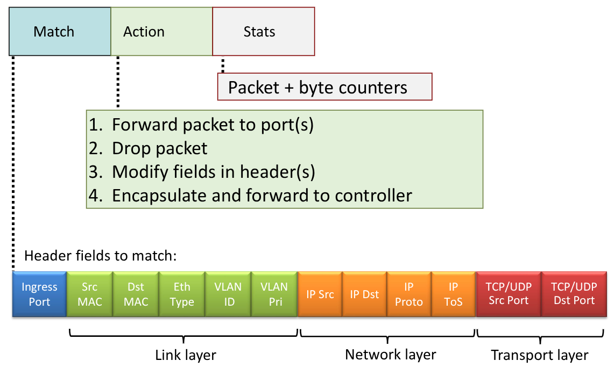

Il protocollo `OpenFlow` è molto flessibile, e permette di unificare diversi tipi di servizi diversi attraverso la stessa astrazione:

<div class="flexbox" markdown="1">

|  Servizio  |                   _match_                    |               _action_                |
| :--------: | :------------------------------------------: | :-----------------------------------: |
|  `Router`  |   prefisso `IP` di destinazione più lungo    |     fai il forwarding su un link      |
|  `Switch`  |       indirizzo `MAC` di destinazione        | forwarding su una o più porte (flood) |
| `Firewall` | indirizzi `IP` e numero di porta `TCP`/`UDP` |         permettilo o bloccalo         |
|   `NAT`    |            indirizzo `IP` e porta            |    modifica l'indirizzo e la porta    |

</div>

## 2.11. Middlebox

Sono i dispositivi che si trovano nel _network core_, codì definiti:
> Una _middlebox_ è una qualunque scatola che esegue funzioni diverse da quelle standard di un normale _router IP_ o  sul percorso tra un _host_ sorgente e un _host_ destinatario

Ad esempio, il `NAT`, la `cache` o il `firewall` sono delle _middlebox_. Altri esempi di _middlebox_ sono i _load balancers_, gli _ids_ (controlla il pacchetto e i successivi per ispezionarli e filtrare pacchetti potenzialmente pericolosi) e altri più _application specific_..


Inizialmente le _middlebox_ erano soluzioni proprietarie chiuse su certi tipi di reti.
Nel tempo ci siamo spostati verso un _"whitebox" hardware_ programmabili attraverso `API` pubbliche.

# 3. La clessidra di internet

<div class="grid2">
<div class="">

L'immagine sulla destra rappresenta _internet_ attraverso i protocolli e le soluzioni ai problemi di ogni livello..

Possiamo notare come il livello _network_ rappresenti il "restingimento" di questa clessidra, attraverso l'unico protocollo `IP` che deve essere implementato da tutti i miliardi dei dispositivi connessi ad internet.
</div>
<div class="">
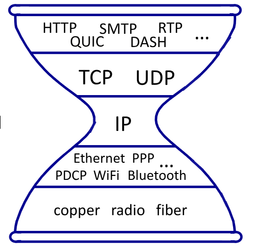
</div>
</div>

Attraverso l'introduzione delle varie _middlebox_ oggi abbiamo ampliato il restingimento nel livello network:

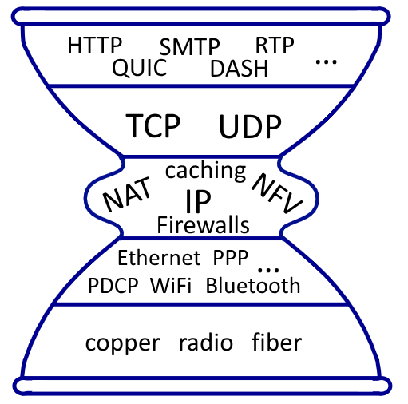

