# 1. Indice

- [1. Indice](#1-indice)
- [2. Che cos'è internet](#2-che-cosè-internet)
- [3. Protocolli](#3-protocolli)
- [4. Network Edge](#4-network-edge)
	- [4.1. Rete di Accesso: DSL](#41-rete-di-accesso-dsl)
	- [4.2. Fibra Ottica](#42-fibra-ottica)
	- [4.3. Wireless Access Networs](#43-wireless-access-networs)
	- [4.4. Trasmissione dei pacchetti](#44-trasmissione-dei-pacchetti)
- [5. Network Core](#5-network-core)
	- [5.1. Packet Switching](#51-packet-switching)
	- [5.2. Circuit Switching](#52-circuit-switching)
	- [5.3. Packet Vs. Circuit](#53-packet-vs-circuit)
	- [Forwarding Tables e Protocolli di _Routing_](#forwarding-tables-e-protocolli-di-routing)
	- [5.4. Struttura del Network di Network](#54-struttura-del-network-di-network)
- [6. Performance](#6-performance)
	- [6.1. Ritardi e Instradamento](#61-ritardi-e-instradamento)
	- [6.2. Throughput](#62-throughput)
- [7. Sicurezza](#7-sicurezza)
- [8. Protocolli e Servizi](#8-protocolli-e-servizi)
	- [8.1. Internet Protocol Stack](#81-internet-protocol-stack)

# 2. Che cos'è internet

Non esiste una risposta univoca a questa domanda, ma **dipende dal punto di vista**.

<div class="grid2">
<div class="">
<div class="p">Dall'interno</div>

Se si guarda dall'interno, possiamo definirlo come:
> Un sistema che connette milardi di dispositivi attraverso link di comunicazione. Questi si dividono in:
> - _Host_: alla periferia della rete
> - _Packet Switches_: inviano pacchetti di reti

Possiamo quindi dire che è una _rete di reti_ che connette miliardi di _host_ sui quali girano le applciazioni.

Quando parliamo di _host_ non intendiamo solamente dei _calcolatori_, infatti oggigiorno la maggior parte dei dispositivi connessi oggi sono di tutti i tipi (smartwatch, telecamenre, pacemaker, tostapane, lavatrici, occhiali AR). Questa nuova modulaizone del mondo è chiamata **Internet of Things**, dove ogni oggetto può essere collegato e interrogato tramite internet.

Internet segue una serie di **protocolli** di standardizzazione che permettono la corretta comunicazione tra più _host_.
Gli istituti di standardizzazione sono diversi, uno ad esempio è `IETF` (_Internet Engineering Task Force_) che pubblica documenti chiamati `RFC` (_Request For Comments_). Questi documenti sono analizzati e approvati, andando a generare i **protocolli**.

</div>
<div class="">
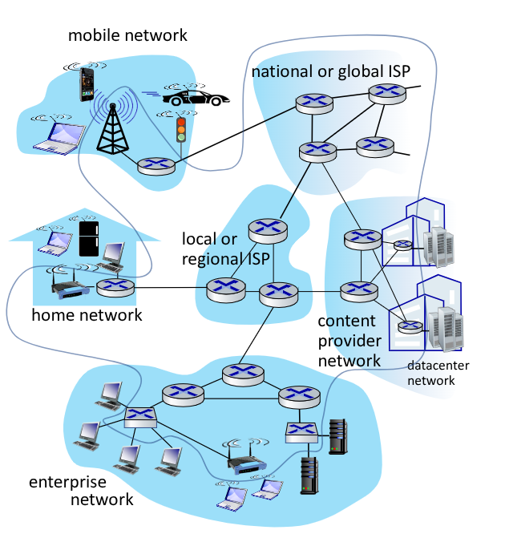
</div>
<div class="">
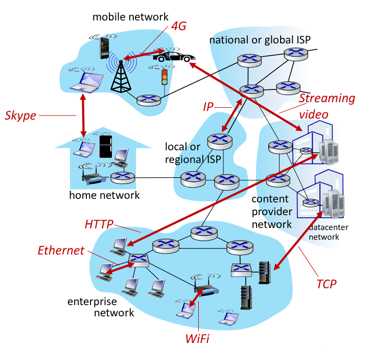
</div>
<div class="">
<div class="p">Servizio</div>

Possiamo vedere Internet come un Servizio, ovvero un'infrastruttura che fornisce servizi per le applicazioni.
Fornisce interfaccie per il corretto utilizzo di applicazioni distribuite.

</div>
</div>

# 3. Protocolli

Un **protocollo** è un insieme di regole che definiscono il formato e l'ordine dei messaggi che devono essere inviati e ricevuti tra più entità, stabilendo le azioni che devono essere effettuate.

Questi protocolli sono adoperati anche dalle persone durante la vita di tutti i giorni:

<figure class="">
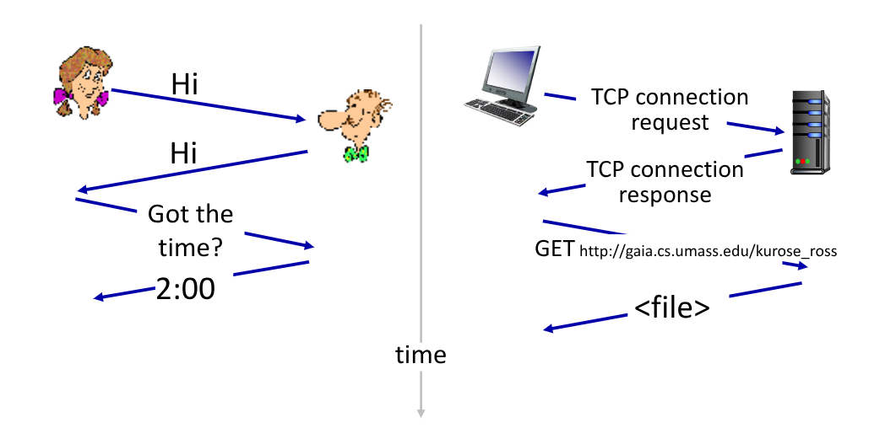
<figcaption>

I protocolli utilizzati nel _web_ sono del tutto analoghi con quelli umani
</figcaption>
</figure>

# 4. Network Edge

<div class="grid2">
<div class="">


Il _Network Edge_ (_Periferia di Internet_) si trovano gli _host_, ovvero i _device_ che eseguono le applicazioni che si connettono ad Internet.

In un modello **client-server** gli _host_ si dividono in:
- _Client_: l'_host_ che chiede un servizio
- _Server_: l'_host_ che produce e distribuisce un servizio

Per _client_/_server_ si intendono dei processi, e non la _macchina client/server_, che è il _device_ sul quale si trova il processo.

I server si trovano tipicamente in dei **Data Center**, grossi centri che contengono molte **macchine server**.

Gli _host_ si connettono ad internet tramite le **reti di accesso**, che si trovano proprio nella parte più esterna di internet.
In resto è chiamato **Network Core**: un'infrastuttura di distribuzione delle informazioni, per direzionarla alla rete di accesso corretta.

Per connettersi alle _reti di accesso_ si possono utilizzare diversi metodi:
- _Rete di accesso residenziale_: permette l'accesso alla rete in un'appartamento
- _Rete di accesso istituzionale_: permette l'accesso alla rete in un contesto istituzionale (aziende, scuole, ...)
- _Mobile_: permette l'accesso da remoto

Non siamo interessati tanto alla tecnologia di accesso, ma piuttosto il _trasmission rate_ (che è necessariamente minore o uguale a quello e della rete di accesso) e se il tipo di connessione è **dedicato** (Ethernet) o **condiviso** (Wi-Fi).

</div>
<div class="">
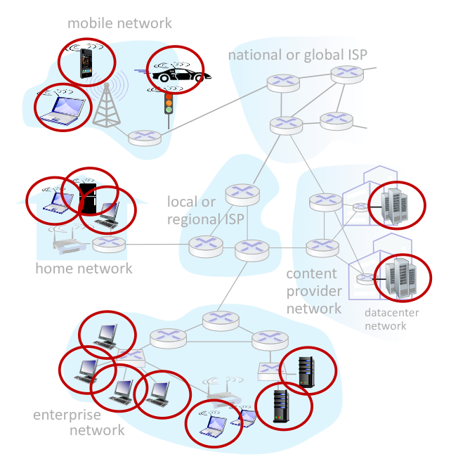

</div>
</div>

## 4.1. Rete di Accesso: DSL

È un vecchio standard ormai quasi in disuso. Era possibile ottenerne accesso tramite la stessa compagnia telefonica che gestiva l'accesso telefonico, che diventava quindi anche **ISP**.

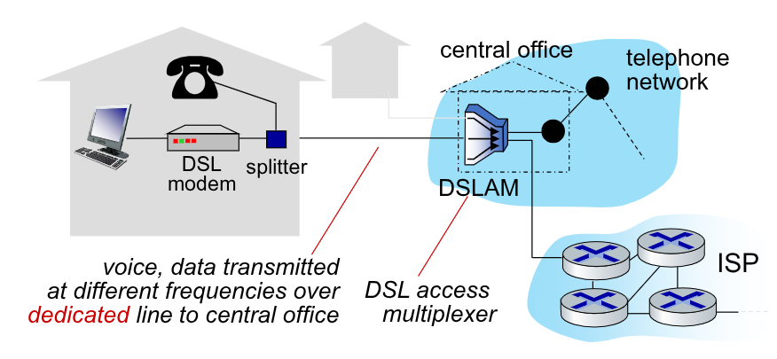

Venivano utilizzate le esistenti rete telefoniche per comunicare sulla rete, tramite uno _splitter_.
Infatti le linee telefoniche trasferivano sia i dati che la voce in simultanea, codificandoli su frequenze diverse:
- Canale in _dowstream_ ad alta velocità, banda 50 kHz - 1 MHz
- Canale in _upstream_ a media velocità, banda 4 kHz - 50 kHz
- Normale canale telefonico a due vie,  banda 0 kHz - 4 kHz

Le comunicazioni erano poi gestite dal _DSLAM_ che smistava:
- La voce nella rete telefonica
- I dati nella rete internet

## 4.2. Fibra Ottica

Ne esistono diversi tipologie, in europa le più comuni sono le seguenti:

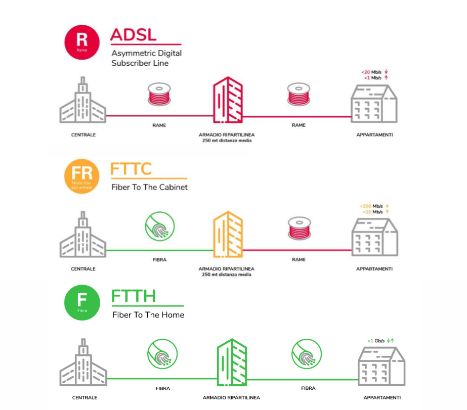

## 4.3. Wireless Access Networs

Si dividono in diverse categorie in base alle loro dimensioni:
- **Wireless local area networks**: tipicamente delle dimensioni di un edificio
- **Wide-area cellular access networks**:  distribuiti dagli operatori di rete, ampiezze nell'ordine delle decine di kilometri.

Nelle reti istituzionali, ovvero quelle utilizzare dalle aziende, università, etc. si ha un mix di diverse tecnologie, che connettono _switch_ e _router_.

## 4.4. Trasmissione dei pacchetti

L'_host_ possiede due funzioni, quella di invio dati e quella di ricezione dati.

Quando un _host_ deve inviare un messaggio ad un altro _host_, lo divide in tante sezioni, chiamati **pacchetti**, ognuno di lunghezza $L \text{bits}$.

Le informazioni digitali salvate nei `bit` di informazione, vengono trasformati in segnali fisici che vengono trasmessi attraverso delle connessioni fisiche.
Ogni segnale fisico, per essere generato e trasmesso, necessita del tempo, chiamato _bit-rate_ $R \text{bits/s}$.
Questo valore è messo in rapporto con la lunghezza dei pacchetti per ottenere il _ritardo di trasmissione_, ovvero il tempo necessario per trasferire $L$ bit attraverso la connessione:
$$
	{L \over R}\text{s}
$$


Questo valore è diverso dal _ritardo di propagazione_, che invece è il tempo necessario per un segnale per percorrere lo spazio tra i due comunicanti.

I pacchetti viaggiano sui _link di comunicazione_, che si possono dividere in due categorie:
- **Mezzi Guidati**: il segnale è guidato ed è trasmesso in mezzi solidi (rame, fibra ottica, ...)
- **Mezzi Liberi**: il segnale si propaga liberamente (radio, ...)

Alcuni esempi di mezzi guidati sono:
- **Doppino telefonico** (_Twisted Pair_): consiste in due fili di rame all'interno di un isolante schermante. A seconda della schermatura e della qualità di rame utilizzato si possono avere più categorie:
  - _Categoria 5_: trasmette da `100Mbps` fino a `1Gbps`
  - _Categoria 6_: trasmette fino a `10Gbps`
- **Cavo coassiale**: è formato da due conduttori di rame concentrici. Permette più comunicazioni bidirezionali in parallelo, permettendo una comunciazione in banda comune. Veniva ad esempio utilizzato per la televisione, dove ogni canale riusciva a trasmettere nell'ordine delle `100s Mbps`
- **Fibre Ottiche**: i bit sono qui codificati in impulsi di luce, che si propaga molto più velocemente rispetto ai segnali elettrici. Questi mezzi hanno due grossi vantaggi rispetto agli altri:
  - Non vengono influenzati da segnali elettromagnetici, mantenendo quindi un basso _error rate_ anche tra ripetitori molto lontani. Nei conduttori di rame questo valore è $O(10^{-6})$ mentre nelle fibre ottiche è $O(10^{-11})$.
  - Permette comunicazioni point-to-point fino alle `100s Gbps`

I mezzi liberi invece sono generalmente **segnali Radio**. Questi mezzi trasportano il segnale attraverso lo spettro elettromagnetico, e non necessitano di "fili" o "cavi".

Sono susciettibili ad effetti ambientali, quali riflessioni, interferenze e ostruzioni fisiche da oggetti schermanti. L'_error rate_ è infatti nell'ordine di $O(10^{-3})$.

Ne esistono di diversi tipi:
- **Microonde**: canali che trasmettono fino a `45Mbps`
- **Wireless LAN (Wi-Fi)**:
- **Wide Area**:
  - _4G_: nell'ordine delle `decine di Mbps`
  - _5G_: nell'ordine delle ``
- **Satellite**: anch'essi fino a `45Mbps` ma con tempi di _delay_ nell'ordine dei `270ms`

# 5. Network Core

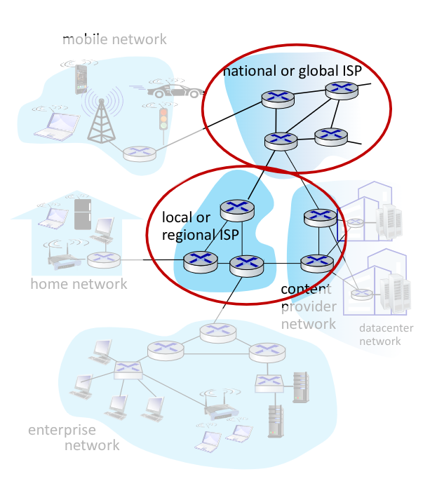

## 5.1. Packet Switching

<div class="grid2">
<div class="">

In questa area non sono presenti _host_, ma solamente degli _switch_ che si occupano esclusivamente di distribuire i pacchetti in entrata verso la loro destinazione.
Questa azione di smistamento è chiamata _packet-switching_.

Il comportamento dei vari _router_ è un comportamento **store and forward**: un router prima memorizza **l'intero pacchetto**, ne legge la destinazione, e successivamente lo trasmette al prossimo step della connessione che lo avvicinerà alla destinazione.

Se immaginiamo che $L = 10$ Kb e $R = 100$ Mbps, il tempo necessario per fare un salto è di $0.1$ ms.

Con $n$ salti (_hop_), immaginando che
- $L$ e $R$ siano costanti per ogni salto
- Sulla rete ci siano solamente 2 host che comunicano uno alla volta
- Il tempo di propagazione sia _nullo_

Il tempo totale è quindi di $n \cdot \frac{L}{R}$.

</div>
<div class="">
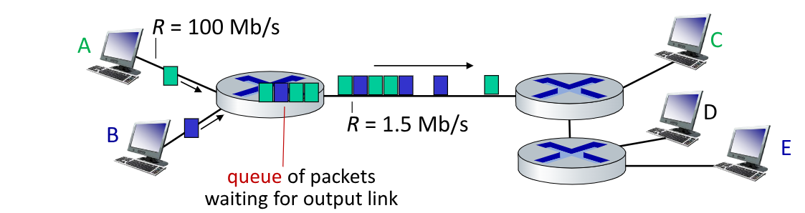
</div>
</div>

## 5.2. Circuit Switching

<div class="grid2">
<div class="">

Immaginiamo ora un esempio più complesso.
Immaginiamo 2 _host_ che comunicano in uscita su reti con $R = 100$ Mbps verso lo stesso _router_.
Sull'altro lato del _router_, lui comunica con un $R = 1.5$ Mbps verso un'altro router collegato a 3 _host_.

Il primo router quindi riceve in ingresso dati a `200 Mbps` e li comunica con `1.5Mbps`.
I pacchetti vengono quindi salvati in una coda interna al _router_ in attesa di poter essere trasmessi.

Possono quindi verificarsi due casi:
- Il pacchetto subisce un ritardo chiamato proprio _queue delay_
- La coda si satura: avviene quindi una perdita dei pacchetti più recenti che non possono più essere salvati, generando una **congestione dello _switch_**

Un modo per evitare le congestioni è quello di fornire ai _router_ **più link** in uscita, ognuno dedicato ad una comunicazione possibile. Questa configurazione si chiama **_circuit switching_**. In questo modo sono presenti connessioni _end-to-end_ per ogni possibile connesione, che rimane _idle_ quando i due _host_ non stanno comunicando

Questa architettura era utilizzata comunemente nelle reti telefoniche tradizionali.

</div>
<div class="">
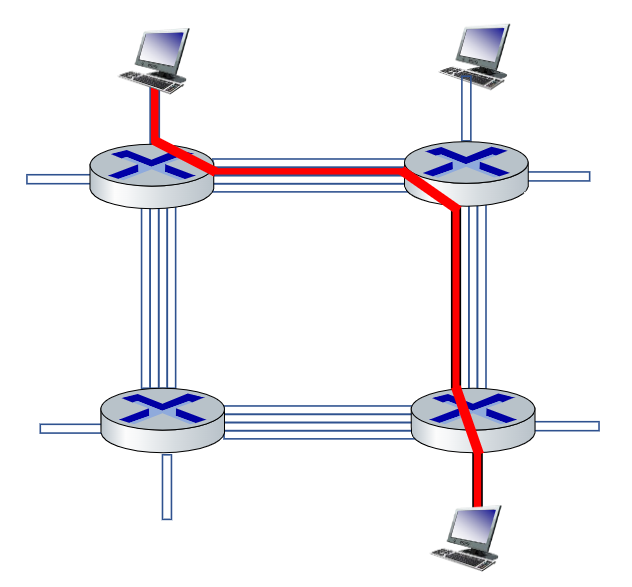
</div>
</div>

## 5.3. Packet Vs. Circuit

Il _packet switching_ permette a più utenti di utilizzare un unica rete, e se ben configurata può ridurre le congestioni a un numero basso.

Se immaginiamo il seguente esempio:
<figure class="">
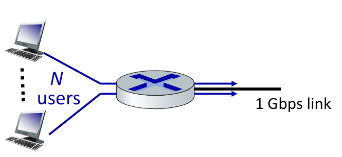
<figcaption>

Ogni utente è attivo il 10% del tempo ad un rate di `100Mbps`
</figcaption>
</figure>

Se immaginiamo il **circuit-switching**, per quanto sia vero che non abbiamo _congestioni_ con 10 utenti.

Se immaginiamo il **packet-switching** invece la probabilità che più di 10 persone siano attive allo stesso momento, necessario per saturare la connessione in uscita dal router, è di $\frac{1}{2500} = 0.0004$.

## Forwarding Tables e Protocolli di _Routing_

## 5.4. Struttura del Network di Network

Gli _host_ si connettono ad internet tramite l'accesso fornito da un **Internet Service Provider** (`ISP`), che può fornire il servizio sia a livello residenziale che a livello aziendale.

I vari `ISP` devono essere però interconnessi, affinché le comunicazioni possano avvenire in maniera trasversale. CIò crea una rete di reti molto complessa, influenzata anche da motivi economici e politiche nazionali.

La struttura finale di internet di oggi assomiglia a qualcosa del genere:

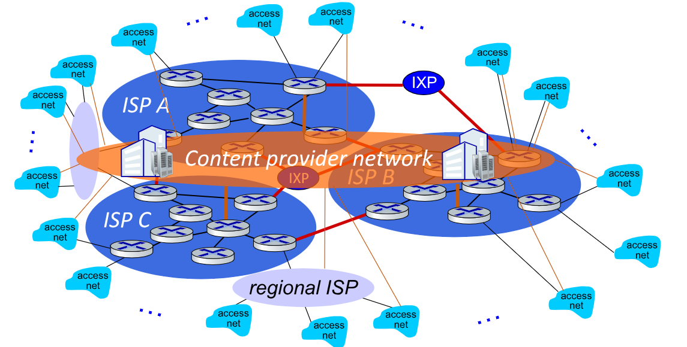

Possiamo quindi rappresentarla come una gerarchia:

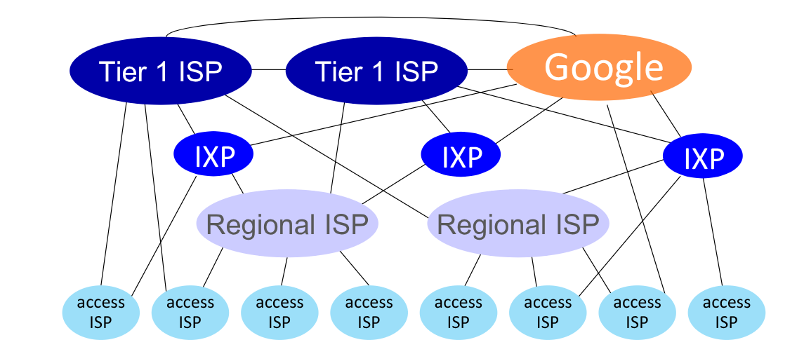

# 6. Performance

Abbiamo già iniziato a vedere come possono avvenire le _perdite di packetti_ e i vari _delay_.

Il ritardo complessivo di un pacchetto è influenzato da 4 fattori:
- $d_{\text{proc}}$: _ritardo di processing_ nel nodo, tempo impiegato dal router per analizzare il pacchetto e decidere come instradarlo.Tendenzialmente è nell'ordine di millisecondi e spesso trascurabile
- $d_{\text{queue}}$: _ritardo di queueing_, non è prevedibile e dipende dal livello di congestione del _router_
- $d_{\text{trans}}$: _ritardo di trasmissione_, calcolato come $\frac{L}{R}$
- $d_{\text{prop}}$: _ritardo di _propagazione_, se la lunghezza del link è $l$ e la velocità di propagazione è $s$ si calcola come $\frac{l}{s}$

$$
d_{\text{nodal}} = d_{\text{proc}} + d_{\text{queue}} + d_{\text{trans}} + d_{\text{prop}}
$$

<div class="grid2">
<div class="">

Avendo noti:
- $R$: larghezza di banda in `bps`
- $L$: lunghezza del pacchetto in `b`

E variando $a$, ovvero il numero di pacchetti medi inviati

Il rate totale sarà quindi $a \cdot \frac{L}{R}$ e può valere:
- $\approx 0$: se il ritardo di _queueing_ è piccolo
- $\approx 1$: se il ritardo di _queueing_ è grosso
- $\gg 1$: abbiamo più pacchetti in entrata che in uscita, geenrando un ritardo infinito!
</div>
<div class="">
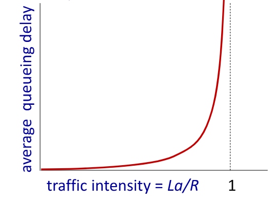


</div>
</div>

## 6.1. Ritardi e Instradamento

Nella vita reale sono presenti numerosi router tra sorgente e destinazione.

Per poter capire ad esempio in quali _router_ un pacchetto arriva prima della destinazione si può usare il comando:
```bash
tracepath indirizzoDestinatario
```

Questo comando invia iterativamente 3 pacchetti con _time-to-live_ uguale al numero dell'iterazione. Ogni volta che i pacchetti termineranno il loto _ttl_ il router invierà un messaggio all'_host_ sorgente con l'informazione del proprio `IP`. Il sorgente cronometra il tempo dall'invio e la ricezione e ripete finché i pacchetti non raggiungono _ttl_ sufficiente per arrivare a destinazione.

## 6.2. Throughput

Il **throughput** è definito come il numero di pacchetti (o bit) che riescono a passare attraverso un certo link nell'unità di tempo.
È una misura media, calcolato ad esempio come la portata di un fluido.

Se facciamo tendere $\Delta t \to 0$ allora otteniamo il **throughput istantaneo**.

In configurazioni del genere:

<figure class="">
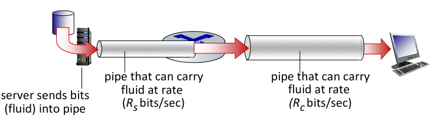
<figcaption>

La connessione avrà un **throughput medio** uguale al minore tra i due.
Questo effetto è chiamato _bottolneck link_.
</figcaption>
</figure>

In generale se ci sono $n$ link ognuno con **throughput medio** $R_i$, il **throughput medio** della connessione sarà:
$$
	R_{\text{avg}} = \min_{i \in [1, n]}\frac{{R_i}}{n}
$$

# 7. Sicurezza

Il mondo andava molto bene quando non c'erano gli _hacker_:
> Persone che non hanno niente da fare che si divertono a danneggiare gli altri. [...]  cattivi ragazzi
> cit. professore Anastasi

Tuttavia oggi ci sono, ed è quindi importante capire a quali possibili attacchi potremmo essere susciettibili:
- **Malware**, si dividono in:
  - _Virus_: infezione che si auto-replica ricevendo/eseguendo degli oggetti
  - _Worm_:  infezione che si auto-replica passivamente ricevendo oggetti che si eseguono da soli
- **Spyware Malware**: può registrare alcune informazioni del dispositivo, come i tasti della tastiera cliccati o i siti web visitati, e salvare questi dati in quelli detti _collection site_

Alcuni tipi di attaccchisono:
- **Denial of Service (DoS)**: gli attaccanti rendono le risorse di connessione dell'obiettivo inutilizzabili, sovraccaricandole con traffico inutile, sfruttando degli _host_ compromessi precedentemente da _botnet_
- **Packet Sniffing**: principalmente su mezzi broadcast (wireless, ethernet condiviso, ...) permette di leggere tutto il traffico sulla rete copiandoli e analizzandoli.
- **IP Snooping**: è possibile inviare pacchetti ad un destinatario modificando il sorgente, così da far credere al destinatario che il sorgente sia diverso da quello reale.

# 8. Protocolli e Servizi

Vediamo adesso com'è organizzato il protocollo che gestisce la comunicazione tra due _host_.
Le comunicazioni sono infatti sono intrinsecamente complesse. CIò è dovuto anche dlla struttura dei _network_, che comprendono molte componenti diverse tra loro, ad esempio:
- _host_
- _router_
- _link_ diversi
- _app_
- protocolli
- _herdware_ e _software_

Si cerca quindi un modo di organizzare la struttura del _network_, o perlomeno di cercare di organizzare le _comunicazioni su network_.

Priam di cercare di astrarre ciò che succede sul web, facciamo un esempio di quello che accade quando qualcuno prova a mandare una lettera.

Se un operatore $O_1$ vuole mandarla all'operatore $O_2$ questi sono i passaggi che avvengono:
- $O_1$ fornisce il messaggio ad un operatore alle Poste
- Le Poste lo trasferiscono al servizio di logistica
- Un corriere prenderà la lettere e la porterà fino ad un centro di sistamente
- Il centro di smistamento lo indirizzerà al centro di smistamento più vicino ad $O_2$
- Dal nuovo centor di smistamento un nuovo corriere lo porta al centro di logistica delle poste vicine ad $O_2$
- Un operatore lo recupererà e lo porterà a $O_2$

Per $O_1$ tutte queste oeprazioni sono sconosciute, e quello che vede è semplicemente che ha portato la lettera alle poste e questa è arrivata a $O_2$.
Possiamo notare come il percorso di questa lettera sia simmetrica: **I primi 4 step sono gli stessi degli ultimi 4, ma percorsi in due versi diversi**

Possiamo quindi classificarli in due momenti diversi:
- I primi 4 sono la procedura di invio
- Le ultime 4 sono la procedura di ricevimento

Ognuno di questi step è chiamato **layer**, e fornisce un servizio attarverso le proprie azioni facendo affidamento ai _layer_ sottostanti.

Questo approccio stratificato è un ottimo modo per affrontare _task_ complesse, poiché divide il problema in problemi più piccoli e semplici, rendendo anche più semplice la manutanzione.

## 8.1. Internet Protocol Stack

<div class="grid2">
<div class="">

Anche internet è gestito a strati.

I **livelli** di internet sono:
- **Applicazione**: supportano le applicazioni di rete. Su questo livello si trovano _client_ e _server_.
  Su questo livello si performano gli scambi tra _client_ e _server_, infatti proprio in questo _layer_ si possono generare richieste `HTTP`, `IMAP`, `SMTP`, ...

- **Trasporto**: trasforma i messaggi dei processi applicativo per trasferire i dati. Può farli con più protocolli: `TCP`, `UDP`, ...

- **Rete**: direziona i messaggi (datagrammi) dal sorgente alla desinazione.
  A questo livello sono contenute le informaizoni relative ai _protocolli di routing_ e i vari indirizzi `IP`

- **Connessione**: conserva le informazioni che permettono il trasferimento dei dati tra elementi vicini tra loro. Alcune tecnologie che si affidano alle informazioni contenute in questo livello sono l'`ethernet`, le comunicazioni `802.11 (Wi-Fi)`, `PPP`

- **Fisico**: È la comunicazione fisica dei `bit` nei cavi

In realtà Internet oggi non segue esattamente questo modello, ma diverse azioni che nel modello appartengono a livelli diversi sono spesso gestite da altri.
</div>
<div class="">
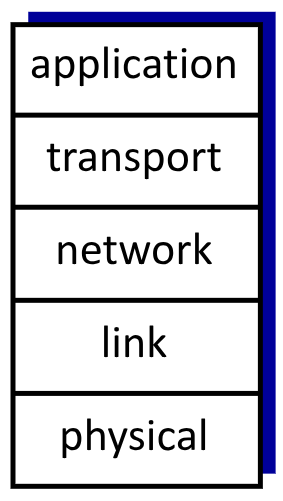

</div>
<div>

Il modello di internet si basa sul **_modello ISO/OSI_**, rimuovendone però due strati:
- **Presentazione**: permette l'interpretazioni del significato dei dati (_encryption_, compressione, convenzioni macchina specifiche, ...)
- **Sessione**: Gestiva la _sincronizzazione_, i checkpoint e il _recovery_ dello scambio di dati

Internet non supporta nativamente questi step, che se fossero necessari devono estere implementati nel livello **applicazione**.

</div>
<div>
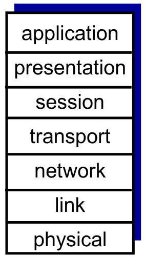

</div>
</div>

Quello che succede quando si invia una richiesta è qualcosa del genere:

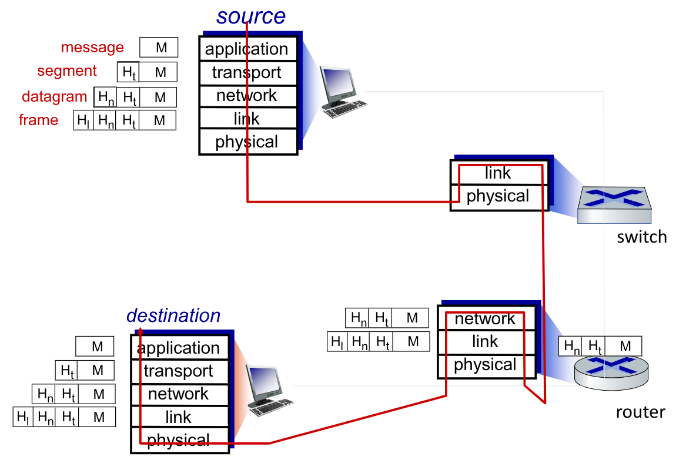

Il messaggio `M` viene **_incapsulato_**, aggiungendo tanti _header_ quanti sono i livelli del modello, appesi sempre in testa, generando il _frame_
Gli _switch_ andranno a leggere **solo** i primi due header per deciderne l'istradamento.
Quando il _frame_ arriva al _router_, questo va a leggere anche il 3° header per capire a quale dispositivo interno alla rete va trasmesso il _frame_.
Il _router_ instrada il frame internamente alla rete verso la destinazione.
La destinazione decodificherà il _frame_ (diverso nel livello _datalink_ modificato dal _router_), leggendone ad uno ad uno gli header, fino a capire qual'è il processo destinatario.
Il processo destinatario riceve quindi il messaggio `M`.
