# 1. Indice

- [1. Indice](#1-indice)
- [2. Livello di Trasporto](#2-livello-di-trasporto)
	- [2.1. Servizi di Trasporto](#21-servizi-di-trasporto)
	- [2.2. Multiplexing e Demultiplexing](#22-multiplexing-e-demultiplexing)
	- [2.3. Protocollo UDP](#23-protocollo-udp)
	- [2.4. Protocollo TCP](#24-protocollo-tcp)
		- [2.4.1. TCP handshake](#241-tcp-handshake)
			- [2.4.1.1. TCP Sender](#2411-tcp-sender)
		- [2.4.2. TCP Flow Control](#242-tcp-flow-control)
		- [2.4.3. TCP Congestion Control](#243-tcp-congestion-control)
			- [2.4.3.1. Explicit Congestion Notification - `ECN`](#2431-explicit-congestion-notification---ecn)
		- [2.4.4. TCP End-to-End Congestion Control](#244-tcp-end-to-end-congestion-control)
		- [2.4.5. TCP fairness](#245-tcp-fairness)
	- [2.5. Evoluzione del layer di trasporto](#25-evoluzione-del-layer-di-trasporto)

# 2. Livello di Trasporto

Utilizzando il _network layer_ siamo in grado di trasmettere un _datagram_ tra due _host_.

Quello che però vogliamo fare noi non è far comunciare tra di loro due _host_, ma **_due processi_** uno su un _host_ e uno su un'altro.

Il _transport layer_ si occupa proprio di permettere la comunicazione **process-to-process**, basandosi, e migliorando, i servizi di _network layer_.

Si basa su alcuni principi:
- **multiplexing** e **demultiplexing**
- **Trasferimento affidabile dei dati**
- **Controllo di flusso**
- **Controllo delle congestioni**

È implementato da due protocolli:
- `UDP`: trasporto _connectionless_
- `TCP` trasporto affidabile orientato alla connessione. Può implementare il _controllo di flusso_ e il _controllo delle congestioni_

## 2.1. Servizi di Trasporto

Al livello di trasporto di sviluppano comunicazioni logiche tra **processi** e non più tra _host_ come nel livello _network_.

Il servizio di **multiplexing**/**demultiplexing** serve proprio per riuscire a gestire le diverse comunicazioni dei vari processi all'interno dello stesso _host_.

Fornisce il concetto di `pipe`, ovvero il canale logico di connessione tra:
- _Processo Sorgente_: riceve un messaggio dall'_application layer_. Lo divide in diversi _segmenti_ aggiungendovi un **header**. Inoltra i segmenti al _network layer_
- _Processo Destinatario_.: Riceve diversi segmenti dal _network layer_, e ne controlla i valori nell'**header**. Estrae i vari spezzoni del messaggio riassemblandolo, e lo _demultiplexa_ inoltrandolo all'_application layer_ attraverso un _socket_.

Vi sono due protocolli con i quali è possibile implementare il _livello di trasporto_:
- `TCP` (_Transmission Control Protocol_): è un protocollo affidabile che si basa sul **setup della comunicazione**. Implementa il _controllo della congestione della rete_, il _controlllo di flusso_.
- `UDP` (_User Datagram Protocol_): è un protocollo inaffidabile che permette la trasmissione di messaggi non ordinati. È l'implementnazione più vicina al concetto di _best-effort_ del protocollo `IP`

In entrambi i casi non vi è alcuna garanzia sulla _gestione del delay_ né _garanzie sulla banda_.

## 2.2. Multiplexing e Demultiplexing

Il _multiplexing_ è un servizio dei **_trasmettitori_** che permette di gestire i _segmenti_ diretti verso diversi _socket_, aggiungendo informaizoni agli **_header di trasporto_**.

Il _demultiplexing_ è invece un servizio dei **_ricevitori_**, che utilizza le informazioni contenute negli **_header di trasporto_** dei _segmenti_ per indirizzarli ai _socket_ corretti.

<div class="grid2">
<div class="">

Nel caso di _demultiplexing senza connessione_, questo viene effettuato esclusivamente a partire dagli **_indirizzi IP_** e dal **_numero di porta_**.

All'interno dell'_header_ sono contenute, oltre a diverse informazioni per il momento non rilevanti, il **_numero di porta sorgente_** e **_numero di porta destinatario_**.

Questo è tipico del protocollo `UDP`.
</div>
<div class="">
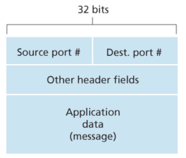
</div>
</div>

Nel caso di _demultimplexing con connessione_, un _socket TCP_ è identificato da **4 tuple**:
- Indirizzo IP sorgente
- Numero di Porta sorgente
- Indirizzo IP destinatario
- Numero di Porta destinatario

Un server potrebbe infatti supportare **_diversi socket TCP_** che operano in **simultanea**. Ogniuno sarà quindi identificato da queste quattro tuple, e sarà associato ad un processo _client_ diverso.

Il _demultiplexer_ utilizzerà quindi **_tutte e quattro le informazioni_** per direzionare opportunamente il segmento al _socket_ corretto.

Questo è tipico del protocollo `TCP`.

## 2.3. Protocollo UDP

L'_User Datagram Protocol_, definito nel `[RFC 768]`, è detto il protocollo di trasporto internet **_nudo e crudo_**.

È il protocollo che incarna al meglio la politica _"best effort"_, in quanto i segmenti `UDP` potrebbero perdersi o arrivare in ordine causale, in quanto ogni segmento viene **_trattato indipendentemente dagli altri_**.

È un protocollo che si dice **_connectionless_**, in quanto non presuppone alcun _handshake_ tra il trasmettitore e il ricevitore.
Questa scelta permette di mantenere un alto livello di semplicità nelle connessioni, oltre a evitare di aggiungere ritardi dovuti al _setup_ della connessione.

Un altro vantaggio è possibile mantenere limitata la dimensione dell'_header_.

Questa scelta però comporta l'assenza di controlli sia _di flusso_ che di _congestione_.


Il protocollo `UDP` è utilizzato in diversi servizi che non necessitano di affidabilità ma preferiscono puntare sulla velocità e non hanno problemi nel perdere informaizoni:
- Applicazioni multimediali e di streaming
- `DNS`
- `SNMP`
- `HTTP/3`: implementa il trasferimento affifabile nell'_application layer_


<div class="grid2">
<div class="">

L'_header_ `UDP` è relativamente semplice e contenuto (`64bit`):
- **Porta sorgente** (`16bit`)
- **Porta destinataria** (`16bit`)
- **Lunghezza** (`16bit`): indica la lunghezza complessiva del pacchetto
- **Checksum** (`16bit`): controlla eventuali errori
- **Payload**: è il messaggio che arriva dall'applicazione

</div>
<div class="">
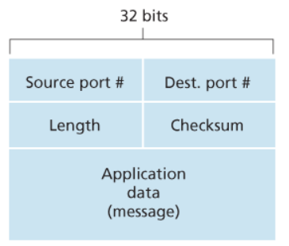
</div>
</div>

## 2.4. Protocollo TCP

È stato definito

È un protocollo _point-to-point_ che implementa il concetto di _pipe_.

È un servizio che garantisce l'**affidabilità della connessione**, sia per quanto riguarda l'ordinamento che per quanto riguarda la correttezza.

La _pipe_ è **full-duplex**, ovvero permette la trasmissione in entrambe le direzione dei _segmenti_, oltre a fornire i servizi di controllo delle congestioni e del flusso permette anche di impostare l'ampiezza della finestra.
 Ogni segmento può avere dimensione variabile, limitata dal `MSS` (_Maximum Segment Size_).

Il `MSS` è calcolato come
$$
	\text{max-size}_{\text{frame-payload}} - \text{size}_{\text{datagram-header}} - \text{size}_{\text{segment-header}}
$$

Il protocollo `TCP` prevede l'invio **cumulativo degli `ACK`**.

È un protocollo orientato alla connessione, che implementa un _handshake_ tra trasmettitore e ricevitore **prima che i dati inizino ad essere inviati**.


Il protocollo `TCP`, quando crea i _segmenti_, lo fa tendno conto della **_posizione dei Byte de messaggio_**

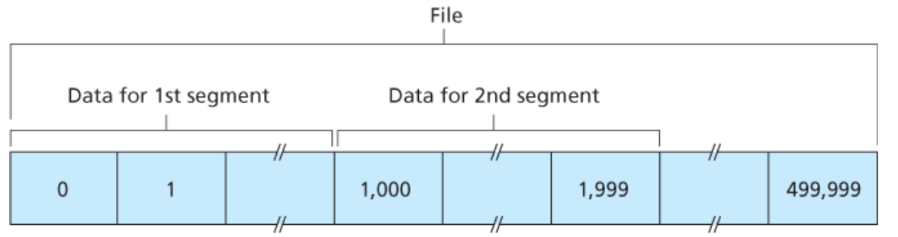


<div class="grid2">
<div class="">

Sulla desra possiamo vedere come è formato un _header TCP_:
- **Numero di Porta Sorgente** (`16bit`)
- **Numero di Porta Destinataria** (`16bit`)
- **Numero di Sequenza** (`32bit`): indica il numero di sequenza del **_primo byte_** contenuto all'interno del segmento rispetto al messaggio complessivo. Questo permette l'inoltro ordinato dei messaggi. Questo valore viene casualmente generato dai due _host_ per minimizzare la probabilità di ricevere un segmento di una vecchia comunicazione che era ancora in viaggio e considerato valido.
- **Acknowedgment number** (`32bit`): durante l'invio del messaggio contiene il **_numero di sequenza del prossimo segmento che il trasmettitore si aspetta di ricevere dal ricevitore_**. È significativo solamente se il l'`ACK bit` è settato
- **Header Length** (`4bit`): indica la lunghezza complessiva dell'_header_. Questa infatti è variabile da un minimo di `160bit` a un massimo di `` dovuto alle varie _options_
- **Bit inutilizzati** (`4bit`)
- **Flags** (`6bit`): sono diversi bit che hanno ruoli diversi:
  - **ACK bit**: utilizzato per indicare che il valore nel campo _acknowledgment number_ è significativo
  - **RST**, **SYN**, **FIN**: sono bit utilizzati per il _setup_ e il _teardown_ della connessione. Il primo serve a resettare la connessione in casi particolari, il secondo per inizializzare una connessione e l'ultlimo per terminarla.
  - **CWR**, **ECE**: sono utilizzati nelle notifiche esplicite di congestione (non utilizzati)
  - **PSH**: indica se il payload deve essere inviato immediatamente al livello superiore (non utilizzato)
  - **URG**: indica se al'interno del payload sono presenti dati che il livello superiore ha segnato come **_urgenti_**. (non utilizzato)
- **Receive Window** (`16bit`): è utilizzato per il controllo di flusso. Indica il numero di _byte_m assimi che il ricevitore può accettare e gestire
- **Internet checksum** (`16bit`)
- **Urgent Data Pointer** (`16bit`): se il bit `URG` è settato, indica la posizione dell'ultimo byte della sezione segnata come **_urgente_**. (non utilizzato)
- **Options**: campo variabile opzionale che specifica alcune informaizoni sul segmento
- **Payload**: messaggio passato dall'_application layer_

</div>
<div class="">
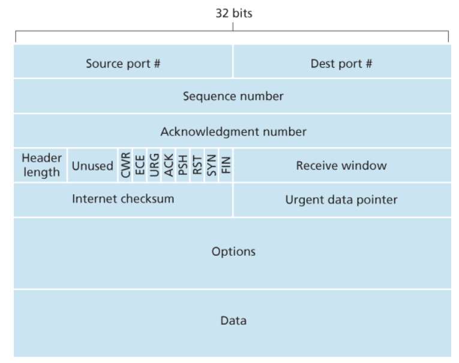
</div>
</div>

Di seguito possiamo vedere un esempio di come vengono utilizzati i campi di _sequenza_ e di _ack_.
<figure class="75">
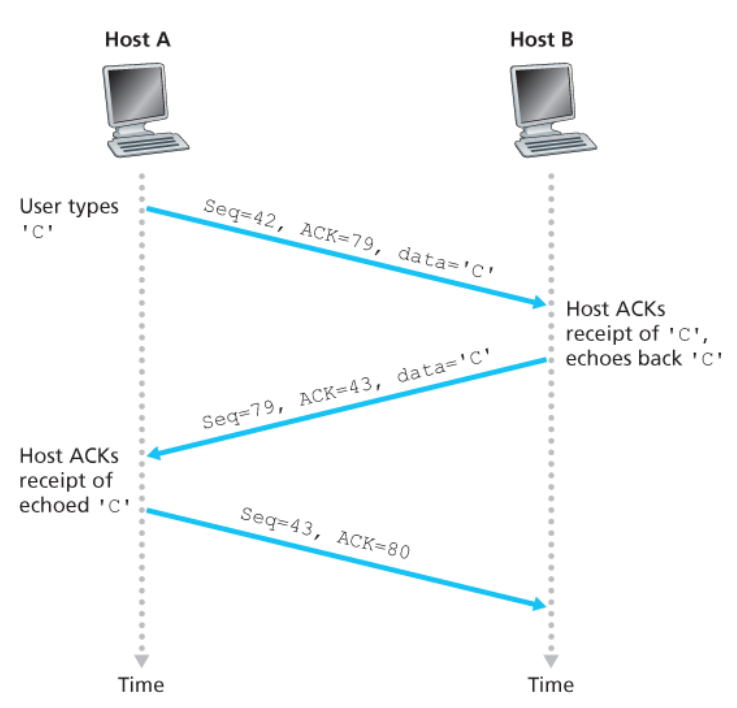
<figcaption>

Questo esempio mostra un semplice scambio di una semplice applicazione `Telnet` tramite `TCP`
</figcaption>
</figure>

Come un _host_ deve gestire dei _segmenti out-of-order_ **non è esplicitato dal protocollo**.
Questo infatti lascia libera scelta ai programmatori che creano le connessioni nel scegliere come comportarsi. In pratica vi sono due opzioni:
1. **Droppare i segmenti out-of-order e richiedere il segmento corretto**: opzione più semplice da implementare
2. **Salvare i segmenti out-of-order in un buffer così da non doverli richiedere**: più complesso da implementare ma permette di ottimizzare la banda della connessione.

Statisticamente la seconda opzione è quella più utilizzata.

### 2.4.1. TCP handshake

<div class="grid3">
<div class="top">
<div class="p">Client Side</div>

Per creare un oggetto socket:
```c
int sockD = socket(AF_INET, SOCK_STREAM, 0);
```

Per connettersi ad un socket:
```c
int connectStatus = connect(sockD,
							(struct sockaddr*)&servAddr,
							sizeof(servAddr));
```

Questa connessione rappresenta la `SYNSENT`, ovvero l'invio di un segmento con:
- `SYN = 1`
- `Seq = x`, dove `x` è un numero casuale scelto per evitare di recuperare segmenti di vecchie connessioni chiuse e scambiarli come ancora validi.

Il client attende adesso l'_ack_ dal server. Quando lo riceve farà la `ESTAB` della connessione con un ultimo invio:
- `ACK = 1`
- `ACKnum = y + 1`, dove `y` è il numero di sequenza del messaggio di `ACK` ricevuto

</div>
<div>
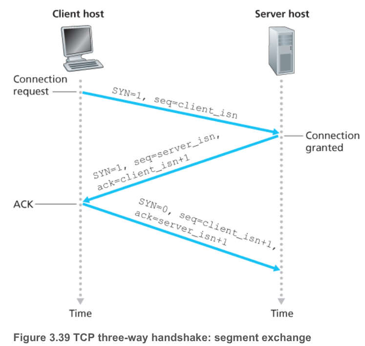
</div>
<div class="top">
<div class="p">Server Side</div>

Per creare un oggetto socket:
```c
int servSockD = socket(AF_INET, SOCK_STREAM, 0);

// associo un indirizzo
bind(servSockD,
	 (struct sockaddr*)&serverAddr,
	 sizeof(serverAddr));
// metto in ascolto
listen(servSockD, 1)
```

Per accettare nuove connessioni:
```c
int clientSocket = accept(servSockD, NULL, NULL);
```

La `accept` rappresenta la `SYN RCVD`, ovvero l'invio di un segmento con:
- `SYN = 1`
- `Seq = y`, dove `y` è un numero casuale
- `ACK = 1`
- `ACKnum = x + 1`

</div>
</div>

<div class="grid2">
<div class="">

Da questo momento in poi i due _host_ possono comunicare attraverso i _socket_.

Quando vorremo chiudere la connessione i passaggi sono molto simili:
- Il _client_ invia un segmento con `FIN = 1` al _server_
- Il _server_ lo riceve e risponde con un `ACK`.
- Successivamente procede acnhe lui a chiudere la connessione inviando anche lui un segmento con `FIN = 1` al _client_
- Il _client_ lo riceve il `FIN` e invia un `ACK`, entrando in un **timed wait**
- Il _server_ riceve l'`ACK`

Nella **timed wait** il _client_ continua ad essere attivo. Questo è implementato per ovviare al problema che l'`ACK` finale potrebbe non arrivare al _server_.
Questi quindi reinvierebbe il `FIN`, rischiando però di trovare il _client_ già spento ed entrando il un _loop_ di invii che non vedrebbero mai risposta.

La **timed wait** quindi forza il _client_ a stare ancora attivo così da poter ricevere eventuali nuove `FIN` dovute alla perdita dell'`ACK`.

</div>
<div class="">
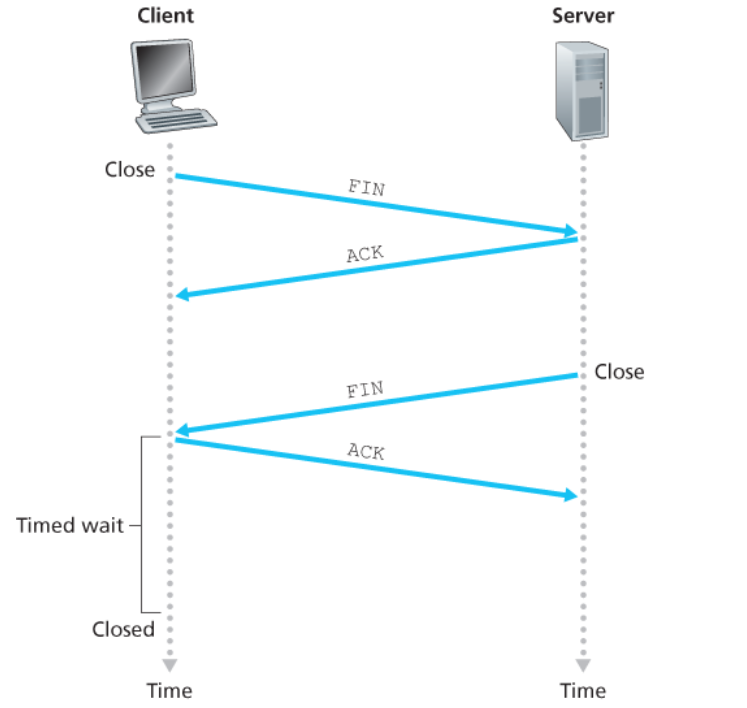
</div>
</div>

Il `TCP` crea quindi un servizio di trasferimento dati affidabile basandosi sul servizio `IP`, che abbiamo detto essere _inaffidabile_.
Questo sistema, basato su finestre `ACK` e ritrasmissioni, e non differisce molto dall'_rdt_ già visto precedentemente, se non per il problema del **calcolo del timeout**.

Mentre nel _link layer_ ci basavamo sul `RTT`, adesso questo valore è **variabile**, a causa degli _hop_ che un pacchetto deve fare.
Dobbiamo quindi riuscire a calcolare una stima del `RTT` del pacchetto che stiamo inviando partendo dai dati passati.

Il `RTT` misurato per un segmento, detto `SampleRTT`, è il tempo che passa dall'invio del segmento (il suo passaggio al _network layer_) fino alla ricezione del rispettivo `ACK`.

La maggior parte degli algoritmi `TCP` **non misurano il `SampleRTT` per tutti i segmenti trasmessi** ma ne misurano uno alla volta, ovvero non misuriamo il `SampleRTT` per i segmenti tra l'invio del misurato e il suo `ACK`.
Questo comporta che otteniamo un nuovo `SampleRTT` ogni `SampleRTT`.

Inoltre, il `TCP` non calcola mai il `SampleRTT` per un segmento ritrasmesso.

Ovviamente, il valore dei vari `SampleRTT` per segmenti diversi **varierà**, anche in maniera considerevole, a causa del _routing_ e dei vari rallentamenti che comporta.

A causa di questa variazione, un dato `SampleRTT` può essere anche **_molto diverso dalla norma_**. Si rileva quindi necessario utilizzare un algoritmo che "filtri" questi valori per ottenere una specie di "media", chiamata `EstimatedRTT`.

L'algoritmo della _media campionaria_ non è molto funzionale, poiché le condizioni della rete **variano molto nel tempo**, e ciò comporterebbe che campioni troppo vecchi influenzerebbero in modo potenzialmente fatale la stima.

Utilizziamo quindi la **_media esponenziale mobile_** `EWMA` (_Exponential Weighted Moving Average_).
Definendo:
$$
	\text{SampleRTT} := RTT \\[0.25em]
	\text{EstimatedRTT}:=ERTT
$$

Otteniamo che:
$$
\begin{align*}
	{ERTT}_{1} &= {RTT}_{0} \\
	{ERTT}_{2} &= \alpha \cdot {RTT}_{1} + (1-\alpha) \cdot {RTT}_{0} \\
	{ERTT}_{3} &= \alpha \cdot {RTT}_{2} + \alpha(1-\alpha) \cdot {RTT}_{1} + (1-\alpha)^2 \cdot {RTT}_{0} = \alpha \cdot {RTT}_{2} + (1-\alpha) \cdot {ERTT}_{2}\\
	 &\vdots \\
\end{align*}
$$

La formula finale sarà quindi una media pesata ricorsiva:
$$
	\boxed{\text{EstimatedRTT} := (1-\alpha) \cdot \text{EstimatedRTT} + \alpha \cdot \text{SampleRTT}}
$$

Il valore consigliato per $\alpha = \frac{1}{8} = 0.125$ `[RFC 6298]`, rendendo la formula:
$$
	\boxed{\text{EstimatedRTT} := 0.825 \cdot \text{EstimatedRTT} + 0.125 \cdot \text{SampleRTT}}
$$

<figure class="">
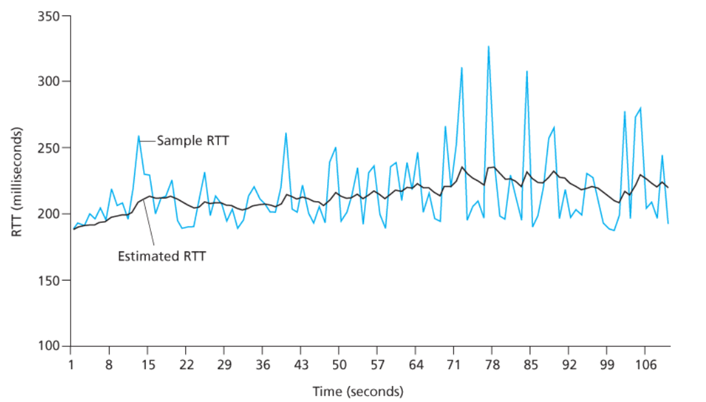
<figcaption>

Esempio di valori di una connessione tra `gaia.cs.umass.edu` e `fantasia.eurecom.fr`
</figcaption>
</figure>

La stima è per sua natura imprecisa. Per riuscire a calcolare il _timeout effettivo_ dobbiamo quindi inserire una sorta di **margine di errore**.
Poiché variazioni elevate di `ERTT` necessitano di un margine più elevato, una prima idea era quella di mettere come margine un altro `ERTT`.
Anche se questo approccio funziona, si possono fare scelte migliori, come ad esempio il **quadruplo della variabilità**.

La variabilità `DevRTT` è una stima di quanto `SampleRTT` varia da `EstimatedRTT`:
$$
	\text{DevRTT} = (1-\beta) \cdot \text{DevRTT} + \beta \cdot | \text{SampleRTT} - \text{EstimatedRTT}|
$$

Il valore consigliato di $\beta$ in questo caso è di $\beta = \frac{1}{4} = 0.25$.

Il _timeout_ viene quindi calcolato come $1$ secondo inizialmente `[RFC 6298]`, e successivamente come:
$$
	\boxed{\text{TimeoutInterval} = \text{EstimatedRTT} + 4 \cdot \text{DevRTT}}
$$

#### 2.4.1.1. TCP Sender

Vediamo adesso una versione semplificata di `TCP sender`.

Il `TCP sender` deve gestire **_3 eventi_**:
1. **Ricezione dati dall'applicazione**: deve fare i seguenti passaggi:
	- Creare un segmento con `seq #`, dove `#` è calcolato rispetto ai byte inviati nel segmento inviato precedentemente. Ovvero la posizione del primo byte nel segmento in riferimento allo _stream_
	- Inizializzare il timer se non è stato già fatto, infatti potrebbe essere presente un timer riferito ad un segmento precedente che non ha ancora ricevuto l'`ACK`.Il timer è infatti preso in riferimento al più vecchio segmento che non ha ancora ricevuto `ACK`.
2. **Timeout**: deve fare i seguenti passaggi:
	- Ritrasmette il segmento che ha causato il _timeout_
	- Riavvia il timer
3. **Ricezione dell'ACK**: deve fare i seguenti passaggi:
	- Se si riferisce a un segmento `unACKed`, aggiorno quello che ora è `ACKed` e aggiusto il timer in modo adeguato

Di seguito possiamo vedere dello pseudocodice che più implementare un `TCP sender`:
```c
/*
* Assumiamo che:
* - il sender non sia legato al TCP flow né al congestion control
* - che tutti i messaggi siano più piccoli di MSS
* - che i dati vengano trasferiti in un unico verso
*/

NextSeqNum = InitialSeqNumber;
SendBase = InitialSeqNumber;

while(1){
	switch(event){
		case 'data received from above':
			newSegment = create_TCP_segment(NextSeqNum, data);
			segments[NextSeqNum] = newSegment;
			if(!timer){
				start(timer);
			}
			passToIP(newSegment);
			addToNotACK(newSegment);
			NextSeqNum += length(data);
			break;
		case 'timer timeout':
			passToIP(getOldestNotACK());
			reset(timer);
			break;
		case 'ACK received':
			if(y > SendBase){
				SendBase = y;
				// rimuovo i segmenti con seq <= SendBase
				removeFromNotACK(SendBase);

				if(getOldestNotACK() != NULL)
					reset(timer);
			}
			break;
	}
}
```

Uno dei problemi con la ritrasmissione dovuta a timeout, è prorpio il fatto che questo timeout può essere relativamente lungo.
Quand oun segmento viene prso, questo lungo periodo di _timeout_ costringe il trasmettitore ad **attendere prima di ritrasmettere il segmento**, aumentando di conseguenza il _delay end-to-end_.

Fortunatamente, il trasmettitore può rilevare la perdita di un pacchetto prima che l'evento di timeout avvenga, attraverso gli **`ACK duplicati`**.

Un `ACK duplicato` è un `ACK` che effettua un _acknowledge_ per un segmento già `ACKed`.

Per capire meglio come il trasmettitore deve reagire ad un `ACK duplicato` capiamo prima perché il ricevitore dovrebbe inviarlo:

<div class="flexbox" markdown="1">

|                                                                        Event                                                                         |                                                                         Azione ricevitore TCP                                                                         |
| :--------------------------------------------------------------------------------------------------------------------------------------------------: | :-------------------------------------------------------------------------------------------------------------------------------------------------------------------: |
|                 Arrivo di un segmento con il `seq` atteso.<br>Tutti i dati fino al numero di sequenza atteso sono già stati `ACKed`                  | Invio del **delayed ACK**: Si attendono funo a 500 ms per l'arrivo di un altro segmento in ordine.<br> Se questo non arriva nell'intervallo, allora si invia un `ACK` |
| Arrivo di un segmento con il `seq` atteso. <br> Vi è anche un altro segmento con numero di sequenza corretto in attesa della trasmissione dell'`ACK` |                              Viene immediatamente inviato un **singolo `ACK cumulativo`**, che effettua l'`ACK` di entrambi i segmenti.                               |
|                          Arrivo fuori ordine di un segmento con `seq` più elevato di quello atteso.<br>**Rilevato un gap**                           |                      Invio immediato di un `duplicate ACK`, indicando il `seq` del prossimo byte atteso.<br>Sarà l'estremo inferiore del _gap_.                       |
|                                        Arrivo del segmento che riempie (parzialmente o completamente) il gap                                         |                                      Invio immediato dell'`ACK` qualora il segmento sia quello nell'estremo inferiore del _gap_                                       |

</div>

In generale il `case` di invio degli `ACK` si complica:
```c

initAllEntries(duplicatesACKsReceived, 0);
// ...
switch(event){
	// ...
	case 'ACK received':
		if(y > SendBase){
			SendBase = y;
			// rimuovo i segmenti con seq <= SendBase
			removeFromNotACK(SendBase);

			if(getOldestNotACK() != NULL)
				reset(timer);
		}
		else{
			// Invio un ACK duplicato per un segmento già ACKed
			duplicatesACKsReceived[y]++;

			if(duplicatesACKsReceived[y] == 3){
				/* TCP fast retransmit */
				passToIP(segments[y]);
			}
		}
		break;
}
```

### 2.4.2. TCP Flow Control

Gli _host_ su ambo i lati di una connessione `TCP` hanno un buffer di ricezione dedicato alla connessione.
Quando vengono ricevuti dei byte corretti e in equenza, questi vengono inseriti nel _receive buffer_.
Il processo associato dell'_application layer_ leggerà i dati proprio da questo buffer, anche se non è detto che lo faccia nel momento esatto in cui questi dati arrivano.

Infatti l'applicazione stessa potrebbe essere impegnata con altre _task_, oppure potrebbe non provare nemmeno a leggere i dati finché non è sicura che sono arrivati tutti.
Se l'applicazione fosse relativamente troppo lenta a leggere i dati, il trasmettitore può facilmente riempire il buffer del ricevitore inviando troppi dati troppo velocemente.

Il protocollo `TCP` fornisce un **_servizio di flow-control_** alle proprie applicazioni per eliminare la possibilità che un trasmettitore possa sovraccaricare il ricevitore.

Il servizio di _flow-control_ è quindi un servizio di _sincronizzazione di velocità_, cercando di far combaciare la velocità di lettura dei dati arrivati con quella di invio dei nuovi.

Il _flow-control_ è implementato attraverso la _receive window_. Poiché il protocollo è _full-duplex_, entrambi gli host mantengono una _receive window_ distinta.

Ipotiziamo che l'_host_ `A` stia inviando un grosso file all'_host_ `B` attraverso una connessione `TCP`.
`B` alloca un _receive buffer_ per questa connessione, di dimensione `RcvBuffer` (di _default_ `4KB`).
Ogni tanto il processo applicazione dell'_host_ `B` procederà a leggere dal _buffer_.

Definiamo quindi le seguenti variabili:
- `LastByteRead`: è il numero dell'ultimo byte dello stream che il processo applicazione di `B` **ha letto dal buffer**
- `LastByteRcvd`: è il numero dell'ultimo byte dello stream che è arrivato dal _network_ ed è stato inserito da `B` nel _buffer_.

Poiché `TCP` non permette di fare _overflow_ nel buffer, è necessario che:
$$
	\text{LastByteRcvd}-\text{LastByteRead} \le \text{RcvBuffer}
$$

La _receive window_ `rwnd` sarà quindi la dimensione rimanente nel buffer:
$$
	\text{rwnd} = \text{RcvBuffer} - \bigl[\text{LastByteRcvd}-\text{LastByteRead}\bigr]
$$

Poiché lo spazio rimanente può campiare nel tempo, `rwnd` **è calcolata dinamicamente**.

Inizialmente `B` imposta `rwnd = RcvBuffer` e invia il primo segmento.

L'_host_ `A` terrà invece traccia di due variabili `LastByteSent` e `LastByteAcked`. Per avere la la certezza di non sovraccaricare il _buffer_ di `B` deve premurarsi che:
$$
	\text{LastByteSent} - \text{LastByteAcked} \le \text{rwnd}
$$

Questo calcolo però ha un problema intrinseco.
Immaginiamo che `A` cominici ad inviare messaggi finché `rwnd = 0`. `A` riceve questa informazione dall'ultimo `ACK` che riceve.
A questo punto `A` non invierà più messaggi attendnedo che `B` legga i messaggi nel buffer così da liberare spazio.
Tuttavia, smettendo di inviare messaggi `B` _non invierà più ACK_, quindi `A` **_non riceverà mai la notifica della liberazione del nuovo spazio_**.

Per risolvere questo problema, le specifiche del `TCP` sanciscono che `A` **continui a inviare segmenti di dimensione `1 Byte` quando la finestra di `B` è zero**.
Poiché il _buffer_ è destinato a svuotarsi prima o poi, i segmenti di _acknowledged_ conterranno valori `rwnd` non nulli, permettendo ad `A` di ripendere con l'invio di messaggi più grandi.

Il _flow-control_ **non è implementato dal protocollo** `UDP`, che quindi può soffrire di perdita pacchetti dovute al _buffer overflow_.

### 2.4.3. TCP Congestion Control

Le ritrasmissioni, utilizzate dal `TCP` per avere un flusso dei dati affidabile.
Questo però ha una conseguenza molto rilevante, infatti la trasmissione multipla di molti pacchetti può portare a **_congestionare la rete_**.

La ritrasmissione infatti cura uno dei sintomi della congestione (la perdita dei pacchetti), ma non la causa stessa di essa.

Vi possono essere diversi motivi per i quali si genera una congestione di rete vediamo il più semplice:

<div class="grid2">
<div class="top">

Immaginiamo due _host_ `A` e `B` che comunicano attraverso un **singolo router** con degli altri host (`C` e `D`).

Immaginiamo che `A` trassmetta dati ad uno dei due _host_ ad un rateo medio di $\lambda_{in}$ byte/s. Ignorando gli _overhead_ aggiuntivi, e i controlli di flusso e congestione, l'host offre un traffico al router proprio di $\lambda_{in}$ byte/s.

Anche l'_host_ `B`  si comporta nel medesimo modo, trasferendo anche lui con la medesima velocità.

I pacchetti provenienti dai due host arriveranno al _router_ attraverso il medesimo mezzo di capacità $R$.
Immaginiamo per semplicità che il _router_ abbia a disposizioni **_sufficienti buffer a contenere tutti i pacchetti anche quando il rateo di entrata dei paccheti eccede quello di uscita_**.

</div>
<div class="top">
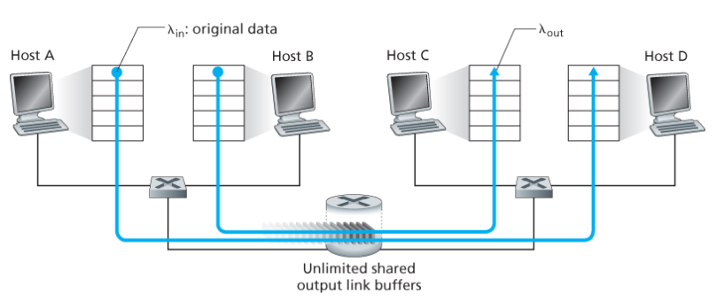
</div>
</div>


Se si ha un rateo di invio $\lambda_{in} \in [0, \frac{R}{2}]$ il _rateo di arrivo medio_ $\lambda_{out}$ è **uguale** al rateo di invio medio del trasmettitore $\lambda_{in}$.

Se però $\lambda_{in} > \frac{R}{2}$ il _throughput_ continua ad essere limitato a $\frac{R}{2}$.
Questo limite superiore è la naturale conseguenza del condividere la capacità del _link_ tra le due connessioni.

Seppur l'utilizzo completo del _link_ possa sembrare una buona cosa, il realtà l'utilizzo a piena capacità del _link_ **_aumenta esponenzialmente il delay tra pacchetti_**.

Esistono quindi diversi approcci per implementare il _congestion control_:
- **Network Assisted congestion control**: il _router_ fornisce un feedback esplicito al trasmettitore e/o al ricevitore riguardanti lo stato di congestione della rete. Questo può avvenire attraverso un bit che indica proprio la congestione del _link_. Questo approccio non è però molto utilizzato oggi
- **End-to-end congestion control**: il _network-layer_ non fornisce nessun supporto specifico al _transport-layer_ per effettuare il _congestion control_. La presenza di congestioni viene dedotta dai sintomi che questa comporta come: _aumento del_ `TTR`, _triplici `ACK` duplicati_, _timeout_. Questi eventi **non sono necessariamente correlati alla congestione**, tuttavia il `TCP` non ha modo di capirne la vera motivazione, e quindi esegue una mossa conservativa, trattando questi eventi come **_indice di congestione_**.

#### 2.4.3.1. Explicit Congestion Notification - `ECN`

L'approccio _network assisted_ opera delegando al router di settare due bit nell'header `IP` (campi `ToS`) per indicare la congestione, e procede a inoltrare il essaggio al destinatario.

Sucessivamente, il destinatario, setterà il bit `ECE` nel segmento di `ACK` di ricezione del segmento e lo inoltrerà al trasmettitore.

QUando il trasmettitore lo riceverà procederà a **dimezzare** `cwnd`, e setterà `CWR` nell'header del successivo segmento da inoltrare.

Questo metodo coinvolge sia il protocollo `IP` che quello `TCP`

### 2.4.4. TCP End-to-End Congestion Control

Il `TCP` utilizza l'approccio **end-to-end**.

Dobbiamo però adesso cpaire come **reagire al rilevamento della congestione**.
Se tutti i trasmettitori azzerassero il rateo di invio, per quanto è vero che la congestione scomparirebbe, è vero anche che i ricevitori continuerebbero a **non veder arrivare alcun pacchetto**.

Per decidere come agire dobbiamo rispondere a tre domande fondamentali:
- Come fa il trasmettitore a _limitare_ il proprio rate dopo aver rilevato congestione?
- Come fa il trasmettitore a _rilevare_ la congestione?
- Come fa il trasmettitore a _aggiustare_ il proprio rateo dopo aver rilevato la congestione?

Il parametro sul quale agiamo si chiama **congestion window** `cwnd`.
Il `cwnd` impone nu limite sul rateo al quale un trasmettitore `TCP` può instradare traffico nella rete.

In generale è di nuovo vero che:
$$
	\text{LastByteSent} - \text{LastByteAcked} \le \text{cwnd}
$$

In generale quindi un trasmettitore limiterà il suo invio secondo la legge:
$$
	\boxed{\text{LastByteSent} - \text{LastByteAcked} \le \min\{\text{rwnd}, \text{cwnd}\}}
$$

In generale il rateo di invio del trasmettitore è di circa:
$$
	\text{rate} = \frac{\text{cwnd}}{\text{RRT}} \;\;\text{bytes/s}
$$


Una semplificazione dell'approccio che il trasmettitore segue si chiama _Additive Increase, Multiplicative Decrease_ (`AIMD`):
> Il trasmettitore prova costantemente ad **aumentare di 1 il rateo di invio del `MSS`**.
> Quando si verifica un sintomo della congestione (_perdita di un pacchetto_, _timeout_, _triplo ACK_).dimezza il rateo di invio.

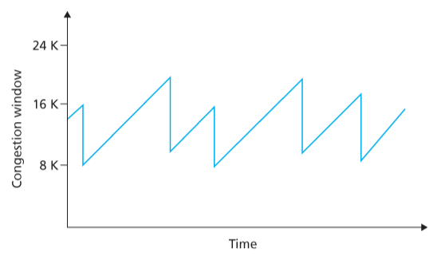


Il vero algoritmo che il `TCP` utilizza è più complesso.
Si divide in tre fasi:
1. **Slow start**: si parte con una finestra piccola per poi ampliarla in modo esponenziale
2. **Congestion Avoidance**: si aumenta il più possibile la finestra finché non si verifica la congestione
3. **Reaction to Loss Events**: 

Quando una connessione viene avviata, lo _slow start_ impone di partire con finestre `cwnd = 1 MSS`.
Successivamente, ad ogni `ACK` si **raddoppia la finestra**.
Nel caso tutto vada bene si invieranno $1, 2, 4, 8, 16, ...$ pacchetti a volta.
Ad un certo punto si raggiungerà una _soglia_ `ssthresh`, che inizialmente è di `64 KB`.
Quando si supera la soglia si passa nella seconda fase (_congestion avoidance_), dove adesso si aumenterà la finestra **_di 1 `MSS` alla volta_**.

Quando si verifica un sintomo di congestione l'algoritmo agisce in modo differente in base al sintomo:
- **3 ACK duplicati**: rimango nella fase di _congestion avoidance_, mantenendo un approccio di _fast recovery_
  - `ssthresh = cwnd / 2`
  - `cwnd = cwnd / 2 + 3`
- **Timeout**: rientro nella fase di _slow start_
  - `ssthresh = cwnd / 2`
  - `cwnd = 1 MSS`

L'aggiornamento del valore della soglia è indipendente dal proprio valore precedente, ma dipende esclusivamente dal valore della finestra prima che si verifichi un sintomo.

Di seguito possiamo trovare sulla sinitra la macchina a stati finiti dellì'algoritmo del _TCP congestion control_.

Sulla destra nivece è proposto un esempio di come possono variare nel tempo i valori della inestra e della soglia.

<div class="grid2">
<div class="">
<figure class="100">
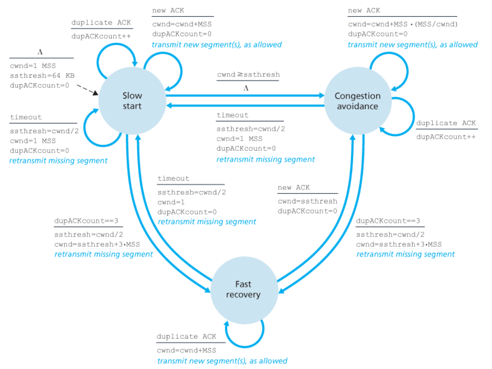
<figcaption>

Nella fase di _slow start_, quando arriva un nuovo `ACK` è segnato che si aumenta "solo di 1" la finestra.
Sottolineiamo che questo avviene **per ogni ACK** ricevuto.
Quindi se arrivano $n$ `ACK` avremo incrementato di $n$ `MSS`, ottenendo una finestra totale di $2\cdot n$ `MSS`.
</figcaption>
</figure>
</div>
<div class="">
<figure class="100">
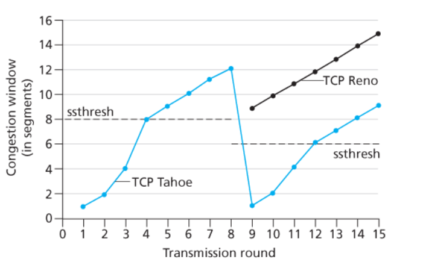
<figcaption>


</figcaption>
</figure>
</div>
</div>

Oltre all'approccio `AIMD`, esiste un altro approccio, detto `TCP CUBIC`, che utilizza una funzione cubica per effettuare il controllo della congestione.
Questo approccio è quello di _default_ in sistemi `Linux` ed è l'approccio più popolare nei _web server_.

### 2.4.5. TCP fairness

L'obiettivo della _fairness_ nel caso delle connessioni `TCP` è che, se $K$ sessioni condividono il medesimo _bottleneck_ di banda $R$, entrambi dovrebbero inviare con un rateo medio di $\frac{R}{K}$

<div class="grid2">
<div class="">

Se ipotizziamo di avere due sessioni TCP in "competizione", dove all'inizio il rateo è quello mostrato dal pallino rosso.

Entrambi sono nella fase di _congestion avoidance_, quindi spostano il pallino **lungo la diagonale parallela alla bisettrice** del semipiano.

Succederà prima o poi al punto in cui la trasmissione supera il limite, provocando un dimezzamento in entrambe le finestre.

Questo continua ad accadere di nuovo e di nuovo e di nuovo.....

È possibile dimostrare matematicamente (non lo faremo) che il pallino tenderà sempre di più a oscillare verso il punto ideale (il punto verde).

</div>
<div class="">
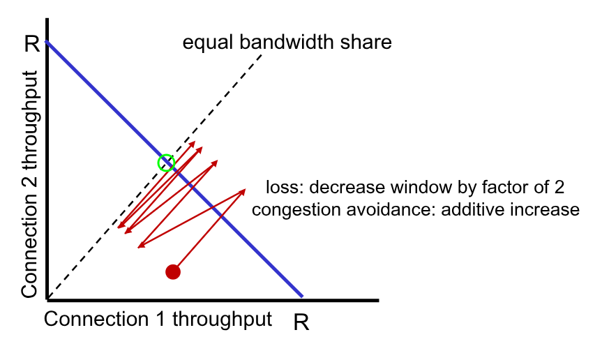
</div>
</div>

Consideriamo quindi l'algoritmo come _fair_.

La fairness però può non sempre essere desiderata in casi di applicazioni particolari.
In quei casi può essere un opzione utilizzare connessioni `UDP`.
Le applicazioni multimediali spesso desiderano di avere un rateo di invio costante, e non vogliono essere limitate dal _congestion control_.
Attraverso `UDP` non si è limitati nessun servizio

Se volessimo invece continuare a a utilizzare la connessione `TCP`, è possibile **aprire connessioni parallele multiple** tra due _host_.
Questo approccio non è molto _fair_, e molti amministratori di rete limitano il numero di connessioni `TCP` che si possono aprire verso uno stesso destinatario.

## 2.5. Evoluzione del layer di trasporto

I protocolli `TCP` e `UDP` sono i protocolli di trasporto principali degli utlimi 40 anni, e ne esistono di diversi tipi.

Tuttavia nessuno di questi supporta funzioni di sicurezza, ed è quindi necessario aggiungere un ulteriore _layer_, detto _transport security layer_, che ha altri _handshake_ e aggiunge _overhead_.

Le tecniche moderne utilizzano un nuovo protocollo, detto `QUIC`.

È un protocollo di _application layer_, che si appoggia sul protocollo `UDP` come protocollo di trasporto, ma implementa tutte e sole le proprietà del livello `TCP`.

L'insieme tra `HTTP/2` e `QUIC` è quello che oggi chiamiamo `HTTP/3`