# 1. Indice

- [1. Indice](#1-indice)
- [2. Reti Wireless e Nodi Mobili](#2-reti-wireless-e-nodi-mobili)
- [3. Rete Wireless](#3-rete-wireless)
  - [3.1. Tipi di Infrastrutture](#31-tipi-di-infrastrutture)
  - [3.2. Caratteristiche dei Link e della Rete](#32-caratteristiche-dei-link-e-della-rete)
  - [3.3. Reti Wireless `LAN` - `WiFi`](#33-reti-wireless-lan---wifi)
    - [3.3.1. Addressing](#331-addressing)
    - [3.3.2. Mobilità in una stessa subnet](#332-mobilità-in-una-stessa-subnet)
    - [3.3.3. Capacità Avanzate](#333-capacità-avanzate)
  - [3.4. Reti Wireless `LAN` - `LiFi`](#34-reti-wireless-lan---lifi)
  - [3.5. Reti Wireless `PAN` - `Bluetooth`](#35-reti-wireless-pan---bluetooth)
  - [3.6. Reti Cellulari `WAN` - `4G` e `5G`](#36-reti-cellulari-wan---4g-e-5g)
- [4. Nodi Mobili](#4-nodi-mobili)
  - [4.1. Routing Indiretto](#41-routing-indiretto)
  - [4.2. Routing Diretto](#42-routing-diretto)
  - [4.3. Impatto della mobilità sui livelli superiori](#43-impatto-della-mobilità-sui-livelli-superiori)

# 2. Reti Wireless e Nodi Mobili

Oggi la maggiorparte dei dispositivi _client_ connessi ad internet sono **dispositivi mobili** (_wireless_)..

Nel 2019 il numero di dispositivi connessi attraverso telefonia mobile era in rapporto 10 a 1 rispetto alla telefonia fissa.

È quindi necessario affrontare due nuove sfide:
- Comunicazioni Wireless
- Nodi mobili che cambiano il punto di aggancio alla rete

# 3. Rete Wireless

Nella figura sulla destra possiamo vedere il contesto nel quale esploreremo l'argomento delle reti wireless.

Identifichiamo innanzitutto gli elementi di una rete wireless:
- **Wireless Hosts**: sono i sistemi finali che eseguono le applicazioni. Fanno parte degli _host_ tutti i dispositivi in grado di connettersi alla rete wireless, indipendentemente dal fatto che siano mobili o meno.
- **Wireless Access Point** (`AP`): è un dispositivo di _bridge_, detto anche _base station_, con due interfacce:
  - La prima è connessa in maniera _linked_ con la rete internet cablata
  - La seconda è connessa in maniera _wireless_ ai dispositivi
- **Wireless Link**: sono i _link_ utilizzati per dagli host per connettersi alle _base stations_ o ad altri host wireless.

L'insieme di più _wireless hosts_ e di un `AP` è indicata come **_basic-service-set_** (`BSS`).

Quando un _host_ si sposta oltre la portata di una _base station_ ed entra nel range di un'altra, cambierà il proprio _access point_ in relazione alla rete internet.
Questi processi sono chiamati **_handoff_** (uscita) e **_handover_** (entrata), e introducono la necessità gestire opportunamente l'_end-off_ di un dispositivo quando si sposta da una cella ad un altra.

In particolare dobbiamo adesso capire come fare a localizzare un dato _host_ mobile all'interno della rete in un certo istante, come effettuare correttamente l'indirizzamento dei dati che possono dover essere reindirizzati in nuovi _access point_ senza interrompere la connessione.

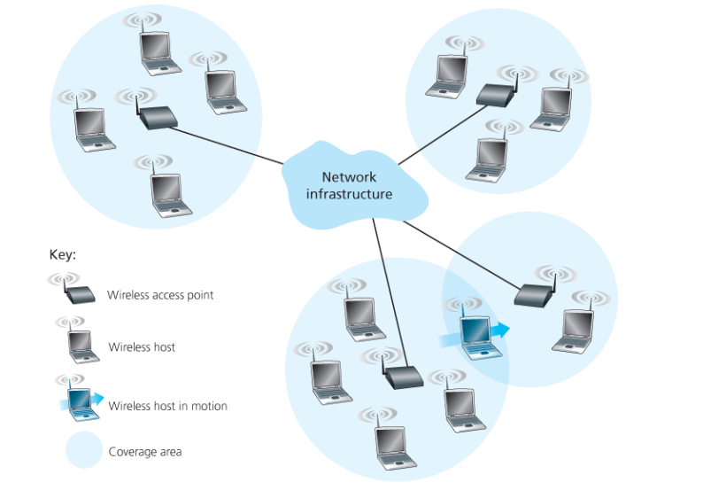

La tecnologia sulla quale un _wireless link_ è basato ne influenza la _portata_ e il _bit-rate_.

La tecnologia con _range_ e _bit-rate_ più basso è la **_Bluetooth_** (`802.15` stadard per reti short-range-low-power, la versione `802.15.1` indica la versione _high-bit-rate_ ovvero `1Mbps`), che è stata pensata per connettere diversi dispositivi sulle scrivanie.

Successivamente troviamo le reti `WiFi`, che è un nome commerciale di una tecnologia basata sul protocollo `IEEE 802.11`.
Hanno area di copertura locale ($\approx 100m$) e permettono trasmissioni con _bit-rate_ che variano a seconda delle vare versioni (dagli `11Mbps` fino alla velocità nominale di `14Gbps`).

Andando ad aumentare il raggio di copertura troviamo alcune tecnologie _long-range_ di `WiFi` (ad esempio per la lettura dei contatori) e le reti mobili.

In particolare abbiamo `4G LTE` e `5G`.
`5G` permette un _bit-rate_ più elevato a discapito di un range minore.

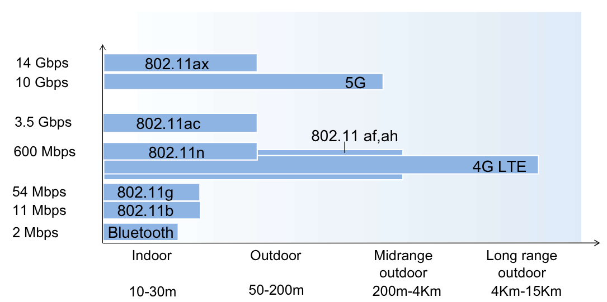

Siamo abituati a vedere le reti wireless basate su un infrastruttura che permette di comunicare con la rete.
Quando un dispositivio opera nella portata di una _base station_ si dice infatti che questo opera nella _**infrastucture mode**_.
Tuttavia è possibile utilizzare la tecnologia wireless in modalità _**ad-hoc**_ che permette la comunicazione tra più dispositivi in maniera wireless senza l'ausilio di alcuna infrastruttura (bluetooth, quick share, air drop, ...).
In questo tipo di tecnologia sono gli _host_ stessi a fornire i servizi di routing, assegnamento degli indirizzi, traduzioni simil-DNS, ...

## 3.1. Tipi di Infrastrutture

Identificando l'**_infrastruttura di rete_** come la rete sulla quale un _host_ wireless potrebbe voler comunicare, vediamo adesso come i vari "pezzi" di una rete wireless possono essere assemblati per ottenere diversi tipi di reti wireless.

In particolare, ci basiamo adesso su due criteri:
1. Il numero di _hops_ effettuati da un pacchetto nella rete wireless
2. La presenza o meno delle _base stations_

Le principali categorie sono quindi identificabili con la seguente tabella:

|                                   |                                                                          _**Single Hop**_                                                                           |                                                                                                                                                                                                                  _**Multiple Hops**_                                                                                                                                                                                                                   |
| :-------------------------------: | :-----------------------------------------------------------------------------------------------------------------------------------------------------------------: | :----------------------------------------------------------------------------------------------------------------------------------------------------------------------------------------------------------------------------------------------------------------------------------------------------------------------------------------------------------------------------------------------------------------------------------------------------: |
|    _**Infrastructure-based**_     |    È presente una _base-station_ connessa ad una rete più ampia.  Un esempio sono le reti `IEEE 802.11` (_WiFi_) e le reti cellulari come `4G LTE` o `5G`.    |                                                                                                   È presente una _base-station_ connessa ad una rete più ampia, ma è consentita la comunicazione tra nodi wireless per raggiungere gli _host_ più distanti.  Un esempio sono le **wireless mesh networks** e le **wireless sensors networks**                                                                                                    |
| _**Ad-hoc, Infrastructure-less**_ | Non è presente alcuna _base-station_, ma sono i singoli nodi wireless a coordinare le trasmissioni da e verso i nodi.  Un esempio sono le **reti Bluetooth**. | Non è presente alcuna _base-station_, ma sono i singoli nodi wireless a coordinare le trasmissioni da e verso i nodi che in questo caso possono essere mobili, cambiando la loro connettività verso gli altri nodi.  Un esempio sono i **mobile ad hoc networkx** (`MANETs`) o i **vehicular ad hoc network** (`VANET`) nel caso in cui i nodi mobili fossero dei veicoli.  Questo tipo di infrastruttura è ancora oggi in forte sviluppo. |

## 3.2. Caratteristiche dei Link e della Rete

Le principali differenze dei link wireless rispetto ai link fisici sono:
- **Minore forze del segnale**: il segnale wireless è trasmetto sfruttando onde elettromagnetiche, che sia ttenuano notevolmente quando sono propagati attraverso la materia. Anche se propagati nel vuoto il segnale si disperde molto più velocemente rispetto ai segnali fisici. Il fenomeno è chiamato _path loss_
- **Maggior esposizione a interferenze**: i segnali wireless utilizzano la frequenza `2.4 GHz` che è condivisa tra più dispositivi, ad esempio anche dalla `802.11b wireless LAN`. Oggi la maggior parte dei protocolli `802.11` opera nella frequenza dei `5GHz`.
- **Propagazione Multipath**: il segnale radio si riflette sulle superfici, arrivando ad una destinazione da punti diversi in momenti leggermente diversi

Questi problemi sono alla base della maggiore difficoltà di effettuare comunicazioni _wireless_ rispetto alle _wired_.
Per questo motivo i protocolli wireless utilizzano potenti algoritmi di `CRC` ma supportano anche un protocollo di _link-level reliable-data-transfer_ che ritrasmette i frame corrotti.

Avendo in considerazione gli impedimenti dovuti al canale wireless, vediamo cosa succede all'_host_ che riceve il segnale wireless.
Quello che riceve è un mix tra una versione degradata del segnale originario e del _background noise_ dovuto all'ambiente.

Si introduce quindi il **_Signal-to-Noise Ratio_** `SNR` che misura la forza relativa del segnale rispetto al _noise_:
$$
  \text{SNR} = 20 * \log_10{\text{Ampiezza}_\text{Segnale} \over \text{Ampiezza}_\text{noise}}
$$

<figure class="">
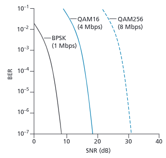
<figcaption>

Questo grafico mette a confronto diverse codifiche dei segnali in relazione al loro `SNR` e `BER` (_Bit-Error-Rate_).

In generale vige la regola che _"dato uno schema di modulazione, più alto è `SNR`, più basso sarà `BER`"_
</figcaption>
</figure>

In generale è possibile aumentare `SNR` aumentando la potenza fornita, questo però ha diversi _tradeoff_, quali il maggior utilizzo di energia e la maggior probabilità di interferenza rispetto ad altre comunicazioni.

Inoltre il fatto che i dispositivi sono mobili, può influenzare direttamente il `SNR`. Sarebbe quindi ottimale avere un modo per modulare la potenza del segnale a seconda delle condizioni nelle quali ci troviamo.

Sono inoltre introdotti due nuovi problemi. Per esporli immaginiamo di avere **3 nodi** (`A`, `B` e `C`) che comunicano tra di loro tramite rete wireless.

Il primo è il **problema del Nodo nascosto**. Immaginiamo di avere un ostacolo tra `A` e `C` (ad esmepio un muro schermante). In questo contesto `B` riesce a comunicare con entrambi, mentre `A` e `C` non si "vedono".
Può quindi accadere che sia `A` che `C` comunichino in contemporanea con `B` che riceve due segnali sovrapposti.
Questa collisione non è rilevata né da `A` che da `C`.

Un secondo problema, simile al primo, è quello dell'**Attenuazione del Segnale**.
Immaginiamo che `B` abbia nel raggio di trasmissione sia `A` che `C`, mentre `A` si trova fuori dal _range_ di `C` (e viceversa).
Quando `A` proverà a comunicare con `B`, se `C` lo sta già facendo, percepirà solamente del _rumore di fondo_ assumendo il canale libero e iniziando anch'egli a comunicare.
Anche in questo caso si ha una collissione in `B` che non è rilevata né da `A` che da `C`.

## 3.3. Reti Wireless `LAN` - `WiFi`

Le reti _WiFi_ è una famiglia di reti locali.

Il nome _WiFi_ è il nome commerciale, il nome ufficale è `IEEE 802.11 wireless LAN`.

Nella tabella di fianco possiamo vedere l'evoluzione della tecnologia negli anni.

La tecnologia `802.11.ah` è utilizzata per i dispositivi che trasmettono a bit-rate elevati per distanze elevate, utile nel caso della gestione dei dispositivi IoT in ambienti ampi.

Tutte queste tecnologie utilizzano `CSMA/CA` per consentire l'accesso multiplo.
La ragione per il quale si utilizza `CSMA/CA` e non `CSMA/CD` è perché **non è sempre posibile per il trasmettitore rilevare le collisioni** che si verificano nella maggior parte dei casi nel ricevitore.

Inoltre tutte esistono sia in versione _ad-hoc_ che _infrastructure-based_.

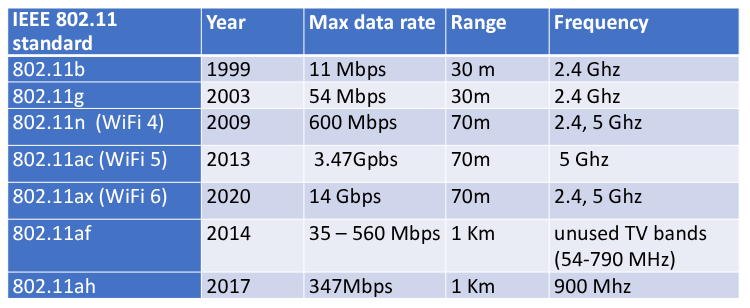

Nell'architettura _WiFi_ un _host_ comunica con l'`Access Point` in un **Basic Service Set** (`BSS`), chiamato impropriamente anche _cell_ o _hotspot_.
Quando un _host_ entra in un `BSS` deve **_associarsi_**, ovvero selezionare una frequenza di comunicazione. In totale sono disponibili $11$ frequenze disponibili (per evitare interferenze tra `AC` vicini).

L'`AP` admin scegliera una di queste frequenze, sul quale l'`AP` ogni $x$ millisecondi invierà un _beacon frame_ nel quale sono conservate le informazioni `AP SSID, MAC address`.

A questo punto un _host_ itererà sulle varie frequenze finché non rileva uno o più _beacon_, scegliendone uno secondo una determinata politica (tipicamente quello a potenza maggiore).
Scelto un _beacon_ l'_host_ recupererà le informazioni contenute nel suo messaggio e procederà a collegarsi con l'`AP` sorgente (eventualmente autenticandosi se necessario).

Una volta collegato procederà ad acquisire un indirizzo `IP` tramite `DHCP` per ottenere un indirizzo nella `AP subnet`.

Analizziamo adesso come fuziona il processo di _Collision Avoidance_, basato si `CSMA/CA`.

Quando un _sender_ deve inviare un _frame_, attende controlla che il canale sia libero (_idle_) per un certo tempo pari a `DIFS`, e successivamente **_trasmette l'intero frame_**, senza effettuare _collision detection_.
Se invece trovasse il canale occupato, procede ad aspettare un tempo casuale aggiuntivo, detto di _backoff_, dopo che rileva il canale _idle_ dopo `DIFS`.
Finché il canale è occupato il timer rimane fermo. Se dopo `DIFS` più _backoff_ secondi il canale è ancora _idle_ procede ad inviare l'intero frame e atende per l'`ACK`.
Se non si riesce ad inviare si aumenta l'intervallo di _backoff_ e si riprova.

Il _ricevitore_ invece, quando riceve un _frame_ corretto restituisce un messaggio di **ACK** dopo un intervallo `SIFS` **_minore di `DIFS`_**.

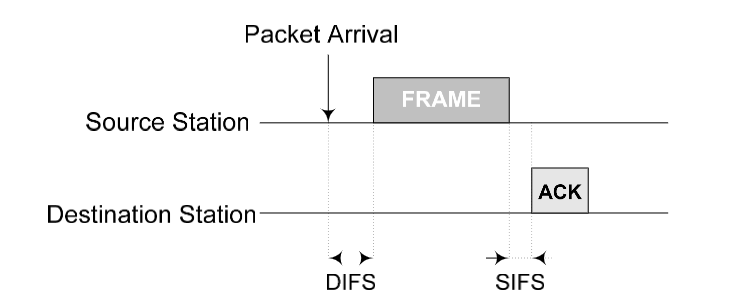

Il pacchetto potrebbe subire delle collisioni, in tal caso l'`ACK` non viene mandato, e il _sender_ dovrà attendere ulteriore tempo prima di rieffettuare la collisione, così da evitare un'ulteriore collisione sulla ritrasmissione.

Di seguito un esempio più complesso nel quale vediamo cosa succede quando si prova a inviare un pacchetto con il mezzo occupato.

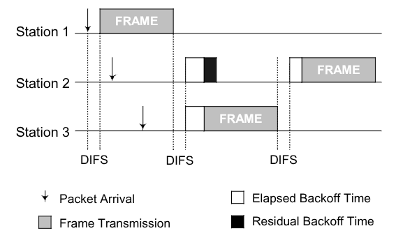

L'intervallo di _backoff_ è un timer casuale che sceglie un valore uniformemente nell'intervallo $[0, CW-1]$.

$CW$ rappresenta la **_Contention Window_**. Inizialmente $CW = {CW}_\text{min}$, e ogni volta che non si riceve un `ACK` si raddoppia il valore finché $CW = {CW}_\text{max}$

${CW}_\text{min}$ e ${CW}_\text{max}$ sono dei parametri `MAC` dipendenti dal livello fisico.

Questo processo diminuisce la probabilità di avere collisioni ma non li ha, infatti è possibile che i tempi scelti casualmente da due _host_ siano uguali, così come i _backoff_.
Tolta questa possibilia, che statisticamente è bassa, rimane il problema del nodo nascosto.

Per riuscire a alleviare questo problema si utilizza il **Virtual Carrier Sensing**..
Questo meccanismo si mette in "ascolto virtuale" del mezzo.

Quando un nodo `A` vuole trasmettere con il nodo `B`, invia innanzitutto una piccola **_Request-To-Send_** (`RTS`) utilizzando `CSMA`.
Il nodo `B` invia quindi in _broadcast_ la **_Clear-To-Send_** `CTS` in risposta al `RTS`.

Il `CTS` è sentita da tutti i nodi che riescono a comunicare con `B`:
- Il nodo `A` procederà quindi a inviare il _data-frame_
- Gli altri nodi attenderanno prima di inviare i propri dati

Quando avrà ricevuto tutti i dati il nodo `B` invia l'`ACK` nuovamente in _broadcast_, così che gli altri nodi possano iniziare a trasmettere (dopo aver atteso un nuovo timer casuale).

Questo meccanismo è _opzionale_, poiché nel caso in cui il i dati da trasmettere abbiano dimensione comparabile con `RST` e `CTS` l'utilizzo nel `VCS` non è conveniente.

<figure class="">
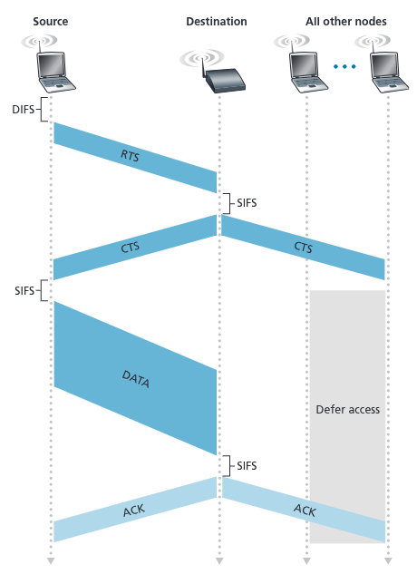
<figcaption>

Il fatto che `RST` e `CTS` sono piccoli implica non solo che la probabilità di collisione diminuisce, ma che le eventuali ritrasmissioni non influenzino troppo le trasimssioni successive.
</figcaption>
</figure>

### 3.3.1. Addressing

I frame `802.11` condividono molte similitudini con quelli `Ethernet`, ai queli aggiungono campi specifici per l'utilizzo dei link wireless.

<figure class="">

<figcaption>

I numeri sopra ogni campo indicano la lunghezza il **Byte**.
I numeri sopra i sotto campi del `frame control` rappresentano la lunghezza in **bit**.
</figcaption>
</figure>

Troviamo quindi i seguenti campi:
- **Frame Control** (`2Byte`): si espande in altri campi:
  - _Protocol Version_ (`2bit`): versione del protocollo di comunicazione
  - _Type_ (`2bit`): indica il tipo di frame (`RTS`, `CTS`, `ACK`, `data`)
  - _Subtype_ (`4bit`): permette di specificare ulteriormente il tipo di messaggio
  - _To AP_ (`1bit`): flag che indica se il messaggio è diretto verso un `AP`
  - _From AP_ (`1bit`): flag che indica se il messaggio è proviene da un `AP`
  - _More frag_ (`1bit`): indica se il frame è seguito da altri frammenti o meno
  - _Retry_ (`1bit`): indica se il frame è una ritrasmissione
  - _Power Mgmt_ (`1bit`): indica in che stato deve entrare un `AP` dopo aver ricevuto il frame (_power-save mode_/_active mode_).
  - _More data_ (`1bit`): indica se il trasmettitore ha altri dati da inviare o meno. È particolarmente utile per i _frame_ che raggiungono `AP` in _power-save mode_
  - _WEP_ (`1bit`): indica se il messaggio è cifrato o meno
  - _rsvd_ (`1bit`): bit riservato che indica se i frame ricevuti vanno analizzati strettamente in ordine
- **Duration** (`2Byte`):
- **Address 1** (`6Byte`): indica l'indirizzo `MAC` del destinatario del messaggio
- **Address 2** (`6Byte`): indica l'indirizzo `MAC` del trasmettitore del messaggio
- **Address 3** (`6Byte`): indica l'indirizzo `MAC` del router al quale l'`AP` è collegato
- **Seq. Control** (`2 Byte`): è l'equivalente del _frame-sequence-number_ per implementare un _reliable-data-trasnfer_
- **Address 4** (`6Byte`): utilizzato solo nella modalità _ad-hoc_.
- **Payload** (`0-2312Byte`): consiste tipicamente di un datagramma `IP` o di un pacchetto `ARP`. Tipicamente la sua dimensione è inferiore ai `1500Byte`.
- **CRC** (`4Byte`): sequenza di `32bit` per consentire il _cyclic-redundancy-check_ per rilevare errori nei bit del messaggio ricevuto. Poiché il `BER` è molto maggiore nelle reti wireless, questo campo assume molta più importanza di quanta non ne avesse nelle reti cablate.

Per comprendere meglio l'utilizzo dei tre indirizzi analizziamo il seguente esempio.

Nella figura sulla destra sono presenti due `AP`, ognuno responsabile di diverse stazioni wireless, ed entrambi connessi direttamente con un _gateway router_ $R_1$.

Quando il router dovrà inoltrare un messaggio verso la stazione wireless $H_1$, lui non sarà a conoscenza del fatto che è presente un `AP` tra lui e l'_host_, ma crede che $H_1$ sia banalmente un _host_ della sottorete alla quale lui fa parte.

Il router, che conosce l'`IP` di $H_1$, utilizza `ARP` per determinarne il `MAC`, incapsulando di conseguenza il datagramma in un `Ethernet Frame` che avrà come campo sorgente il `MAC` di $R_1$ e come campo destinatario quello di $H_1$.

Quando il frame ethernet arriva all'`AP`, quest oconverte il frame `802.3 Ethernet` in un frame `802.11` prima di trasmetterlo nel canale wireless, impostando:
- **Address 1**: indirizzo `MAC` di $H_1$
- **Address 2**: il proprio indirizo `MAC` (`AP`)
- **Address 3**: indirizzo `MAC` di $R_1$

In questo modo $H_1$ potrà successivamente determinare l'indirizzo `MAC` del _gateway router_ che ha inoltrato il _datagram_ nella _subnet_.

Viceversa, quando $H_1$ vorrà inoltrare un datagramma verso $R_1$, creerà un frame `802.11` che si trova impostati:
- **Address 1**: indirizzo `MAC` dell'`AP`
- **Address 2**: il proprio indirizo `MAC` ($H_1$)
- **Address 3**: indirizzo `MAC` di $R_1$

Quando l'`AP` lo riceverà procederà con la conversione in _frame_ `802.3` impostando il campo sorgente con il `MAC` di $H_1$ e quello destinatario con quello di $R_1$.

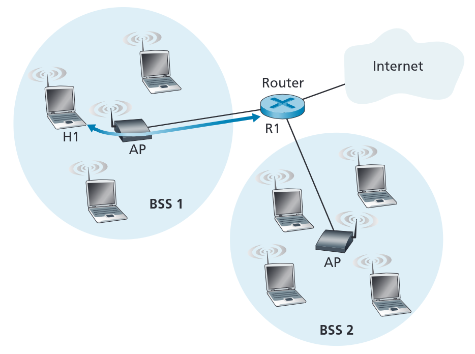

### 3.3.2. Mobilità in una stessa subnet

Per aumentare la portata di una rete wireless, un azione comune è quella di introdurre più `BSS` (_Basic-Service-Set_) all'interno della stessa subnet.

Questa scelta comporta però la necessità di dover gestire correttamente la gestione di un dispositivo quando cambia `BSS`, mantenendone la sessione `TCP`.

L'immagine sulla destra mostra due `BSS` interconnessi, ed un _host_ $H_1$ che si sposta da `BSS1` a `BSS2`.

Poichè entrambi i gli `AP` sono connessi allo stesso _gateway router_ tutte le stazioni appartengono alla stesso _subnet IP_.
Ciò implica che l'indirizzo `IP` di $H_1$ rimane invariato, apparendo a tutti gli effetti come fisso per chi è all'esterno della _subnet_.

Quando $H_1$ si sposta lontano da `AP1`, sente che il segnale ricevuto diminuisce, e inizia a cercare _beacon frame_ di altri `AP` più potenti, selezionando `AP2`.

$H_1$ quindi si **dissocia** da `AP1` e si associa con `AP2`.

Il problema di questo cambio si riflette sullo _switch_, che nella propria _tabella di forwarding_ ha scritto che $H_1$ appartiene a `AP1`, e non è a conoscenza del fatto che dovrà adesso instradare a `AP2` i pacchetti diretti a $H_1$.

Una soluzione, un po' subdola ma efficace, è impostare gli `AP` affinché inviino un _Ethernet frame_ in _broadcast_ nel quale è inserito l'indirizzo di $H_1$.
In questo modo, quando lo _switch_ riceve questo messaaggio, modifica opportunamente la propria _forwarding table_.

Oggi altri protocolli inter-AP stanno venedo sviluppati per gestire questi problemi.

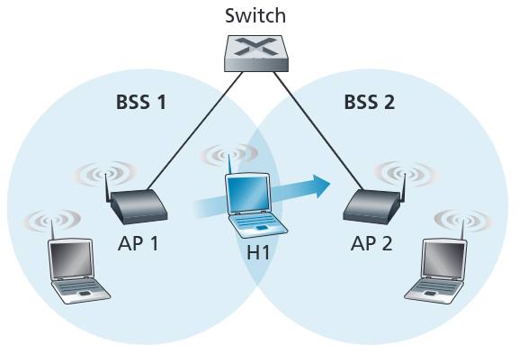

### 3.3.3. Capacità Avanzate

Il protocollo `IEEE 802.11` presenta alcune capacità avanzate che ne permettono una maggiore efficienza.

La prima è la **_rate adaptation_**. I singoli `AP` e nodi mobili cambiano dinamicamente la propria _transmission rate_, sfruttando tecniche di modulazione del llivello fisico.

Quando un dispositivo si sposta, più si allontana dalla _base-station_ più il `SNR` diminuisce e il `BER` aumenta.
Quando il `BER` diventa troppo elevato, il dispositivo **diminuisce il proprio _transmission rate_** selezionando un diverso algoritmo `SNR`, diminuendo di conseguenza anche il `BER`.

Una seconda capacità avanzata è il **_power management_**. Nei dispositivi cablati, l'infrastruttura era fissa, e i singoli dispositivi erano connessi alla rete elettrica.
L'impatto energetico del _networking_ era quindi sì considerato, ma non era un problema rilevante. Con il diffondersi dei dispositivi portatili invece il problema di diminuire l'energia consumata diventa molto rilevante, in quanto sono dispositivi a batteria.

Poiché le componenti non sempre sono attive, un operazione comune è quella di diminuire il voltaggio fornito alle interfacce, fino a spegnerle, quando non sono utilizzate.

Ad esempio, i portatili diminuiscono il voltaggio alle interfacce wireless, mettendole in uno stato di _sleep_, quando non devono inviare pacchetti. Quando sarà necessario inviare un pacchetto si riaumenterà il voltaggio rendendo l'interfaccia nuovamente _active_.

Quando invece è necessario ricevere dei pacchetti, il dispositivo, prima di andare in _sleep_, invia un frame all'`AP` indicando la propria scelta di andare in _sleep_ fino al prossimo _beacon frame_.

L'`AP` quindi procederà a **non inoltrare frame al nodo**, ma utilizzerà un sistema simil _proxy_ che tiene traccia dei pacchetti indirizzati al nodo mentre era in _sleep_.

Al successivo _beacon frame_, l'`AP` consulterà una speciale lista di dispositivi in _sleep_ che hanno ricevuto dei frame che non sono ancora stati consegnati.

Alla ricezione di questo _beacon frame_, un singolo _host_ si risveglia e attende di ricevere gli eventuali frame `AP-to-mobile` conservate nel _simil-proxy_. Quando questi terminano, il singolo _nodo_ **tornerà in _sleep_ fino al prossimo beacon**.

Tutto questo introduce un ritardo nella consegna dei pacchetti, anche se tendenzialmente è "limitato".

## 3.4. Reti Wireless `LAN` - `LiFi`

La rete `LiFi` è una tecnologia moderna simile al `WiFi` che non sfrutta però comunicazioni elettromagnetiche ma **_attraverso la modulazione di luce `LED`_**.

Comunicare con la luce, invece dei segnali a radio frequenza, ha diversi vantaggi.

Il primo vantaggio è a livello di **sicurezza**. Infatti la rete `WiFi`, che comunica in _broadcast_, è la più facile da _sniffare_, in quanto la comunicazione in radio frequenza attraversa i muri, comunicando anche al di fuori degli edifici.
La luce infatti rimane all'interno delle stanze chiuse, rendendo impossibile sniffare i pacchetti da fuori.

Un secondo vantaggio è la minore susciettibilità a **interferenze**, in quanto il segnale luminoso è **_immune a interferenze di natura elettromagnetica_**, oltre a **_non generarne_**.
In questo modo si può avere un utilizzo anche in contesti ad alto rischio interferenze, come stanze con grossi aparecchi che operano sfruttando campi magnetici.

Il terzo, e principale vantaggio. è il **minore costo**. Infatti, è possibile integrare questa tecnologia anche nel sistema di illuminazione, che è qualcosa che oggigiorno è alla base di ogni stanza.

Altri vantaggi:
- Permette una comunicazione nell'ordine del gigabit a diversi dispositivi in parallelo
- Non soffre di congestioni
- È una tecnologia molto più affidabile
- Offre una latenza molto più bassa (fino a 3 volte inferiore).

Il setup tipico è quello mostarto nell'immagine sulla destra.

Sono state fatti degli esperimenti, utilizzando un ufficio di $3m\times 3 m$ mettendo il trasmettitore a $2.7m$ sopra un armadio e mettendo diversi ricevitori, uno tenuto in mano a distanza $1m$, uno sulla scrivania a $1.5m$ e uno sul pavimento a circa $2.5m$.

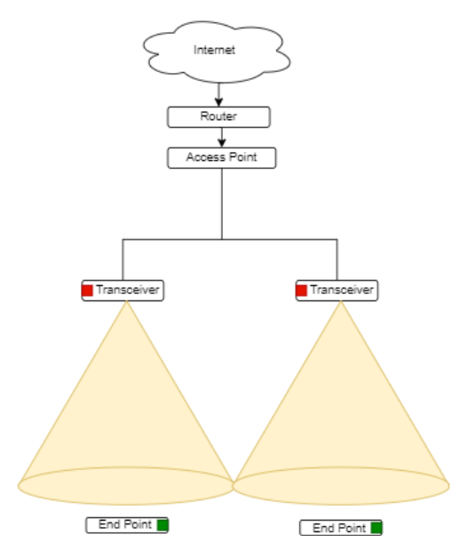

Il primo esperimento è l'impatto sul bit-rate (sia in _downlink_ che in _uplink_) al variare dei dispositivi connessi.

|    Scenario     | Download (Mbps) | Uplink (Mbps) |
| :-------------: | :-------------: | :-----------: |
| Un dispositivo  |  $\approx 250$  | $\approx 160$ |
| Due dispositivi |  $\approx 125$  | $\approx 80$  |

Un secondo esperimento è stato in riferimento alla posizione/orientamento del ricevitore rispetto al trasmettitore.

<figure class="90">
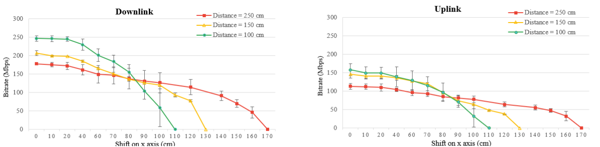
<figcaption>

Shift relativo al cono di luce sull'asse $X$
</figcaption>
</figure>

<figure class="90">
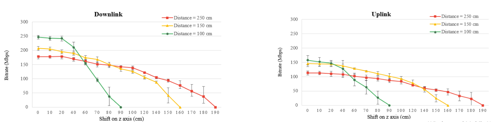
<figcaption>

Shift relativo all'allineamento sull'asse $Z$.
</figcaption>
</figure>

L'area di copertura è di circa:

| Posizione | Distanza $(m)$ | Max $x$ $(m)$ | Max $z$ $(m)$ | Area $(m^2)$ |
| :-------: | :------------: | :-----------: | :-----------: | :----------: |
|  In mano  |     $1.00$     |    $1.10$     |    $0.90$     |    $3.11$    |
|  Desktop  |     $1.50$     |    $1.30$     |    $1.60$     |    $6.26$    |
| Pavimento |     $2.50$     |    $1.70$     |    $1.90$     |   $10.93$    |

L'ultimo esperimento è stato misurare l'effetto dell'inserimento di ostacoli, divisi in _ostacoli fisici spessi_, _ostacoli fisici "fini"_ e _ostacoli occasionali_.

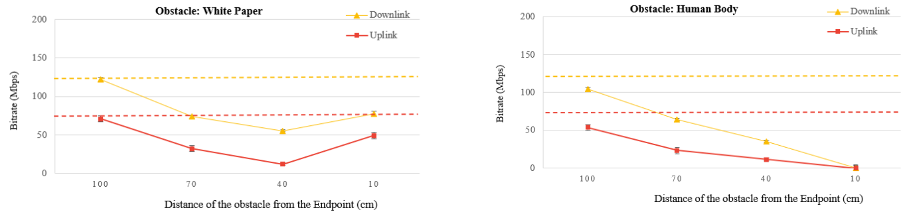

Questo tipo di tecnologia è molto semplice da utilizzare e fornisce alti bit-rate, ma soffre di diversi problemi (_Line-Of-Sight_, _Short Range_, _Shadow Zone_, _Obstacle Sensitivity_).

## 3.5. Reti Wireless `PAN` - `Bluetooth`

Le reti `PAN` (_Personal Area Network_) hanno raggio di copertura minore di $5m$, e sono utilizzate per rimpiazzare tanti collegamenti cablati.

È una tecnologia _ad-hoc_, che non si basa su alcun tipo di infrastruttura, anche se oggi è utilizzato anche per connettersi all'infrastruttura di internet.

Sfrutta la comunicazione attraverso _radio frequenza_ a frequenza di circa `2.4 - 2.5 GHz`.

Inizialmente il _data-rate_ era di `1Mbps` e oggi arriva fino a `3Mpbs`.

L'accesso è multiplo basato su _polling_, dove il _master_ invia un pacchetto di _poll_ ad un dispositivo alla volta, e questo risponde con un pacchetto con dei dati o _null_.

Per risparmiare energia sono presenti anche dei dispositivi detti **_parked device_**, per risparmiare energia.
Ad esempio può dormire negli slot nei quali è sicuro che il master non comunicherà.

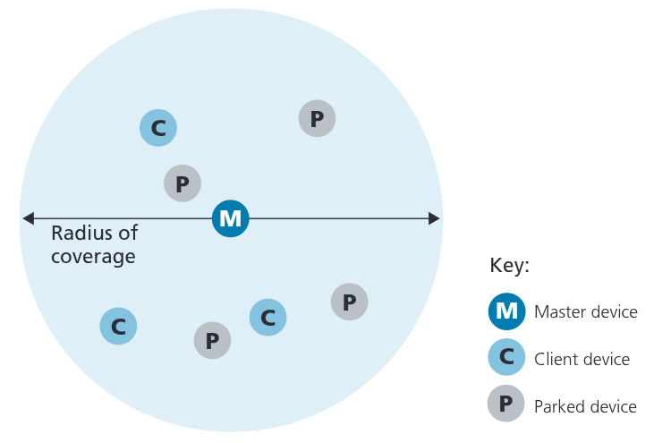

Lo slot dura circa $652 \mu s$, ed è utilizzato in `TDM`, ovvero in un solo senso.
Ad esempio il master trasmette negli slot pari e i client in quelli dispari.

Sfrutta il _frequency hopping_, scegliendo tra 79 possibili canali di frequenza.
Il problema di Bluetooth, è che utilizza potenze piccolissime, che sono sicuramente distrutte dalle interferenze.
Per questo motivo, è possibile per un dispositivo cambiare la propria frequenza. In particolare la frequenza varia pseudo-casualmmente ad ogni _slot_.
In questo modo i tutti dispositivi sono coordinati tra di loro, ed ad ogni _slot_ comunicano con la frequenza corretta.
Questa sequenza _pseudo-casuale_ viene trasmessa dal _master_ durante il **bootstrap**.

## 3.6. Reti Cellulari `WAN` - `4G` e `5G`

Le reti cellulari sono la soluzione per la fornitura di internet in reti `WAN` wireless, e sono oggigiorno più che ampiamente utilizzate.

Infatti la tecnologia `4G` è utilizzata per il $97\%$ del tempo in Corea e più del $90\%$ negli Stati Uniti.

Similitudini con Internet Cablato

Effettua una distinzione tra dispositivi di _edge_ e _core_, ma entrambi appartengono alla stessa famiglia.

Inoltre è anch'essa una _rete di reti_, e sfrutta molti protocolli che abbiamo già visto: `HTTP`, `DNS`, `TCP`, `UDP`, `IP`, `NAT`, `SDN`, `Ethernet`, `tunneling`.

È connesso all'internet cablato.

Differenze con Internet Cablato

Ha un diverso _wireless link layer_ e ha come obiettivo primario quello della mobilità.

L'identità di un utente è adesso associato ad una `SIM card`, e ha un modello di business diverso, basato sull'iscrizione a dei _cellular provider_.

È basato su strutture di autenticazione e ha una forte notazione di _home network_ rispetto al roaming di reti visitate.

La _base-station_ viene chiamata `eNode-B` mentre il dispositivo mobile è chiamato `UE` (_User Element_).
Il dispositivo mobile può essere uno smartphone, un tablet, un laptop, una macchina, ....
Questo è adesso identificato non più da un indirizzo `IP`, bensì da un indentificatore a `64bit` chiamato **_International Mobile Subscriber Identity_** (`IMSI`), che è contenuto all'interno della scheda `SIM` (_Subscriver Identity Module_)

La _base-station_ si connette ad una rete `IP` che segue tutti gli standard di internet che abbiamo già discusso.

Troviamo in questa rete:
- **PDN Gateway** `P-GW`: connette la rete ad internet
- **Serving Gateway** `S-GW`: sono dei gateway che permettono l'instradamento dei dati.
- **Home Subscriver Service** `HSS`: matiene i _record_ di tutti gli utenti iscritti
- **Mobility Management Entity** `MME`: mantiene informazioni relative alle celle nei quali si trova un dispositivo in un certo momento. Fonrisce i sistemi di _autenticazione_, di _path setup_ e di _cell location tracking_..

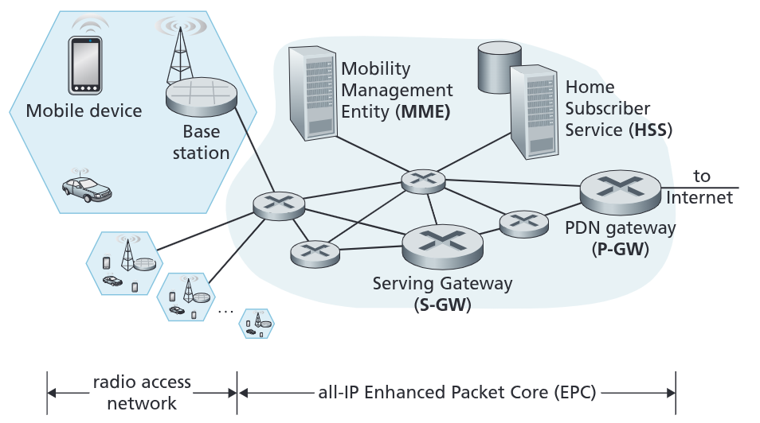

Anche `LTE` presenta una separazione tra _control plane_ e _data plane_. Nel primo sono introdotti nuovi protocolli per supportare la mobilità dei nodi, la sicurezza e l'autenticazione.
Nel _data plane_ invece sono introdotti nuovi protocolli all'interno del _link layer_ e del _physical layer_. Inoltre si fa un elevato utilizzo del tunneling per semplificare la mobilità.

L'architettura `4G LTE` si basa su quella `IP` che abbiamo già studiato.
Sono però introdotti nuovi protocolli all'interno del _link layer_.

In particolare questo è diviso in tre _sublayer_ (dal basso verso l'alto):
- **Medium Access Control Protocol** (`MAC`): questo layer effettua lo _scheduling_ delle trasmissioni, richiedendo e utilizzando i _radio transmission slot_. Esegue inoltre funzioni di _error detection/correction_, incluso l'utilizzo di _bit di ridondanza_ come tecnica per l'_error correction_ a seconda delle condizioni del canale di comunicazione
- **Radio Link Control Protocol** (`RLC`): questo layer esegue due importanti funzioni:
  - La _frammentazione_ (nel trasmettitore) e il _riassemblaggio_ (nel ricevitore) dei datagrammi `IP` troppo lunghi per essere trasmessi negli _slot_. 
  - Implementa il _Reliable link layer data transfer_ utilizzando `ACK/NAK` basati sul protocollo `ARQ`
- **Packet Data Convergence Protocol** (`PDCP`): Effettua la compressione degli _header_ per diminuire il numero di bit trasmessi nel _link_ e la (de)cifratura del datagramma `IP` utilizzando le chiavi ottenute tramite i messaggi scambiati tra il dispositivo e l'`MME` quando il dispositivo si è collegato per la prima volta alla rete.

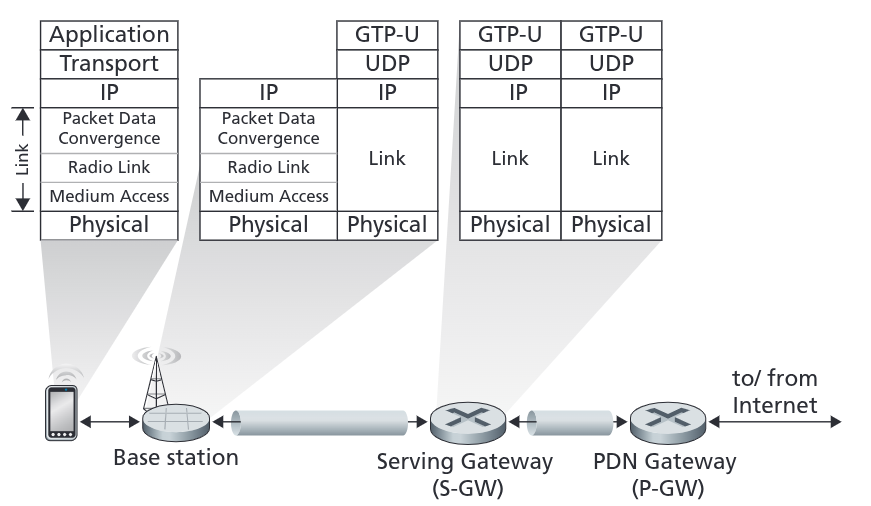

Così come le reti `WiFi` e `Bluetooth`, anche le reti cellulari fanno utilizzo della **_sleep mode_** per preservare la batteria.

In particolare si utilizzano due livelli di _sleep mode_:
- **Light sleep**: I dispositivi entrano in questo stato dopo circa $100ms$ di inattività. Si svegliano periodicamente (tipicamente ogni $100ms$) per controllare eventuali trasmissioni in entrata. 
- **Deep sleep**: I dispositivi entrano in questo stato dopo circa $5\text{-}10s$ di inattività. Qualora il dispositivo cambiasse cella mentre è in questo stato, è necessario che ristabilisca l'associazione.

Lo standard `4G LTE` oggi sta venendo rimpiazzato dal `5G` che prometteva di incrementare di 10 volte i picchi di _bitrate_, di diminuire di 10 volte la latenza e di incrementare di 100 volte la capacità di traffico rispetto al `4G`.

Il `5G NR` (_New Radio_) sfrutta due bande di frequenza:
- **FR1**: $450MHz$ - $6GHz$
- **FR2**: $24GHz$ - $52GHz$

Queste bande sono nell'ordine delle onde millimetriche e **non sono retro-compatibili con il `4G`**, in quanto utilizzano altre bande di frequenza.

Il vantaggio di queste frequenze è quello di incrementare di rateo di invio dati, sfruttando anche antenne multi direzionali `MIMO`, ma diminuendo i raggi di copertura.

Infatti le celle `5G` sono molto più piccole, raggiungendo raggi di copertura tra i $10m$ e i $100m$.

Per riuscire ad avere una buona copertura, a differenza del `4G LTE` che richiedeva un numero moderato di _base stations_, il `5G` ne richiede un massivo e denso spiegamento.

# 4. Nodi Mobili

Lo spettro della mobilità, dal punto di vista della rete può essere riassunto come:
- **No mobility**: Un dispositivo si piò muovere tra reti, ma mentre lo fa è spento
- **Little Mobility**: Un dispositivo si può movere all'interno della stessa rete di un provider
- **Medium Mobility**: Un dispositivo si può muovere tra più reti dello stesso provider
- **High Mobility**: Un dispositivo si può muovere tra più reti di più provider diversi mentre _mantiene le connessioni attive_.

Il nostro interesse è concentrato verso una **mobilità medio-alta**.

Un primo approccio che possiamo adottare per per permettere la mobilità è **_delegare il problema ai router della rete_**.
In particolare i _router_ pubblicizzeranno i nomi (che siano indirizzi IP permanenti o numeri identificativi come il numero di telefono) dei dispositivi mobili che li visitano attraverso lo scambio delle _routing table_.
Infatti questa operazione è **supportata nativamente dal routing IP**, e non richiede ulteriori modifiche ai protocolli, se non il fatto che il router deve ora pubblicizzare anche gli indirizzi di _host_ oltre a quelli di _rete_. 
Le _tabelle di routing_ indicheranno quindi dove ogni dispositivo è locato attraverso un match dei prefissi.

Questa soluzione, per quanto efficace su piccola scala, **_non è scalabile a miliardi di dispositivi_**.
L'approccio utilizzato quindi **_fa gestire il prolema agli end-system_**, spostando la funzionalità ai "bordi" della rete.
In particolare avremo due approcci di _routing_:
- **Indirect Routing**: la comunicazione tra un corrispondente ad un dispositivo è indirizzata all'_home network_ del dispositivo. Sarà l'_host network_ che la inoltrerà al dispositivo
- **Direct Routing**: un corrispondente prima recupera l'indirizzo del dispositivo e solo successivamente comunica direttamente con esso.

L'_home network_ infatti rappresenta una **_sorgente di informazioni finali riguardanti il dispositivo_**. Contattandolo è possibile ottenere informazioni sulla posizione del dispositivo.
L'_home network_ salva le informazioni relative all'identià di un dispositivo all'interno del proprio `HSS`.

Si dice invece _visited network_ una qualsiasi rete diversa dall'_home network_. 
Esiste un accordo tra reti diverse che sancisce che tutte le reti devono fornire acesso a tutti i dispositivi visitatori.

Questo schema si presta bene per le reti cellulari, mentre trova alcune difficoltà ad essere applciato alle reti `WiFi`.

In quest'ultime infatti gli `ISP` non hanno nessun concetto di _home globale_.
Infatti le credenziali di accesso di ogni `ISP` sono diverse, e sono conservate all'interno dei singoli dispositivi.
Reti diverse avranno quindi credenziali diverse.

Esistono però alcune rare eccezioni a questo concetto, come ad esempio la rete `eduroam`, che conserva le credenziali in maneira globale, indipendentemente dalla posizione.

Esiste in realtà un architettura `mobile IP` ma non è utilizzata.

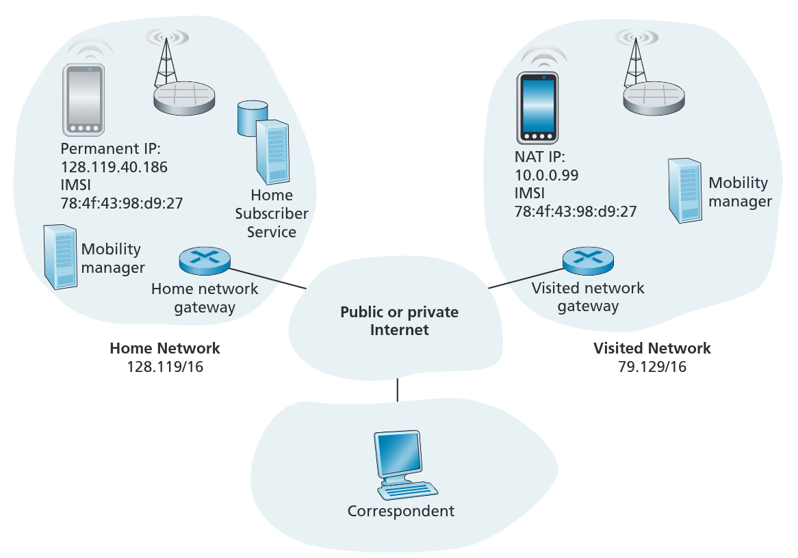

## 4.1. Routing Indiretto

Quando un dispositivo entra un _visited network_, gli viene assegnato un indirizzo temporaneo dal `NAT` locale.

In particolare, il `MME` si associa con il dispositivo che compie due azioni:
- Registra la posizione attuale del dispositivo con il nuovo indirizzo.
- Informa l'`HSS` dell'_home network_ del dispositivo aggiornandolo sulla nuova posizione del dispositivo

Quando un corrispondente vuole comunicare con il dispositivo utilizza **_l'indirizzo del home network_** del dispositivo come _destination address_.
Quando questa comunicazione viene intercettata dall'_home network gateway router_, questo, invece di inoltrarlo internamente, effettua un _forwarding_ verso il _gateway router_ del _visited network_ salvato nell'`HSS`.
Sarà quiesto poi ad inoltrarlo al dispositivo.

Quando il dispositivo risponde risponde alla comunicazione il datagramma raggiunge il _visited network gateway router_ e poi può scegliere tra due strade:
- Viene inoltrato **direttamente** al corrispondente
- Viene inoltrato all'_home network gateway router_ che poi lo reindirizzerà al corrispondente

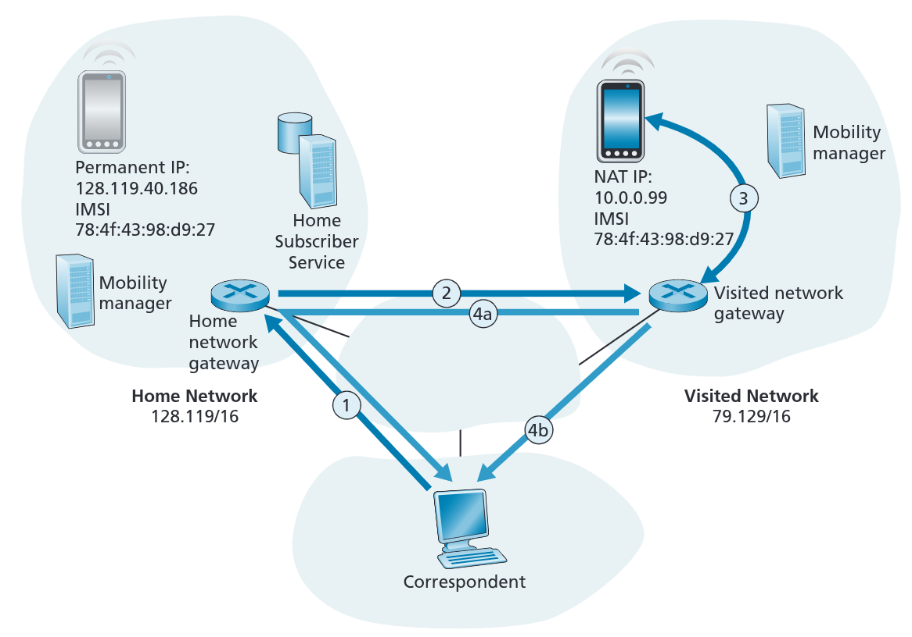

Questo problema di _triangolazione_ può diventare **inefficiente** qualora il corrispondente e il dispositivo si trovino nea stesse rete.

Infatti la posizione del dispositivo mobile è **_trasparente nei confronti del corrispondente_**, in un approccio _privacy first_.

Abbiamo però il vantaggio che le connessioni _on-going_ possono essere mantenute anche se il dispositivo cambaisse _visited network_.
Infatti, al cambio di network, viene aggiornata il record nell'`HSS`, che quindi informerà il _gateway router_ che inoltrerà diversamente i pacchetti in arrivo.

IL cambio rischia sì di perdere qualche pacchetto, ma questo è in linea con la filosofia _best-effort_ di internet.

## 4.2. Routing Diretto

Quando un corrispondente vuole comunicare con un dispositivo chiede la possizione attuale al _home network_ del dispositivo, che risponde con la posizione attuale del dispositivo.

Successivamente il corrispondente **comunicherà direttamente** con il dispositivo.

In questo modo, qualora i due dispositivi si trovassero nella stessa rete, si risolve l'inefficienza della triangolazione.

In questo caso però se il dispositivo cambiasse rete le connessioni _on-going_ non sarebbero automaticamente preservate.
È quindi necessario definire nuovi protocolli per risolvere questo problema.

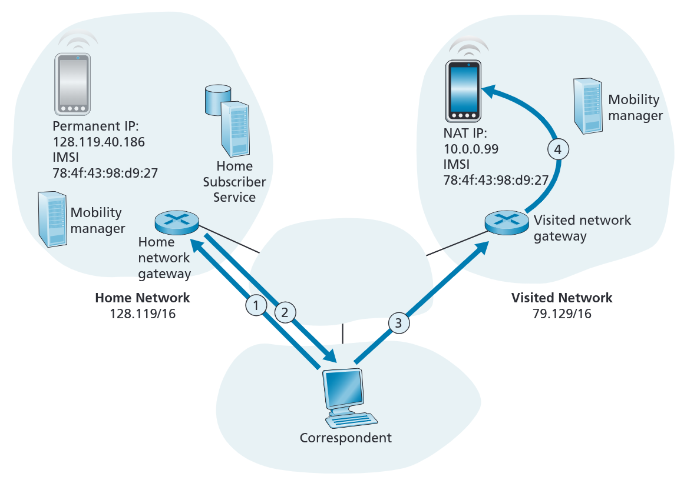

Alcune soluzioni poco eleganti possono essere:
- Quando il dispositivo si sposta si notifica il visited network precedente che rende il routing indiretto
- Dopo un numero di pacchetti "persi" (poiché il dispositivo di è spostato) il corrispondente chiede nuovamente al `HSS` l'indirizzo del dispositivo. Se fosse lo stesso potrebbe chiudere la connessione, mentre se fosse diverso comunica con il nuovo indirizzo.

## 4.3. Impatto della mobilità sui livelli superiori

A livello logico l'impatto della mobilità è minimo, mentre a livello di prestazioni l'impatto può essere molto rilevante. La probabilità di avere **packet loss/delay** aumenta a causa delle ritrasmissioni. Il `TCP` rischia di interpretare questo aumento di perdite come una congestione, diminuendo la _congestion window_ oltre il necessario.
Questo aumenta il _delay_ anche nel traffico reale, diminuendo il _throughput_ di tutte le connessioni.

Questa reazione, che sarebbe normale e auspicabile nel caso la congestione avenisse davvero, è completamente sproporzionata in relazione a quello che sta realmente accadendo.