# 1. Indice

- [1. Indice](#1-indice)
- [2. Reti a Commutazione di Pacchetto](#2-reti-a-commutazione-di-pacchetto)
	- [2.1. Switched Ethernet](#21-switched-ethernet)
	- [2.2. Virutal LANs](#22-virutal-lans)
	- [2.3. Packet-Switched WAN](#23-packet-switched-wan)
		- [2.3.1. Circuito Virtuale](#231-circuito-virtuale)
		- [2.3.2. Datagram Service](#232-datagram-service)
	- [2.4. Virtual Link](#24-virtual-link)

# 2. Reti a Commutazione di Pacchetto

Esistono diverse topologie di topologie per le reti a commutazione di pacchetto.

L'esempio più semplice è quello dell'_**ethernet hub**_. L'_hub_ è un dispositivo di livello fisico analogo a tutti gli effetti ad un ripetitore di segnale. Non permette il _frame buffering_, non fa controlli `CSMA/CD` e inoltre non fa nemmeno _packet switching_, ma si limita a ritrasmettere i messaggi **verso tutte le uscite**.

Dall'_hub_ ci siamo evoluti introducendo l'**_ethernet switch_**. Lo _switch_ non solo permette il _frame buffering_, ma permette anche di effettuare _packet switching_, controllando il destinatario del messaggi e propagando quest'uiltimo **solo nel link corretto**. Per fare ciò lo _switch_ deve essere in grado di conservare i _frame_ attraverso un _buffer_.

Lo _switch_, che è un dispositivo **completamente trasparente** verso gli _host_, effettua anche controlli `CSMA/CD`.

Inoltre lo _switch_ è un dispositivo **plug-and-play** _self-learning_.


<div class="grid2">
<div class="">

Ogni _host_ ha una **connessione dedicata** verso lo _switch_, ognuna amministrata con il **protocollo ethernet**.

Poiché ogni link è indipendente, il massimo numero di trasmissioni con $N$ nodi e uno switch è di $\frac{N}{2}$.

Nell'esempio a destra vediamo infatti come le comunicazioni `A-A'` e `B-B'` avvengano in parallelo.

</div>
<div class="">
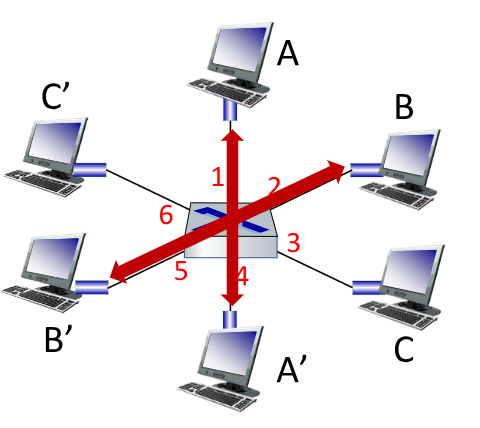
</div>
</div>

Per permettere un'instradamento corretto ogni switch ha al suo intenro una _**switch table**_.
La _switch table_ è equivalente ad una _routing table_ (che vedremo più avanti) e contiene:
- `MAC address`: indirizzo `MAC` di un host
- `interface`: numero che identifica l'interfaccia di uscita dallo _switch_
- `TTL`: indica il _time-to-live_ dell'entrata, dopo il quale questa va rimossa

Uno switch impara quali _host_ possono essere raggiunti attraverso le interfacce, quando si riceve un frame, lo _switch_ impara infatti **_l'interfaccia del trasmettitore_**.

Se lo _switch_ non ha informazioni relative all'interfaccia del ricevitore procede a **trasmettere il messaggio a tutti**.

Lo pseudocodice che descrive come si comporta un switch all'arrivo di un frame è il seguente:
```snippets
Recupera il MAC address del trasmettitore
Se non è presente nella table lo salva

Recupera il MAC address del ricevitore
if(entrata trovata) then{
	if(l'interfaccia di uscita è uguale a quella di entrata)
		then droppa il frame
	else
		trasmette il frame all'interfaccia indicata all'entrata
}
else
	flood a tutte le interfacce tranne quella di arrivo
```

## 2.1. Switched Ethernet

Seguendo l'approccio degli _switch_ è possibile amppliare le reti collegando tra di loro i vari _switch_:

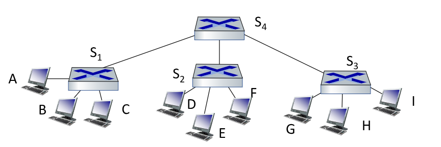

Bisogna porre particolare attenzione al fatto che _switch_ e _router_ sono **due dispositivi diversi** che **operano a livelli diversi**.s

Lo _switch_, lavorando al livello di _link_, implementa i livelli 1 e 2, controllando il _frame_ e gli indirizzi `MAC`.
Gli switch lavorano al livello di _network_, implementando anche il livello 3, controllando quindi il _datagram_ e gli indirizzi `IP`.

<figure class="">
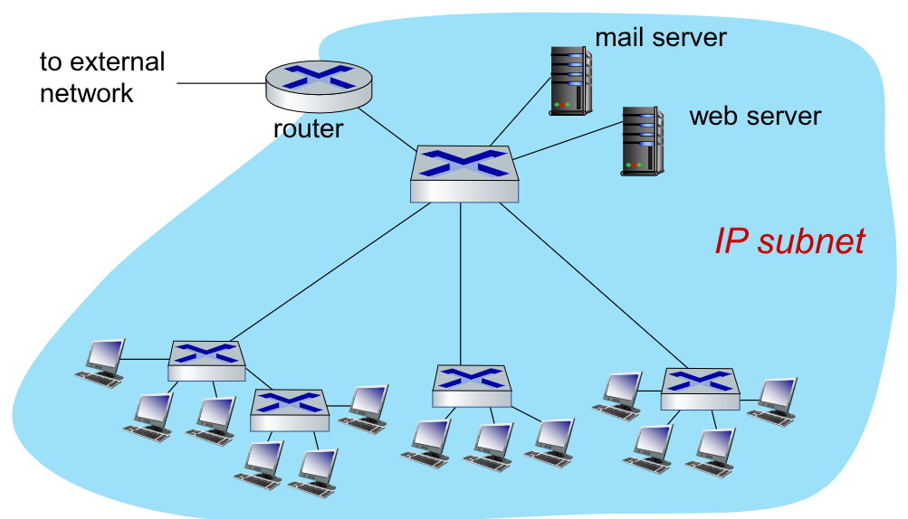
<figcaption>

A livello implementativo il router e lo switch vengono collassati in un unico dispositivo hardware. È comunque più corretto da un punto di vista funzionale separare concettualmente i due dispositivi.
</figcaption>
</figure>


Gli _switch_ sono messi a dura prova all'interno dei **datacenter**, dove abbiamo centinaia di migliaia di _host_ vicini che comunicano tra loro .

È quindi necessario gestire correttamente e in maniera efficace e affidabile grossi carichi di lavoro gestiti da molte applicazioni che gestiscono ogniuna molti clienti, gestendo quindi la distribuzione del carico.
Soprattutto, dobbiamo trovare un modo per **evitare effetti bottleneck**.

<div class="grid2">
<div class="">

All'interno di un _datacenter_ la rete è organizzata così:

I _server rack_ contengono al loro interno dai 20 ai 40 _server-blades_, ovvero _host diversi_.

Ogni _rack_ possiede un **Top-Of-Rack** `TOR` switch, che permette connessioni ethernet a `40-100Gbps` per ogni _server-blade_.

Diversi _rack_ (a gruppi di circa 16) sono collegati da uno _switch di livello 2_.

Gli _switch di livello 2_ sono a loro volta connessi a uno o più _switch di livello 1_ (anch'esso a gruppi di circa 16).
I vari _switch di livello 1_ sono connessi ai **vari router di uscita**
</div>
<div class="">
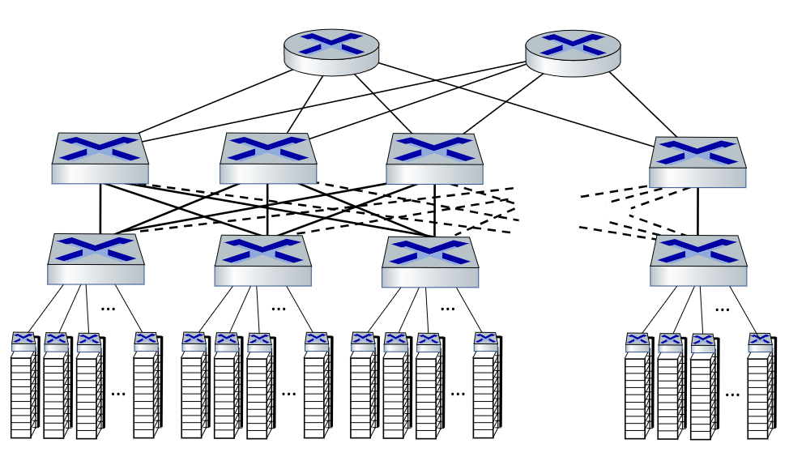

</div>
</div>


## 2.2. Virutal LANs

Se proviamo a scalare le connessioni _ethernet_ vecchia maniera su cavo coassiale, abbiamo che tutte le comunicazioni di livello 2 devono **attraversare intere** `LAN`. Questo genera problemi di _efficienza_, _sicurezza_ e _privacy_.

Per ovviare a qesti problemi sono state introdotte le `VLAN` (_Virtual-LAN_). Le `VLAN` generano **_più domini di broadcast_**. In questo modo le comunicazioni _broadcast_ vengono confinate al dominio di appartenenza.

L'introduzione delle `VLAN` introduce però altri problemi _amministrativi_. Se ad esempio un utente di un dominio di _broadcast_ si dovesse **fisicamente spostare attaccandosi ad uno switch di un altro dominio**, vorrebbe comunque essere **_logicamente connesso allo switch del suo dominio, non a quello attuale_**.


<div class="grid2">
<div class="">

Gli _switch_ che suportono capacita per le `VLAN` possono essere configurati per definire **_più `LAN` virutali_** sulla stessa infrastruttura `LAN`.
Questo si chiama **_port-based `VLAN`_**, che raggruppa le interfacce di usicta (attraverso uno _switch-management-software_) affinché un singolo switch fisico si comporti da più _switch virtuali_.
</div>
<div class="">
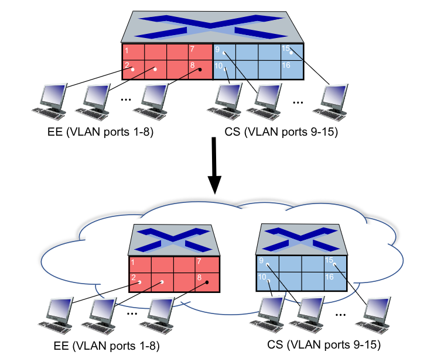
</div>
</div>

Questo tipo di `VLAN` permette tre vantaggi principali:
- **Isolazione del traffico**: i frame relativi alle prime 8 porte possono raggiungere _solo_ le prime 8 porte. È inoltre possibile definire le `VLAN` a seconda dei `MAC address` degli _endpoint_ piuttosto che nelle porte dello _switch_
- **Membership dinamica**: le porte possono essere assegnate dinamicamente a diverse `VLAN`
- **Forwarding tra VLAN**: permesso dal _routing_, permette l'introduzione di diversi domini di _broadcast_.

Le comunucazioni tra `VLAN` diverse vengono effettuate inoltrando i messaggi ad un _router_, complicamndo di fatto comunicazioni tra dispositivi magari fisicamente vicini ma con `VLAN` differenti.

<div class="grid2">
<div class="">

Ad un _switch_ potrebbe essere assegnata una `trunk port`, che permette di trasmettere _frame_ tra _switch_ diversi con le stesse `VLAN`
</div>
<div class="">
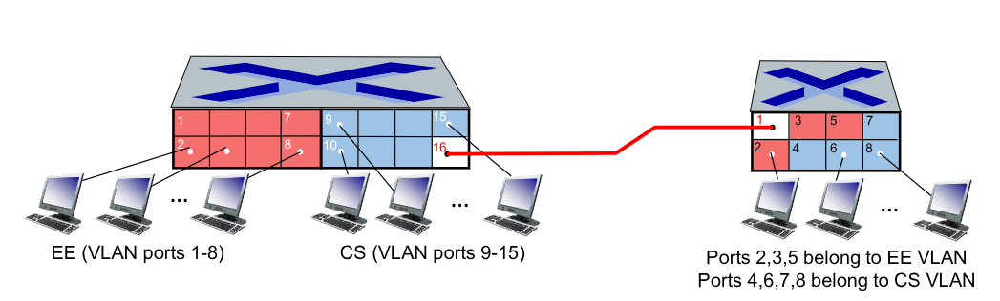
</div>
</div>

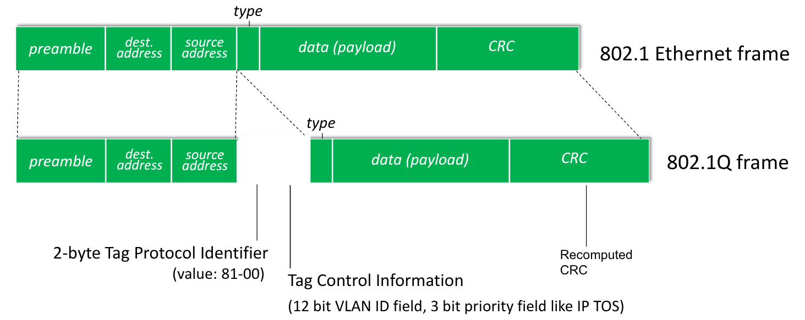

Al formato ethernet standard  sono aggiunti `2Byre` per l'identificatore di protocollo, `12bit` che identificano l'`ID` della `VLAN` e 3 che ne sanciscono la priorità (come nelle tabelle a livello `IP`).

## 2.3. Packet-Switched WAN

Se scaliamo l'architettura della `LAN` per aumentarne l'affidabilità, andiamo a generare un nuovo tipo di area network, detto **_Wide-Area-Netwok_** o `WAN`, gestita topologicamente come un _**mesh**_.

<figure class="">
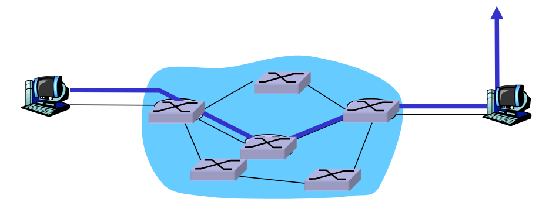
<figcaption>

Uno _switch_ è collegato con un certo numero variabile di altri _switch_, così da migliorare l'affidabilità nel caso di guasti dei _link_.
</figcaption>
</figure>

Similmente a come accadeva per gli indirizzi `MAC` nelle `LAN`, ogni nodo nelle `WAN` è identificato da un proprio **_indirizzo univoco._**.

Andiamo a introdurre un **problema di routing**. Adesso infatti sono presenti _più percorsi tra uno switch e un'altro_. Adesso non ci preoccupiamo di questa scelta, e diamo per scontato di conoscerlo.

Supposto quindi di conoscere il percorso migliore, vediamo quindi come inoltrare i pacchetti all'interno di questa architettura.

I servizi forniti da questa architettura sono di due tipi:
- **Connectionless**: ogni pacchetto è gestito individualmente senza nessun tipo di _handshake_. In questo tipo di servizio un pacchetto inviato dopo potrebbe essere instradato diversamente e arrivare prima dei precedenti. È chiamato anche **datagram service**
- **Connection**: si stabilisce prima un _circuito virtuale_ attraverso un _handshake_. Successivamente tutti i pacchetti seguono lo stesso percorso

### 2.3.1. Circuito Virtuale

Crea un percorso dal trasmettitore al ricevitore che i pacchetti seguiranno.

Si comporta similmente ai vecchi _circuiti telefonici_, dove tutte le azioni **_si verificano all'interno del percorso_**.

Nelle comunicazioni si hano tre fasi: _setup_, _comunicazione_ e _teardown_.

<div class="grid2">
<div class="">

Una _virtual-conneciton_ consiste in:
1. Un percorso dal trasmettitore al ricevitore
2. `VC number`, dove ogni numero identifica il `VC` in un link sul perorso. _Potrebbe essere diverso per link diversi, anche se identificano lo stesso percorso_
3. Le entrate nelle _forwarding tables_ nei router sul percorso

Allo stesso modo un pacchetto che viagga sul `VC` possiede l'identificatore di `VC` piuttosto che l'indirizzo di destinazione.

</div>
<div class="">
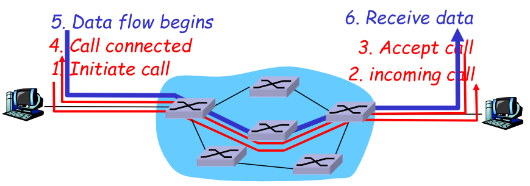
</div>
</div>

La _forwarding table_ diventa quindi qualcosa del genere:

<figure class="">
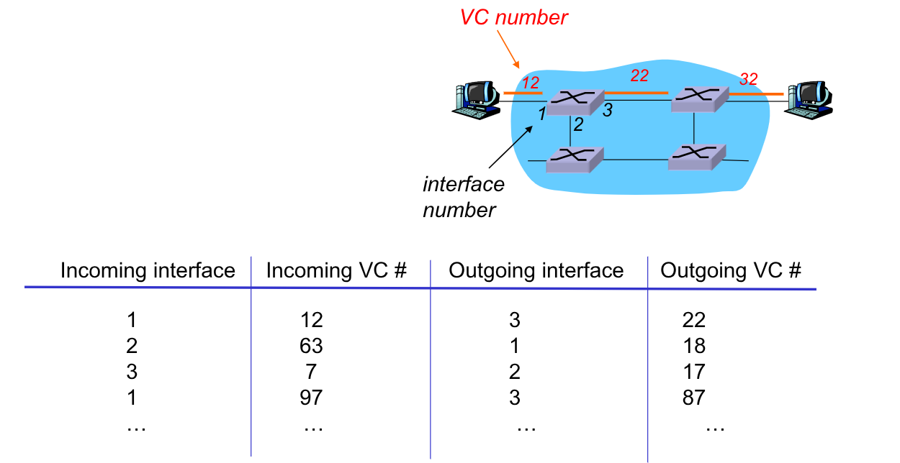
<figcaption>

Quando un pacchetto viene ritrasmesso da uno _switch_, gli viene cambiato il `VC number` in accordo con la propria _forwarding table_
</figcaption>
</figure>

### 2.3.2. Datagram Service

Con questo servizio non ci poniamo il problema di stabilire un unico percorso, ma trattiamo ogni pacchetto indipendentemente l'uno dall'altro.

Non abbiamo in realtà nemmeno il concetto di connessione, ma semplicemente ogni _switch_ inoltra i messaggi senza mantenere uno stato.

I pacchetti sono inoltrati, **anche attraverso percorsi diversi**, sulla base dell'indirizzo del ricevitore.

Avevamo già introdotto la _forwarding table_ all'intenro di una rete `LAN`:

<div class="flexbox" markdown="1">

| `MAC adress` | `interface` | `TTL` |
| :----------: | :---------: | :---: |
|      A       |      1      |  60   |
|      A'      |      4      |  60   |
|      B       |      2      |  60   |
|     ...      |     ...     |  ...  |

</div>

Le tabelle di forwarding vengono adesso **_così trasformate_**:

<figure class="75">
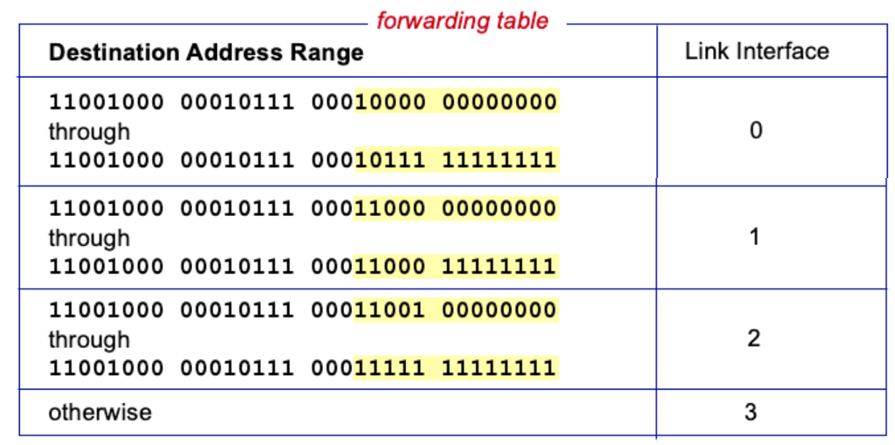
<figcaption>

Un router **_non contiene tutti gli indirizzi possibili_** per efficienza.
Si mettono quindi _range di indirizzi_ che via via si amplieranno per _switch_ vicini al _network core_, e si restringeranno per quelli più verso il _network edge_
</figcaption>
</figure>

## 2.4. Virtual Link

La virtualizzazione delle risorse è una delle astrazioni più potenti all'interno dell'ingegneria dei sistemi.

Ad ora abbiamo visto i concetti di _memoria virtuale_, _dispositivi virtuali_. _LAN virtuali_, _macchine virtuali_

Introduciamo quindi il concetto di **_link virtuale_**.

Il percorso tra un trasmettitore e un ricevitore è trattato _virtualmente_ come un **link punto-punto**.
Questo è comodo poiché, dal punto di vista del _network layer_ è **inifluente il servizio di comunicazione che sta alla base**.


