# 1. Indice

- [1. Indice](#1-indice)
- [2. Introduzione](#2-introduzione)
- [3. Servizi e Funzionalità del data link](#3-servizi-e-funzionalità-del-data-link)
	- [3.1. Error Detection](#31-error-detection)
		- [3.1.1. Parity Checking](#311-parity-checking)
		- [3.1.2. Metodi di Checksum](#312-metodi-di-checksum)
		- [3.1.3. Controlli di Ridondanza Ciclica - `CRC`](#313-controlli-di-ridondanza-ciclica---crc)
	- [3.2. Error Correction](#32-error-correction)
		- [3.2.1. 2-Dimension Parity Check](#321-2-dimension-parity-check)
	- [3.3. Reliable Data Transfer](#33-reliable-data-transfer)
		- [3.3.1. rdt1.0](#331-rdt10)
		- [3.3.2. rdt2.0 e rdt2.1](#332-rdt20-e-rdt21)
		- [3.3.3. rdt2.2](#333-rdt22)
		- [3.3.4. rtd3.0](#334-rtd30)
		- [3.3.5. rdt3.0 pipeline](#335-rdt30-pipeline)
			- [3.3.5.1. Go-Back-N](#3351-go-back-n)
			- [3.3.5.2. Selective Repeat](#3352-selective-repeat)
- [4. Point to Point Protocol (`PPP`)](#4-point-to-point-protocol-ppp)
- [5. Multiple Access Protocol](#5-multiple-access-protocol)
	- [5.1. Time Division Multiple Access - `TDMA`](#51-time-division-multiple-access---tdma)
	- [5.2. Random Access Protocols](#52-random-access-protocols)
		- [5.2.1. Slotted ALOHA](#521-slotted-aloha)
		- [5.2.2. Pure ALOHA](#522-pure-aloha)
		- [5.2.3. Carrier Sense Multiple Access - `CSMA`](#523-carrier-sense-multiple-access---csma)
	- [5.3. Taking Turns MAC Protocols](#53-taking-turns-mac-protocols)
		- [5.3.1. Polling](#531-polling)
		- [5.3.2. Token Passing](#532-token-passing)
- [6. Local Area Network - `LAN`](#6-local-area-network---lan)
	- [6.1. Indirizzi MAC](#61-indirizzi-mac)
	- [6.2. Ethernet](#62-ethernet)
		- [6.2.1. Perdita di Pacchetti e Distanze Massime](#621-perdita-di-pacchetti-e-distanze-massime)
		- [6.2.2. 802.3 Ethernet Standards](#622-8023-ethernet-standards)

# 2. Introduzione

Vedremo adesso come i dati sono trasferiti tra noti adiacenti.

Le **reti a connessione diretta** sono il più semplice tipo di connessione tra host, e consiste nella connessione attravero un _link_ fisico. Tuttavia, il _link_ fisico non è intrinsecamente affidabile, in quanto può generare degli errori nella trasmissione dei dati.
Vedremo quindi delle tecniche che rendono la comunicazione su questo _link_ inaffidabile, affidabile. Successivamente indagheremo su come ampliare questi concetti a reti più ampie.

Un _link_ fisico permette la trasmissione di bit di dati attraverso l'invio di segnali (elettrici, eletromagnetici o ottici) che lo attraversano. È connesso a dei **trasmettitori**/**ricevitori** che permettono di effettuare le codifiche/decodifiche tra segnali fisici e bit logici attraverso protocolli specifici.

Quando diciamo che i link sono inaffidabili, è proprio a causa del fatto che vengono trasmessi segnali fisici. Questi infatti possono andare incontro a diversi effetti esterni che li disturbano (attenuazioni di segnali, _noise_, interferenze, fading, ....). È quindi possibile che i segnali vengano alterati durante la trasmissione, rendendo la traduzione del ricevitore diversa da quella inviata originalmente.

<figure class="">
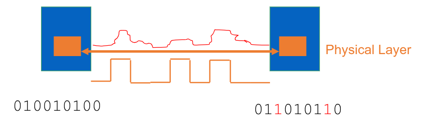
<figcaption>

La quantità di errori verrà misurata attraverso il _bit-error-rate_, che misurerà l'affidabilità di un _link_
</figcaption>
</figure>

Sarà quindi necessario introdurre una serie di servizi che permetteranno di rendere le comunicazioni più affidabili. Questi servizi sono implementati al livello _data link_.

# 3. Servizi e Funzionalità del data link

Uno dei servizi che introduciamo è il **framing**. Questo servizio incapsula il _datagramma_ all'interno di più _frames_/_trame_.
Ogni _frame_ è incapsulato in due informazioni di controllo, che forniscono informazioni sul singolo frame per permettono al ricevitore di successivamente ricreare correttamente il frame:
- _Header_: contiene diverse informazioni sul _frame_
- _Payload_ (contenuto)
- _Trailer_: contiene altre informazioni sul _frame_

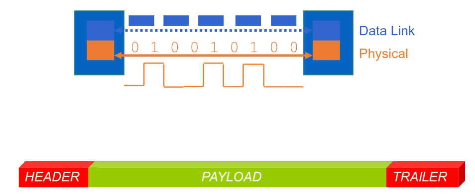

Questo servizio comporta un maggiore _overhead_, tuttavia permette di diminuire la probabilità di errore.
Nel caso di messaggi grossi, per qualsiasi invio si ha la quasi certezza che arrivi corrotto.
Se invece dividiamo il grosso messaggio in più _frame_ più piccoli la probabilità complessiva che il messaggio sia corrotto rimane la stessa se non aumenta (a causa di _header_ e _trailer_), ma quella che un singolo messaggio lo sia diminuisce drasticamente. Possiamo quindi limitarci a chiedere il reinvio **dei frame corrotti**, diminuendo quindi la probabilità complessiva di errore.

Gli altri servizi che vedremo saranno quindi:
- **Rilevazione di errore**: permettono al ricevitore di rilevare errori durante la comunicazione
- **Correzione dell'errore**: il ricevitore identifica e corregge gli errori
- **Ritrasmissione**: il ricevitore segnala quali frame sono stati corrotti, e il trasmettitore li invia nuovamente
- **Controllo del flusso**: permette di controllare la velocità di trasmissione tra due nodi che comunicano
- **Half-duplex**: due nodi possono trasmettere sullo stesso link, ma solo uno alla volta
- **Full-duplex**: due nodi possono trasmettere sullo stesso link anche simultaneamente

Il _link-layer_ si trova all'interno di **_tutti gli host_**. È implementato nel `NIC` (_Network Interface Card_) sui chip, che implementano il _physical layer_.

Il `NIC` Si attacca al bus dell'host di sistema, ed opera sfruttando una combinazione di _hardware_, _software_ e _firmware_.

Durante una trasmissione la parte che invia si occupa di **incapsulare il datagrama in _frames_** e aggiunge gli _header_/_trailer_ inserendovi _error-checking-bits_, _reliable-data-transfer_, _flow-control_, ...
Il ricevitore controllerà che non vi siano errori e, in caso positivo, estrarrà il datagramma fornendolo al layer superiore.

## 3.1. Error Detection

Definiamo:
- `R`: _Ridondanza_, bit di controllo aggiuntivi che permettono l'_error detection_
- `D`: _Dati Protetti_, bit mantenuti dall'_error checking_ (potrebbero includere i file di _header_)

Prima di iniziare cominciamo subito dicendo che **_non esiste un sistema di error detection efficace al 100%_**. Nonostante ciò, i vari protocolli che vedremo possono comunque non prevenire qualche errore, ma accade raramente. Vedremo inoltre che la probabilità di individuare un errore e correggerlo aumenta all'aumentare dei bit `R`, così come la probabilità che `R` stesso sia corrotto.

<figure class="">
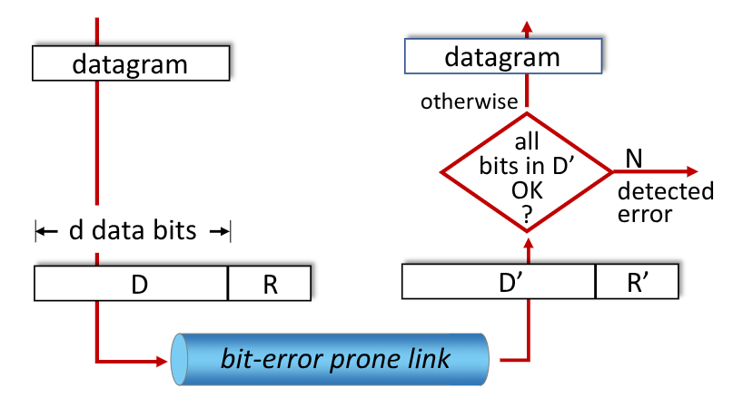
<figcaption>

La sfida del ricevitore è valutare se `D'` e `D` coincidono, valutando `R'` (anch'esso potenialmente corrotto)
</figcaption>
</figure>

Vediamo quindi tre tecniche per rilevare errori nei dati.

### 3.1.1. Parity Checking

È probabilmente la forma di _erro detection_ più semplice.
Permette di scovare errori nel messaggio attraverso un **singolo parity bit** `P`.

Ciò significa che in un messaggio di $d$ bit, il messaggio finale sarà di lunghezza $d+1$ bit.

Questo bit è codificato così:
> **Even Parity**: Se il numero di `1` all'interno del messaggio è dipari allora `P = 1`, altrimenti `P = 0`  
> **Odd Parity**: Se il numero di `1` all'interno del messaggio è dipari allora `P = 0`, altrimenti `P = 1`

In parole povere, rende pari/dispari il numero di `1` all'interno del messaggio.

Il trasmettitore doverà semplicemente contare il nuemro di bit settati all'interno del messaggio per valutarne la correttezza.

Si vede subito che questo metodo, per quanto semplice, è fallace in caso di errori multipli in numero pari sul singolo messaggio.

Nel caso infatti di `01101|1` $\to$ `11111|1` non verrebbe rilevato alcun errore in quanto in entrambi i casi il numero di bit settati è **pari**.

Se è vero che la porbabilità di errore su un bit è bassa, quella che più bit _consecutivi_ lo siano dovrebbe essere ancora più bassa. Tuttavia, vari esperimenti hanno mostrato che gli errori hanno la tendenza di raggrupparsi in gruppo. Varie misurazioni hanno stimato che la probabilità di errore con questa tecnica è vicina al $50\%$.

### 3.1.2. Metodi di Checksum

Nelle tecniche di _checksum_ i `D` bit sono trattati come una sequenza di interi ognuno su $k$ bit.

Uno dei più semplici metodi di _checksum_ è quella di sommare questi $k$ interi e utilizzare il controllo con la somma come metodo di _error-detection_.

Il metodo di _checksum_ utilizzato da internet si basa su questo approccio, trattando i _byte_ come interi su `16bit`.
Il complemento a 1 di questa somma forma l'**Internet Checksum** trasportato dall'header.

Il ricevitore controllerà anch'egli il _checksum_ e lo confronterà con quello ricevuto.

Questo algoritmo è spiegato in dettaglio all'interno del `RFC 1071`.

È più sicuro del semplice _parity checking_ ma meno dei `CRC`, tuttavia è ampiamente utilizzato anche su _Internet_ proprio per la sua elevata semplicità computazionale.

### 3.1.3. Controlli di Ridondanza Ciclica - `CRC`

Il `CRC` (_Cycilc Redundancy Check_) è l'algoritmo di _error detection_ più potente.

Introduciamo un nuovo parametro:
- `G`: _Generator_, bit pattern dato di $r+1$ bit tale per cui il `MSD = 1`

L'obiettivo di questo algoritmo è di scegliere $r$ `CRC` bit `R` tali che $<D, R> = D\cdot 2^r \text{XOR} R$ sia esattamente divisibile per `G` in modulo 2.

Il altre parole:
$$
	D \cdot 2^r \text{XOR} R = nG \\
	D \cdot 2^r = nG \text{XOR} R
$$

Possiamo vedere di lato un semplice calcolo con:
- `D = 101110`, `d = 6`
- `G = 1001`, `r = 3`

Per valutare `R` utilizziamo la seconda equazione ottenuta:
$$
	D \dot 2^r = nG \text{XOR} R
$$

Ed effettuiamo la divisione $D \dot 2^r \over G$. Il resto di questa operazione sarà proprio `R`, mentre il quoziente sarà `n`.

La sequenza trasmessa sarà quindi: `<D, R> = 101 110 011`

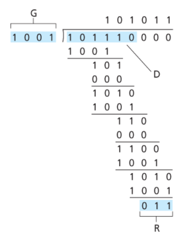

Gli standard internazionali hanno sono stati definiti per generatori a `8-`, `12-`, `16-` e `32-`bit.
Lo standard `CRC-32` a `32bit`, utilizzato nella maggior parte dei protocolli a livello `link`, utilizza il generatore:

<code>GCRC-32=100000100110000010001110110110111</code>

Ogni standard `CRC` permette di rilevare errori di bit consecutivi per gruppi inferiori a `r+1` bit

## 3.2. Error Correction

Sono algoritmi che permettono non solo di identificare se c'è stato un errore, ma di individuarlo e correggerlo.

### 3.2.1. 2-Dimension Parity Check

Un modo per migliorare il _parity checking_ è introdurre un _2-dimention parity checking_. Invece di valutare i messaggi come un array lineare, li rendiamo un array bidimensionale quadrato. A questo punto effettuiamo il _parity check_ **sia sulle colonne che sulle righe**.
In questo modo possiamo non solo individuare gli errori sui singoli bit, ma anche localizzarli nella griglia e correggerli.
Permette inoltre di migliorare significatamente la probabilità di rilevare errori multipli, ma non sempre si riesce a correggerli.

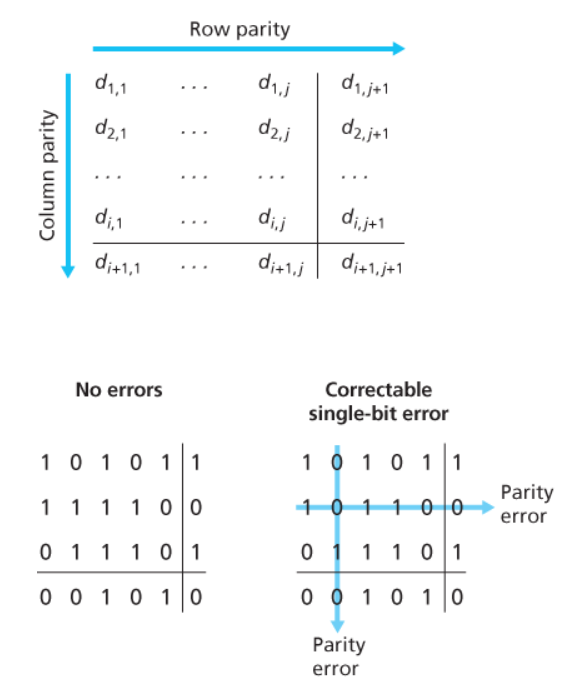

## 3.3. Reliable Data Transfer

Dobbiamo riuscice a implementare un livello tra il link inaffidabile e i _sender_/_receiver_ per rendere affidabile la trasmissione dei pacchetti.

Definiamo quindi il protocollo `rdt` (_Reliable Data Transfer_), eseguito al livello sottostante al _sender_/_receiver_ per rendere il canale di comunicazione affidabile.
Le interfacce di questo protocollo sono:
- `rdt_send()`: chiamata dall'alto. Passa i dati da trasferire
- `udt_send()`: chiamato dal protocolo per trasferire i dati
- `rdt_rcv()`: chiamato dal protocolo quando arriva il pacchetto dal lato del ricevitore che fa da ricevitore
- `deliver_data()`: chiamato da `rdt` per fornire i dati al layer soprastante

Il protocollo avrà "impacchettato" i dati con l'header di protezione durante l'invio, e lo avrà rimosso durante la ricezione, senza che i due interpreti ne siano a conoscienza.

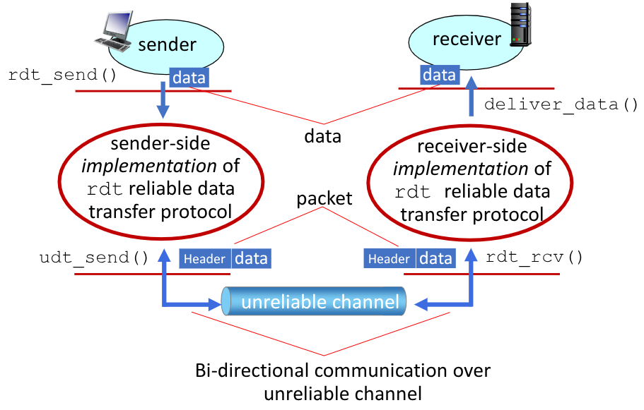

Svilupperemo questo protocollo in maniera incrementale, in maniera chiara e non ambigua, basandoci su alcune assunzioni.

Consideremo solamente trasferimenti dati unidirezionali, permettendo però il controllo in entrambe le direzioni.

Per specificare i mittenti e i destinatari utilizzeremo le **macchine e stati finiti** (già viste e ampiamente utilizzate nel corso di Reti Logiche).

### 3.3.1. rdt1.0

Facciamo le seguenti ipotesi per capire come funziona la macchina a stati finiti:
- Il canale sottostante è **_perfettamente affidabile_**

Svilupperemo due macchine a stati finiti:
- Per il _trasmettitore_: che invia i dati sul canale sottostante
- Per il _ricevitore_ che legge i dati dal canale sottostante

Avremo quindi le seguenti macchine e stati finiti:

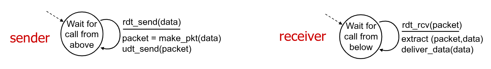

### 3.3.2. rdt2.0 e rdt2.1

Ipotizziamo adesso che il canale sottostante possa **invertire bit in gruppi**.
È quindi adesso necessario introdurre dei bit di ridondanza (`CRC` o _checksum_, sceglieremo il secondo per comodità) per rilevare gli errori.

Dobbiamo però adesso scegliere un modo per **gestire gli errori**.
Abbiamo più modi:
- `ACKs` (_ACKnowledgements_): il ricevitore informa esplicitamente il trasmettitore che il pacchetto ricevuto è `OK`
- `NAKs` (_Negative AcKnowledgements_): il ricevitore informa esplicitamente il trasmettitoche che il pacchetto ricevuto **_presenta errori_**

Quando il trasmettitore riceve un `NAK` procede a _**ritrasmettere il pacchetto incriminato**_.

Questo protocollo segue una politica di _stop-and-wait_. Infatti il trasmettitore, dopo aver inviato un pacchetto, attende il messaggio del ricevitore prima di procedere con il successivo invio.

Le due macchine a stati finiti per questo protocollo sono le seguenti:

Trasmettitore

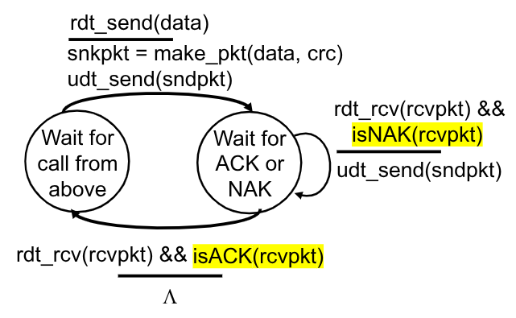

Ricevitore

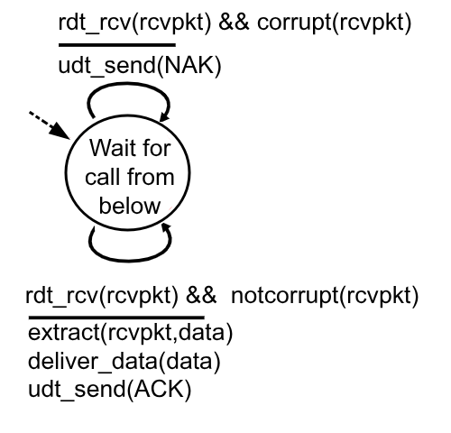

Questo tipo di protocollo ha però un punto debole. Che succede se **_l'`ACK`/`NAK` viene corrotto nell'invio_**?
Il trasmettitore non avrebbe idea dello stato del ricevitore, e la mera ritrasmissione potrebbe provocare dei duplicati.

È quindi necessario che il trasmettitore aggiunga un _sequence number_ che specifica il numero del pacchetto nel messaggio. In questo modo, qual'ora il ricevitore ricevesse un duplicato riesce ad identificarlo scartandolo.

Le **macchine a stati finiti si complicano**:

Trasmettitore

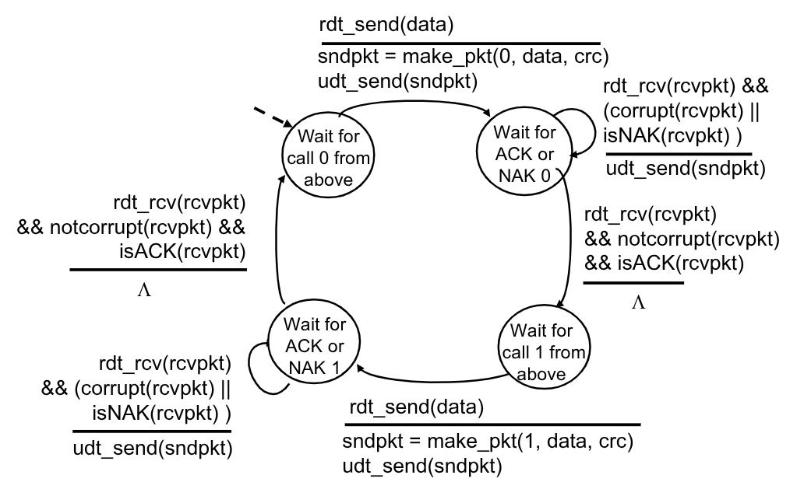

Ricevitore

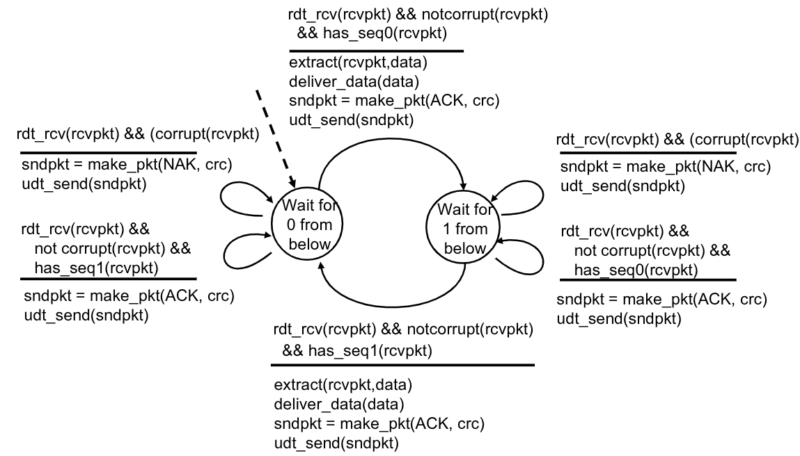

Il _trasmettitore_ adesso aggiunge ai vari pacchetti un numero di sequenza che ne indica la posizione. In realtà per implementare questa funzionalità è sufficiente **un solo bit**. Questo bit verrà invertito dopo l'invio di ogni pacchetto. Se il trasmettitore riceverà due volte di fila un pacchetto con lo stesso bit sequenza, interpreterà l'ultimo come duplicato del pacchetto precedentemente ottenuto, in quanto non ha informazioni riguardanti la ricezione del messaggio di `ACK`/`NAK`.

Questo però complica la nostra macchina a stati finiti per il _trasmettitore_, in quanto è necessario ricordarsi adesso il valore dell'ultimo bit di sequenza, andando di fatto a raddoppiare gli stati.

### 3.3.3. rdt2.2

È un ulteriore implementazione del `rdt2.1`, che utilizza **_esclusivamente gli `ACK`_**.

Invece di utilizzare un `NAK`, il ricevitore invia `ACK`  multipli per segnalare di ritrasmettere l'ultimo pacchetto inviato, inludendo esplicitamente il bit di sequenza all'interno del messaggio di `ACK`.

Molti protocolli, incluso quello `TCP`, utilizzano questo approccio per evitare l'utilizzo dei `NAK`

### 3.3.4. rtd3.0

Introduciamo una nuova ipotesi, quella che il nostro canale di comunicazione, oltre a poter corrompere i bit, possa **_perdere pacchetti_**, sia contenenti dati che contenenti `ACK`.

Il nostro obiettivo sarà quindi quello di riuscire a dedurre e gestire opportunamente queste perdite. Un primo approccio è quello di far attendere al trasmettitore un _tempo ragionevole_ per l'arrivo dell'`ACK`.
Se entro questo tempo il messaggio di `ACK` non arriva, supponeremo che il messaggio non sia arrivato, e procederemo a reinviarlo.

Questo metodo infatti è efficace anche nel caso in cui i pacchetti non si siano davvero persi ma abbiano subito un ritardo. Infatti, il ricevitore è già in grado di gestire pacchetti duplicati.

Le **macchine a stati finiti del trasmettitore si complicano ulteriormente**:

<figure class="">
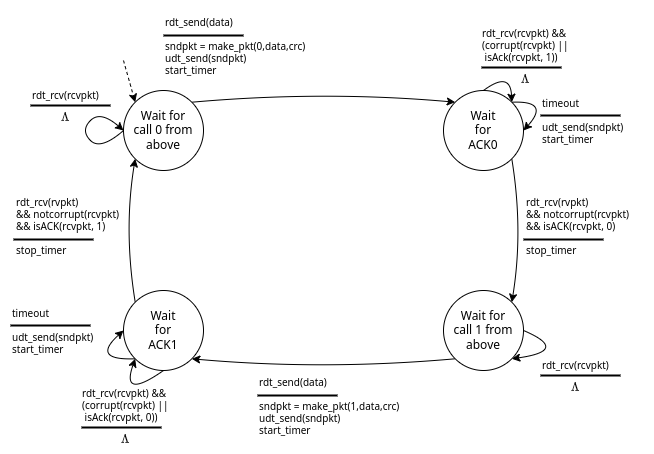
<figcaption>

Il fatto che quando arriva un `ACK` "sbagliato" non si faccia nulla è detto approccio **pigro**, dato che comunque prima o poi si verificherà l'evento del timer che procederà al reinvio del messaggio.
</figcaption>
</figure>

In questo caso è ancora più fondamentale inserire all'interno dell'`ACK` il pacchetto di riferimento, vediamo di seguito perché:

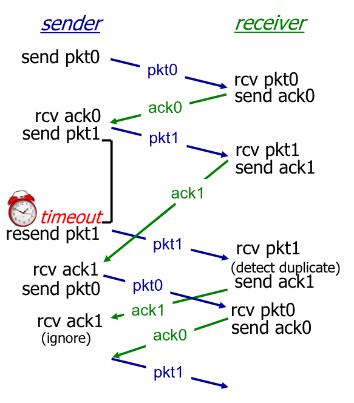

Possiamo valutare le performance di questo protocollo `rdt3.0`, detto di _stop-and-wait_.

Definiamo la **performance di utilizzo** $U_{\text{sender}}$ la frazione di tempo nella quale il trasmettitore è impegnato ad inviare pacchetti sul totale.

Ipotizziamo il seguente caso:
- Banda del link: `1Gbps`
- Ritardo di propagazione: `15ms`
- Dimensioni pacchetti: `8000 bit/pkg`

Il tempo necessario a trasferire un pacchetto attraverso il canale è di:
$$
	D_{\text{trans}} = \frac{L}{R} = \frac{8000\;\text{bits}}{10^9\;\text{bits/sec}} = 8 \mu s
$$

Prima di inviare il pacchetto successivo, il nostro protocollo richiede però l'arrivo dell'`ACK`.

Dobbiamo quindi considerare anche il `RRT` (_Round-Trip-Time_) nel nostro calcolo, in questo caso di $15ms + 15ms = 30ms$

Possiamo quindi calcolare la **performance di utilizzo**:
$$
	U_{\text{sender}} = \frac{\frac{L}{R}}{RTT + \frac{L}{R}} = \frac{0.008}{30.008} = 0.00027
$$

Possiamo quindi dedurre che la **performance di utilizzo** del protocllo `rdt3.0` fa schifo.

### 3.3.5. rdt3.0 pipeline

Per migliorare le _performance di utilizzo_ del protocollo `rd3.0` si introduce la tecnica del _**pipelining**_.

Attraverso questa tecnica il trasmettitore non invia solo un pacchetto, ma permette l'invio di più pacchetti non ancora verificati.

Questa introduzione comporta però delle modifiche:
- Il numero di bit dedicati a indicare il _numero di sequenza_ deve aumentare.
- Dobbiamo introddurre dei sistemi di _buffering_ nel trasmettitore e/o nel ricevitore.

<figure class="">
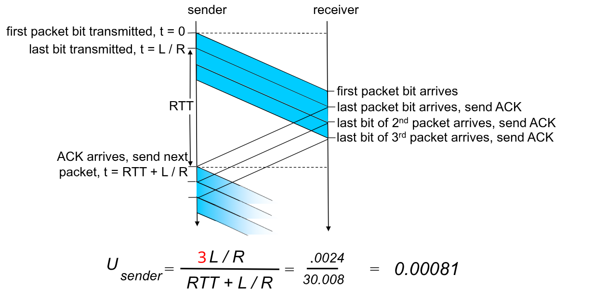
<figcaption>

Possiamo notare che inviare $n$ pacchetti in una _pipeline_ moltiplica la performance per un fattore di $n$.
</figcaption>
</figure>

Il numero massimo di pacchetti inviabili in una finestra $\frac{L}{R} + RTT$ è proprio $1 + \frac{RTT \cdot R}{L}$.

Sia il numero di sequenza che il sistema di _buffering_ saranno dipendenti dalle modalità con le quali il protocollo gestisce gli errori (pacchetti persi, corrotti e in ritardo).

In particolare, se forniamo $k$ bit al numero di sequenza, potremo inviare in una pipeline un massimo di $2^k$ pacchetti

Vediamo quindi alcuni protocolli di pipelining:

#### 3.3.5.1. Go-Back-N

Con questo protocollo il trasmettitore può trasmettere più pacchetti senza attendere per alcun `ACK`. Tuttavia **esiste un numero massimo di pacchetti non verificati inviabili**, chiamato **Window Size** $N$.

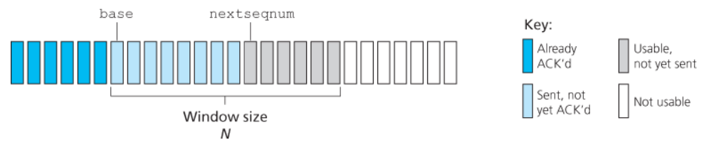

Definiamo come `base` il _numero di sequenza del più vecchio pacchetto non verificato_, e come `nextseqnum` il _più piccolo numero di sequenza non utilizzato_.

Possiamo quindi identificare quattro intervalli:
- `[0, base-1]`: pacchetti inviati che sono già stati verificati tramite `ACK`
- `[base, nextseqnum - 1]`: pacchetti inviati che non sono ancora stati verificati tramite `ACK`
- `[nextseqnum, base + N - 1]`: pacchetti che possono essere inviati immediatamente
- `[base + N, end]`: paccchetti che non possono essere inviati se prima non riceviamo l'`ACK` del pacchetto con numero di sequenza `base`.

In questo protocollo gli `ACK` in realtà non sono relativi ai singoli pacchetti, ma sono inviati per **gruppi di essi**.
Infatti il messaggio di `ACK(n)` conterrà un numero di sequenza $n$, che indica **_l'ultimo pacchetto validato_**.
Quando il trasmettitore riceverà `ACK(n)`, setterà `base = n+1`.

È inoltre introdotto un _timer_. Se alla scadenza di questo timer non è arrivato alcun `ACK`, il trasmettitore procede a **_ritrasmettere tutti i pacchetti nell'intervallo `base, nexseqnum - 1]`_**.
All'arrivo dell'`ACK(n)`, il trasmettitore resetterà il timer.

Il ricevitore si occupa quindi di inviare gli `ACK` per i gruppi di pacchetti corretti arrivati.
Questo può comportare l'invio di `ACK(n)` duplicati, infatti `ACK(1)` è un sottoinsieme di `ACK(4)`, che però viene generato dopo.
Un vantaggio è la necessità di ricordare solamente `expectedseqnum`, ovvero il numero di sequenza del prossimo pacchetto non ancora ricevuto in maniera corretta.

In caso di ricezione fuori ordine è possibile effettuare una scelta di implementazione, decidendo di mantenere o scartare i vari pacchetti.

Possiamo vedere le **macchine a stati finiti** e un esempio:

Trasmettitore

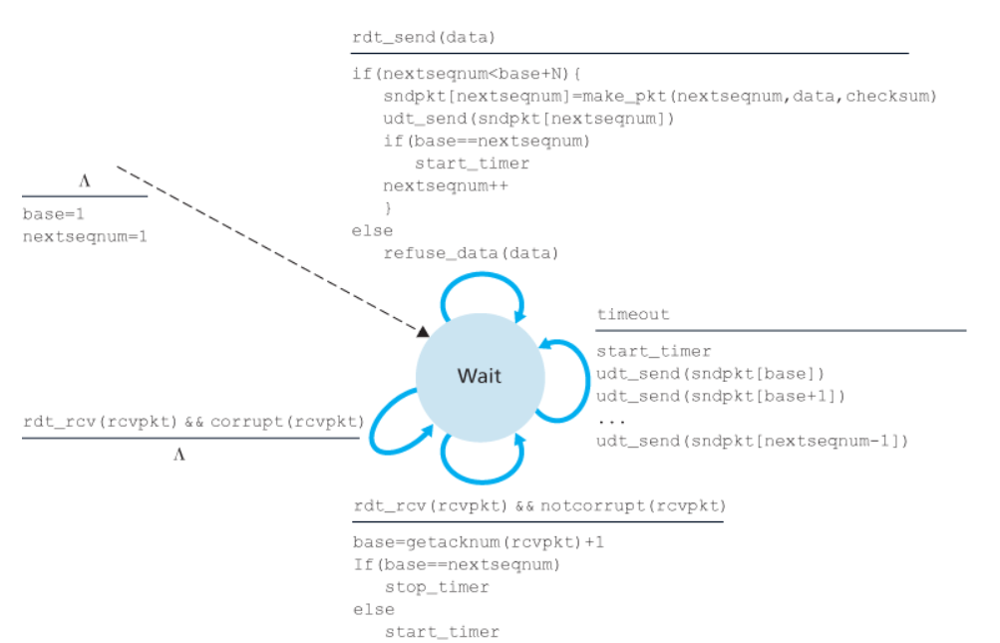

Ricevitore

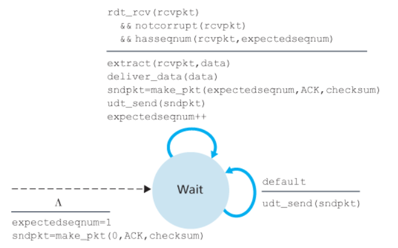

Esempio

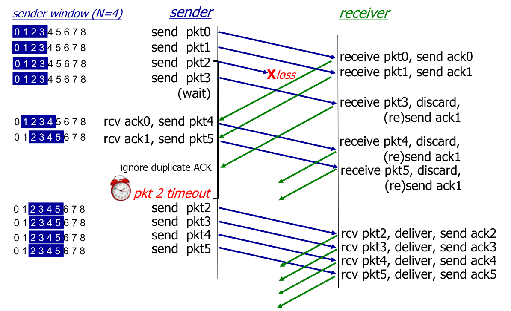

#### 3.3.5.2. Selective Repeat

È l'altro protocollo per la gestione delle _pipeline_.
In questo protocollo il ricevitore invia gli `ACK` **_individualmente per ogni pacchetto ricevuto_**, implementando sistemi di buffering per eventuali pacchetti fuori ordine e **evitando ritrasmissioni non necessarie**.

Anche in questo caso abbiamo una **Window Size** $N$, con la gestione interna molto simila al protocollo `GBN`. A differenza di questo però, il ricevitore avrà già ricevuto `ACK` anche per pacchetti all'interno della finestra, come possiamo vedere nell'immagine di seguito:

<figure class="">
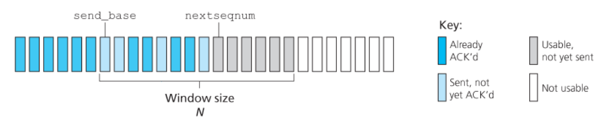
<figcaption>

I pacchetti **verificati** nella finestra sono bufferizzati dal ricevitore qual'ora fosse necessario una comunicazione in ordine.
</figcaption>
</figure>

In questo caso, qual'ora dovesse scadere il _timer_, il trasmettitore reinvierà **_tutti i pacchetti <u>non verificati</u> all'interno di_** `[base, nextseqnum - 1]`.

Possiamo vedere un esempio di `SR` in azione:

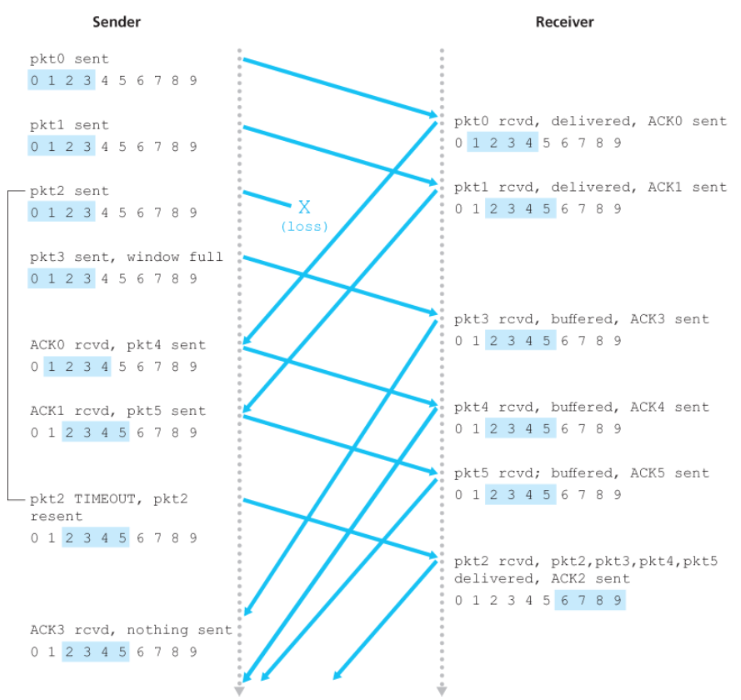

Notiamo subito un problema. Infatti, quando arriverà `ACK(2)`, il trasmettitore non avrà ancora ricevuto né `ACK(3)` né `ACK(4)`, che nel nostro esempio sono stati persi.
Allo scadere del _timer_, il trasmettitore invierà i pacchetti `4` e `5`. D'altro canto però, il ricevitore ha giàà ottenuto e segnato l'invio dell'`ACK` di `4` e `5` che quindi sono a tutti gli effetti **_inviati più volte_**.

Questo non sembrerebbe un problema, ma immaginiamo di avere una finestra di `3 pkg`, identificati in modulo 2 come `0`, `1`, `2`.

Immaginiamo quindi che vengano inviati i primi tre pacchetti **senza problemi**.

Il ricevitore avrà segnato come ricevuti questi pacchetti, inviando i loro `ACK`. Sarà pronto a ricevere il nuemro `3`, `4`, e `5`, anch'essi identificati in modulo due come `0`, `1` e `2`.

Ipotizziamo adesso che **_tutti gli `ACK` si perdano_**.

Il trasmettitore, non avendo ricevuto alcun `ACK`, attenderà quindi il _timeout_ e procederà a reinviare **_gli stessi pacchetti_**.

Il ricevitore adesso accetterà i nuovi pacchetti, poiché i numeri di sequenza coincidono, portando ad una duplicazione dei primi sei pacchetti e al salvataggio di un messaggio complessivo errato.

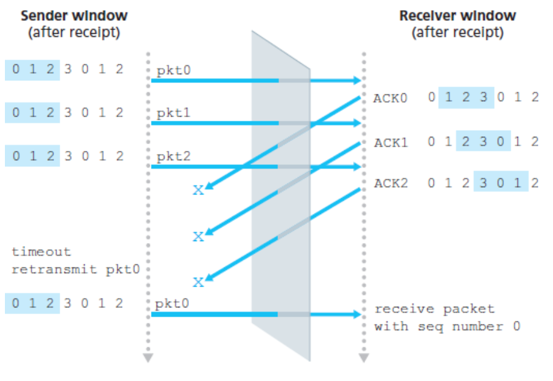

Questo dilemma sulla natura dei pacchetti è dovuto proprio al fatto che vengono utilizzate **finestre troppo grandi**. Infatti, se utilizziamo finestre grandi tanto quanto i numeri di frequenza abbiamo già visto che è impossibile distinguere le ritrasmissioni con l'invio di nuovi pacchetti. Per risolvere questo problema si _**diminuisce la dimensione della finestra**_ $N$, **senza variare l'intervallo dei numeri di sequenza**. È possibile dimostrare che, se i numeri di sequenza $s \in [0, S]$, con una finestra $N = \frac{S}{2}$ e introducendo un _lifetime_ ai pacchetti risolviamo questo problema.

All'interno di reti ad alta velocità, il _lifetime_ massimo dato ai pacchetti in comunicazioni `TCP` è di **circa tre minuti** (`RFC 1323`).

# 4. Point to Point Protocol (`PPP`)

Le connessioni _point to point_ consistono in un singolo trasmettitore e in un singolo ricevitore.

Il protocollo che disciplina questo tipo di connessioni permette:
- **Packet Framing**: l'incapsulamento del datagramma nel _layer di rete_ in quello che abbiamo chiamato il _Data Link Frame_. Questo traspoera informazioni di livello di rete per ogni protocollo.
- **Bit Transoarency**: il pacchetto deve trasportare tutti i pattern nel capo dati
- **Connection Liveness**: permette di rilevare e segnalare fallimenti della connessione al layer di rete
- **Network Layer Address Negotiation**: permette agli _endpoint_ di imparare e configurare gli uni gli indirizzi di rete degli altri

Questo protocollo invece non permette:
- **Error Correction**
- **Error Recovery**
- **Flow Control**
- **Out for order deliveries**
- **Point-to-multipoint communication** (supportato invece di altri protocolli come il `HDLC`)

L'_error recovery_, il _flow control_ e il _data re-ordering_ sono delegati dal protocollo **ai livelli superiori**.

Il protocollo stabilisce che i messaggi siano così incapsulati:

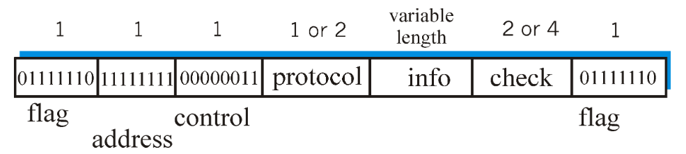

- **Flag**: sono delle sequenze di bit che fanno da delimitatore del _frame_
- **Indirizzo**: è un campo inutile, ma è sempre costante. Venne inserito perché in principio si pensava di supportare anche la _point-to-multipoint_.
- **Controllo**: non fa nulla. È stato inserito con l'ottica che in futuro possa contenere informazioni di controllo
- **Protocollo**: specifica il protocollo del livello superiore (ad esmepio `IP`) attraverso il quale il pacchetto è inviato
- **Info**: rappresenta i dati provenienti dai livelli superiori- La lunghezza è un parametro negoziabile, che va da $0$ a $1024$ Byte.
- **Check**: rappresenta i bit che servono per il `CRC` per la _error detection_

All'interno delle _info_ potrebbe però essere presente proprio la sequenza del **flag**.
Per evitare che il ricevitore interpreti in maniera errata queti dati, trattandoli come _flag_ di terminazione, si introduce una **sequenza di escape**. `01111101`

Il processo attraverso il quale il trasmettitore crea questa sequenza si chiama _byte stuffing_, mentre l'inverso compito dal ricevitore si chiama _byte unstaffing_.

Le trasmissioni delle seguenti sequenze vengono quindi tradotte:
$$
\begin{align*}
	\textbf{Dati uguali al flag} &:
	\begin{CD}
		01111110 @>{\quad\text{Trasmettitore}\quad}>> 01111101\;01111110 	@>{\quad\text{Ricevitore}\quad}>> 01111110\\
	\end{CD} \\[1em]
	\textbf{Dati uguali alla sequenza di escape} &:
	\begin{CD}
		 01111101 @>{\quad\text{Trasmettitore}\quad}>> 01111101 01111101 @>{\quad\text{Ricevitore}\quad}>> 01111101
	\end{CD}

\end{align*}
$$

# 5. Multiple Access Protocol

Sono protocolli che permettono la trasmissione dei messaggi di tipo **_broadcast_**, ovvero _point-to-multipoint_.

Alcuni sistemi basati su _broadcast_ sono: le reti cellulari, le reti wifi, il vecchio _Ethernet_. reti satellitari o, banalmente, le persone che si riuniscono e parlano.

Le connessioni _broadcast_ hanno un problmea intrinseco alla loro natura. Dato che tutti i nodi condividono lo stesso mezzo, se due nodi iniziassero a comunicare insieme senza attendersi l'un l'altro si si verificherebbero delle **_collisioni_** che produrrebbero interferenze nella trasmissione.

Il **Multiple Access Protocol**:
> Implementa un algoritmo distribuito che determina come i nodi condividono il canale, determinando quando un nodo può comunicare.+

È importante sottolineare che le comuncazioni relative all'utilizzo del canale **_devono essere fatte sempre attraverso lo stesso canale_**.

Esistono diversi approcci attraverso il quale è possibile implementare le comunicazioni _broadcast_.

Un protocollo ideale, dato un canale multi-accesso (`MAC`) di banda $R$ bps, vorrebbe che:
1. Se un nodo vuole trasmettere, lo può fare al rateo $R$
2. Se $M$ nod vogliono trasmettere, lo possono fare con una velocità media $\frac{R}{M}$
3. Non esiste un **nodo speciale** che coordina le comunicazioni, né degli strumenti di sincronizzazione o di prenotazione
4. Deve essere semplice

In generale esistono tre classi di protocollo:
- **Channel Partitioning**: permettono di dividere un conale in _pezzi più piccoli_ (slot temporali, modulazione di frequenze, suddivisione di codice). Ad ogni nodo viene assegnato in maniera esclusiva **uno di questi nodi**
- **Random Access**: non divide il canale, permettendo le collisioni. Tuttavia permette anche di _"guarire"_ da esse
- **Taking Turns**: ogni nodo si prenota per un quanto di tempo, tendenzialmente proporzionale alla dimensione del messaggio che deve inviare.

## 5.1. Time Division Multiple Access - `TDMA`

È un protocollo che permette l'accesso al canale in "round". Tutti i nodi ottengono uno slot di **dimensione fissata** ad ogni turno. Per dimensione si intende il tempo necessario per inviare un pacchetto di dimensione nota.
Se un nodo non necessita del suo _slot_, questo va semplicemente _idle_.

Un esempio grafico di questo approccio è il seguente:

<figure class="75">
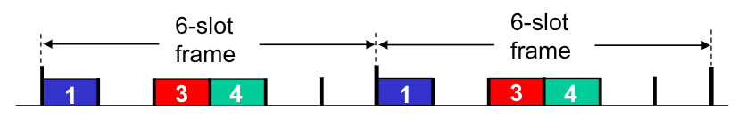
<figcaption>

Esempio con una connessione a 6 stazioni, con tre nodi che devono trasmettere, mentre gli altri sono _idle_.
</figcaption>
</figure>

Questo metodo non soddisfa i desideri del `MAC` ideale.
1. **NO**: Se un nodo deve trasmettere, la velocità con la quale lo può fare è vincolata al proprio slot, indipendentemente dal fatto che ci sia qualcun'altro.
2. **SÌ**: Se l'allocazione del tempo è uguale per tutti, in media in fondo tutti trasferiscono alla stessa velocità
3. **NO**: i _clock_ devono essere sincronizzati affinché non si abbiano sforature. Inoltre potrebbe servire un nodo esterno che regola l'ordine
4. **SÌ**: ognuno ha il suo slot senza dover fare troppi controlli.

## 5.2. Random Access Protocols

Questa politica sancisce che quanod un nodo ha dei pacchetti da trasferire lo fa **utilizzando tutto il canale**. Il protocollo inoltre **_non regola alcuna coordinazione a priori tra i nodi_**.

Questo ultimo passaggio comporta che il protocollo è susciettibile a **collisioni**. Il protocollo a `random access MAC` specifica come rilevarle e recuperare gli errori.
Alcuni esempi di protocolli `MAC` sono:
- `ALOHA` e `slotted ALOHA`
- `CSMA`, `CSMA/CD`, `CSMA/CA`

### 5.2.1. Slotted ALOHA

Questo protocollo opera sotto le seguenti assunzioni:
- Tutti i frame sono uguali $L$ bit
- La rete opera a $R$ bps
- Il tempo è diviso in unità di $\frac{L}{R}$ s
- I nodi iniziano a trasmettere i frame _solo all'inizio degli slot_
- I nodi sono sincronizzati così che ogniun osa quando lo slot inizia
- Se due o più _frame_ collidono in uno slot, **tutti i nodi** rilevano la collisione prima che lo slot termini.

Detta $p$ una probabilità $0 \le p \le 1$, le operazioni stabilite dal protocollo sono semplici:
- Se un nodo ha un nuovo _frame_ da trasmettere aspetta l'inizio del prossimo slot e lo trasmette tutto nello slot
- Se non ci sono collisioni, il _frame_ è stato correttamente trasferito e l'operazione di trasferimento è terminata
- Se ci sono state collisioni, il nodo le rileva prima della fine dello slot. Successivamente, per ogni slot successivo il nodo avrà una probabilità $p$ di ritrasmettere il _frame_.

La ritrasmissione ha probabilità $p$ che avvenga senza una nuova collisione. Quello che si intende con questa affermazione, è che ad ogni ritrasmissione è come se il nodo lanciasse una "biased coin":
- **Testa** rappresenta la ritrasmissione, che accade con probabilità $p$
- **Croce** rappresenta saltare lo slot e ritentare al prossimo, che accade con probabilità $(1 - p)$

Tutti i nodi fanno la scelta di ritrasmettere o meno il _frame_ **indipendente**.
Una possibile evoluzione è quella sulla destra.

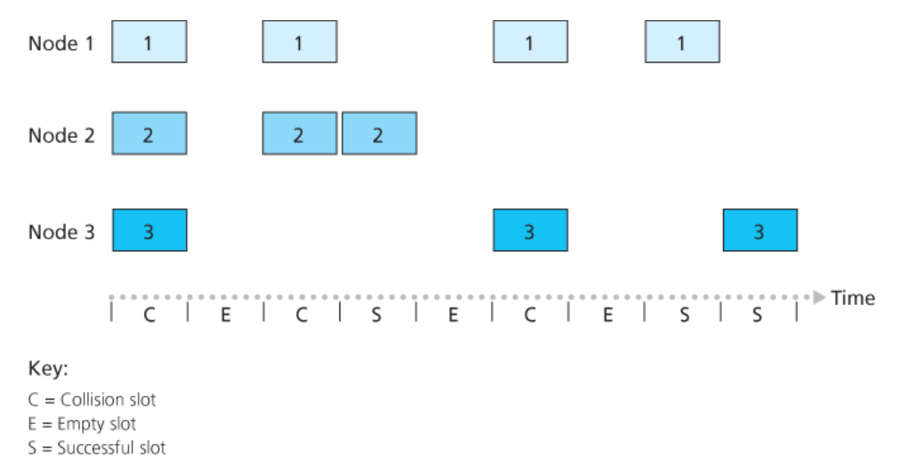

Questo protocollo ha sia pro che contro.

|                                     Pro                                      |                                                   Contro                                                    |
| :--------------------------------------------------------------------------: | :---------------------------------------------------------------------------------------------------------: |
|               Un singolo nodo attivo più trasmettere a $R$ bps               |                             Ci possono essere collisioni che sprecano gli slot                              |
| È decentralizzato, poiché solo gli slot nei nodi devono essere sincronizzati |                                  Ci sono delgi slot _idle_ non utilizzati                                   |
|                                   Semplice                                   | I nodi potrebbero rendersi conto della collisione **dopo** che il pacchetto è stato completamente trasmesso |
|                                                                              |                                    Necessità di sincronizzare il _clock_                                    |

Andiamo a calcolarne l'efficienza, ovvero **ill raporto tra _slot correttamente utilizzati_ sul _totale_**.

Supponendo di avere $N$ nodi, ogniuno con tanti _frame_ da inviare, ognuno con probabilità $p$ di essere trasmesso in uno slot:
- Probabilità che un nodo invii correttamente un messaggio in uno slot: $p(1-p)^{N-1}$
- Probabilità che un _qualsiasi_ nodo invii correttamente un messaggio in uno slot: $N\cdot p(1-p)^{N-1}$
- Massima efficienza: troviamo $p^*$ che massimizza $N\cdot p(1-p)^{N-1} \to p^* = \frac{1}{N}$
- Calcoliamo il limite di $\lim_{N\to\infty}{N\cdot p^*(1-p^*)^{N-1}}$

Non specificando i calcoli, l'efficienze massima è di $\frac{1}{e} = 0.37 \Rightarrow 37\%$

Quindi, **_nel caso migliore_**, utilizzeremo il canale solamente per poco più di un terzo del tempo.

### 5.2.2. Pure ALOHA

È una versione più semplice dello _slotted ALOHA_, dove **_non è presente sincronizzazione tra i nodi_**. Quando un nodo ha un _frame_ da comunicare **_lo trasmette immediatamente_**.

Questo non fa altro che aumentare la probabilità di collisioni, infatti se inviamo un frame al tempo $t_0$, questo potrebbe collidere con gli altri frame inviati nell'intervallo $[t_0-1, t_0 +1]$

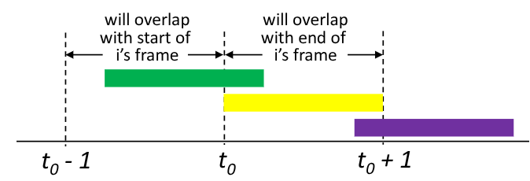

Calcoliamo l'efficienza:
$$
\begin{align*}
	P(\text{successo di un dato nodo}) &= P(\text{trasmissione efficace}) \cdot P(\text{nessun altro nodo trasmette in } [t_0-1, t_0]) \cdot P(\text{nessun altro nodo trasmette in } [t_0, t_0+1]) \\
	&= p \cdot (1-p)^{N-1} \cdot (1-p)^{N-1} \\
	&= p \cdot (1-p)^{2(N-1)} \\
	&\begin{CD}
		@VV{p^* \text{ massimizza}}V
	\end{CD} \\
	P(\text{successo di un dato nodo}) &= \lim_{N\to\infty}{p^* \cdot (1-p^*)^{2(N-1)}} = \frac{1}{2e} = \boxed{0.18}
\end{align*}
$$

Otteniamo quindi un efficienza persino **peggiore dello _slotted ALOHA_**.

### 5.2.3. Carrier Sense Multiple Access - `CSMA`

Nei protocolli `ALOHA` abbiamo visto la decisione di un nodo di trasmettere è indipendente dall'attività degli altri nodi all'interno del canale. Il fatto che un altro nodo stia gia trasmettendo non ferma un altro nell'iniziare a trasmettere. Allo stesso modo, un nodo che sta già trasmettendo non si mette in pausa se un altro inizia a comunicare.

Per migliorare questo sistema si utilizzano due regole utilizzate anche nella comunicazione umana:
1. **_Ascolta prima di parlare_**: se qualcun altro sta parlando si attende che questo finisca prima di parlare. Nel mondo delle reti si chiama _carrier sensing_, un nodo ascolta il canale prima di trasmettere, e attende che non vi siano comunicazioni per un intervallo di tempo stabilito prima di iniziare a trasmettere.
2. **_Se qualcuno inizia a parlare nello stesso momento, smetti_**: Nel mondo delle reti si chiama _collision detection_, un nodo sta in ascolto anche mentre sta trasmettendo. Se rilevau na collisione attende un tempo casuale prima di ripetere il ciclo di trasmissione

Queste due regole sono alla base dei protocolli `CSMA` e `CSMA/CD` (con _collision detection_), regolamentati in `[Kleinrock 1975b; Metcalfe 1976; Lam 1980; Rom 1990]`.

Nonostante il _carrier sensing_ le collusioni **possono comunque avvenire**. Infatti il _delay_ di propagazione comporta che due nodi possano non sentirsi quando iniziano le trasmissioni.

Sulla destra possiamo vederre un esmepio di ciò.

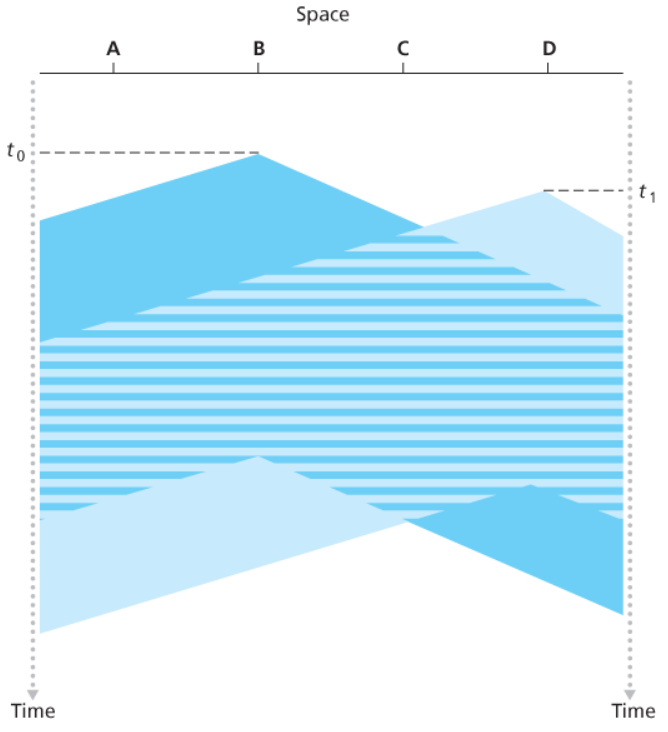

Questa versione però non performa _collision detection_, infatti sia $B$ che $D$ continuano a trasmettere i loro _frame_ anche se sanno che c'è stata una collisione.
Il protocollo `CSMA/CD` sancisce che le comunicazioni siano terminate nel momento in cui si rileva una collisione.

Il grafico sopra diventa quindi quello sulla destra.

In questo modo riusciamo a **_diminuire il tempo perso per via delle collisioni_**.

Il segnale inviato durante le collisioni si chiama **_segnale di `JAM`_**. Questo server per rafforzare la collisione e renderne più semlice per gli altri nodi l'individuazione

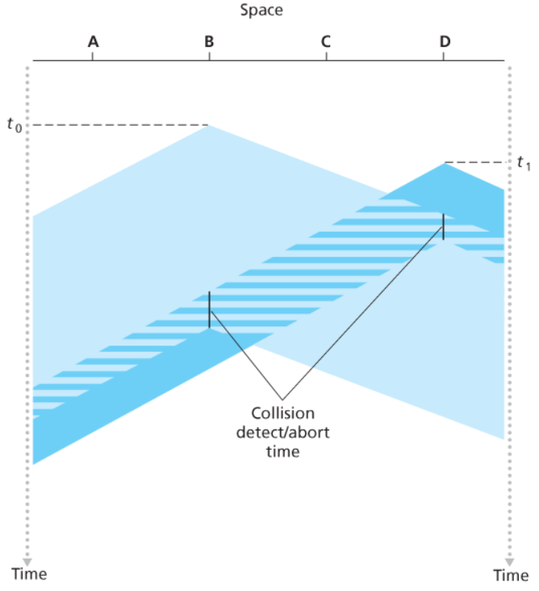

Prima di analizzare il protocollo `CSMA/CD` riassiumiamo le operazioni che abbiamo appena descritto dal punto di vista del **NIC**:
1. L'adattatore ottiene un datagramma dal _network layer_. Prepara quidni il _frame del link layer_ e prepara il _frame adapter buffer_
2. Il **NIC** si mette in ascolto sul canale:
   1. Se il canale è _idle_ (non c'è energia sul canale) **_inizia a trasmettere il frame_**
   2. Se il canale invece è occupato attende finché non si libera e poi inizia a trasmettere il frame
3. Mentre sta trasmettendo, il **NIC** **_monitora la potenza energetica in entrata_** . Se è <u>significatamente</u> diversa da quella da lui trasmessa, significa che **_ci sono segnali provenienti da altri adattatori_** che comunicano sul canale _broadcast_
4. Se il **NIC** ha trasmesso l'intero frame senza interruzioni, termina. Altrimenti esegue un _abort_ della trasmissione
5. Dopo l'_abort_, il **NIC** **_attende un tempo casuale e riparte dal punto 2_**, entrando nel **_binary (exponential) backoff_**
	- Dopo la $m$-esima collisione, il `NIC` genera un valore $K \in {0, 1, 2, 3, ..., 2^m-1}$ e attende $K \cdot 51,2 \;\mu$sec

Questo metodo non soddisfa i desideri del `MAC` ideale.
1. **SÌ**: Se un nodo deve trasmettere e il canale è libero, comunica al massimo della banda
2. **SÌ**: Nessun nodo ha una corsia preferenziale
3. **SÌ**: Non ci sono elementi di sincronizzazione, ed è _fully decentralized_
4. **SÌ**: possiamo dire che è semplice

Anche se questo protocollo sembra ottimo, ha un problema nel _throughput_ nel caso di un numero elevato di nodi, che aumenta la probabilità di collisioni, degradandolo.

## 5.3. Taking Turns MAC Protocols

Sono un unione tra le altre due classi di protocolli che abbiamo visto.

Ne esistono anche qui di diversi tipi

### 5.3.1. Polling

Nel sistema con _polling_, si ha una **struttura centralizzata**, dove è presente un dispositivo **master**/**coordinatore** che _invita_ i nodi **slave**/**normali** a parlare.

Se non hanno messaggi da trasmettere questi inviano un messaggio `null` e il _master_ procede con il prossimo

È tipicamente utilizzato con dispositivi "stupidi.
Il protocollo Bluetooth si basa proprio sul _polling_.

Ha dei punti critici:
- Si genera del _polling overhead_
- È susciettibile ad un alta _latenza_
- Presenta un _single-point-of-failure_

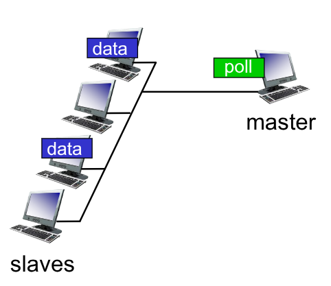

### 5.3.2. Token Passing

Nei sistemi con _token_, si ha un **_token_** (_frame di bit_) che viene passato da un nodo all'altro in maniera sequenziale.

Solo chi ha il _token_ può trasmettere

Anche questo metodo ha dei punti critici:
- Si genera del _token overhead_
- È susciettibile ad un alta _latenza_
- Presenta un _single-point-of-failure_ che è il _token_

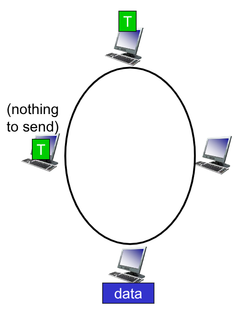

# 6. Local Area Network - `LAN`

Le reti LAN sono leti a medio broadcast, che hanno un area di copertura limitata.

Permettono un _alto bit rate_ ma ha il difetto di, per sua natura, effettuare comunicazioni di tipo _broadcast_.

È quindi necessario avere un **Medium Access Control Protocol** introducendo un sistema di indirizzamento `MAC`.

<figure class="90">
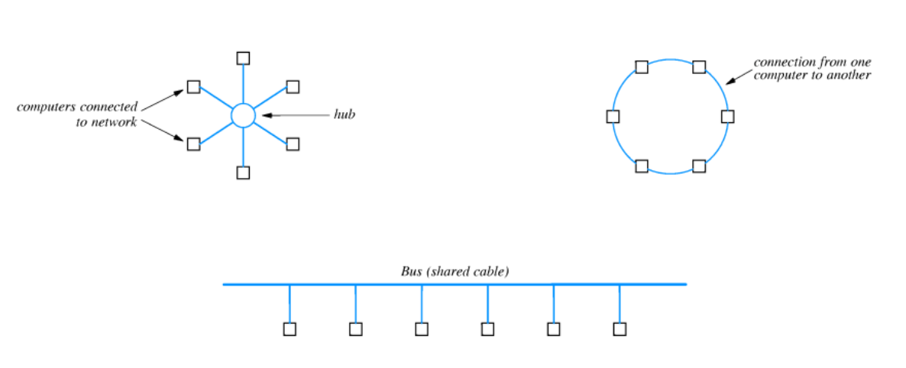
<figcaption>

Alcune topologie di rete `LAN`. In ordine da in alto a sinistra a in basso a destra abbiamo la topologia _a stella_, _ad anello_ e tramite _bus_
</figcaption>
</figure>

## 6.1. Indirizzi MAC

Per poter comunicare privatamente su reti naturalmente broadcast, dobbiamo trovare un modo per riuscire a individuare **univocamente** ogni nodo all'interno della _rete locale_ nelal quale si trova.

Per fare ciò si introducono gli **_indirizzi MAC_**. Questi indirizzi sono assegnati in maniera univoca dal **_produttore della scheda di rete_**. Vengono utilizzati **localmente** per permettere la trasmissione di _frame_ tra più interfacce sulla stessa rete locale.

Gli indirizzi `MAC` sono codificati su `48bit` in esadecimale, d'accordo con lo standard `IEEE`. È salvato direttamente nella `ROM` del `NIC`, ma qualche volta è modificabile tramite software. Un esempio di indirizzo `MAX` è: `1A-2F-BB-76-09-AD`.
I primi `24bit` identificano la scheda vera e prorpia, gli ultimi `24bit` invece identificano **il costruttore**.

Gli indirizzi `MAC` (o indirizzo fisico) **sono diversi** dagli indirizzi `IP`, che identificano il nodo **nel livello di internet**.

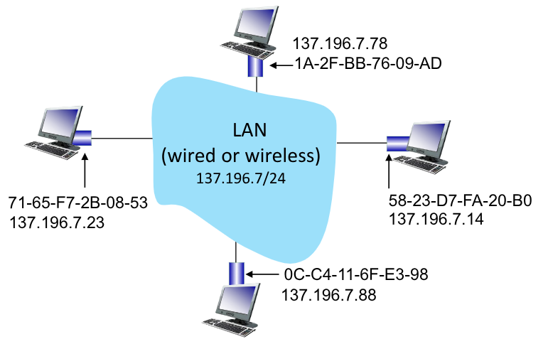

Esiste inolte un **_indirizzo di broadcast_** nel quale tutte le interfacce si identificano. L'indirizzo è il seguente `FF-FF-FF-FF-FF-FF`.

## 6.2. Ethernet

È la tecnologia più popolare che implementa le **reti locali cablate**.

La topologia tipica di questa tecnologia si è evoluta nel tempo. Negli anni '90 il collegamento più popolare era quello attraverso un **cavo coassiale** che si comportava da _bus_, generando un unico grande dominio per le collisioni.

Oggi la topologia più comune è quella _a stella_, dove l'_hub_ viene identificato da uno **_switch_**. Questo _switch_ opera a livello 2 e, oltre a rigenerare i segnali come un comune _hub_, gestisce i _frame_ ridirezionandoli opportunamente solo ai nodi coinvolti. In questo modo è come se ogni connessione viaggiasse su un protocollo ethernet separato.

La tecnologia ethernet incapsula il datagramma `IP` in quello che chiamiamo **_Ethernet frame_**

Dove:
- **Preambolo**: è utilizzato per _sincronizzare i clock del sender e del receiver_. È composto da `7 Bytes` di `10101010` seguiti da `1 byte` di `10101011`.
- **Indirizzo**: sono `6 Byte` utilizzati per conservare gli indirizzi `MAC`:
  - **Indirizzo Sorgnete**: indica il `MAC` del nodo che ha trasmesso il _frame_
  - **Indirizzo Destinatario**: può indicare il `MAC` di un destinatario o un indirizzo speciale che indica la comunicazione _broadcast_. Se un pacchetto possiede un _dest. addr._ diverso dal proprio o dal _broadcast_, il nodo lo scarta e smette di stare in ascolto sul resto dei bit che stanno venendo trasmessi.
- **Type**: indica il protocollo di livello superiore utilizzato (`IP`, `Novell IPX`, `AppleTalk`, ...) su `2Byte`
- **Bit di controllo** `CRC`: permettono la error-detection su `4Byte`
- **Data(payload)**:  ha una dimensione minima di `48Byte` e una dimensione massima di `1500Byte`. Per sapere il perché della dimensione minima guardare il [capitolo successivo](#621-dinamica-delle-collissioni)

Le connessioni _ethernet_ sono:
- **Senza connessioni**: non è infatti introdotto nessun _handshake_ tra l'invio e il ricevimento di informazioni tra `NIC`
- **Inaffidabili**: chi riceve un pacchetto **non invia alcun messaggio di `ACK`**. I dati che possono andare persi per via di errori di comunicazione vengono recuperati **_solo se un livello superiore li vuole utilizzare_**, altrimenti rimangono perduti.

Il protocollo `MAC` utilizzato dalle connessioni _ethernet_ è un **_unslotted `CSMA/CD` con backoff binario_**.

I passaggi in una comunicazione sono questi:
1. Il NIC riceve dati dal _network layer_ e crea il frame
2. Se il `NIC` si mette in ascolto del canale e iniza la trasmissione solo dopo che sono passati `96bit` di tempo _idle_
3. Se il `NIC` ha trasmesso tutto il pacchetto senza errori, termina
4. Se il `NIC` rileva un altra trasmissione mentre sta inviando il pacchetto, **_fa abort dell'invio_** e procede a inviare un **_segnale di jam_** di `48bit`.
5. Dopo l'_abort_ il `NIC` entra nel _backoff esponenziale_ per un massimo di **_17 tentativi_**, dopo i quali droppa il frame

Il _segnale di jam_ fa in modo che tutti gli altri trasmettitori vengano a conoscenza dell'avvenuta collisione.
Assumendo connessioni Etehrnet a `10Mbps`, la trasmissione di `48bit` impiega un tempo di circa $4.8\mu$s

### 6.2.1. Perdita di Pacchetti e Distanze Massime

I cavi sono mezzi inaffidabili, che possono essere susciettibili a perdita di informazioni. I segnali fisici che passano in un mezzo fisico vanno infatti incontro a degradazione. Ad esempio, misurarono empiricamente che nei cavi coassiali la lunghezza massima era di $500m$ nel caso di cavi spessi, e di $250m$ nel caso di cavi fini.

Per poter migliorare queste distanze si introducono i _repeater_, che non sono altro che **amplificatori e ripetitori** di segnale. Tuttavia anche questi sono susciettibili ad errori, ed è stato calcolato che **_il numero massimo di repeater in cascata è di_** $4$, successivamente si avranno sicuramente delle perdite.

Immaginiamo di avere, come in figura sulla destra, due interfacce che comunicano su uno stesso mezzo di rame (con velocità di propagazione $v \approx 200.000 m/s$) che possiede 4 _repeater_, che producono un ritardo di trasmissione di $\frac{\Delta_R}{4}$. Ipotizzando una connessione $R = 10$ Mbps.

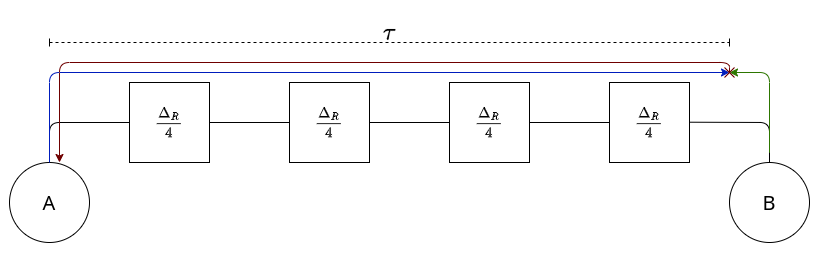

Ipotizzando che nell'istante $t_0 = 0$ l'interfaccia `A` inizi a trasmettere, e che nell'istante $t_1 = \tau$ lo faccia anche `B` si avrà una collisione che `A` intercetterà solo dopo un tempo di:
$$
	t_{coll} = 2(\tau + \Delta_R) = 2\Bigl(\frac{l_{max}}{v} + \Delta_R\Bigr)
$$

Affinché `A` rilevi la collisione, è necessario che questa arrivi al nodo prima che finisca di trasmettere il suo pacchetto.

Immaginiamo che `A` stia inviando **_il più piccolo pacchetto possibile_** di lunghezza $L_{min}$. Per farlo impiegherà un tempo di $\frac{L_{min}}{R}$.

È quindi necessario che:
$$
	2\Bigl(\frac{l_{max}}{v} + \Delta_R\Bigr) \le \frac{L_{min}}{R} \\
	L_{min} \ge 2R\Bigl(\frac{l_{max}}{v} + \Delta_R\Bigr)
$$

Empiricamente fu scoperto che la $l_{max} \approx 2500m$, dal quale deriviamo che $\boxed{L_{min} = 72 Byte}$.

Rimuovendo tutte le informazioni di corredo (_preambolo_, _type_, _indirizzi_, _CRC_), otteniamo perché il datagramma **_deve essere almeno_** $48 Byte$.

### 6.2.2. 802.3 Ethernet Standards

Esistono **tanti diversi protocolli ethernet**. Ognuno lavora su diversi mezzi fisici, a velocità diverse, ma tutti hanno un comune il `MAC protocol` e il _formato dei frame_.

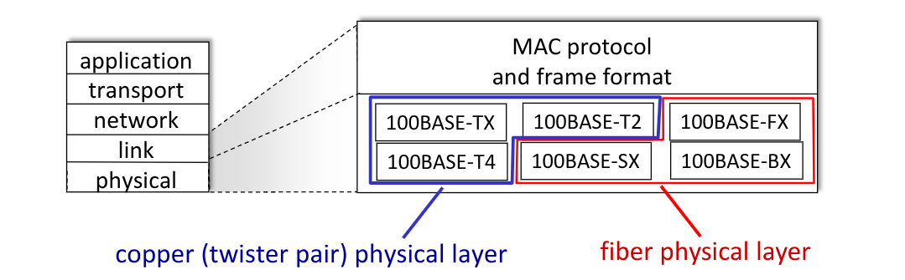