# 1. Indice

- [1. Indice](#1-indice)
- [2. Sicurezza](#2-sicurezza)
	- [2.1. Principi di Crittografia](#21-principi-di-crittografia)
		- [2.1.1. Crittografia a chiave simmetrica](#211-crittografia-a-chiave-simmetrica)
			- [2.1.1.1. Trasmissione della chiave](#2111-trasmissione-della-chiave)
		- [2.1.2. Crittografia a chiave pubblica](#212-crittografia-a-chiave-pubblica)
	- [2.2. Integrità della comunicazione](#22-integrità-della-comunicazione)
		- [2.2.1. Funzioni Hash](#221-funzioni-hash)
		- [2.2.2. Message Autentication Code - `MAC`](#222-message-autentication-code---mac)
			- [2.2.2.1. Attacco Playback e OTP](#2221-attacco-playback-e-otp)
		- [2.2.3. Firme Digitali](#223-firme-digitali)
			- [2.2.3.1. Public Key Certification](#2231-public-key-certification)
	- [2.3. Autenticazione](#23-autenticazione)
- [3. Implementare la sicurezza](#3-implementare-la-sicurezza)
	- [3.1. Sicurezza a Livello Applicazione](#31-sicurezza-a-livello-applicazione)
	- [3.2. Sicurezza a livello trasporto - `TLS`](#32-sicurezza-a-livello-trasporto---tls)
	- [3.3. Toy-TLS](#33-toy-tls)
		- [3.3.1. Handshake](#331-handshake)
		- [3.3.2. Chiusura](#332-chiusura)
	- [3.4. TLS](#34-tls)
	- [3.5. 3.5 Sicurezza a livello Network - `IPsec`](#35-35-sicurezza-a-livello-network---ipsec)
		- [3.5.1. Encapsulation Security Protocol - `ESP`](#351-encapsulation-security-protocol---esp)
	- [3.6. Firewall e IDS](#36-firewall-e-ids)
		- [3.6.1. Stateless Packet Filters](#361-stateless-packet-filters)
		- [3.6.2. Stateful Packet Filters](#362-stateful-packet-filters)
		- [3.6.3. Application Gateways](#363-application-gateways)
		- [3.6.4. Limiti di firewall e gateway](#364-limiti-di-firewall-e-gateway)


# 2. Sicurezza

Il termine sicurezza è molto generico e può intendere diversi aspetti:
- **Confidenzialità**: solo il mittente e il destinatario dovrebbero essere in grado di "comprendere" il contenuto di un dato messaggio. Per poter raggiungere questa sicurezza si utilizza il _**criptaggio**_. Il mittente cripta il messaggio, mentre il destinatario lo decripterà
- **Autenticazione**: il trasmettitore deve ricevere la conferma che il destinatario sia davvero tale e non qualcun altro.
- **Integrità del messaggio**: il trasmettitore vuole che il messaggio non venga alterato (né quando in transito né successivamente) da terzi.
- **Permessi di accesso e disponibilità**: un dato servizio deve consentire l'accesso e la disponibilità agli utenti


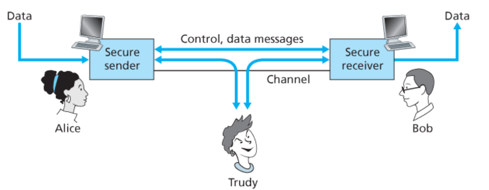

L'immagine illustra lo scenario nel quale abbiamo uno scambio di messaggi in chiaro sulla rete tra `Alice` e `Bob` che viene intercetttato da `Trudy`, un intruso.

Affinché `Ailce` e `Bob` possano scambiarsi messaggi in sicurezza, mantenendo i requisiti di _confidenzialità_, _autenticazione_ e _integrità_, devono devono scambiarsi prima dei messaggi di controllo e soccessivamente dei messaggi di dati.

In intruso può infatti può:
- **Fare Eavsdropping**: intercettare dei messaggi
- **Modifica del flusso**: può inserire nuovi messaggi, modificare quelli che vengono inviati o eliminarli
- **Impersonificarsi**: può fingersi un altro dispositivo
- **Hijaking**: può prendere possesso della connessione sostituendosi ad uno degli attori
- **Denial of Service**: può intasare il servizio in modo che non possa essere utilizzato da altri.


## 2.1. Principi di Crittografia

Per rendere illegibile un messaggio gli si applica un **_algoritmo di cifratura_**.

In una comunicazione standard tra utenti, l'algoritmo di cifratura è **_standard e noto_**. La sicurezza infatti non sta nel funzionamento dell'algoritmo, ma dalla **_chiave di cifratura_** $K$ che viene utilizzata da ogni utente.

<figure class="">
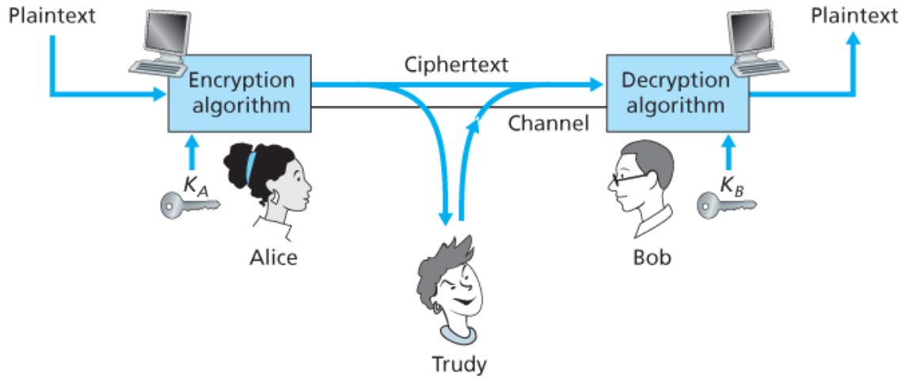
<figcaption>

$m$ è il testo in chiaro, $K_A(m)$ è il messaggio m **cifrato con la chiave** $K_A$.
Per ottenere il messaggio va decifrato con $m = K_B(K_A(m))$.
</figcaption>
</figure>

`Trudy` può ancora intercettare il messaggio, ma stavolta otterrà $K_A(m)$, che non ha un vero e proprio significato.
Prima di poter accedere al messaggio $m$ deve riuscire a decifrarlo in qualche modo.

Per valutare un algoritmo di cifratura si misura **_quanto è facile decifrarlo senza avere la chiave_**.

Esistono due approcci attraverso i quali è possibile decifrare un messaggio senza la chiave:
- **Brute Force**: prova **_tutte le chiavi possibili_** finché non trova quella corretta
- **Analisi statistica**: si effettuano delle analisi sia sui messaggi che sugli utenti che scambiano i messaggi per recuperare pattern sui quali basarsi per recuperare la chiave.

### 2.1.1. Crittografia a chiave simmetrica

In questo assioma crittografico sia `Alice` che `Bob` possiedono **_la stessa chiave_** $K_S$ (per questo si dice simmetrica).

Per decidere la chiave comune si utilizza un cifrario.

Il più semplice cifrario è quello di **sostituzione**:
> Si sostituisce un carattere con un altro

Un cifrario monoalfabetico sostituisce una lettera con un altra. Dato il semplice `plaintext: abcdefghijklmnopqrstuvwxyz` si può tradurre con il testo cifrato `ciphertext: mnbvcxzasdfghjklpoiuytrewq`.

In questo caso:
```plaintext
bob. i love you. alice
```

Diventa:
```plaintext
nkn. s gktc wky. mgsbc
```

La chiave di cifratura è quindi **_mappata da un set di 26 lettere per mappare 26 lettere_**, ottenendo $26! - 1$ possibili chiavi.


Un altro algoritmo più complesso è l'algoritmo a _$n$ cifrari di sostituzioni__
> Per ogni simbolo si effettua una sostituzione seguendo un diverso cifrario.
> Il cifrario da utilizzare è otenuto a partire dalla posizione del carattere. La lettera alla posizione $i$ utilizzerà il cifrario alla posizione $i \% n$ nel _cycling pattern_

Dati $n$ cifrari con il seguente _cycling pattern_: $M_1, M_3, M_4, M_3, M_2$, cifrare una parola come `dog` verrà cifrata come : $M_1(d)M_3(o)M_4(g)$.

In questo caso la chiave corrisponde prorpio al **numero di cifrari** e al _cyclic pattern_ utilizzato.

Questi tipi di cifrari soffrono del problema che nella lingua molte parole sono _standard_ nei discorsi, così come il numero di parole sensate composte da poche lettere sono poche, ed è quindi possibile decifrare almeno quelle poche parole.

A quel punto, attraverso analisi statistiche è possibile riuscire a tradurre parti del messaggio, rendendo più semplice il decriptaggio di tutto il messaggio.

Esistono quindi altri tipi di cifratura più sicuri utilizzati.
Il primo approccio è la **_cifratura basata su Stream_**.
Questo approccio orientato allo stream, **_ogni bit viene cifrato per conto proprio_**.

Questo tipo di approccio è utilizzato per connessioni `TLS`, `Bluetooth`, cellulari `4G` e `5G`

Un altro approccio è la _**Cifratura a Blocchi**_.
Queto approccio divide i messaggi in **_blocchi di dimensioni uguali_** (aggiungendo eventualmente padding all'ultimo blocco), e procede a **_criptare ogni blocco come un unità_**.

Esistono diversi algoritmi orientati al blocco:
- `DES` (_Data Encryption Standard_)
- `3DES` (_Triple Data Encryption Standard_)
- `AES` (_Advanced Encryption Standard_)
- `IDEA` (_International Data Encryption Algorithm_)

L'algoritmo `DES` ero lo standard americano, e si basa su una **_chiave simmetrica a 56-bit_**, basata su input a blocchi a `64-bit`.

Una challenge di decriptazione dimostrò che per decriptare la chiave in _brute force_ richiede meno di un giorno.

Allora si passò al `3DES` che critpa tre volte un messaggio con tre diverse chiavi.

Dal 2001 lo standard è diventato l'`AES`, che processa dati in blocchi di `128bit` utilizzando chiavi di `128`, `192` o `256 bit` .

È stato dimostrato che per decifrare in _brute force_ un messaggio che con il `DES` ci vuole un `1s` ci vuole circa _**149 trilioni di anni**_, basandosi sulla tecnologia dell'epoca.

#### 2.1.1.1. Trasmissione della chiave

Dobbiamo capire come permettere a due entità di scambiarsi la chiave in modo sicuro.

Il metodo più semplice sarebbe quello di permettere ai due personaggi di incontrarsi di persona , cosa però non sempre possibile.

Un altro modo potrebbe essere quello di utilizzare una **_crittografia a chiave pubblica_**, ma vedremo più avanti che ha poco senso logico.

Il terzo approccio è quello di utilizzare un `KDC` (_Key Distribution Center_), un entità distribuita terza fidata che permette di fare da intermediario tra le entità.

Quando un entità $i$ si registra presso un `KDC` ottiene una chiave $K_{i-KDC}$, una chiave simmetrica che permette di comunicare in maniera sicura al `KDC`.

Quando si vuole comunicare con un nuovo utente $j$, si invia una richiesta cifrata al `KDC`: $K_{i-KDC}(i, j)$.
Questo risponde con un messaggio cifrato con $K_{i-KDC}$ contenente:
- **_chiave di sessione_** $R_1$:  è una chiave a tempo che andrà utilizzata da $i$ e $j$
- **_tiket_**: un _**messaggio cifrato con $K_{j-KDC}$**_ contenente informazioni sul mittente $i$ e la chiave di sessione $R_1$

A questo punto $i$ deve occuparsi di **inoltrare così com'è il tiket a $j$**.
Quando $j$ la riceve è in grado di decifrarla poiché utilizza la propria chiave e otterrà informazioni su $i$ e la **_nuova chiave da utilizzare per le comunicazioni con $i$_**.

### 2.1.2. Crittografia a chiave pubblica

Questo approccio risolve il problema della chiave simmetrica che prevede che due utenti debbano trovare un modo per collegarsi e comunicarsi la chiave.

Questo approccio è **_radicalmente diverso_**. Si basa su due chiavi:
- **_chiave di cifratura pubblica_** $K_i^+$: è nota a tutti e condivisa a chiunque
- **_chiave di decifratura privata_** $K_i^-$: non è nota a nessuno tranne al singolo utente.

Quando `Alice` vuole inviare un mesasggio a `Bob` un messaggio `m` utilizza come chiave di cifratura la **_chiave pubblica di `Bob`_** $K_B^+$, trasmettendo $K_B^+(m)$.

Quando `Bob` riceve il messaggio lo **_decifra con la propria chiave privata_** $K_B^-(K_B^+(m)) = m$

La crittografia a chiave pubblica, detta `RSA` (_Rivest, Shamir, Adelson algorithm_), dal punto di vista computazionale, **_è molto più complessa_**. Infatti `DES` è almeno 100 volte più veloce della `RSA`. Questo, su messaggi molto grandi, può comportare un _overhead_ non trascurabile.

Inoltre `RSA` richiede delle chiavi $K^+$ e $K^-$ tali che:
$$
	K^-(K^+(m)) = m = K^+(K^-(m))\\
	K^- \not\propto K^+
$$

Per ottimizzare al meglio le comunicazioni in caso di messaggi grossi si utilizza un metodo ibrido con la **_chiave di sessione_** $K_S$:
- Si utilizza `RSA` per scambiarsi la chiave di sessione $K_S$
- Quando entrambi possiedono $K_S$, si utilizza la _crittografia a chiave simmetrica_

## 2.2. Integrità della comunicazione

L'**integrità della comunicazione**, nota anche come _autenticazione dei mesasaggi_, permette di essere sicuro che i messaggi:
- Avere la certezza che il mittente dei messaggi sia chi dice di essere
- Avere la certezza che il messaggio non sia stato manomesso in alcun modo durante il transito

Prendiamo il caso più semplice, ovvero un singolo messaggio.

Prima di parlare di come viene garantita l'integrità della comunicazione, ripassiamo le _funzioni hash_.

### 2.2.1. Funzioni Hash

Sono delle funzioni `H` che prendono in ingresso un input `m` e restituiscono una stringa di dimensioni finita `H(m)` nota come _hash_.

L'_hash_ rappresenta, in qualche maniera, il messaggio originale.

Le funzioni _hash_ devono avere delle proprietà:
1. Devono essere facili da computare
2. Devono essere **_irreversibili_**, dato `H(m)` non deve essere possibile ottenere `m`
3. Devono essere **_resistenti alle collisioni_**, dato `[m, H(m)]` deve essere computazionalmente impossibile produrre `m' != m` tale che `H(m) == H(m')`
4. Devono produrre **_hash apparentemente casuali_**

La funzione di _checksum_ ad esempio rispetta le proprietà di produrre stringhe di dimensioni fissate (`16bit`) e quella di ridurre i messaggi da tanti a pochi.

Tuttavia non è _resistente alle collisioni_.
Le stringhe `Iou100.99BOB` e `Iou900.19BOB` infatti producono la stesso output `B2 C1 D2 AC`.
Il _checksum_ **_non è quindi un algoritmo che permette di rispettare l'integrità della comunicazione_**.

Altre funzioni di _hashing_ utilizzate che non hanno questi problemi sono:
- `MD5`: definita in `RFC 1321` calcola _digest_ di `128bit` in 4 step.
- `SHA-1`: è lo standar americano e calcola _digest_ su `160bit`

### 2.2.2. Message Autentication Code - `MAC`

Questo algoritmo rispetta i principi di autenticazione e di integrità, _senza utilizzare alcuna crittografia_.

<div class="grid2">
<div class="">

Sulla destra possiamo vedere un immagine che riassume i passaggi che l'algoritmo introduce.

Quando un mittente manda un messagio `m` e vi aggiunge un **_segreto_** `s`, ottenendo `m+s`.
Prima di inviare il messaggio calcola anche `H(m+s)` con una funzione di _hashing_ (come ad esempio `SHA-1` o `MD5`) e lo appende al messaggio, ottenendo `(m, H(m+s))`.

Il destinatario otterrà quindi il mesasggio `(m, h)`, e calcolerà quindi `H(m+s)`, utilizzando anche lui il **segreto** `s`.
Se `H(m+s) == h` allora concluderà che tutto è andato bene.

</div>
<div class="">

</div>
</div>

Lo standard più popolare di `MAC` oggi in utilizzo è `HMAC [RFC 2104]` che dopo aver generato `(m, H(m+s))` performa un ulteriore hash per inviare `H(m, H(m+s))`.

#### 2.2.2.1. Attacco Playback e OTP

È un tipo di attacco che avviene in due momenti diversi.

Inizialmente si **copiano i messaggi che `Alice` invia** e si salvano localmente.

Successivamente si **inoltrano questi messaggi a `Bob`**.

Questi messaggi, poiché non sono manomessi, passano il controllo del `MAC`, e possono essere dannosi. Infatti se venisse intercettata una richiesta di bonifico, questa potrebbe essere inoltrata ripetutamente da parte di `Trudy`.

Questo tipo di attacchi sfruttano una vulnerabilità di `MAC`, il fatto che **_si verifica chi produce il messaggio, ma non chi lo invia_**.
Infatti non vi sono verifiche di "freschezza" del messaggio, quindi che sia passato "poco tempo" tra la creazione del messaggio con l'invio del messaggio con la ricezione di esso.

Esistono diversi modi per implementare questo livello di sicurezza, uno ad esempio è quelle delle _One-Time-Password_, ovvero `OTP`.

A partire da un _seed_ si generano pseudocasualmente ogni `x` secondi un nuovo codice `c`.
Quando un utente invia il messaggio si inserisce in `m + s` anche questo codice `R` provvedendo a fare l'_hashing_ di `H(m+s+R)`.
Chi riceve il messaggio provvederà anche lui a effettuare l'_hash_ di `m+s+R`, avendo accesso **_al medesimo codice in quell'istante_**.
Se i due combaciano allora si ha la certezza che:
- Chi ha generato il messaggio è chi ha dett odi essere, poiché condividiamo lo stesso `s`
- Chi ha inviato il messaggio lo ha fatto nell'ultima "finestra dell'`OTP`", poiché hanno utilizzato lo stesso `R` generato da un algoritmo pseudocasuale nello stesso istante.

### 2.2.3. Firme Digitali

La tecnica della _firma digitale_ è una tecnica crittografica che ha lo stesso ruolo della _firma cartacea_, ovvero quello di stabilire che una persona è il _creatore_/_proprietario_ di un documento, o che ne ha banalmente _preso visione_.

Una firma infatti:
- **È Verificabile**: è possibile verificare che è proprio una persona ad aver firmato il documento
- **È non falsificabile**: è possibile provare che il firmatario di un documento è diverso dal nome inserito
- **È non ripudiabile e rispetta l'integrità del messaggio**: sia chi ottiene un messaggio firmato sia chi lo firma può provare che è stato firmato un documento `m` e non un altro `m'`

`MAC` non garantisce le proprietà di _non falsificabilità_, _verificatibilità_ e _non ripudiabilità_, anche se garantisce l'integrità.

Tuttavia la **_crittografia a chiave pubblica sì_**.

È possibile firmare un messaggio $m$ **_crittografandolo con la propria chiave privata_**, creando il messaggio criptato $K^-(m)$.

Precedentemente avevamo sottolieato la relazione:
$$
	K^-(K^+(m)) = m = K^+(K^-(m))
$$

Notiamo ora il motivo. Infatti:
- $K^-(K^+(m)) = m$ permette la lettura di un messaggio ricevuto da un altro utente che conosceva la nostra _chiave pubblica_.
- $m = K^+(K^-(m))$ permette invece la verifica che un utente abbia firmato un documento decifrando questa firma con la sua _chiave pubblica_ e verificando che combaci con il messaggio.

La verifica infatti dimostra che **_chi ha firmato ha utilizzato la chiave privata della persona per la quale si è spacciato_**.
Così possiamo dimostrare che:
- `Bob` ha firmato il documento
- Nessun altro ha firmato il documento
- `Bob` ha firmato proprio `m` e non un altro documento diverso.

Tuttavia avevamo anche detto che la crittografia di grandi messaggi richiede tanto _overhead_. Per risolvere ciò quello che si fa è **_firmare il digest della funzione di hash ottenuto dal messaggio_**.
In questo modo abbiamo le garanzie della _crittografia della chiave pubblica_, ottimizzando le dimensioni attraverso le funzioni di _hash_.

Di seguito possiamo vedere come può avvenire l'invio e la ricezione di un messaggio.

<div class="grid2">
<div class="top">
<div class="p">Invio</div>
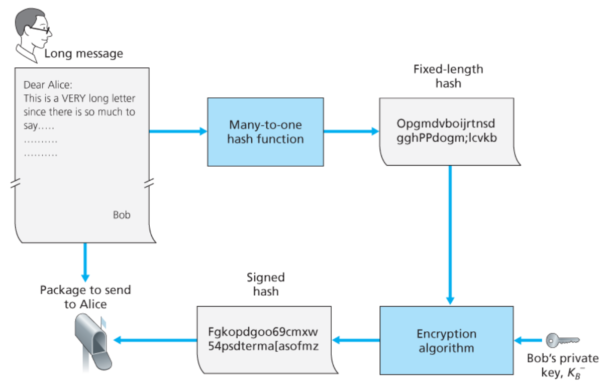
</div>
<div class="top">
<div class="p">Verifica nella ricezione</div>
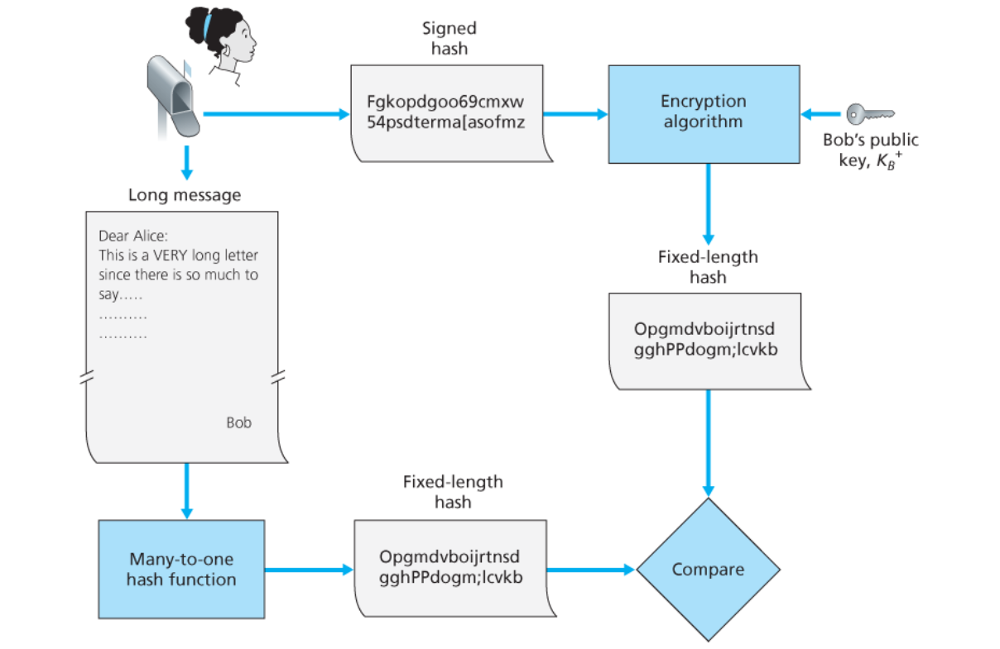
</div>
</div>

#### 2.2.3.1. Public Key Certification

L'approccio della firma digitale attraverso la **crittografia a chiave pubblica** funziona, ma ha un grosso problema sottostante: _"Come facciamo ad essere sicuri che la chiave pubblica di X sia davvero la chiave pubblica di X?"_

Si introduce quindi una **_certificazione della chiave pubblica_** che permette di verificare senza alcun dubbio che una data chiave appartenga ad una specifica entità.

<div class="grid2">
<div class="">

Questa certificazione è rilasciata da un entità terza, detta _Certification Authority_ che per fornire il certificato richiede una registrazione dell'entità che desidera verificare la propria chiave pubblica.

A quel punto la `CA` rilascerà un certificato firmato con la propria firma digitale che garantisce che $K^+$ è la chiave pubblica dell'entità.

La verifica che la firma digitale sia autentica si verifica attraverso la **_chiave pubblica della `CA`_**, che è **_assunta nota a tutti_**.
</div>
<div class="">
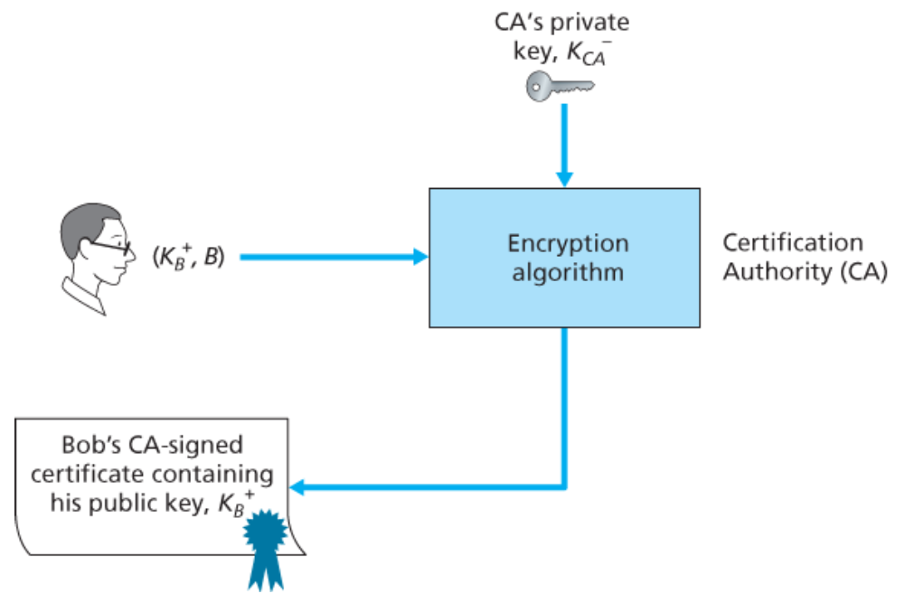
</div>
</div>

A questo punto quando un utente vuole avere la chiave pubblica di un entità può richiedere direttamente alla `CA` la chiave pubblica dell'entità.


## 2.3. Autenticazione

È il processo con il quale un entità prova la sua identità ad un altra entità.

Quando questo accade attraverso una rete non possiamo basarci sulle informazioni biometriche che invece utilizziamo quando incontriamo un'altra persona per strada, ma dobbiamo basarci sulle informazioni che un entità è in grado di fornirci per verificare la propria identità.

Non possiamo basarci su informazioni tendenzialmente note come nome, cognome, data di nascita, ...
Per avere la certezza che chi sta comunicando delle informazioni è necessario avere altre informazioni.

Un primo esempio è quello di una **password**, utilizzato nella posta elettronica per tanti anni, in quanto solo chi la crea ne è a conoscenza.

Il problema era che questo messaggio però viaggiava **_in chiaro_**, e quindi poteva essere tranquillamente _sniffato_ (intercettato) da terzi che poteva riutilizzarlo, nei già nominati _attacchi playback_.

Possiamo quindi pensare di **_cifrare la password_**, ma anche questa è _sniffabile_, infatti non ci interessa la password vera e propria, ma il suo _hash_.

La soluzione può quindi essere quella di utilizzare un `OTP` e la _cifratura a chiave pubblica_.

Quando ci si autentica ad un altra entità, questa risponde con un `OTP` $R$.
Successivamente dovremo reinviarlo cifrandolo con la nostra **_chiave privata_** $K^-(R)$ e inviando la nostra chiave pubblica $K^+$.
L'entità verificherà la chiave pubblica, e verificherà che $K^+(K^-(R)) = R$, e che quindi siamo chi diciamo di essere.

Anche questo metodo ha delle vulnerabilità, in particolare un utente terzo può infatti fare da _middlemen_ nella comunicazione fingendosi `B` con `A` e `A` con `B`.

# 3. Implementare la sicurezza

La sicurezza è un servizio che può essere inserito **in tutti i livelli del modello a strati di internet**.

Vediamo quindi alcuni modi per implementare la sicurezza.

## 3.1. Sicurezza a Livello Applicazione

Se abbiamo un applicazione _client_/_server_ che deve comunicare in maniera riservata, dobbiamo poter utilizzare una funzione come la `send` fornita dalla `socket API` che però implementa nativamente anche la sicurezza.

Queste funzioni si trovano nella libreria `pgp` (_Pretty-Good-Privacy_), disponibile pubblicamente su internet.
All'interno della libreria sono definite tutte una serie di funzioni che permettono di **_garantire la confidenzialità_**.

`pgp` implementa una tecnica di crittografia ibrida tra chiave simmetrica e chiave pubblica.

<div class="grid2">
<div class="">

Per garantire la confidenzialità si genera una chiave di sessione che cifra il messaggio. Successivamente, **_nello stesso pacchetto_**, si cifra la chiave di sesione attraverso la chive pubblica del destinatario.

Quando il destinatario riceverà il messaggio decifra la chiave di sessione con la propria chiave privata, e utilizza questa per decifrare il messaggio.

A questo punto i due, qualora continuassero a comunicare, possono direttamente utilizzare la chiave simmetrica.

</div>
<div class="">
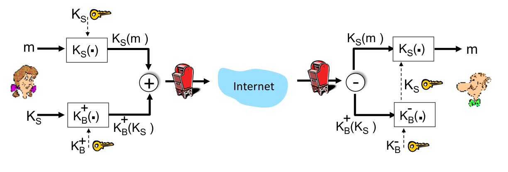
</div>
<div class="">

Per garantire invece l'integrità e l'autenticazione possiamo utilizzare la firma digitale.

Il mittente firmerà digitalmente il messaggio inviando un pacchetto contenente:
- l'_hash_ contenente il messaggio e cifrato con la propria chiave privata,
- il messaggio in chiaro

Il destinatario decifrerà il messaggio utilizzando la chiave pubblica del mittente e confronterà l'_hash_ decifrato con quello generato.
</div>
<div class="">
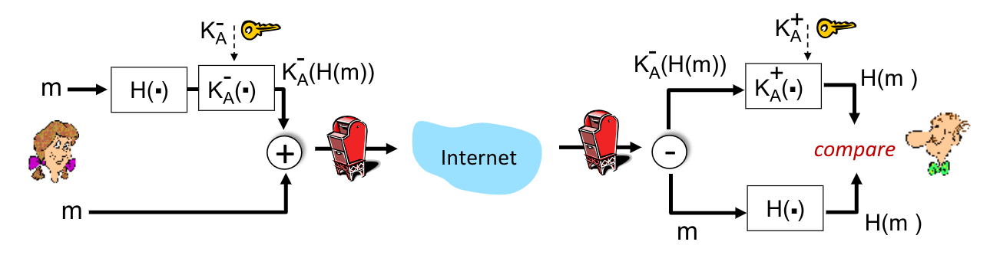
</div>
</div>

Per avere tutti i vantaggi è sufficiente fare i passaggi descritti prima per quanto riguarda l'integrità e l'autenticazione e poi garantendo la confidenzialità.

Questo metodo permette al programmatore di implementare i servizi richiesti solo se necessari.

Tuttavia uno svantaggio di questo approccio è il problema della portabilità.
Se infatti avessimo più applicazioni che hanno necessità delle stesse garanzie, il programmatore sarebbe costretto a riscrivere il codice ogni volta, o perlomeno, di raccogliere il codice in una libreria da dover ogni volta includere.

## 3.2. Sicurezza a livello trasporto - `TLS`

È un protocollo di sicurezza costruito tra il livello di trasporto `TCP` e il livello applicazione che fornisce:
- **Confidenzialità**: crittografia a _chiave simmetrica_
- **Integrità**: crittografia _tramite hash_
- **Autenticazione**: crittografia a _chiave pubblica_

Prima di `TLS` era utilizzato il protocollo `SSL` (_Secure Socket Layer_) che però è stato depreccato nel 2015.

È un protocollo di sicurezza supportato da quasi tutti i _browser_ e _web server_, ed è rappresentato dalle comunicazioni alla porta `443` tramite `https`.

## 3.3. Toy-TLS

Vediamo adesso una versione semplificata del protocollo `TLS`.

Sicuramente avremo questi passaggi:
- **handshake**: gli _host_ utilizzano i propri certificati e chiavi private per autenticarsi l'un l'altro e scambiarsi/creare una chiave simmetrica
- **key derivation**: gli _host_ utilizzano la chiave simmetrica per _recuperare altre chiavi_, come il _segreto_
- **data transfer**: si ha lo scambio di dati come uno _stream di record_ diviso in _record_
- **chiusura della connessione**: si inviano dei messaggi speciali per chiudere la connessione in maniera sicura

### 3.3.1. Handshake

<div class="grid2">
<div class="">

Dopo aver stabilito una connessione `TCP`, si inzia con l'_handshake_ del `TLS`.

Si invia innanzitutto il messaggio di hello, al quale l'altro risponde con il proprio certificato della chiave pubblica.

Dopo aver verificato il certificato si genera un **master secret** $MS$ e lo si cifra con la chiave pubblica dell'altro.

Quando il destinatario di questo messaggio lo riceverà lo decifrerà con la propria chiave privata.
</div>
<div class="">
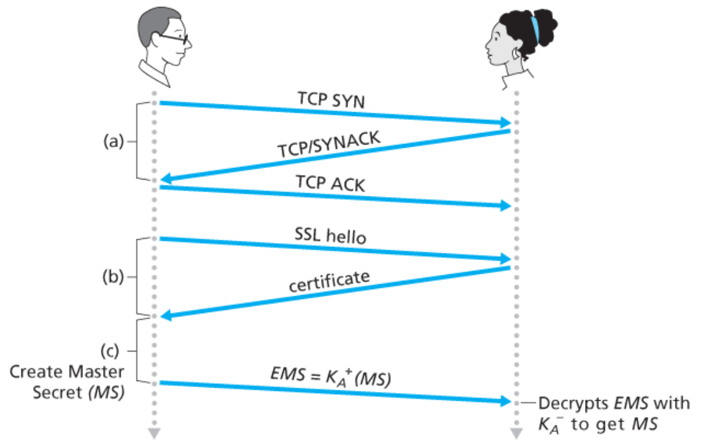
</div>
</div>

Quando entrambi avranno lo stesso $MS$ si generano quattro chiavi:
- $K_C$: chaive di cifraggio per i dati inviati dal client al server
- $M_C$: chiave MAC per i dati inviati dal client al server
- $K_S$: chaive di cifraggio per i dati inviati dal server al client
- $M_S$: chiave MAC per i dati inviati dal server al client

Queste chiavi vengono generati attraverso una funzione di derivazione di chiavi (`KDF`) che utilizza come _seed_ il $MS$ e altri dati per generare le chiavi.

Per cifrare i dati inviati all'interno di un flusso si divide il flusso in una serie di _record_ composti da:
- Lunghezza
- Dati
- chiave MAC

Ogni record viene quindi cifrato utilizzando la chiave simmetrica e solo dopo viene passato al layer `TCP`.

Questi record sono susciettibili a attacchi di _re-ordering_ da un eventuale _man-in-the-middle_ e a attacchi di _replay_.

Per proteggere questi record quello che si fa è:
- Generare il `MAC` anche a partire dal numero di sequenza del `TLS` per proteggere dal _re-ordering_
- Utilizzare un `nonce` (come la 2FA) per proteggere da attacchi di _replay_.

### 3.3.2. Chiusura

Per evitare attacchi di tipo _truncation_, nei quale un agressore crea un finto messsaggio di chiusura terminando la connessione tra gli host, si rende sicuro anche il messaggio di chiusura.

In particolare si inserisce nei vari record un nuovo campo **types** che è settato a `0` se il record scambia dati o `1` se è un record di chiusura.

In questo caso il `MAC` viene generato dall'unione di dati, tipo e numero di sequenza.

## 3.4. TLS

Il `TLS` fornisce un `API` che tutti possono utilizzare.

Il protocollo `QUIC` incorpora `TLS` su `UDP` e forma, insieme a una versione ridotta di `HTTP/2`, `HTTP3`.

Nel `TLS` si utilizzano diversi strumenti, raccolti in una _cipher suite_:
- Algoritmo di generazione chiavi (_key derivation function_ `KDF`).
- Algoritmo di cifratura a chiave pubblica
- Algoritmo di cifratura a chiave simmetrica
- Algoritmo di generazione del `MAC`

Di questi algoritmi ne esistono un infinità di implementazioni, ma è necessario che gli _host_ che partecipano alla comunicazione utilizzano **_gli stessi algoritmi_**.

Nell'ultima versione sono disponibili "solo" **_5 cipher suite_**, ma è comunque necessario sceglierne una.

Per far si che server e client concordino sulla _suite_ da utilizzare, il client inserisce nel messaggio di `hello`:
- le _suite_ che supporta
- un _nonce_, per garantire l'integrità del messaggio

Il server allora scelgierà tra le _suite_ proposte dal client (tipicamente il server le conosce tutte) rispondendo con il proprio certificato e il proprio nonce per garantire che questi messaggi di scambio, che ricordiamo essere mandati in chiaro, non siano stati manipolati.

## 3.5. 3.5 Sicurezza a livello Network - `IPsec`

Il protocollo `IP sec` permette di fornire cifrature a livello _datagram_ per garantire autenticazione, identità e confidenzialità sia per il traffico dell'utente che per il controllo del traffico.

Questo può essere implementato in due modi:
- **Transport Mode**: si cifra solamente il _payload_ del _datagram_, mantenendo l'_header_ in chiaro.
- **Tunnel Mode**: si cifra _l'intero datagramma_, e lo si incapsula in un nuovo datagramma con un nuovo _header IP_ che verrà _tunnelizzato_ alla destinazione.

Molte istituzioni spesso richiedono l'installazione di una rete privata per motivi di sicurezza, ma questa scelta è _molto costosa_, poiché richiede l'acquisto di router, link e la creazione di una infrastruttura `DNS` ad hoc.
In particolare, qualora l'organizzazione avesse più uffici distaccati, qeusta unica rete privata diventa quasi impossibile da realizzare.

<div class="grid2">
<div class="">

Attraverso le `VPN` si sviluppa questa rete privata attraverso comunicazioni attraverso internet.

Quando un datagramma esce dalla rete locale dell'_headquarters_ il _gateway router_ convertirà il datagramma `IPv4` in un datagramma `IPsec`, inoltrandolo su internet attraverso il _tunneling_.

Per chiunque intercetti il datagramma questo si presenta come un normale messaggio, quando in realtà il _payload_, se decifrato, rappresenta il reale datagram.

Quando questo messaggio arriverà ad al _gateway router_ del _branch office_ o all'_OS_ del dispositivo della _salesperson_, questi decifreranno il _payload_ e forniranno il payload decifrato al livello superiore.

</div>
<div class="">
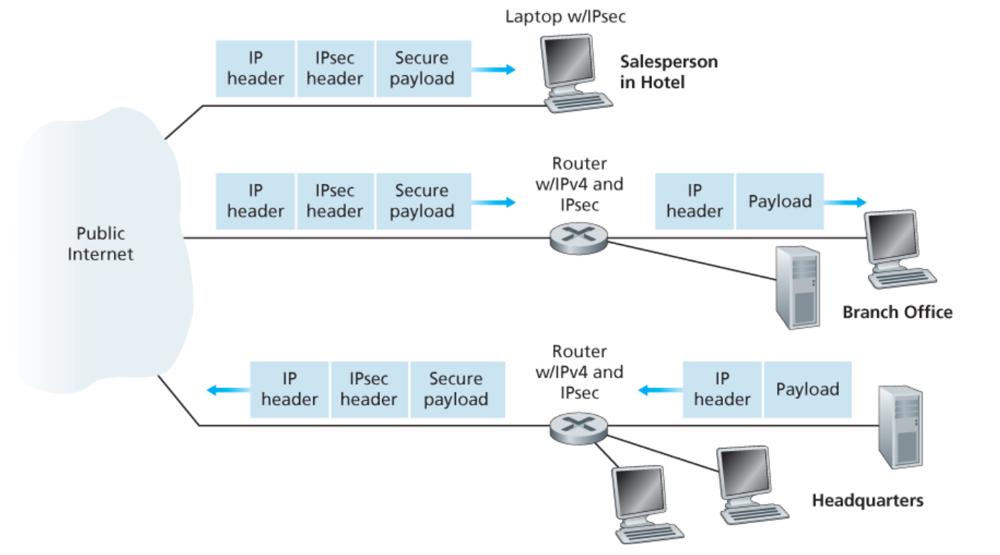
</div>
</div>

Esistono due principali protocolli che permettono l'`IPsec`:
- **Authentication Header Protocol** (`AH`): fornisce autenticazione della sorgente e integrità dei dati, ma non implementa la confidenzialità della comunicazione. È definito in `[RFC 4302]`
- **Encapsulation Security Protocol** (`ESP`): fornisce autenticazione del sorgente, integrità dei dati e confidenzialità della comunicazione sfruttando il _tunneling_. È definito in `[RFC 4303]`.

Tra i due quello più ampiamente utilizzato è `ESP`.

### 3.5.1. Encapsulation Security Protocol - `ESP`

<div class="grid2">
<div class="">

`IPsec` introduce la _**security association**_ (`SA`), ovvero una associazione per garantire i servizi di sicurezza tra due punti (tipicamente tra _gateway routers_) in modo unidirezionale.
Per ottenere una comunicazione bidirezionale si avranno due `SA`.

`IPsec` è quindi un protocollo _connection-oriented_, a differenza di `IP` che è _connectionless_.

</div>
<div class="">
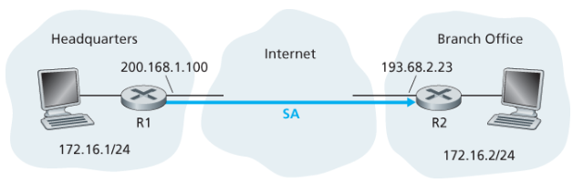
</div>
</div>

Per funzionare la `SA`, sia il router `R1` che il router `R2` devono mantenere alcune informazioni:
- **Security Parameter Index** (`SPI`): identificatore a `32bit` della `SA`
- Interfaccia di origine della `SA`
- Interfaccia di destinazione della `SA`
- Tipo di cifratura utilizzata
- Chiave di cifratura
- Tipo di check di integrità utilizzato
- Chiave di autenticazione

Queste informazioni sono utilizzate da `R1` per cifrare i messaggi uscenti e da `R2` per decifrarli.

<div class="grid2">
<div class="">

Quando si cifra un _datagram_ gli si appende per prima cosa un `ESP trailer`.

All'interno del _trailer_ si trovano tre campi:
- _padding_: sono dei bit di riempimento così da avere un messaggio che ha come dimensione un multiplo della lunghezza di un blocco.
- _padding length_: quanti byte di riempimento sono stati inseriti, così da poterli rimuovere correttamente quando il messaggio verrà decifrato
- _next header_: indica di che tipo sono i dati contenuti nel campo _payload_.

Questo datagram viene cifrato con la chiave specificata dalla `SA`.

A questo punto si appende in cima a questo datagramma cifrato un `ESP header` che contiene:
- `SPI`: per indicare quale `SA` si sta utilizzando
- _sequence number_: per evitare attacchi di _replay_. È inizializzato a 0 alla creazione di un nuovo `SA` e viene incrementato ad ogni datagramma inviato

L'unione tra `ESP header` e il datagram cifrato viene chiamato **_enchilada_**.

A partire dall'_enchilada_ viene generato un MAC di autenticazione utilizzando la chiave e l'algoritmo specificato nel `SA`.

A questo punto si appende il `MAC` alla fine dell'_enchilada_ formando il nuovo _payload_.

Alla fine si crea un nuovo header IP con i classici campi `IPv4` e si appende alla cima del messaggio, creando il nuovo messaggio.

</div>
<div class="">
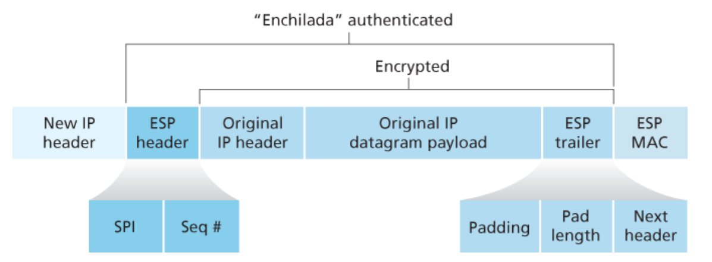
</div>
</div>

Il _datagram_ `IPsec` è visto dalla rete come un normalissimo _IP datagram_.
L'incapsulamento però modifica le informazioni di trasporto del datagramma. In particolare, mentre nell'_header_ del messaggio originale è presente l'indirizzo `IP` sorgente del router di uscita (ipotizzando un architettura `NAT`), l'indirizzo IP contenuto nell'_header_ del `IPsec datagram` sarà **_quello del tunneled gateway router_**, ovvero il router che si occupano di (de)incapsulare il datagramma.
Inoltre, per discriminare i datagrammi `IPsec` con protocollo `ESP` da quelli `TCP`, `UDP`, `SMTP` si inserisce il valore `50` all'interno del **_protocol number_**.

Le informazioni relative ad una `SA` sono conservate in entrambi gli _endpoint_, in particolare in due database:
- **_Security Policy Database_** (`SPD`): indica per un dato datagramma se è necessario utilizzare `IPsec` a partire da alcune informazioni del _datagram_ (indirizzi sorgente/destinatario, numero di protocollo, ...)
- **_Security Association Database_** (`SAD`): conserva lo stato delle `SA` e le relative informazioni su come processare un dato datagramma, sia in invio (_criptaggio_) che in arrivo (_decriptaggio_)

In parole povere `SAD` indica come inoltrare un pacchetto e `SPD` cosa fare per instradarlo correttamente.

## 3.6. Firewall e IDS

Un **_firewall_**:
> Isola la rete interna di un'organizzazione dal resto di internet, permettendo il passaggio solamente ad alcuni pacchetti bloccando gli altri

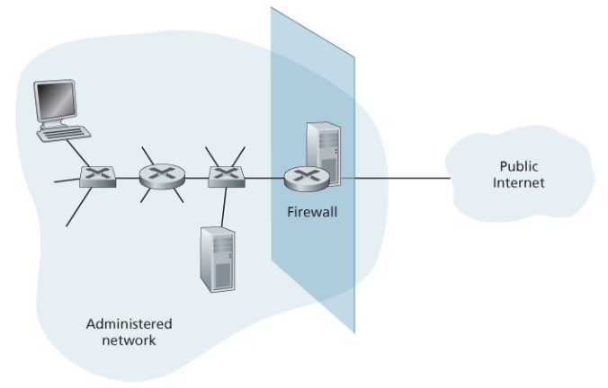

Attraverso il _firewall_ è possibile prevenire diversi tipologie di attacchi:
- **_Denial of Service_** (`DoS`): quando un aggressore stabilisce un numero elevato di finte connessioni `TCP` terminando le risorse del _server_. In questo modo non è più possibile stabilire vere connessioni
- **_Modifica/Accesso illegale a dati interni_**: è possibile reindirizzare gli aggressori verso pagine di enti di sicurezza o mostrare loro messaggi
- **_Bloccare accessi non autorizzati_**: è possibile permettere il passaggio solamente agli _host_ e agli utenti autenticati

Esistono tre tipi di _firewall_:
- **_Stateless Packet Filters_**
- **_Stateful Packet Filters_**
- **_Application Gateways_**

Nei primi due casi la rete interna è connessa a quella esterna attraverso il _router firewall_

### 3.6.1. Stateless Packet Filters

SI effettua un filtro **_sui singoli pacchetti_**, e si prende la decisione in base alle informazioni contenute in esso, come:
- Indirizzi sorgente e destinatario
- Sorgente `TCP`/`UDP`, porta di destinazione
- Tipo di messaggio
- Bit `TCP`,`SYN`, `ACK`

Ad esempio possiamo scegliere di bloccare tutti i datagrammi che hanno **_protocol number = 17_** (protocollo `UDP`) che hanno porta sorgente e/o destinataria `23`. In questo modo tutti i pacchetti `UDP` o le applicazioni `telnet` vengono **droppati** dal router.

Per impostare queste regole si utilizza una **_Access Control List_** `ACL`, che non è altro he una tabella di regole che vengono applicate con politica _top-to-bottom_ (si analizzano dalla prima a scendere e si applica la prima regola che corrisponde al pacchetto in questione).

Un esempio di `ACL` "pessimistica":

<div class="flexbox" markdown="1">

| Action  |   IP source    |    IP dest     | Protocol | Source Port | Dest Port | Flag bit |
| :-----: | :------------: | :------------: | :------: | :---------: | :-------: | :------: |
| `ALLOW` |  `222.22/16`   | `!(222.22/16)` |  `TCP`   |   `>1023`   |   `80`    |  `any`   |
| `ALLOW` | `!(222.22/16)` |  `222.22/16`   |  `TCP`   |    `80`     |  `>1023`  |  `ACK`   |
| `ALLOW` |  `222.22/16`   | `!(222.22/16)` |  `UDP`   |   `>1023`   |   `53`    |   ---    |
| `ALLOW` | `!(222.22/16)` |  `222.22/16`   |  `UDP`   |    `53`     |  `>1023`  |   ---    |
| `DENY`  |     `ALL`      |     `ALL`      |  `ALL`   |    `ALL`    |   `ALL`   |  `ALL`   |

</div>

In questo tipo di tabella tutti i pacchetti che non sono previsti dalle regole vengono rifiutati.

Un altro approccio più "ottimistico" è quello di ammettere tutti i pacchetti tranne quelli previsti dalle regole.

È uno strumento da utilizzare con cautela poiché permette l'accesso anche a pacchetti che "non hanno senso", come pacchetti con campi corretti (`dest port = 80`, `ACK = 1`) che però non appartengono ad alcuna connessione `TCP` attiva

### 3.6.2. Stateful Packet Filters

Questo tipo di firewall tiene traccia di **_tutte le connessioni TCP_**, tracciano di valori di `SYN` e `FIN` filtrando le informazioni attraverso un _timeout_.

Per fare ciò espande la propria `ACL`:

<div class="flexbox" markdown="1">

| Action  |   IP source    |    IP dest     | Protocol | Source Port | Dest Port | Flag bit | Check Connection |
| :-----: | :------------: | :------------: | :------: | :---------: | :-------: | :------: | :--------------: |
| `ALLOW` |  `222.22/16`   | `!(222.22/16)` |  `TCP`   |   `>1023`   |   `80`    |  `any`   |                  |
| `ALLOW` | `!(222.22/16)` |  `222.22/16`   |  `TCP`   |    `80`     |  `>1023`  |  `ACK`   |       `X`        |
| `ALLOW` |  `222.22/16`   | `!(222.22/16)` |  `UDP`   |   `>1023`   |   `53`    |   ---    |                  |
| `ALLOW` | `!(222.22/16)` |  `222.22/16`   |  `UDP`   |    `53`     |  `>1023`  |   ---    |       `X`        |
| `DENY`  |     `ALL`      |     `ALL`      |  `ALL`   |    `ALL`    |   `ALL`   |  `ALL`   |                  |

</div>

### 3.6.3. Application Gateways

Questo tipo di _firewall_ filtra i pacchetti a livello applicazione oltre che analizzando i campi `IP`/`TCP`/`UDP`.

Potremo infatti avere la necessità di garantire un certo tipo di servizi **solo ad alcuni utenti**.

Se ad esempio volessimo consentire le connessioni `SSH` solo ad un certo numero di utenti, possiamo installare un _application gateway_.
Quando un utente proverà a stabilire una connessione `SSH`, questa verrà rediretta sull'_application gateway_ che esaminerà se l'utente può o meno effettuare questa azione.
Se l'utente ne ha la facoltà, **_sarà il gateway ad aprire la connessione con l'esterno_** agendo da _middleman_.

### 3.6.4. Limiti di firewall e gateway

I _firewall_ e i _gateway_ non sono perfetti e non controllano tutti i parametri.

Un esempio immediato è il fatto che il filtraggio dei pacchetti **considera solo gli header dei singoli pacchetti**, senza controllare i _payload_ né le correlazioni tra di essi.

Per poter implementare questo tipo di sicurezza esistono dei **_Sistemi di Rilevamento delle Intrusioni_** (_Intrusion Detection System_ - `IDS`).
Questi dispositivi effettuano un **ispezione profonda dei pacchetti**, controllando il contenuto ed esaminando le correlazioni tra pacchetti multipli, riuscendo a prevedere _port scanning_, _network mapping_ e _DoS attack_.

Putroppo possono soffrire di allucinazioni, ma è l'unico modo per poter riuscire ad avere delle sicurezza.

A differenza delle operazini del _firewall_ queste operazioni sono **_molto pesanti e introducono un importante overhead_**.

<div class="grid2">
<div class="">

Quello che si fa quindi è **avere un firewall** che filtra i pacchetti.
Successivamente si collega il _router firewall_ ad un _application gateway_ attraverso un _router_ che è anche connesso alla **Zona Demilitarizzata**.

Nella _zona demilitarizzata_ si trovano tutte quelle risorse che **necessitano di comunicare con il mondo esterno**, e per le quali non ha senso stabilire delle regole stringenti (posta elettronica, DNS, ...)

</div>
<div class="">
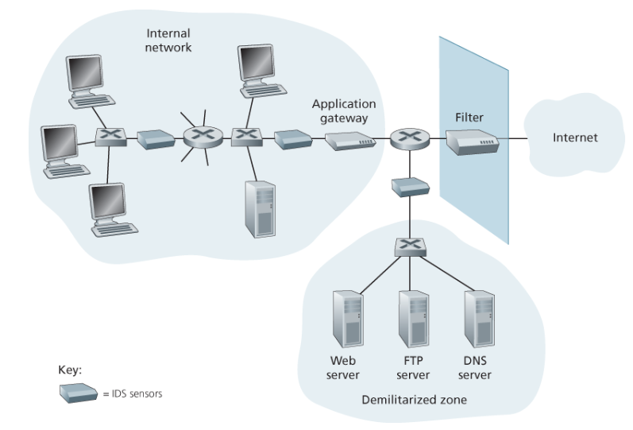
</div>
</div>
