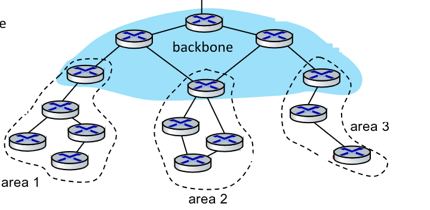
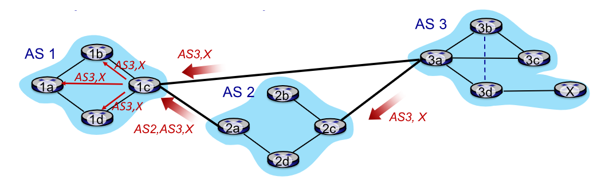

# 1. Indice

- [1. Indice](#1-indice)
- [2. Funzionalità del Network Layer](#2-funzionalità-del-network-layer)
	- [2.1. Control Plane](#21-control-plane)
- [3. Protocolli di Routing](#3-protocolli-di-routing)
	- [3.1. Algoritmi di routing link-state - Dikkstra](#31-algoritmi-di-routing-link-state---dikkstra)
	- [3.2. Algoritmi di Distance Vector](#32-algoritmi-di-distance-vector)
	- [3.3. Confronto Link-State e Distance-Vector](#33-confronto-link-state-e-distance-vector)
- [4. Routing Scalabile](#4-routing-scalabile)
	- [4.1. Intra-AS routing](#41-intra-as-routing)
	- [4.2. Inter-AS routing - `BGP`](#42-inter-as-routing---bgp)
	- [4.3. Intra-AS vs. Inter-AS](#43-intra-as-vs-inter-as)

# 2. Funzionalità del Network Layer

Il _network layer_ fornisce due funzionalità:
- **Forwarding**: dirige i pacchetti dall'ingresso del router all'uscita appropriata. Opera nel _data plane_
- **Routing**: determina la rotta dei pacchetti dalla sorgente alla destinazione. Opera nel _control plane_

Nel tragitto di un datagramma, il ruolo dei _data plane_ di ciascun _router_ intermedio è quello di **inoltrare il datagrama dal link d'ingresso a quello di uscita** mentre quelle del _control plane_ è quello di **coordinare le tante azioni di inoltro locali in modo che i datagrammi vengano instradati su percorsi di router tra mittente e destinatario**.

## 2.1. Control Plane

Esistono due approcci per strutturare il _control plane_ di una rete:
- **Per-router control**: è il metodo tradizionale
- **Logically centralized Control**: è alla base del _Software Defined Networking_ (`SDN`). Non la copriamo in questo corso

Nel caso del _per-router control_ le componenti dezi singoli algoritmi di routing in ciascun router **interagiscono nel _control plane_**.
Infatti le _tabelle di routing_ sono frutto di un confronto continuo tra le altre _tabelle di routing_ degli altri _router_.

# 3. Protocolli di Routing

L'obiettivo dei protocolli di routing è:
> Determinare le rotte dall'host mittente all'host destinatario attraverso i router di rete.

Le _rotte_ sono dei _percorsi buoni_, dove:
- **Percorso**: sequenza di router che i pacchetti devono attraversare dalla sorgente alla destinazione
- **Buono**: metrica relativa che può indicare diversi aspetti, il _meno costoso_, il _più veloce_, il _meno congestionato_, ...

Il _routing_ rappresenta una delle 10 sfide principali in ambito networking.

Per rappresentare una rete utilizziamo i **_grafi_** con la seguente notazione:
$$
G = (N, E) \longrightarrow
\begin{cases}
	\begin{align*}
		N &: \text{insieme di routers (nodi)} = \{u, v, w, x, y, z\} \\[0.5em]
		E &: \text{insieme di links (archi)} = \{(u,v), (u, x), (v, x), (v, w), ...\}
	\end{align*}
\end{cases}
$$

Ogni link diretto da $a \to b$ ha associato un costo, per semplicità ipotizzato simmetrico, $c_{a,b} = c_{b,a}$.
Se non esiste un link $x \to y$ allora assumiamo che $c_{x,y} = \infty$

Il costo è **_definito dall'operatore di rete_**: può essere $1$ (metriche per minimizzare il numero di _hop_), inversamente proporzionale alla banda (minimizzare la banda), inversamente proporzionale alla congestione (evitare la congestione), ...
La metrica utilizzata da sistemi _low-power_ è quella che si basa sull'affidabilità dei _link_, ovvero al numero di ritrasmissioni medie richieste per ogni _link_.

Gli algoritmi di _routing_ si dividono in quattro categorie principali, a seconda di come rispondano domande
- Quanto veloce cambiano le rotte
- Se utilizza informazioni globali o è centralizzato

I protocolli di _routing_ che si basano su **_informazioni centralizzate_** sono gli **_algoritmi link state_**:
> Tutti i router hanno conoscenza _globale_ della topologia della rete, e conoscono il costo di ciascun link

Quelli che invece si basano su **_informazioni globali_** sono gli **_algoritmi distance vector_**
> Ogni router conosce solo il costo diretto con i  router direttamente collegati.
> Attraverso un processo iterativo di calcolo e scambio di informazioni con i vicini riesce a ottenere una conoscenza globale della rete


Per quanto riguarda gli algoritmi che cambiano velocemente le rotte abbiamo gli **_algoritmi dinamici_**:
> Algoritmi che cambiano velocemente le rotte attraverso aggiornamenti periodici o in risposta a cambiamenti del costo del link


L'altro tipo di algoritmi sono gli **_algoritmi statici_** che invece cambiano le rotte lentamente

## 3.1. Algoritmi di routing link-state - Dikkstra

È un algoritmo **_centralizzato_**, dove tutti i nodi sono a conoscenza della topologia della rete, attraverso l'invio di messaggi _link-state broadcast_, attraverso i quali tutti i nodi ricevono le stesse informazioni.

L'algoritmo calcola il percorso dal costo minimo da un nodo sorgente a tutti gli altri, fornendo quindi la _forwarding table_ per quel nodo.

È un algoritmo iterativo, dopo $k$ iterazioni si conoscono i $k$ percorsi a costo minimo per $k$ destinazioni diverse.

La notazione che utilizzeremo è la seguente:
- $c_{x,y}$: costo diretto $x \to y$. Se non sono vicini diretti allora $c_{x, y} = \infty$
- $D(v)$: stima _corrente_ del costo del percorso dal costo minimo dalla sorgente alla destinazione $v$
- $p(v)$: nodo predecessore lungo il percorso dalla sorgente a $v$
- $N'$: indieme di nodi il cui percorso dal costo minimo è noto **definitivamente**

Un esempio di algoritmo può essere il seguente:
```pseudo
start:
N' = {u}
for all nodes v
	if v adjacent to u
		then D(v) = c_{u,v}
	else D(v) = \infty

Loop:
	find w not in N' such as D(w) is minimum
	add w in N'
	update D(v) for all v adjacent to w and v not in N':
		D(v) = \min{(D(v), D(w) + c_{w,v})}

until all nodes in N'
```

Questo algoritmo deve essere eseguito **_da tutti i router_**.

Ipotizzando una rete con $n$ router, ognuna delle $n$ iterazioni deve passare per tutti i nodi $w$ non in $N'$.

Questo comporta l'effettuare $\frac{n(n+1)}{2}$ confronti, ovvero una complessità $O(n^2)$.

Se utilizziamo l'implementazione più efficiente, utilizzando lo _heap_, abbiamo comunque una complessità $O(n\log{n})$.

Inoltre dobbiamo anche prendere in considerazione che ogni router manda il _broadcast_ le sue informazioni _link state_ agli altri $n-1$ router.
Algoritmi di boradcasr efficienti permettono di diffondere un messaggio con $O(n)$ attraversamenti di _link_.
Il messaggio di ciascun router attraversa quindi $O(n)$ link, per una complessità complessiva di tutti i messaggi di $O(n^2)$.


Inoltre, se i costi dei link dipendono dal volume del traffico, è un algoritmo che soffre delle **_oscillazione delle rotte_**, dove ad ogni cambio del costo di un singolo link è necessario **_ricalcolare tutte le tabelle_**.

## 3.2. Algoritmi di Distance Vector

Quasti algoritmi si basano sull'_**equazione di Bellmam-Ford**_ $BF$:
$$
D_x(y): \text{costo del least-cost path } x \to y \\
\Downarrow \\
D_x(y) = \min_v{c_{x,v} + D_v(y)} \quad \wedge \quad c_{x,v} \ne \infty
$$

L'idea dell'algoritmo è quella di far inviare a ciascun nodo, occasionalmente, la propria stima del vettore delle distanze $D_v$ ai vicini.

Quando un nodo $x$ riceve nuove stime per il $D_v$ per qualsiasi vicino, aggiorna anch'egli il proprio $D_v$ usando l'equazione $BF$:
$$
	D_x(y) = \min_v{c_{x,v} + D_v(y)} \quad \forally \in N
$$

In codizioni normali la stima $D_x(y) \to d_x(y)$, ovvero all'**_effettivo least cost_**.

Uno pseudocodice:
```pseudo
wait(cambio costo link locale o messaggio da vicino)
	D'_v stime di D_v usando i nuovi valori

	if D'_v != D_v
		D_v = D'_v
		then notifica i propri vicini
```

Questo algoritmo **iterativo** è _asincrono_, infatti ogni iterazione locale è causata da cambi locali dei link vicini.

Ha un carico minore, poiché distribuito, ed è anche **self-stopping** poiché ogni nodo notifica i vicini solo quando il suo $D_v$ cambia.

I cambi di costi nei link possono avere due effetti diversi, a seconda che il costo di un link diminuisca o aumenti.
Nel caso si abbia un **miglioramento** nel costo di un link, viene subito rilevato, aggiornando opportunamente il proprio $D_v$ e ritrasmettendolo ai vicini.

I vicini ricevono l'aggiornamento modificando il proprio $D_v$ calcolando il nuovo percorso a costo minimo e comunicando ai loro vicini i $D_v$.

Quando $y$ riceverà gli aggiornamenti dai propri vicini, il suo costo minimo non varierà e $y$ non invierà altri messaggi.

In questo modo con soli 3 comunicazioni i nodi hanno ricevuto tutte le informazioni.

Se invece si avesse un **peggioramento** il primo nodo $y$ rileva un cambiamento, ma sa che uno dei nodi vicini $z$ ha un costo minore del cambiamento. Questo costo inferiore però potrebbe passare proprio dal _link_ che adesso è peggiorato.
Notifica quindi il peggioramento inviando il valore del proprio vicino più il costo per arrivare dal vicino.
A questo punto però il vicino $z$ aggiornerà il percorso per arrivare alla destinazione, consco del fatto che il vecchio miglior percorso adesso è peggiorato di $c_{y,z}$ e ritrasmetterà questo valore. E così via finché non otterremo il valore desiderato.

Per risolvere questo problema, chiamato **_count-to-infinity_**, si utilizza la tecnica dell' **_inversione avvelenata_**.

Quando un nodo $z$ instrada verso $x$ passando da $y$, notificherà $y$ che la sua distanza verso $x$ è **_infinita_**, così da evitare problemi relativi alle modifiche dei link di $y$.
In questo modo $y$ pensa che $z$ non abbia un percorso verso $x$, e non creerà il ciclo di scambio tra i nodi adiacenti.

Questa tecnica funziona però solamente per risolvere cicli che si formano tra nodi adiacenti.

## 3.3. Confronto Link-State e Distance-Vector

<div class="flexbox" markdown="1">

|                                                                       |                                                   LS                                                    |                                                                                DV                                                                                |
| :-------------------------------------------------------------------: | :-----------------------------------------------------------------------------------------------------: | :--------------------------------------------------------------------------------------------------------------------------------------------------------------: |
|                       Complessità dei messaggi                        |                                  $n$ router, $O(n^2)$ messaggi inviati                                  |                                                     Scambi tra vicini, con un tempo di convergenza variabile                                                     |
|                        Velocità di convergenza                        |                Algoritmo $O(n^2)$, $O(n^2)$ messaggi. <br> Susciettibile a oscillazioni                 |            Tempo di convergenza variabile per via di _cicli_ o per il problema del _count-to-infinity_ se non è predisposta l'_inversione avvelenata_            |
| Robustezza <br><small>(rottura e/o compromissione dei router)</small> | I router possono comunicare costi di _link_ errati. <br> Ogni router costruisce solo la propria tabella | È possibile comunicare costi di _percorsi non corretti_ (_black-holing_). Se ogni $D_v$ di ogni router è usato anche dagli altri, l'errore si propaga nella rete |

</div>

# 4. Routing Scalabile

Fin'ora abbiamom fatto una trattazione sul routing puraemntepuramente teorico, dove tutti i _router_ sono uguali e la rete è "piatta".

Nella realtà invece abbiamo **miliardi di destinazioni**, non possiamo quindi salvare tutti gli indirizzi nelle tabelle di _routing_, poiché, oltre a necessitare un ingente disponibilità di memoria, il loro scambio  ingolferebbe i collegamenti.

DObbiamo quindi pensare ad alcuni approcci di scalabilità che permettano comunque un **autonomia amministrativa** all'interno delle singole reti.

L'approccio generale aggrega i router in regioni chiamate **_Autonomus Systems_** (`AS`), detti anche **_domains_**.

Si parlerà quindi di:
- **Routing intra-AS**: per il routing all'interno di un `AS`, dove tutti i router devono eseguire lo stesso protocollo di _routing_. Tra `AS` diversi possiamo avere protocolli di routing intra-domain diversi. È presente un **_gateway-router_** che permette la comunicazione tra `AS` diversi
- **Routing inter-AS**: È il protocollo seguito dai _gateway_ per il _routing inter-domain_


Per `AS` interconnessi, la tabella di inoltro è configurata dagli algoritmi di routing:
- _intra-AS_: determina le entrate per le destinazioni **dentro l'AS**
- _inter-AS_ e _intra-AS_: determina le entrate per le destinazioni **esterne all'AS**

Il sito [bgp.he.net](https://bgp.he.net) permette di recuperare informazioni sugli `AS`

## 4.1. Intra-AS routing

Supponiamo di avere un _router_ in `AS1` che riceve un _datagram_ con destinazione esterna a `AS1`, il _routing inter-domain_ deve fare due cose:
1. Capire quali sono le destinazioni che si possono raggiungere attraverso gli `AS` adiacenti
2. Propagare queste informazioni di raggiungibilità per tutti i router in `AS1`.

I protocolli di routing intra-AS più comuni sono:
- **Routing Information Protocol** (`RIP`): descritto in `[RFC 1723]` utilizza il classico _distance vector_ scambiandoli ogni 30 secondi
- **Enhanced Interior Gateway Routing Protocol** (`EIGRP`): è anch'esso basato sui `DV` ed è stato proprietario di `Cisco` per decenni fino al 2013 quando diventò _open_ `[RFC 7868]`
- **Open Shortest Path First** (`OSPF`): descritto in `RFC 2328`, è un _link-state routing_. Non è standard `RFC` ma è lo standard `ISO`, identico a `IS-IS protocol`.

Il protocollo `OSPF`  si basa sul _link-state classico_, ogni router invia a tutti degli `OSPF link-state advertisements` **direttamente su IP** a tutti gli altri router nell'`AS`, conoscendo la topologia e calcolando la _tabella di forwarding_ attraverso l'algoritmo di _Dikstra_.
Il costo di un link si basa su diverse metriche (_bandwidth_, _delay_, ...).
I messaggi `OSPF` sono **autenticati**.

Il protocollo può essere **gerarchico**:
<div class="grid2">
<div class="">

Nell'esempio sulla destra possiamo vedere la **_gerarchia a due livelli_**:
- **Local Area**
- **Backbone**

I _link-state advertisements_ sono inviati **solamente nella backbone**.

Il _gateway router_ si è in "cima" alla **backbone**.
I **backbone router** eseguono `OPFS` nella **backbone**.

In particolare gli **Area border routers** hanno le distanze per le destinazioni nella loro stessa area (_local routers_), comunicandole alla backbone.

I **local routers** inviano `LS` soo nella propria area, calcolando il proprio routing e inoltrando pacchetti all'esetrno attraverso il _border router_.

</div>
<div class="">

</div>
</div>


## 4.2. Inter-AS routing - `BGP`

Il protocollo standard per i protocolli di routing _inter-domain_ è il **_Border Gateway Protocol_** `BGP`.

Consente ad una sottorete di pubblicizzare la sua esistenza al resto di Internet.
Il protocollo fornisce quindi ad ogni `AS` un mezzo per:
- Ottenere informazioni sulla raggiungibilità delle reti di destinazioni di `AS` vicini, attraverso l'_external BGP_ (`eBGP`)
- Determinare le rotte per altre reti basandosi su informazioni di raggiungibilità e _policy_
- Propagare informazioni di raggiungibilità a tutti i router nell'`AS`, attraverso l'_internal BGP_ (`iBGP`)
- Pubblicizzare alle reti vicine le informaizoni di raggiungibilità delle destinazioni

In una `BGP session` due router `BGP` si scambiano messaggi `BGP` su **connessioni `TCP` semi-permanenti**, con i quali pubblicizzano i _path_ verso diverse sottoreti di destinazione che sono in grado di raggiungere.

I massaggi `BGP` (descritti in `[RFC 4371]`) pricipali sono:
- `OPEN`: apre una connessione `TCP` con il _peer_ `BGP` remoto e autentica il _perr_ `BGP` mittente
- `UPDATE`: pubblicizza un nuovo path o ne rimuove un nuovo vecchio
- `KEEPALIVE`: tiene la connessione viva in assenza di `UPDATES`, è utilizzato anche come `ACK` alla `OPEN` _reqeust_.
- `NOTIFICATION`: riporta errori precedenti. È utilizzato anche per chiudere le connessioni.

Per pubblicizzare una rotta si costruisce un messaggio che segue il formato:
- **Prefisso Sottorete**: destinazione pubblicizzata
- **Attributi**: due attributi importanti sono:
  - `AS-PATH`: lista degli `AS` per i quali è passata la pubblicizzazione del prefisso
  - `NEXT-HOP`: indica l'indirizzo di un'interfaccia del _gateway router_ in un `AS` per andare a quello adiacente in un altro `AS`.

Nel **routing basato su policy** il gateway che riceve la pubblicazione di una rotta utilizza `import policy` per accettare o declinare la rotta. Inoltre, utilizza la _policy_ anche per deterinare se e quando pubblicizzare un percorso agli `AS` vicini.

<figure class="75">

<figcaption>

Il router `1c` di `AS1` riceve tramite `eBGP` entrambe le rotte, ma basandosi su una _policy_ decide di pubblicizzare via `iBGP` il percorso `AS3, X`.
</figcaption>
</figure>

Nell'immagine sopra i router di `AS1` conoscono tramite `iBGP` il percorso per `X` che passa da `1c`.
Per il router `1d` andrànno inseriti i record `<1c, 1>`, attraverso _routing `OSPF` intra-domain_ e `<X, 1>` (ipotizzando che l'interfaccia 1 sia quella che lo collega corretta).

Un _local router_, quando deve scegliere un _gateway_ per inoltrare verso l'esterno un pacchetto sceglie quello che ha **_costo intra-domain minore_**, indipendentemente dal numero di `AS` che questo poi attraverserà, in un processo chiamato **_Hot Potato Routing_**.

`BGP` permette inoltre di soddisfare le _policy_ con pubblicazione.
Infatti un `ISP` potrebbe volere inoltrare il traffico solo da/verso le reti dei suoi _client_.

I router possono quindi conoscere più di una rotta per `AS` di destinazione, applicando le regole in ordine:
- _Policy_: preferenze locali date dai valori di alcuni attributi
- Shortest`AS-PATH`
- _Hot Potato Routing_ scelta del `NEXT-HOP` router più vicin
- Altro

## 4.3. Intra-AS vs. Inter-AS

I due protocolli sono diversi per i seguenti motivi:

<div class="flexbox" markdown="1">

|             |                                                            Inter-AS                                                             |               Inter-AS               |
| :---------: | :-----------------------------------------------------------------------------------------------------------------------------: | :----------------------------------: |
|  _Policy_   | Gli amministratori voglino il controllo su come il traffico viene instradato e su chi può instradare attraverso la propria rete |   Si ha un amministratore singolo    |
| Prestazioni |                                         La _policy_ è più importante delle prestazioni                                          | Si può concentrare sulle prestazioni |

</div>


Inoltre il _routing gerarchico_ riduce la dimensione delle tabelle, riducendo gli update da mandare.

