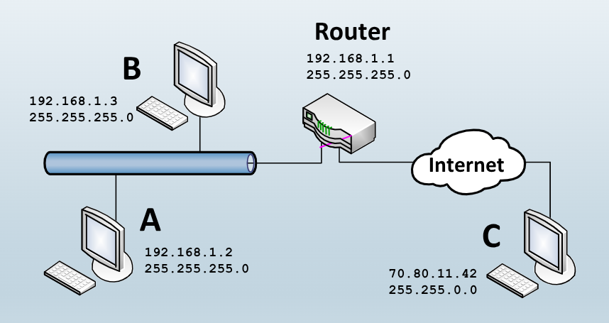
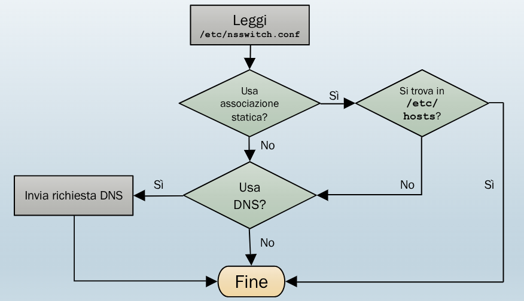
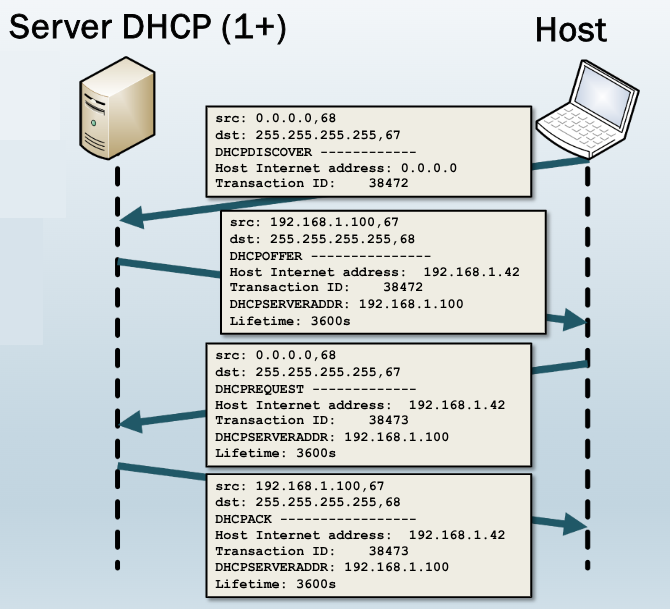
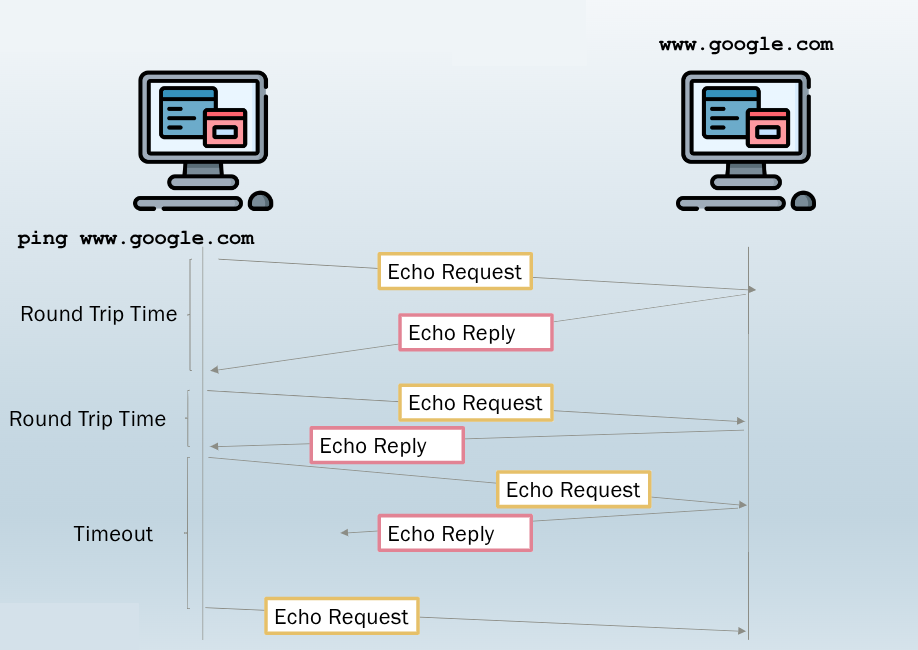

# 1. Indice

- [1. Indice](#1-indice)
- [2. Indirizzi IP](#2-indirizzi-ip)
- [3. Configuraizione interfaccia di `rete`](#3-configuraizione-interfaccia-di-rete)
	- [3.1. Netplan](#31-netplan)
- [4. Default Gateway](#4-default-gateway)
- [5. DNS](#5-dns)
- [6. DHCP](#6-dhcp)
- [7. Test di Connettività](#7-test-di-connettività)
	- [7.1. Ping](#71-ping)
	- [7.2. Traceroute](#72-traceroute)
	- [7.3. Analisi dei pacchetti](#73-analisi-dei-pacchetti)


# 2. Indirizzi IP

Si dice **rete locale** una rete composta esclusivamente di end-point e di _switch_. Le comunicazioni su rete locale sono composte quindi solamente di informazioni relative ai primi due livelli di comunicazione, non permettendo l'accesso dall'esterno.

Per poter comunicare all'esterno si utilizza un _router_ che permette l'accesso ad internet, poiché analizza le informaizoni di livello 3.

Per poter comunicare un dato dispositivo necessità di 4 informazioni:
- Indirizzo `IP`
- Maschera di rete
- Indirizzo `IP` del gateway (per comunicazioni all'esterno)
- Indirizzo `IP` del server `DNS` per la traduzione dell'url in un indirizzo `IP` di end-point

Ogni scheda di rete di un computer è identificata all'interno della rete tramite un **indirizzo IP**, una sequenza di `32bit` (`IPv4`) o `128bit` (`IPv6`).

Gli indirizzi `IPv4` sono rappresentati in 4 numeri decimali in notazione decimale puntata/ :

$$
\underbrace{\text{11000000}.\text{10101000}.\text{00010101}.\text{10000010}}_{192.168.21.130}
$$

Un indirizzo IP è a sua volta definito in due parti:
- La parte iniziale indica la rete
- La parte finale indica l'host

Per poter dividere queste informazionisi utilizza la **_maschera di rete_**. Qeusta maschera è una sequenza di `32bit` che ha:
- Nella prima parte tanti `1 bit` quanti sono i bit da dedicare alla rete
- Nella parte finale tanti `0 bit` quanti sono quelli necessari epr indirizzare tutti gli host.

Nella maschera `255.255.240.0` $\to$ `11111111.11111111.11110000.00000000` abbiamo $2^{12}-2$ host possibili. Il $-3$ è dovuto a due indirizzi dedicati:
- `0`: dedicato all'indirizzo di rete
- tipicamente `1`: dedicato all'indirizzo di gateway
- `255`: dedicato alle comunicazioni in _broadcast_

Per ricavare l'indirizzo di rete dato un `IP` e una `mask` si effettua l'operazione di `and`.

Possiamo vedere di seguito un esempio:



# 3. Configuraizione interfaccia di `rete`

La connessione che sarà emulatada _virtualbox_ è una connessione cablata (_ethernet_).

Per vedere lo stato delle impostazioni di rete nel computer, in sistemi `ubuntu` si utilizza il comando:
```bash
ip
```
> Usage: ip [ OPTIONS ] OBJECT { COMMAND | help }
>        ip [ -force ] -batch filename
> where  OBJECT := { address | addrlabel | fou | help | ila | ioam | l2tp | link |
>                    macsec | maddress | monitor | mptcp | mroute | mrule |
>                    neighbor | neighbour | netconf | netns | nexthop | ntable |
>                    ntbl | route | rule | sr | stats | tap | tcpmetrics |
>                    token | tunnel | tuntap | vrf | xfrm }
>        OPTIONS := { -V[ersion] | -s[tatistics] | -d[etails] | -r[esolve] |
>                     -h[uman-readable] | -iec | -j[son] | -p[retty] |
>                     -f[amily] { inet | inet6 | mpls | bridge | link } |
>                     -4 | -6 | -M | -B | -0 |
>                     -l[oops] { maximum-addr-flush-attempts } | -echo | -br[ief] |
>                     -o[neline] | -t[imestamp] | -ts[hort] | -b[atch] [filename] |
>                     -rc[vbuf] [size] | -n[etns] name | -N[umeric] | -a[ll] |
>                     -c[olor]}


Per vedere le interfacce si utilizza il comando:
```bash
ip addr show # ip a s
```
Che stampa questo:

<div class="grid2">
<div class="">

La prima è l'"interfaccia" di _loopback_.

Nel caso della prima riga abbiamo che:
- `lo`: interfaccia di _loopback_
- `LOOPBACK`: utilizzata per comunicare con se stessi
  - `UP`: abilitata a livello software
  - `LOWER UP`: ha un collegamento hardware funzionante
- `mtu` (_maximum transission unit_): massima quantità di byte per singolo pacchetto trasmissibili
- `qdisc noqueue` (_Queueing Discipline_): come gestisce l'accodamento dei pacchetti. Non ha coda (i pacchetti in questo caso non escono fisicamente)
- `state UNKNOWN`: lo stato fisico non si applica, poiché non è una vera scheda
- `group default`: indica il gruppo al quale possono far parte delle interfaccie. Questa interfaccia fa parte del gruppo standard,
- `qlen 1000`: numero massimo di pacchetti che vengono tenuti in coda

Nelle altre righe abbiamo:
- Gli indirizzi indirizzabili (in questo caso nulli perché è un interfaccia interna)
- Indirizzo `MAC` (in questo caso fittizio)
- `inet`: indirizzo IPv4 di questo
- `scope host lo`: valido sol ointerno al PC
- `valid_lft forever preferredlft forever`: validità delgi indirizzi `IP` associati all'interfaccia

Se invece prendiamo la seconda interfaccia:
- `enpp0s3`: nome dell'interfaccia
- `BROADCAST, MULTICAST`: supporta _broadcust_ e _multicast_
- `mtu 1500`: dimensione massima dei pacchetti in cavo _Ethernet_
- `qdisc fq_codel`: disciplina specifica che fa si che, in caso di congestione, i pacchetti accodati più vecchi vengano scartati
- `state UP`: scheda abilitata
- `link/ether 08:00:27:4c:e2:d9 brd ff:ff:ff:ff:ff:ff`: indirizzo fisico (`MAC`) della scheda di rete, e indirizzo broadcast
</div>
<div class="">


```log
1: lo: <LOOPBACK,UP,LOWER_UP> mtu 65536 qdisc noqueue state UNKNOWN group default qlen 1000
    link/loopback 00:00:00:00:00:00 brd 00:00:00:00:00:00
    inet 127.0.0.1/8 scope host lo
       valid_lft forever preferred_lft forever
    inet6 ::1/128 scope host noprefixroute
       valid_lft forever preferred_lft forever
2: enp0s3: <BROADCAST,MULTICAST,UP,LOWER_UP> mtu 1500 qdisc fq_codel state UP group default qlen 1000
    link/ether 08:00:27:4c:e2:d9 brd ff:ff:ff:ff:ff:ff
    inet 10.0.2.15/24 brd 10.0.2.255 scope global dynamic noprefixroute enp0s3
       valid_lft 86327sec preferred_lft 86327sec
    inet6 fd17:625c:f037:2:b9da:2e71:4d42:d0f2/64 scope global temporary dynamic
       valid_lft 86328sec preferred_lft 14328sec
    inet6 fd17:625c:f037:2:a00:27ff:fe4c:e2d9/64 scope global dynamic mngtmpaddr
       valid_lft 86328sec preferred_lft 14328sec
    inet6 fe80::a00:27ff:fe4c:e2d9/64 scope link
       valid_lft forever preferred_lft forever
```
</div>
</div>

L'indirizzo `IP` di una rete più essere settato staticamente o configurato dinamicamente tramite `DHCP`.

Il campo `inet 10.0.2.15/24 brd 10.0.2.255 scope global dynamic noprefixroute enp0s3` specifica queste informazioni:
- `inet`: indirizzo IP e maschera in forma compatta
- `brd`: indirizzo di broadcast
- `scope global`: l'indirizzo è **valido su internet**
- `dynamic`: indirizzo assegnato da `DHCP` automaticamente. Poteva essere anche valere:
  - `secondary`: indirizzo aggiunto ad un’interfaccia che ne ha già uno primario
  - `deprecated`: l’indirizzo non deve più essere usato per nuove connessioni, ma resta valido per quelle già attive (legato a `preferred_lft scaduto`).
  - `temporary (IPv6)`: indirizzo generato per motivi di privacy, cambia periodicamente per non
tracciare il device.
  - `tentative (IPv6)`: indirizzo in fase di verifica (Duplicate Address Detection, DAD).
  - `permanent`: indirizzo configurato staticamente e non soggetto a scadenza
- `noprefixroute`: non è stata creata la rotta automatica per la rete

Per configurare le interfacce si utilizza il comando `ip`.
In realtà queste modifiche sono **_temporanee_**, e non sopravvivono al _reboot_ della macchina.
Ecco alcuni comandi
```bash
# Per abilitare/disabilitare un'interfaccia si utilizza il comando:
sudo ip link set <interface_name> up/down

# Per aggiungere un indirizzo IP ad un interfaccia
sudp ip addr add 10.0.3.17/24 brd 10.0.3.255 dev <interface_name>

# Per rimuovere un indirizzo IP a un'interfaccia
sudp ip addr del 10.0.3.17/24 brd 10.0.3.255 dev <interface_name>

# Per rimuovere TUTTI gli indirizzi IP di un'interfaccia
sudp ip addr flush  dev <interface_name>
```

In `Ubuntu` la configurazione di rete è gestita da due tool:
- `Netplan`
- `Network Manager` (o `systemmd-networkd` per distribuzioni server o configurazioni di rete meno dinamiche)

## 3.1. Netplan

Fornisce un interfaccia di configurazione per le interfacce basata su `YAML` (_Yet Another Markup Language_). `YAML` è un linguaggio di programmazione spesso impiegato per definire file di configurazione, avendo un formato leggibile sia dalle macchine che dagli esseri umani.

Genera file di configurazione di rete nel formato comprensibile dal "rendering" di rete sottostante.

Nella cartella `/etc/netplan` si trovano i file di configurazione `.yaml`. Se non sono necessarie configurazioni di rete particolari, di default si trova `01-network-manager-all.yaml` che contiene la semplice configurazione di rete, che delega tutto al `NetworkManager`.
Le configurazioni hanno un prefisso numerico che rappresenta la priorità rispetto alle modifiche.

È presente anche un file `50-cloud-init.yaml` è un tool usate per automatizzare la configurazione di rete al bootstrap.
In questo file viene specificato al NetworkManager che l'interfaccia di rete `enp0sX` verrà configurata automaticamente dal `DHCP`.

Per vedere la configurazione complessiva di netplan è possibile utilizzare il comando:
```bash
sudo netplan get
```
Che concatena opportunamente tutti i file di configurazione a seconda della priorità

Per vedere invece lo stato di tutte le periferiche del dispositivo con netplan si utilizza:
```bash
sudo netplan status --all
```

Se volessimo aggiungere un indirizzo `IP` ad un'interfaccia dobbiamo creare un nuovo file all'interno di `/etc/netplan` che abbia un nome alfabeticamente maggiore dell'ultimo presente.

Ad esempio potremmo aggiungere `51-enp0s3-interface.yaml`:0
```yml
network:
   version: 2
   ethernets:
      enp0s3:
         addresses: [192.168.10.2/24]
```

I file di configurazione dovrebbero avere permessi esclusivi solo ai super utenti, perciò può essere necessario utilizzare il comando:
```bash
sudo chmod 600 51-enp0s3-interface.yaml
```
s

Per applicare la configurazione, verificando eventuali errori possiamo applicare la configuraizone:
```bash
sudo netplan try  # attende 120 secondi, se non viene premuto enter annulla l'operazione
```

Per applicare direttamente la configurazione si utilizza:
```bash
sudo netplan apply
```

Aggiungere un indirizzo `IP` ad un interfaccia può essere utile in alcuni casi:
- **Gestione di più reti**: in caso di maccchine che comunica con reti distinte, con più indirizzi `IP` è possibile per un singolo dispositivo essere visibile e accessibile da diverse reti
- **Host Virtuali**: in ambienti web capita spesso che più siti web siano hostati sullo stesso server fisico. In questo modo gli si permette di accedere ai vari siti web da indirizzi `IP` dedicati
- **NAT**: può essere utile configurare più indirizzi IP su una singola interfaccia per eseguire operazione di traduzione degli indirizzi di rete (`NAT`), dove un singolo server o dispositivo può rispondere a più reti
- **Ridondanza e bilanciamento del carico**: più indirizzi `IP` possono essere utili per configurare meccanismi di bilanciamento del carico, cosicché se un indirizzo `IP` fosse irraggiungibile, il traffico può essere reindirizzato automaticamente ad un altro disponibile
- **Isolamento logico di servizi**: quando un server esegue più servizi, può essere utile assegnarvi indirizzi IP distinti per configurare _firewall_ diffeerenziati.
- **Migrazione**: può essere utile per assegnare un nuovo indirizzo IP ad un servizio in esecuzione su un server esistente.
- **Segmentazione delle Reti**: può facilitare la segmentazione logica delle reti. Si può utilizzare per isolare diverse applicazioni o ambienti senza richiedere _hardware_ aggiuntivo.

Per disabilitare l'assegnazione di indirizzi di un interfaccia, ad esempio epr evitare che un'interfaccia ottenga un indirizzo, si aggiunge `activation-mode: manual` nella configurazione dell'interfaccia:
```yaml
network:
   version: 2
   ethernets:
      enp0s3:
         activation-mode: manual
```

In questo modo avremo che l'interfaccia avrà `state UP` ma non avrà assegnati alcun indirizzo `IP` assegnato al boot.

Per disattivarlo fino al prossimo riavvio si utilizza:
```bash
sudo ip link set enp0s3 down
```


La configurazione delle interfacce può avvenire anche senza `Netplan`. Per farlo su sistemi ubuntu si:
- Rimuovono tutti i file di configuraizone `/etc/netplan`
- Si installa il pacchetto `ifupdown` che permette di configurare le interfacce con le informazioni in `/etc/network/interfaces`

La configurazione si fa quindi:
- `ifup <interface_name>`: abilita l'interfaccia con la configurazione in `/etc/network/interfaces`
- `ifdown <interface_name>`: disabilita l'interfaccia
- `ifup -a`: abilita tutte le interfacce specificate nella sezione auto del file di configurazione nello stesso ordine

Le informazioni che abbiam oappena configurato vengono utilizzato in questo modo quando un _host_ invia un pacchetto ad un altro _host_:
```snippets
dest_subnet = my_netmask & dest_addr

if (dest_subnet == mys_subnet)
   then deliver-to-dest_addr
else
   forward-to-default_router
```

Nel caso di host che si trovano sulla stessa rete, il pacchetto viene inoltrato **direttamente all'host di destinazione** tramite comunicazione di livello _data-link_ 2 attraverso _switch_ o _access point_.

# 4. Default Gateway

Il router verso cui l'host invia i pacchetti destinati a reti non locali si chiama **default gateway**.

Quello principale **_deve essere unico_**, altrimenti potremmo avere:
- Routing ambiguo: il _kernel_ non sa quale uscita usare quando trova più regole di default
- Asimmetria del traffico: pacchetti in uscita da uno potrebbero rientrare dall'altro
- Connettività intermittente

Sui sistemi `Unix` per visualizzare la tabella di _routing_ si utilizza il comando:
```bash
ip route show
```
> default via 192.168.69.1 dev eth0 proto dhcp src 192.168.69.4 metric 100
> 192.168.69.0/24 dev eth proto kernel scope link src 192.168.69.4

Per aggiungere delle rotte:
```bash
# Invio diretto nella rete locale
ip route add 192.168.1.0/24 dev eth0      # tutto il traffico passerà attraverso eth0

# Default Gateway
ip route add default via 192.168.1.1
```

Per scoprire la rotta usata per un indirizzo `IP` specifico:
```bash
ip route get 70.143.3.67
```

Per informazioni sul comando `ip route` è possibile consultare `man ip-route`.

Per configurare il default gateway possiamo farlo con **Netplan**:
```yaml
routes:
   to: default
   via: 192.168.1.1
```

O con `ifupdown`:
```bash
auto lo

iface lo inet loopback

iface eth0 inet static
   address 192.168.1.2
   netmask 255.255.255.0
   broadcast 192.168.1.255
   gateway 192.168.1.1
```

# 5. DNS

Semplifica l'utilizzo quotidiano della rete, associando un nome ad un indirizzo `IP`:
   - `131.114.73.85` $=$ `unipi.it` $\ne$ `www.unipi.it`

L'host deve ricavare l'indirizzo `IP` a partire dal nome. Per fare ciò il sistema prima cerca l'informazione statica nel file `/etc/hosts`:
```log
127.0.0.1         localhost
127.0.1.1         studenti
131.114.73.85     unipi.it
```

Se non trova corrispondenze all'interno del file utilizza il `DNS`, un database distribuito formato da una gerarchia di `DNS server`, che operano a livello applicazione per permettere l'interrogazione del database attravero il protocollo `UDP` nella porta `53`.

Il _client_ effettua una richiesta a un server `DNS` che risponde con l'indirizzo `IP` se è di tipo **authorative** per quell'indirizzo, altrimenti inoltra la domanda ad un sevrer "più grande".

Il file `/etc/resolv.conf` contiene gli indirizzi `IP` dei server `DNS` che l'host può contattare. All'interno della `VM`:
```log
nameserver 127.0.0.53
options edns0 trust-ad
search sca.unipi.it
```

Per effettuare delle richieste manualmente è possibile utilizzare il comando:
```bash
nslookup nome_dominio
```

Nei sistemi `Unix` è presente anche un meccanismo di **Name Service Switch** `NSS` che permette di ricavare i nomi di "cose" da diverse fonti, nel nostro caso i nomi di _host_.

Le fondi da usare e l'ordine con cui usarle sono salvate nel file `/etc/nsswitch.conf`:
```log
...
hosts:      files mdns4_minimal [NOTFOUND=return] dns
```


Per configurare DNS speifici sull'interfaccia di rete con Netplan si aggiunge al file di configurazione:
```yaml
network:
   version: 2
   ethernets:
      enp0s3:
         addresses: [10.10.10.2/24]
         nameservers:
            search:
               - "mycompany.local"        # serve per completare le ricerche nelle reti locale
            addresses:
               - 10.10.10.253
               - 8.8.8.8         # dns di google
```

Lo schema per la risoluzione dei nomi è quindi questo:




VirtualBox emula l'hardware di un calcolatore, compresa la _scheda di rete ethernet_.
Al fine di connettere la macchina virtuale ad internet viene emulata anche un'infrastruttura di rete


# 6. DHCP

Il _Dynamic Host Configuration Protocol_ consente la configurazione automatica e dinamica dei parametri `TCP/IP` degli host. Assegna alle connessioni `UDP` la porta `67`.

All'interno della rete è configurato un server `DHCP` che permette di fornire i parametri di configurazione ai client che si connettono alla rete.
I parametri sono:
- Indirizzo `IP`: scelto da un pool di indirizzi disponibili
- Maschera di rete
- Indirizzo del gateway
- Indirizzo del server `DNS`

Le informazioni del server `DHCP` non sono permanenti, ma hanno una scadenza. In questo modo gli indirizzi `IP` bloccati da client che si sono disconessi possono essere riutilizzati.

<div class="grid2">
<div class="">

Il processo di _leasing IP_ avvviene secondo dei passaggi detti **DORA**:
- _Discover_
- _Offer_
- _Request_
- _Acknowledge_


</div>
<div class="">

</div>
</div>

Esistono diversi tipi di software per server `DHCP`, quello che utilizzeremo noi si chiama **_Kea DHCP_**, orientato ad ambienti di rete moderni.

È possibile scaricarlo con il comando `sudo apt install kea`, e i file di configurazione si trovano in `/etc/kea/kea-dhcp4.conf`. Le modifiche a questo file entrano in atto solo quando viene riavviato il servizio:
```bash
systemctl restart kea-dhcp4-server.service
```

Per consultare lo stato del server e controllare eventuali errori si utilizzano i comandi:
```bash
systemctl status kea-dhcp4-server.service
sudo journalctl -u kea-dhcp4-server -b
```

Analizziamo il contenuto di `/etc/kea/kea-dhcp4.conf`:
<div class="grid2">
<div class="">

```json
"Dhcp4": {
	// Add names of your network interfaces to listen on.
	"interfaces-config": {
        // See section 8.2.4 for more details. You probably want to add just
        // interface name (e.g. "eth0" or specific IPv4 address on that
        // interface name (e.g. "eth0/192.0.2.1").
        "interfaces": [ ]

        // Kea DHCPv4 server by default listens using raw sockets. This ensures
        // all packets, including those sent by directly connected clients
        // that don't have IPv4 address yet, are received. However, if your
        // traffic is always relayed, it is often better to use regular
        // UDP sockets. If you want to do that, uncomment this line:
        // "dhcp-socket-type": "udp"
    },

    // Kea supports control channel, which is a way to receive management
    // commands while the server is running. This is a Unix domain socket that
    // receives commands formatted in JSON, e.g. config-set (which sets new
    // configuration), config-reload (which tells Kea to reload its
    // configuration from file), statistic-get (to retrieve statistics) and many
    // more. For detailed description, see Sections 8.8, 16 and 15.
    "control-socket": {
        "socket-type": "unix",
        "socket-name": "/run/kea/kea4-ctrl-socket"
    },
    // .....
```
</div>
<div class="">

La sezione `interfaces-config` è configura su quali interfacce di rete il server DHCP ascolta, secificando le interfacce nella sezione `inferfaces`:
- `["eth0"]`: ascolta su `eth0`
- `["eth0/192.168.10.1"]`: per vincolare all'`IP`
- `["*"]`: per tutte le interfacce (sconsigliato se si hanno molte interfacce)

La sezione `control-socket` abilitai l canale di controllo locale per inviare comandi a runtime senza dover riavviare il _daemon_.
</div>
<div class="">

```json
   	// ...
   	// Use Memfile lease database backend to store leases in a CSV file.
   	// Depending on how Kea was compiled, it may also support SQL databases
   	// (MySQL and/or PostgreSQL). Those database backends require more
   	// parameters, like name, host and possibly user and password.
   	// There are dedicated examples for each backend. See Section 7.2.2 "Lease
   	// Storage" for details.
   	"lease-database": {
   	    // Memfile is the simplest and easiest backend to use. It's an in-memory
   	    // C++ database that stores its state in CSV file.
   	    "type": "memfile",
   	    "lfc-interval": 3600
   	},
   	// Kea allows storing host reservations in a database. If your network is
   	// small or you have few reservations, it's probably easier to keep them
   	// in the configuration file. If your network is large, it's usually better
   	// to use database for it. To enable it, uncomment the following:
   	// "hosts-database": {
   	//     "type": "mysql",
   	//     "name": "kea",
   	//     "user": "kea",
   	//     "password": "kea",
   	//     "host": "localhost",
   	//     "port": 3306
   	// },
   	// See Section 7.2.3 "Hosts storage" for details.
   	// Setup reclamation of the expired leases and leases affinity.
   	// Expired leases will be reclaimed every 10 seconds. Every 25
   	// seconds reclaimed leases, which have expired more than 3600
   	// seconds ago, will be removed. The limits for leases reclamation
   	// are 100 leases or 250 ms for a single cycle. A warning message
   	// will be logged if there are still expired leases in the
   	// database after 5 consecutive reclamation cycles.
   	// If both "flush-reclaimed-timer-wait-time" and "hold-reclaimed-time" are
   	// not 0, when the client sends a release message the lease is expired
   	// instead of being deleted from the lease storage.
   	"expired-leases-processing": {
       	"reclaim-timer-wait-time": 10,
       	"flush-reclaimed-timer-wait-time": 25,
       	"hold-reclaimed-time": 3600,
       	"max-reclaim-leases": 100,
       	"max-reclaim-time": 250,
       	"unwarned-reclaim-cycles": 5,
   	},
   // ...
```

</div>
<div class="">

`lease-database` specifica come e dove il server salva gli assegnamenti degli indirizzi `IP`. La voce `memfile` imposta il salvataggio sul file `/var/liv/kea` e l'`lfc-interval` è l'intervallo per la compattazione periodica dei file di _lease_.

È eventualmente possibile configurare anche un database.

La sezione `expired-leases-processing` invece gestisce il comportamento dei _lease_:
- `reclaim-timer-wait-time`: indica ogni quanto individuare i _lease_ scaduti
- `flush-reclaimed-timer-wait-time`: indica ogni quanto rimuovere dal blocco i _lease_ scaduti dal file
- `hold-reclaimed-time`: indica quanto tempo tenere scaduti i _lease_ prima di eliminarli
- `max-reclaim-leases`: imposta il numero massimo di _lease_ da processare
- `max-reclaim-time`: indica il massimo tempo utilizzabile per processare i _lease_
- `unwarned-reclaim-cycles`: indica dopo quanti cicli in cui restano tanti _lease_ scaduti loggare un _warning_
</div>
<div class="">

```json
	// Global timers specified here apply to all subnets, unless there are
	// subnet specific values defined in particular subnets.
	"renew-timer": 900,
	"rebind-timer": 1800,
	"valid-lifetime": 3600,

	// ...
	"option-data": [
		// When specifying options, you typically need to specify
		// one of (name or code) and data. The full option specification
		// covers name, code, space, csv-format and data.
		// space defaults to "dhcp4" which is usually correct, unless you
		// use encapsulate options. csv-format defaults to "true", so
		// this is also correct, unless you want to specify the whole
		// option value as long hex string. For example, to specify
		// domain-name-servers you could do this:
		// {
		//     "name": "domain-name-servers",
		//     "code": 6,
		//     "csv-format": "true",
		//     "space": "dhcp4",
		//     "data": "192.0.2.1, 192.0.2.2"
		// }
		// but it's a lot of writing, so it's easier to do this instead:
		{
			"name": "domain-name-servers",
			"data": "192.0.2.1, 192.0.2.2"
		},

		// Typically people prefer to refer to options by their names, so they
		// don't need to remember the code names. However, some people like
		// to use numerical values. For example, option "domain-name" uses
		// option code 15, so you can reference to it either by
		// "name": "domain-name" or "code": 15.
		{
			"code": 15,
			"data": "example.org"
		},

		// ...
	],
```
</div>
<div class="">

In questa sezione troviamo subito dei timer che vengono notificati dal server al client:
- `renew-timer`: indica il tmepo dopo il quale il _client_ deve rinnovare il lease con il server che glielo ha fornito
- `rebind-timer`: indica il tempo dopo il quale il _client_ deve, nel caso non sia ancora riuscito a rinnovare il _lease_, ritentare in broadcast verso qualunque server
- `valid-lifetime`: indica la durata del _lease_ in secondi

Successivamente troviamo delle opzioni globali organizzate secondo la gerarchia `globale < class < subnet < host`, dove un livello più specifico sovrascrive quello più generico.

Le opzioni sono diverse qui ne vediamo solo alcune.

</div>
<div class="">

```json
   "client-classes": [
        {
            // This specifies a name of this class. It's useful if you need to
            // reference this class.
            "name": "voip",

            // This is a test. It is an expression that is being evaluated on
            // each incoming packet. It is supposed to evaluate to either
            // true or false. If it's true, the packet is added to specified
            // class. See Section 12 for a list of available expressions. There
            // are several dozens. Section 8.2.14 for more details for DHCPv4
            // classification and Section 9.2.19 for DHCPv6.
            "test": "substring(option[60].hex,0,6) == 'Aastra'",

            // If a client belongs to this class, you can define extra behavior.
            // For example, certain fields in DHCPv4 packet will be set to
            // certain values.
            "next-server": "192.0.2.254",
            "server-hostname": "hal9000",
            "boot-file-name": "/dev/null"

            // You can also define option values here if you want devices from
            // this class to receive special options.
        }
    ],
```
</div>
<div class="">

Qui troviamo le già nominate `classi` che osno utilizzate per applicare opzioni  comportamenti.
Si riferisono solamente a gruppi di client che soddisfano una condizione, **_valutata su ogni pacchetto_**.

</div>
<div class="">

```json
   	// Below an example of a simple IPv4 subnet declaration. Uncomment to enable
   	// it. This is a list, denoted with [ ], of structures, each denoted with
   	// { }. Each structure describes a single subnet and may have several
   	// parameters. One of those parameters is "pools" that is also a list of
   	// structures.
	"subnet4": [
    	{
			// This defines the whole subnet. Kea will use this information to
			// determine where the clients are connected. This is the whole
			// subnet in your network.

			// Subnet identifier should be unique for each subnet.
			"id": 1,

			// This is mandatory parameter for each subnet.
			"subnet": "192.0.2.0/24",

			// Pools define the actual part of your subnet that is governed
			// by Kea. Technically this is optional parameter, but it's
			// almost always needed for DHCP to do its job. If you omit it,
			// clients won't be able to get addresses, unless there are
			// host reservations defined for them.
			"pools": [ { "pool": "192.0.2.1 - 192.0.2.200" } ],

			// These are options that are subnet specific. In most cases,
			// you need to define at least routers option, as without this
			// option your clients will not be able to reach their default
			// gateway and will not have Internet connectivity.
			"option-data": [
				{
					// For each IPv4 subnet you most likely need to specify at
					// least one router.
					"name": "routers",
					"data": "192.0.2.1"
				}
			],

			//...
    	}
   ],
```
</div>
<div class="">

Troviamo quindi le assegnazioni di indirizzi per le sottoreti (_subnet_).
Qui troviamo alcune opzioni specifiche, come il `default gateway`, indicato nella sotto-sezione `option-data` con il `name: "routers"`.

Se questo non fosse impostato, verrà fornito ai _client_ un indirizzo `IP`, ma non gli verrebbe indicato dove instradare il traffico esterno.

</div>
</div>

In fondo al file troviamo le impostazioni relative alla generazione di log che omettiamo perché non fondamentali per i nostri scopi.


La configurazione del _client_ con `dhcp` avviene nei suoi file di configurazione:
```yml
network:
	ethernets:
		enp0s1:
			dhcp4: true		# Questa è la voce importante
# ...
```

# 7. Test di Connettività

Il protocllo della suite `IP` definito per lo scambio di messaggi di controllo ,errore e diagnostica è l'`ICMP` (_Internet Control Message Protocol_). Questi messaggi non trasportano dati applicativi, ma serve per il rilevamento dei malfunzionamenti **senza correggere alcun errore**.

<div class="grid2">
<div class="">

Un pacchetto `ICMP` è incapsulato in un pacchetto `IP` e contiene:
- `Type`: `8bit` identifica la categoria. I principali tipi sono:
  - `0`: echo reply
  - `3`: Destination network(`code:0`)/host (`code:1`) unreachable
  - `8`: echo request
  - `11`: Time to Live expired
  - `30`: Traceroute
- `Code`: `8bit`, dettaglia specifico del tipo
- `Checksum`: controllo di integrità
- `Data`: variabili secondo il tipo
</div>
<div class="">

</div>
</div>


I messaggi informativi sono usati per diagnosi e controllo:
- `Echo Request` / `Echo Reply` sono utilizzati da `ping`
- `Router Advertisement`/`Router Sollicitation` per l'autoconfigurazioen di rete. È più utilizzato in `ICMPv6`

I messaggi i errore invece sono usati per segnalare problemi di consegna o instradamento:
- `Destination Unreachble (Type 3)`
  - `Code 0` network
  - `Code 1` host
  - `Code 3` port
- `TTL Exceeded (Type 11)`: usato quando il campo `TTL` di un pacchetto scade. È fondamentale per il comando `traceroute`

## 7.1. Ping

Serve a testare la connettività tra l'host e un altro host remoto
```bash

ping www.google.com
ping 192.168.3.34
```

Il comando invia più messaggi `ICMP` di tipo `Echo Request` e attende messaggi di tipo `Echo Reply`.

<figure class="">

<figcaption>

La terza richiesta viene persa per congestione della rete.
L'host locale attende un _timeout_ e successivamente lo segnala come perso.
</figcaption>
</figure>

Il `ping` su `A` invia a `B` una serie di pacchetti `Echo Reqeust` (circa uno al secondo). Quando `B` riceve il pacchetto invia un `Echo Reply` a `A`. Il comando effettua un calcolo della percentiale dei pacchetti ricevuti e del `RTT` (_Round-Trip-Time_), mostrando le statistiche al termine del comando, ovvero quando l'utnete lo interrompe `Ctrl+C`.

Alcuni possibili errori sono:
- `Network Unreachable`: l'host locale non ha _route_ valide per raggiungere l'_host_ remoto
- `100% packet loss`: l'_host_ locale non ha ricevuto nessun pacchetto di risposta
- `Unknwon host`: non è stato possibile risolvere il nome dell'_host_ specificato

Il comando ha una serie di opzioni consultabili da `man ping`, alcuni sono:
- `-c`: specifica il numero di richieste
- `-i`: specifica l'intervallo tra le richieste
- `-s`: specifica la dimensione del payload del pacchetto `ICMP`
- `-f`: invia pacchetti `ICMP` _il più velocemente possiibile_ (utilizzare con cautela)
- `-W`: specifica il _timeout_ dei pacchetti
- `-t`: specifica il valore del _TTL_
- `-q`: entra in _quiet mode_, mostrando solamente le statistiche finali

Il comando ha dei limiti, in quanto può essere ploccato da servizi per prevenire _ping flood_ e `DoS`. Inoltre il comando misura **solo la raggiungibilità a livello `IP`** e non quella del servizio applicativo.

Inoltre non distingue tra congestione di rete, filtri o host realmente spenti.

Possiamo notare come:
```bash
ping unipi.it			# Funziona
ping www.unipi.it		# Non funziona perché le richieste sono filtrate
```

## 7.2. Traceroute

Consente di conoscere il percorso che un pacchetto `IP` effettua per raggiungere un'host destinatario.

Per testarlo sulla macchina virtuale è necessario cambiare le impostazioni di rete di _VirtualBox_ impostando l'interfaccia connesssa a `NAT` ma impostandola come **scheda con bridge**.

Il comando si basa sul fatto che ogni pacchetto `IP` ha un campo `TTL` che i router decrementano di `1`. Quando questo campo scende a `0` il router scarta il pacchetto e invia al mittente un messaggio `ICMP TTL Exceeded`. `traceroute` invia alla destinazione pacchetti `UDP` _sonda_ con il campo `TTL` crescente.

Ci rendiamo conto che la destinazione è stata raggiunta perché viene assegnata per ogni sonda un numero di porta **_alto_**, che sarà quasi sicuramente chiusa. L'_host_ finale, non avendo processi in ascolto su quelal porta, risponde con `ICMP Destination Unreachable, code Port Unreachable`, segnalando che abbiamo raggiunto la destinazione.

Quando eseguiamo il comando può succedere che quanche _sonda_ non generi una risposta entro il _timeout_. Questo viene indicato tramite asterisco `*`.

Possiamo provare ad utilizzare sonde di tipo diverse:
```bash
traceroute -I www.google.com		# Utilizza ICMP Echo

traceroute -T -p 443 www.google.com	# Utilizza TCP SYN
```
Vediamo le differenze:

<div class="grid2">
<div class="top">

Il primo genera questo output:
```log
traceroute to www.google.com (216.58.204.132), 30 hops max, 60 byte packets
 1  _gateway (192.168.96.1)  1.145 ms  1.364 ms  1.545 ms
 2  131.114.30.65 (131.114.30.65)  2.358 ms  2.355 ms  2.533 ms
 3  jspg-jser.unipi.it (131.114.191.89)  2.529 ms  2.524 ms *
 4  ru-unipi-rl1-pi01.pi01.garr.net (193.206.136.89)  3.707 ms * *
 5  rl1-pi01-rs1-to01.to01.garr.net (185.191.181.37)  13.119 ms * *
 6  rs1-to01-rs1-mi02.mi02.garr.net (185.191.181.119)  28.374 ms * *
 7  rs1-mi02-re1-mi02.mi02.garr.net (185.191.180.157)  26.900 ms * *
 8  142.250.164.230 (142.250.164.230)  37.046 ms * *
 9  192.178.99.215 (192.178.99.215)  355.167 ms  287.462 ms  287.436 ms
10  108.170.233.97 (108.170.233.97)  287.429 ms  10.045 ms  10.018 ms
11  par21s05-in-f4.1e100.net (216.58.204.132)  11.893 ms  12.023 ms  12.004 ms
```
</div>
<div class="top">

Mentre il comando `traceroute www.google.com` i messaggi vengono filtrati:
```log
traceroute to www.google.com (216.58.204.132), 30 hops max, 60 byte packets
 1  _gateway (192.168.96.1)  3.879 ms  3.841 ms  4.577 ms
 2  131.114.30.65 (131.114.30.65)  4.560 ms  4.546 ms  4.533 ms
 3  jspg-jser.unipi.it (131.114.191.89)  4.521 ms  4.508 ms  4.542 ms
 4  ru-unipi-rl1-pi01.pi01.garr.net (193.206.136.89)  4.482 ms  4.470 ms  4.503 ms
 5  rl1-pi01-rs1-pi01.pi01.garr.net (185.191.181.38)  4.490 ms  4.423 ms  4.410 ms
 6  rs1-to01-rs1-mi02.mi02.garr.net (185.191.181.119)  9.156 ms  10.677 ms rs1-pi01-rs1-rm02.rm02.garr.net (185.191.181.35)  9.426 ms
 7  rs1-rm02-re1-mi02.mi02.garr.net (185.191.181.69)  14.990 ms rs1-mi02-re1-mi02.mi02.garr.net (185.191.180.157)  13.773 ms  13.753 ms
 8  142.250.174.46 (142.250.174.46)  13.739 ms  13.728 ms 142.250.164.230 (142.250.164.230)  13.390 ms
 9  * 192.178.99.215 (192.178.99.215)  13.679 ms *
10  108.170.233.57 (108.170.233.57)  177.412 ms  177.394 ms  177.377 ms
11  192.178.104.106 (192.178.104.106)  177.360 ms 108.170.233.57 (108.170.233.57)  177.342 ms 192.178.104.104 (192.178.104.104)  102.247 ms
12  * * *
13  192.178.111.26 (192.178.111.26)  8.460 ms * *
14  192.178.99.219 (192.178.99.219)  11.970 ms * *
15  * * *
16  * * *
17  * * *
18  * * *
19  * * *
20  * * *
21  * * *
22  * * *
23  * * *
24  * * *
25  * * *
26  * * *
27  * * *
28  * * *
29  * * *
30  * * *
```
</div>
</div>

## 7.3. Analisi dei pacchetti

Un interfaccia collegata a una rete è in grado di ricevere e visualizzare **tutti i pacchetti che circolano** sul mezzo condiviso. Tuttavia, di solito l'interfaccia conserva e analizza solamente quelli a lei destinati.

Questa verifica si fa confrontando l'indirizzo `MAC` nel campo destinazione dei pacchetti con il proprio.

È anche possibile settare l'interfaccia in "modalità promiscua", analizzando tutti i pacchetti.

Il comando `tcpdump` è di un _software_ che setta temporaneamente l'interfaccia in modalità promiscua e permette di visualizzare tutti  ipacchetti che circolano sulla rete locale. La sintassi:
```bash
sudo tcpdump [opzioni][espressione]
```

Alcune opzioni sono:
- `-c` specfica il numero di pacchetti
- `-i` specifica l'interfaccia
- `-q` visualizza meno informazioni
- `-n` non risolve i nomi DNS
- `-v`, `-vv`, `-vvv` più dettagli
- `-w file.pcap` scrive l'output in un file da aprire con `Wireshark`
- `-r file.pcap` legge un file precedentemente con `-w`

Alcune espressioni per filtrare i pacchetti sono:
- `port 80` specifica la porta
- `host 192.168.4.2` specifica l'host 
- `udp and port 5555` specifica di intercettare i pacchetti con protocollo **UDP** alla porta `5555`
- `dst host google.it and port 80`: hanno come destinatario un host del dominio specificato che arrivano alla porta specificata
- `src host 192.168.0.2 and port not 90`: hanno come sorgente un host specificato e che non arrivano alla porta 


Per filtrare pacchetti di richiesta DHCP:
```bash
sudo tcpdump -i enp0s3 port 67 or port 68 -n -vv
```


```json
{
 "Dhcp4":{
  "interfaces-config": {"interfaces": [	"enp0s8"]},
  "lease-database":{"type":"memfile","persist":true},
  "subnet4":[
   {
    "subnet": "192.168.56.0/24",
    "pools":[ {"pool": "192.168.56.100 - 192.168.56.200" } ],
    "option-data":[
     {
	"name": "domain-name-servers",
	"data": "1.1.1.1, 8.8.8.8"
     },
     {
	"name": "routers",
	"data": "192.168.56.1"
     }
    ]
   }
  ]
 }
}

```