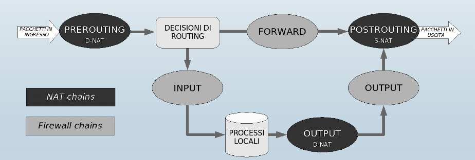

# 1. Indice

- [1. Indice](#1-indice)
- [2. Firewall](#2-firewall)
- [3. netfilter e iptables](#3-netfilter-e-iptables)
	- [3.1. Tabella `filter`](#31-tabella-filter)
- [4. `NAT`](#4-nat)
- [5. Firewall Stateful](#5-firewall-stateful)

# 2. Firewall

Un _**firewall**_ è un meccanismo di protezione hardware e/o software che permette di controllare le connessioni in ingresso e in uscita e applicano delle regole di _blocco_ e _filtraggio_.

Esistono diversi tipi di _firewall_ che operano a diversi livelli:
- **Network Firewall**: operano nel _network layer_ analizzando gli header `IP`, `TCP` e `UDP`
- **Host-based Firewall**: fanno _deep packet inspection_ nell'_application layer_, richiedendo però maggiori risorse computazionali. SOno efficaci contro _malware_, _exploit di vulnerabilità note_, _comportamenti dannosi delle applicazioni_, ...

Studieremo quindi il **_Network Firewall_**.

Il **packet filtering** operato dai _firewall_ può essere:
- **Stateless**: ogni pacchetto viene analizzato singolarmente sulla base di campi statici (indirizzo sorgente, indirizzo di destinazione, ...)
- **Stateful**: tiene traccia delle connessioni `TCP`/degli scambi `UDP` in corso, discriminando le connessioni legittime da quelle sospette.

In entrambi i casi il _firewall_ contiene una **tabella di regole**. Ogni regola contiene delle caratteristiche del pacchetto:
- **Indice**: più basso l'indice più alta la priorità della regola. Se un pacchetto fa _match_ con più regole, il _firewall_ intraprenderà l'azione della **_regola con indice minore_**.
- **IP Sorgente**
- **Porta Sorgente**
- **IP Destinatario**
- **Porta Destinazione**
- **Azione**: indica che azione intraprendere nei confronti dei pacchetti. Possono essere:
  - `DROP`: scarta il pacchetto
  - `ACCEPT`: accetta il pacchetto

Nel caso di _firewall stateful_ sono presenti anche altri campi, ma non ci poniamo questo problema per ora.

Per ogni pacchetto il firewall compie tre azioni:
1. Analizza l'header
2. Scorre la tabella delle regole
3. Se il pacchetto corrisponde alle caratteristiche delal regola, intrapende l'azione


Ipotizzando una rete locale `222.22.0.0/16` e vogliamo:
- Impedire l'accesso a Internet dall'interon della rete
- Consentire l'accesso dalla rete esterna `111.11.0.0/16` alla sottorete locale `222.22.22.0/24`, impedendo però a `111.11.11.0/24` di accedere alla sottorete locale `222.22.22.0/24`

Un esempio di _firewall_ è il seguente:
<div class="flexbox" markdown="1">

| indice |   IP sorgente    | Porta Sorgente | IP destinatario  | Porta dest. |  Azione  |
| :----: | :--------------: | :------------: | :--------------: | :---------: | :------: |
|   1    | `111.11.11.0/24` |                | `222.22.22.0/24` |             |  `DROP`  |
|   2    | `111.11.0.0/16`  |                | `222.22.22.0/24` |             | `ACCEPT` |
|   3    |    `0.0.0.0`     |                |    `0.0.0.0`     |             |  `DROP`  |

</div>

A seconda della **regola di default** (ultima riga della tabella), il _firewall_ può essere:
- **Inclusivo** (_blocca tutto_): sicuro ma scomodo, poiché necessita che per ogni pacchetto vada inserita una nuova regola
- **Esclusivo** (_consente tutto_): comodo ma insicuro, poiché devo prevedere le regole che ritengo utili per la sicurezza.

# 3. netfilter e iptables

All'interno del kernel `Linux` il componente **_netfilter_** offre le funzionalità di:
- _stateless_/_stateful_ packet filternig
- `NA[P]T`: estensione del `NAT` che consente di mappare molti indirizzi diversi in un unico `IP`.

`iptables` invece è il programma `CLI` che server per configurare le tabelle di reogle.

In particolare `iptables` lavora su diverse tabelle (_tables_), ogniuna con una specifica funzionalità.

Ogni tabella contiene **diverse catene**, dette _chains_, che contengono una lista di regole da applicare a una categoria di pacchetti.

Andiamo a studiare in particolare le tabelle `filter` e `nat`.

## 3.1. Tabella `filter`

La tabella `filter` ha **3 catene**:
- `INPUT`: per i pacchetti in ingresso destinati ai processi locali
- `OUTPUT`: per i pacchetti in uscita dai processi locali
- `FORWARD`: per i pacchetti in transito che vanno inoltrati ad altri _host_.

Per visualizzare le regole:
```bash
sudo iptables [-t table] -L [chain]
```

La tabella di _default_ è proprio `filter`, mentre nel caso in cui non si specifichi una catena vengono vidualizzate tutte:
```bash
sudo iptables -L INPUT
```
> Chain INPUT (policy ACCEPT)
> target     prot opt source               destination
```bash
sudo iptables -t nat -L
```
> Chain PREROUTING (policy ACCEPT)
> target     prot opt source               destination         
> 
> Chain INPUT (policy ACCEPT)
> target     prot opt source               destination         
> 
> Chain OUTPUT (policy ACCEPT)
> target     prot opt source               destination         
> 
> Chain POSTROUTING (policy ACCEPT)
> target     prot opt source               destination 

Vediamo adesso uan serie di comandi per manipolare le tabelle:
```bash
# Aggiungere una regola in fondo alla catena
sudo iptables [-t table] -A chain rule-specification

# Aggiungere una regola in una posizione specifica (o in cima se lasciato vuoto)
sudo iptables [-t table] -I chain [num] rule-specification

# Rimuovere una regola dalla catena
sudo iptables [-t table] -D chan rule-specification
sudo iptables [-t table] -D chan num

# Rimuovere tutte le regole dalla/e catena/e
sudo iptables [-t table]  -F [chain]

# Cambiare la regola di default
sudo iptables [-t table] -P target
```

`rule-specification` è una stringa in cui possiamo specificare:
<div class="flexbox" markdown="1">

|      Comando      | Descrizione                      |
| :---------------: | :------------------------------- |
| `-p <protocollo>` | protocollo (TCP, UDP, ICMP, ...) |
|  `-s <address>`   | indirizzo sorgente               |
|  `-d <address>`   | indirizzo destinazione           |
| `--sport <port>`  | porta sorgente                   |
| `--dport <port>`  | porta destinazione               |
| `-i <interface>`  | interfaccia di ingresso          |
| `-o <interface>`  | interfaccia di uscita            |
|   `-j <target>`   | azione (DROP/ACCEPT)             |

</div>

Un aspetto importante da sottolineare è che **_le regole non vengono salvate permanentemente_**. 
È quindi necessario reimpostarle ad ogni avvio del sistema. Un modo utile per farlo è:
```bash
# Salviamo le regole
sudo iptables-save > file

# Carichiamo le regole
sudo iptables-restore < file
```
# 4. `NAT`

Il `NAT` permette ai dispositivi all'interno di una rete di utilizzare degli indirizzi `IP` locali, che vengono tutti tradotti come **_un unico indirizzo `IP` pubblico_**.

Attraverso il meccanismo di _port translation_ può modificare internamente gli header delle richieste manipolando le porte e gli indirizzi IP dei pacchetti, salvando all'interno delle tabelle le regole di traduzione.

La tabella `nat` ha **3 catene**:
- `PREROUTING`: per fare il `D-NAT`, ovvero alterare l'indirizzo/porta di destinazione dei pacchetti in arrivo
- `OUTPUT`: per fare `D-NAT` dei pacchetti in uscita dai rocessi locali _prima del routing_
- `POSTROUTING`: per fare il `S-NAT`, ovvero alterare l'indirizzo/porta sorgente dei pacchetti in partenza


Per settare una nuova conversione per la traduzione da indirizzo IP locale a IP pubblico:
```bash
sudo iptables -t nat -A POSTROUTING -s 192.168.0.2 -j SNAT --to-source 151.162.50.2
```

Invece se volessimo fare la conversione inversa nel momento dell'arrivo della risposta:
```bash
sudo iptables -t nat -A PREROUTING -d 151.162.50.2 -j DNAT --to 192.168.0.2
```

Invece per impostare una nuova regola per mappare più richieste di _client_ diversi sulla stessa porta in porte diverse:
```bash
sudo iptables -t nat -A POSTROUTING -s 192.168.0.0/24 -j SNAT --to-source 151.162.50.1:4001-4100
```

Per reindirizzare tutte le richieste ad una porta ad un determinato dispositivo:
```bash
sudo iptables -t nat -A PREROUTING -p tcp --dport 80 -j DNAT --to 192.168.0.55:80
```


Le catene di `filter` e `nat` sono disposte in modo che `filter` **_veda indirizzi e porte reali_**:




# 5. Firewall Stateful

Possiamo specificare nelal regola un criterio basato sullo stato della connessione TCP di cui un pacchetto fa parte.

A esempio possiamo rendere accessibile via `ssh` (`port 22`) un host (`192.168.10.1`) _solo per il computer dell'amministratore_ (`192.168.10.5`), e che non possa farlo da solo:
```bash
sudo iptables -P DROP

# Permetti le connessioni ssh dall'amministratore verso l'host
sudo iptables -A INPUT -p tcp -i -s 192.168.10.5 -d 192.168.10.1 --dport 22 -m state --state NEW,ESTABLISHED -j ACCEPT

sudo iptables -A OUTPUT -p tcp -o eth0 -s 192.168.10.1 -d 192.168.10.5 --sport 22 -m state --state ESTABLISHED -j ACCEPT
```

Un altro esempio può essere quello di un _firewall_ che blocca le connessioni dall'eserno ma permette quelli che partono dalla rete locale:

```bash
sudo iptables -A FORWARD -s 192.168.10.0/24 -i eth0 -m state --state NEW,RELATED,ESTABLISHED -j ACCEPT
sudo iptables -A FORWARD -d 192.168.10.0/24 -i eth0 -m state --state RELATED,ESTABLISHED -j ACCEPT

# OPPURE #
sudo iptables -A FORWARD -s 192.168.10.0/24 -i eth0 -m state --state NEW,RELATED,ESTABLISHED -j ACCEPT
sudo iptables -A FORWARD -d 192.168.10.0/24 -i eth0 -m state --state NEW -j DROP
```

Un ulteriore esempio può essere quello dell'utilizzo del _firewall_ per proteggersi dal `SYN flooding`:
```bash
sudo iptables -A INPUT -p tcp --syn -m limit --limit 1/s -j ACCEPT
```