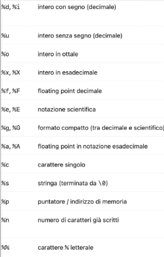
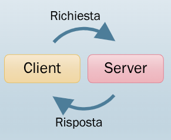
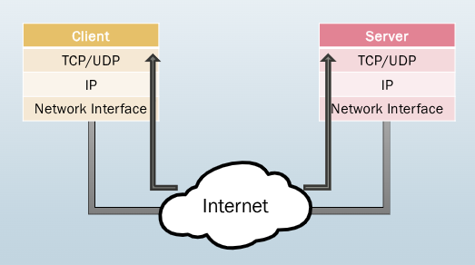
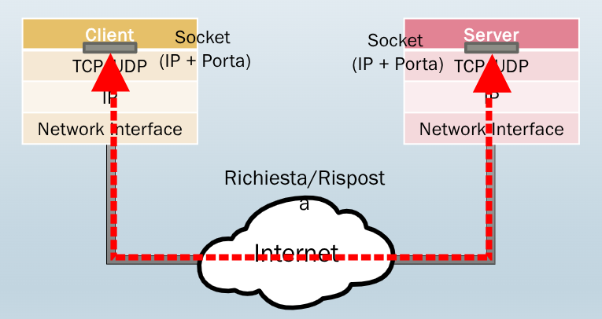
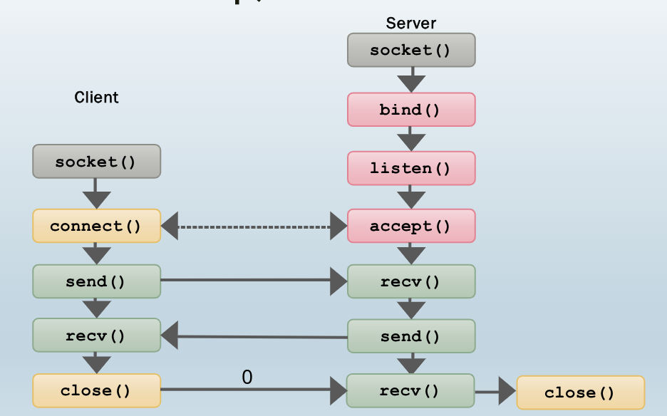
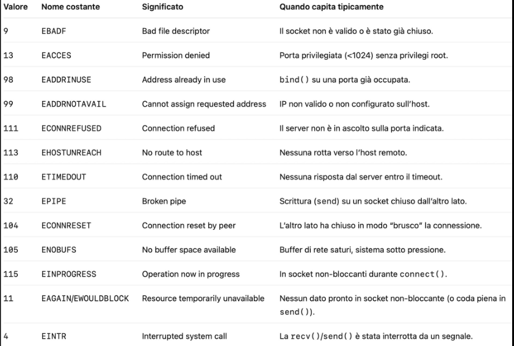
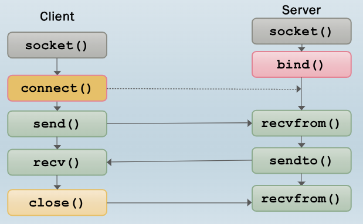

# 1. Indice

- [1. Indice](#1-indice)
- [2. Introduzione al C](#2-introduzione-al-c)
	- [2.1. Strutture dati](#21-strutture-dati)
	- [2.2. Memoria dinamica](#22-memoria-dinamica)
	- [2.3. Operazioni di IO](#23-operazioni-di-io)
		- [2.3.1. Gestione dei file](#231-gestione-dei-file)
	- [2.4. Compilare e linkare i file](#24-compilare-e-linkare-i-file)
	- [2.5. Dtata e ora](#25-dtata-e-ora)
- [3. Programmazione Distribuita](#3-programmazione-distribuita)
	- [3.1. Primitive dei Socket](#31-primitive-dei-socket)
	- [3.2. Lato Server](#32-lato-server)
	- [3.3. Lato Client](#33-lato-client)
	- [3.4. Scambio dati](#34-scambio-dati)
- [4. Gestione degli errori](#4-gestione-degli-errori)
- [5. Server Concorrente](#5-server-concorrente)
	- [5.1. fork](#51-fork)
	- [5.2. Uso dei thread - `pthread`](#52-uso-dei-thread---pthread)
- [6. Socket Non bloccanti](#6-socket-non-bloccanti)
	- [6.1. Manipolare socket](#61-manipolare-socket)
- [7. IO multiplexing](#7-io-multiplexing)
	- [7.1. Primitiva `select`](#71-primitiva-select)
		- [7.1.1. Struttura timeout](#711-struttura-timeout)
		- [7.1.2. Insieme di descrittori](#712-insieme-di-descrittori)
		- [7.1.3. Utilizzo di `select()`](#713-utilizzo-di-select)
- [8. Socket UDP](#8-socket-udp)
	- [8.1. Primitive `sendto()` e `revcfrom()`](#81-primitive-sendto-e-revcfrom)
- [9. Text Vs Binary Protocols](#9-text-vs-binary-protocols)


# 2. Introduzione al C

Le variabili possono essere definite ovunque, come nel `C++`.

Le differenze strutturali si notano nella gestione di oggetti, nella memoria dinamica e nelle operaizoni di I/O.

## 2.1. Strutture dati

```c
struct Complex{
	double Re;
	double Im;
};

int main(){
	int a = 4;
	struct Complex c;		//! Va esplicitata
}
```

In `C` abbiamo le seguenti caratteristiche:
- **Dichiarazione**: scrivere sempre `struct nomeStruct`
- **Contenuto**: **_solo ed esclusivamente campi (dati)_**
- **Inizializzazione**: **_non ha costrtuttori di default_**
- **Visibilità di default**: tutti i membri sono `public`
- **Ereditarietà**: non supportata
- **Operatori di overloading**: non disponibili
- **Compatibilità**: le struct `C` funzionano in `C++`

## 2.2. Memoria dinamica

In `C` non esiste la _keyword_ `new` per allocare dinamicamente memoria nello _heap_.

Per poter fare operazioni sulla memoria dobbiamo **includere** `<stdlib.h>` e utilizare:
- `void* malloc(size)` per allocare una zona di memroia
- `void free(void*)` per deallocare una zona di memoria

```c
#include <stdlib.h>

int main(){
	int mem_size = 5;
	int *ptr;
	ptr = (int*)malloc(sizeof(int)*mem_size);
	if(ptr == NULL){
		// errore nell'allocazione
	}

	free(ptr);
}
```

## 2.3. Operazioni di IO

Le operazioni di I/O si basano sulla `<stdlib.h>`, che fornisce funzioni per leggere e scrivere da/verso:
- `stdin` (_tastiera_), attraverso la `int scanf(char* formato, void& indirizzi)`. È una funzione rischiosa perché non controlla la lunghezza e può causare _buffer overflow_. Meglio utilizzare `fgets(str, sizeof(str), stdin)`
- `stdout` (_schermo_), attraverso la `int printf(char* formato, argomenti)`
- `file` attraverso la `fprintf(FILE* f, ...)` e la `fscanf(FILE* f, ...)`

<div class="grid2">
<div class="">

```c
#include <stdio.h>

int main(){
	char* str = "Hello!\n";
	printf(str);
	pritnf("str = %s", str);

	int i = 5;
	printf("i = %d\n", i);

	scanf("%d", &i);
	printf("i = %d\n", i);
}
```
</div>
<div class="">
<figure class="">

<figcaption>

Alcuni caratteri epr la manipolazione delle stringhe nelle funzioni.
</figcaption>
</figure>

</div>
</div>


In `C` non esiste il tipo nativo stringa, ma è un **_array di caratteri_** terminato con il carattere speciale `\0`:

```c
#include <stdio.h>

char *str1 = "Hello \n";		// Alloco 8 Byte |H|e|l|l|o| |\n|\0|
int len = strlen(str1);			// len -> 7
```

Per confrontare due stringhe alfabeticamente, ovvero secondo l'ordine del dizionario, si utilizza la `int strcmp(char* s1, char* s1)`:
- `0` se sono identiche
- `<0` se `s1` è alfabeticamente minore di `s2`
- `>0` se `s1` è alfabeticamente maggiore di `s2`

Alcune funzioni:
```c
char str[20];
n = sizeof(str);
strncpy(str, "Hello \n", n);		// 8 è minore di 20, quindi tutt'ok

char *str2 = "World!\n";
n2 = sizeof(str2);
strcat(str, str2, n2);
/*
* considera str come la lunghezza senza \0, mentre in str2 lo considera
* produce quindi "Hello \nWorld!\n\0"
```

### 2.3.1. Gestione dei file

Ogni file aperto è rappresentato da un puntatore di tipo `FILE*` definito in `<stdio.h>`

<div class="grid2">
<div class="">

```c
#include <stdio.h>

FILE* fd;
fd = fopne("path/file.txt", "r");

if(fd == NULL){
	// Gestione errore
}
```
</div>
<div class="">
<div class="flexbox" markdown="1">

| Modificatore |     Significato     |  File inestistente   |
| :----------: | :-----------------: | :------------------: |
|     `r`      |    Sola lettura     | `segmentation fault` |
|     `w`      |   Sola scrittura    |  **_crea il file_**  |
|     `r+`     | lettura e scrittura |  **_crea il file_**  |
|     `a`      |      _append_       |  **_crea il file_**  |
|     `a+`     | _lettura e append_  |  **_crea il file_**  |

</div>
</div>
</div>

Per leggere/scrivere si un file si utilizzano `fscanf()` e `fprintf()` che funzionano esattamente come `scanf` e `printf`.

```c
#include <stdio.h>

// Lettura file
int ret, n;
FILE *fd1;
fd1 = fopen("/tmp/foo.txt", "r");
if (fd1 == NULL) {
	// Gestione errore
}
ret = fscanf(fd1, "%d", &n);


// Scrittura file
char *str = "Hello!\n";
FILE *fd2;
fd2 = fopen("/tmp/bar.txt", "w");
if (fd2 == NULL) {
	// Gestione errore
}
ret = fprintf(fd2, "%s", str);
```

Per ottenere informazioni sul file:
```c
#include <stdio.h>
#include <sys/stat.h>

// Dimensione
int ret, size;
struct stat info;

ret = stat("/tmp/foo.txt", &info);
size = info.st_size;
```

## 2.4. Compilare e linkare i file

Per la compilazione si creano i file oggetto a partire dai file sorgente:
```bash
# Generiamo un file oggetto per ogni sorgente
gcc -Wall -c myfile1.c myfile2.c
# `-Wall` non ignora i warning
# `-c` specifica che sono file `.c`
```

Per il _linking_ dei vari file oggetto in un unico eseguibile:
```bash
gcc -o myProgram myFile1.o myFile2.o
```

Oppure in un unica linea:
```bash
gcc -Wall -c myFile1.c myFile2.c -o myProgram
```

## 2.5. Dtata e ora

Di seguito un esempio di stampa di data e ora:
```c
time_t rawtime;
struct tm * timeinfo;

/* Ottieni l'ora in formato POSIX */
time(&rawtime);
timeinfo = localtime (&rawtime); 

/* La struttura timeinfo non va deallocata (è allocata staticamente dal 
sistema operativo, viene sovrascritta ad ogni invocazione */

/* Stampa l'ora */

// ctime() trasforma l'ora in stringa
printf("%s\n", ctime(&rawtime));

/* Formattare data/ora in stringa secondo un formato specificato */
strftime(buffer, BUFFER_SIZE, "%Y-%m-%d %H:%M:%S", timeinfo);
```

I vari formati sono:
<div class="flexbox" markdown="1">

| Modificatore |                Descrizione                 |   Esempio    |
| :----------: | :----------------------------------------: | :----------: |
|     `%A`     |  Nome completo del giorno della settimana  | `Wednesday`  |
|     `%d`     |       Giorno del mese, con due cifre       |     `25`     |
|     `%B`     |           Nome completo del mese           | `September`  |
|     `%Y`     |           Anno con quattro cifre           |    `2024`    |
|     `%H`     |    Ora con due cifre nel formato 24 ore    |     `15`     |
|     `%M`     |            Minuti con due cifre            |     `30`     |
|     `%S`     |           Secondi con due cifre            |     `45`     |
|     `%a`     | Nome abbreviato del giorno della settimana | `Mon`, `Tue` |
|     `%b`     |          Nome abbreviato del mese          | `Jan`, `Feb` |
|     `%I`     |    Ora con due cifre nel formato 12 ore    |     `03`     |
|     `%p`     |    AM/PM (usato con il formato 12 ore)     |      /       |
|     `%m`     |                    mese                    |   `01-12`    |

</div>

La `struct tm` invece:
```c
struct tm{
	int tm_sec   	// Seconds [0,60]. 
	int tm_min   	// Minutes [0,59]. 
	int tm_hour  	// Hour [0,23]. 
	int tm_mday  	// Day of month [1,31]. 
	int tm_mon   	// Month of year [0,11]. 
	int tm_year  	// Years since 1900. 
	int tm_wday  	// Day of week [0,6] (Sunday =0). 
	int tm_yday  	// Day of year [0,365]. 
	int tm_isdst 	// Daylight Savings flag. 
};

```


# 3. Programmazione Distribuita

Due processi possono cooperare attraverso:
- _Sincronizzazione_ (semafori, ....)
- _Comunicazione_ (memoria condivisa, chiamate a procedura remota, scambio di messaggi)

Due processi possono cooperare:
- Sulla stessa macchina
- **_Su macchine diverse_**, in quelli che si chiamano **_sistemi distribuiti_**

Un paradigma basato su scambio di messaggi, utilizzato principalmente per sistemi distribuiti, è il modello `Client/Server`.

<div class="grid2">
<div class="">

</div>
<div class="">
<figure class="">

<figcaption>

Il protocollo dei messaggi è il `TCP` oppure l'`UDP`.
Si aprono atraverso i _socket_.
</figcaption>
</figure>
</div>
</div>

Un _socket_ è l'astrazione di un canale di comunicazione tra processi. Fornisce un interfaccia unica per operare con diversi protocolli di rete, nascondendo i dettagli dei livelli sottostanti.

Un _socket_ è identificato da un indirizzo:
- _host_ (`TCP/IP`: indirizzo `IP`)
- _processo_ (`TCP/IP`: numero porta)


Nelle comunicazioni un _scket_ è l'estremità del canale di comunicazione:




L'astrazione del _socket_ è implementata dal _sistema operativo_. Quest'ultimo infatti mette a disposizioen delle **primitive** (`system calls`) che permettono di:
- Creare un _socket_
- Assegnarli un indirizzo e una porta
- Connettersi ad un altro _socket_
- Accettare una connessione
- Inviare e ricevere dati attraverso i _socket_

## 3.1. Primitive dei Socket

Per la creazione di un _socket_ dobbiamo includere tre librerie e utilizzare la primitiva `socket()`:
```c
#include <sys/types.h>
#include <sys/socket.h>
#include <netinet/in.h>

/**
* Permette la creazione di un socket. Non lo associa ad un indirizzo IP o ad una porta
* @param domain è la famisglia di protocolli da utilizzare, può valere
*					- AF_LOCAL: comunicazione locale
*					- AF_INET: protocolli IPv4, TCP e UDP
* @param type specifica la tipologia di socket
*					- SOCK_STREAM: connessione affidabile, bidireionale (TCP)
*					- SOCK_DGRAM: invio di pacchetti senza connessione (UDP)
* @param protocol va impostato sempre a 0
* @return un descrittore di file che rappresenta il socket e servità a manipolare il socket attraverso le altre primitive, `-1` su errore
*/
int socket(int domain, int type, int protocol);
```

Alcune strutture dati utili per la gestione {degli indirizzi:
```c
/* Endpont IPv4 in `netinet/in.h`*/

struct sockaddr_in{
	sa_family_t		sin_family;		/* address family: AP_INET */
	in_port_t		sin_port;		/* port in network byte order */
	struct in_addr 	sin_addr;		/* internet address */
}

/* Internet address in `netinet/in.h` */
struct in_addr {
	uint32_t		s_addr;			/* address in network byte order*/
}
```

Esiste anche una `struct sockaddr` utilizzata da alcune funzioni, ma che non non manipoleremo mai direttamente.

Negli esempi è possibile notare la dicitura `in network byte order`. Questo è sepcificata perché calcolatori diversi possono usare modalit diverse per **ordinare i byte**.

Prendiamo per esempio il numero `422990` in `32bit`: `0000 0000 0000 0110 0111 0100 0100 1110`

Questo può essere memorizzato:
<div class="flexbox" markdown="1">

|                     big-endian                     |                   little-endian                    |
| :------------------------------------------------: | :------------------------------------------------: |
|   Per primo il byte più significativo (**MSB**)    |   Per primo il byte meno significativo (**LSB**)   |
| `0000 0000 \| 0000 0110 \| 0111 0100 \| 0100 1110` | `0100 1110 \| 0111 0100 \| 0000 0110 \| 0000 0000` |
</div>


Sulla rete viene utilizzata la notazione **_big-endian_**, mentre il formato dell'_host_ è variabile.

Sono quindi fornite le seguenti funzioni di conversione:
```c
#include <arpa/inet.h>
#include <stdin.h>						// per `uint16_t` e `uint32_t`

uint32_t htonl(uint32_t hostlong); 		// host to network long
uint16_t htons(uint16_t hostshort); 	// host to network short
uint32_t ntohl(uint32_t netlong); 		// network to host long
uint16_t ntohs(uint16_t netshort); 		// network to host short
```

I formati `uint16_t` e `uint32_t` utilizzano **_sempre_** rispettivamente `16` e `32` bit, a prescindere del calcolatore utilizzato per compilare.


Noi siamo abituati a vederli nel formato **presentazione**, in notazione puntata (`192.34.5.123`)
Gli indirizzi `IP` seguono però un formato **numerico** su `32bit` utilizzato dal computer. (`3223455 099`)

Sono quindi necessari delle funzioni di traduzione:
```c

/**
* Permette di tradurre da formato presentazione a formato numerico
* @param af (address family) famiglia (AF_INET)
* @param src stringa del tipo "ddd.ddd.ddd.ddd"
* @param dst puntatore a una struct in_addr
*/
int inet_pton(int af, const char *src, void *dst);

/**
* Permette di tradurre da formato numerico a formato presentazione
* @param af: famiglia (AF_INET)
* @param src: puntatore a una struct in_addr
* @param dst: puntatore a un buffer di caratteri lungo size
* @param size: deve valere almeno INET_ADDRSTRLEN
*/
const char *inet_ntop(int af, const void *src, char *dst, socklen_t size);
```

Un piccolo programma che crea un _socket_ e crea un indirizzo può essere il seguente:
```c
#include <arpa/inet.h>
#include <sys/types.h>
#include <sys/socket.h>
#include <netinet/in.h>

int main(){
	int sd = socket(AF_INET, SOCK_STREAM, 0);

	struct sockaddr_in my_addr;
	memset(&my_addr, 0, sizeof(my_addr));	// Pulizia per sicurezza

	my_addr.sin_family = AF_INET;
	my_addr.sin_port = htons(4242);
	inet_pton(AF_INET, "192.168.4.5", &my_addr.sin_addr);

}
```

## 3.2. Lato Server

Le operazioni preliminari che effettua un _server_ per istaurare comunicazioni su _socket TCP_ sono:
- `socket()`
- `bind()`
- `listen()`
- `accept()`

```c
/**
* Assegna un socket a un indirizzo (IP+Porta).
* Viene usata dal server per specificare indirizzo e porta sui quali ricevere richieste.
* 	Di solito, il client non ha bisogno di eseguire questa funzione
* @param sockfd: descrittore del socket (socket file descriptor)
* @param addr: puntatore alla struttura di tipo `struct sockaddr` (Visto che usiamo `struct sockaddr_in` bisogna convertire il puntatore)
* @param addrlen: dimensione di `addr`
* @return `0` se ha successo, `-1` su errore
*/
int bind(int sockfd, const struct sockaddr *addr, socklen_t addrlen);

// Esempio
ret = bind(sd, (struct sockaddr*)&my_addr, sizeof(my_addr));


/**
* Specifica che il socket è passivo, verrà quindi utilizzato per ricevere richieste di connessione.
* Possono essere messi in listen solo socket `SOCK_STREAM`
* All'arrivo di una richiesta di conessione il kernel lo mette in attesa in una coda, attendendo la chiamata di accept() per prenderle in carico
* Se arrivano più richieste di `backlog` le nuove richieste verranno rifiutate
* @param sockfd: descrittore del socket
* @param backlog: dimensione della coda, cioè quante richieste dai client possono rimanere in attesa di essere gestite
* @return `0` se ha successo, `-1` su errore
*/
int listen(int sockfd, int backlog);

// Esempio
ret = listen(sd, 10);


/**
* Accetta una richiesta di connessioen perveunta sul socket.
* Ha senso solo sui socket `SOCK_STREAM`
* La funzione è bloccante: il programma si ferma finché non arriva una richiesta
* @param sockfd: descrittore del socket
* @param addr: puntatore a una struttura (vuota) di tipo `struct sockaddr` (Qui ci viene salvato l'indirizzo del client
* @param addrlen: dimensione di addr
* @returns il descrittore di un nuovo socket che verrà usato per la comunicazione, `-1` su errore
*/
int accept(int sockfd, struct sockaddr *addr, socklen_t *addrlen);

// Esempio
struct sockaddr_in cl_addr;
int len = sizeof(cl_addr);
new_sd = accept(sd, (struct sockaddr*)&cl_addr, &len);
```

Un esempio di codice lato server può essere il seguente:
```c
#include <arpa/inet.h>
#include <sys/types.h>
#include <sys/socket.h>
#include <netinet/in.h>

int main(){
	int ret, sd, new_sd, len;
	struct sockaddr_in myaddr, cl_addr;

	sd = socket(AF_INET, SOCK_STREAM, 0);

	memset(&my_addr, 0, sizeof(my_addr));
	my_addr.sin_family = AF_INET;
	my_addr.sin_port = htons(4242);
	inet_pton(AF_INET, "192.168.4.5", &my_addr.sin_addr);

	// se vogliamo stare in attesa su tutte le interfacce:
	// `my_addr.sin_addr.s_addr = INADDR_ANY`

	ret = bind(sd, (struct sockaddr*)&myaddr, sizeof(my_addr));
	ret = listen(sd, 10);

	int len = sizeof(cl_addr);

	new_sd = accept(sd, (struct sockaddr*)&cl_addr, &len);
}
```

## 3.3. Lato Client

Per connettere un _socket_ locale ad un _socket_ remoto si utilizza:
```c
/**
* Permette di connettere un socket locale ad un socket remoto.
* È una funzione bloccante che ferma il programma finché la richiesta di connessione non viene accetata
* @param sockfd descrittore del socket locale
* @param addr puntatore alla struttura contenente l'indirizzo del server
* @param addrlen dimensione di addr
* @returns `0` se ha successo, `-1 su errore
*/
int connect(int sockfd, const struct sockaddr *addr, socklen_t addrlen);
```

Un esempo di codice:
```c
#include <arpa/inet.h>
#include <sys/types.h>
#include <sys/socket.h>
#include <netinet/in.h>

int main () {
	int ret, sd;
  	struct sockaddr_in sv_addr; // Struttura per il server

	/* Creazione socket */
  	sd = socket(AF_INET, SOCK_STREAM, 0);
  	/* Creazione indirizzo del server */
	memset(&sv_addr, 0, sizeof(sv_addr)); // Pulizia
	sv_addr.sin_family = AF_INET ;
	sv_addr.sin_port = htons(4242);
  	inet_pton(AF_INET, "192.168.4.5", &sv_addr.sin_addr);
  	ret = connect(sd, (struct sockaddr*)&sv_addr, sizeof(sv_addr));
	//...
}
```

## 3.4. Scambio dati

Chi vuole inviare messaggi utilizza la seguente primitiva:
```c
/**
* Invia un messaggio attraverso un socket connesso.
* È una funzione bloccante che ferma il programma finché non ha scritto tutto il messaggio.
* La funzione non "spedice pacchetti", ma copia dati nel buffer del kernel. Sarà poi quest'ultimo a frammentarli in pacchetti TCP.
* In caso di buffer saturo si blocca l'esecuzione del programma finché non vi è sufficiente spazio
* @param sockfd descrittore del socket
* @param buf puntatore al buffer contenente il messaggio da inviare
* @param len dimensione in byte del messaggio
* @param flags per settare delle opzioni, lo lascieremo a `0`
* @returns `numero di byte inviati` se ha successo, `-1` su errore
*/
ssize_t send(int sockfd, const void* buf, size_t len, int flags);
```

Un esempio:
```c
int ret, sd, len;
char buffer[1024];

// ...

strcpy(buffer, "Hello Server!");
len = strlen(buffer);
ret = send(sd, (void*)buffer, len, 0);
if(ret < len){
	// Gestione Errore
}
```

Chi vuole ricevere un messaggio invece:
```c
/**
* Permette di prelevare un messaggio da un socket connesso.
* La funzione è bloccante, ferma il programma finché non ha letto qualcosa
* @param sockfd descrittore del socket
* @param buf puntatore al buffer in cui salvare il messaggio
* @param len dimensione in byte del messaggio desiderato
* @param flags per settare delle opzioni
* @returns `numero di byte ricevuti`, `-1` su errore, `0` se il socket remoto si è
chiuso
*/
ssize_t recv(int sockfd, const void *buf, size_t len, int flags);
```

Vediamo un esempio:
```c
int ret, sd, bytes_needed;
char buffer[1024];

// ...

bytes_needed = 20;

ret = recv(sd, (void*)buffer, bytes_needed, 0);
// Adesso 0 < ret <= bytes_needed
if (ret < bytes_needed) {
	// Gestione errore
}

// OPPURE, per avere la certezza che `ret == bytes_needed`
ret = recv(sd, (void*)buffer, bytes_needed, MSG_WAITALL);
```

Se volessimo **_chiudere un socket_**, questo non può più essere usato per inviare o ricevere dati:
```c
#include <unistd.h>

/**
* Permette di chiudere un socket.
* Invia un messaggio di `0` all'host remoto
* @param fd descrittore del socket
* @returns `0` se ha successo, `-1` su errore
*/
int close(int fd);
```

Uno schema può essere il seguente:




# 4. Gestione degli errori

Abbiamo visto che le primitive fin'ora restituiscono `-1` in caso di errore.
Oltre ad avere questo ritoro, le primitive **_settano una variabile_** `errno` che può essere letta per scoprire il motivo dell'errore.

```c
#include <errno.h>

ret = bind(sd, (struct sockaddr*)&my_addr, sizeof(my_addr));
  if (ret == -1) {
	switch(errno){
		case EADDRINUSE: /* Gestisci errore */
		case EINVAL:  /* Gestisci errore */
    	//...
	}
  }

```

Di seguito si può vedere una breve lista, non completa, di errori rilevanti:



Per vedere l'errore a schermo è sufficiente utilizzare un altra funzione:
```c
#include <stdio.h>

// ...
ret = bind(sd, (struct sockaddr*)&my_addr, sizeof(my_addr));
if (ret == -1) {
	perror("Error: ");
	exit(1);
}
// ...
```

# 5. Server Concorrente

Quando creiamo un server, tendenzialmente vogliamo che sia in grado di accettare **_più connessioni_** mentre ne gestisce altre.

Per fare ciò vi sono diversi metodi:

## 5.1. fork

```c
#include <unistd.h>
pid_t fork(void);
```

La primitiva `fork()` duplica un processo restituendo:
- Nel processo padre il `PID` del figlio
- Nel processo figlio `0`

Quando un processo viene duplicato, il padre e il figlio si ritrovano **_gli stessi descrittori duplicati_**.

Ogniuno deve quindi **_chiudere il descrittore che non usa_**, per evitare di mantenere aperte risorse non necessarie.
In particolare:
- Il padre chiude il descrittore del socket connesso al _client_
- Il figlio chiude il descrittore del socket in ascolto

```c
int ret, sd, new_sd, len;
struct sockaddr_in my_addr, cl_addr;

//...

pid_t pid;
sd = socket(AF_INET, SOCK_STREAM, 0);
ret = bind(sd, (struct sockaddr*)&my_addr, sizeof(my_addr));
ret = listen(sd, 10);
len = sizeof(cl_addr); 

//...

while (1) {
	new_sd = accept(sd, (struct sockaddr*)&cl_addr,&len);

	pid = fork();
	if (pid == -1){/*Gestione errore*/}

	if (pid == 0) {
		// Sono nel processo figlio. Chiudo socket in ascolto
		close(sd);
		
		// Servo la richiesta con new_sd
		//...

		close(new_sd);
		exit(0); // Il figlio termina
	}
	
	// Sono nel processo padre. Chiudo socket connesso al client
	close(new_sd);
}

```

## 5.2. Uso dei thread - `pthread`

Un _thread_ è identificato dal tipo `pthread_t`, e protegge le risorse condivise attraverso `pthread_mutex_t`

```c
#include <pthread.h>

/**
* crea un nuovo processo che partirà eseguendo start_routine(void)
*/
int pthread_create(pthread_t* thread, const pthread_attr_t* attr, void* (*start_routine)(void), void* arg);

/**
* blocca un thread in attesa della terminazione di un altro
*/
int pthread_join(pthread_t thread, void** retval);

/**
* per terminare un thread e mettere a disposizione un suo risultato
*/
void pthread_exit(void* retval);
```

# 6. Socket Non bloccanti

Di default un _socket_ è **_bloccante_**.

Tutte le operazioni su di esso **fermano l'esecuzione del processo in attesa del risultato**.
Questa modalità è sepmlice da usare e va bene per applicazioni in cui i blocchi temporanei non sono problematici o in cui viene utilizzato il _multithreading_ per gestire la concorrenza.

I _socket_ possono però essere settati anche come **_non bloccanti_**.

In questo caso le operazioni non attendono i risultati:
- `connect()`: se non può connettersi subito restituisce `-1` e setta `errno = EINPROGRESS`
- `accept()`: se non ci sono richieste restituisce `-1` e setta `errno = EWOULDBLOCK`
- `send()`: se non riesce a inviare tutto il messaggio subito (il buffer è pieno) restituisce `-1` e setta `errno = EWOULDBLOCK`
- `recv()`: se non ci sono messaggi restituisce `-1` e setta `errno = EWOULDBLOCK`

Per cerare un _socket_ non bloccante:
```c
int host_fd = socket(AF_INET, SOCK_STREAM|SOCK_NONBLOCK, 0);
```

Altri errori che ci possono essere sono quelli [nell'immagine già presentata sopra](#errno-example).


La modalità non bloccante invece è utile in applicazioni che devono gestire **_molte connessioni simultaneamente_** e dove bloccare il programma per un singolo _socket_ è inefficiente.

La _modalità non blocante_ è utilizzata insieme a tecniche di multiplexing di IO, con chiamate come `select()`, `poll()` e `epoll()` per monitorare più socket, e agire quando uno o più di questi diventano pronti per operazioni di `IO`.

## 6.1. Manipolare socket

```c
#include <unistd.h>
#include <fcntl.h>

/**
* Server per manipolare un descrittore di file o di socket
* @param fd il descrittore
* @param cmd il comando da passare. Alcuni esempo
*		- F_GETFL: ottieni i flag di stato
*		- F_SETFL: imposta i flag di stato
* @param other terzo argomento facoltativo necessario per alcuni comandi
* @returns dipende dal comando, `-1` e errno su errore
*/
int fcntl(int fd, int cmd, int other);
```

Un esempio di utilizzo:
```c
int sd, ret;

sd = socket(/**/);

/* Ottieni i flag attuali */
ret = fcntl(sd, F_GETFL, NULL);

/* Setto il flag non bloccanto, MANTENENDO GLI ALTRI*/
fcntl(sd, F_SET, ret | O_NONBLOCK);
```

# 7. IO multiplexing

Permette di controllare più descrittori/_socket_ (non bloccanti) nello stesso momento, attraverso la primitiva `select()`.

Può essere:
- **Sincrono**: il programma rimane comunque in attesa che qualche descrittore sia pronto
- **Asincrono**: il programma non rimane in attesa, ma restituisce un errore

## 7.1. Primitiva `select`

Abbiamo già detto che permette di controllare più _socket_ contemporaneamente:
```c
#include <sys/time.h>
#include <sys/types.h>
#include <unistd.h>

/**
* Rileva i socket pronti
* È una funzione bloccante. Si sblocca o quando un socket controllato diventa pronto o quando scade il timeout.
* @param nfds numero del descrittore più alto tra quelli da controllare + 1
* @param readfds lista di descrittori da controllare per la lettura
* @param writefds lista di descrittori da controllare per la scrittura
* @param exceptfds lista di descrittori da controllare per le eccezioni (non lo utilizzeremo)
* @param timeout intervallo di timeout
* @return restituisce il numero di descrittori pronti, `0` se scade il timeout, `-1` su errore
*/
int select(int nfds, fd_set* readfds, fd_set* writefds_fd, fd_set* exceptfds, struct timeval *timeout);
```

Un _socket_ si dice **pronto in lettura** se:
- C'è almeno un byte da leggere
- Il socket è stato chiuso (`read() == 0`)
- È un socket in ascolto e ci sono connessioni effettuate
- C'è un errore (`read() == -1`)

Un _socket_ si dice **pronto in scrittura** se:
- C'è spazio nel _buffer_ per scrivere
- C'è un errore (`write() == -1`), se il socket viene chiuso viene settato `errno = EPIPE`

### 7.1.1. Struttura timeout

```c
#include <sys/socket.h>
#include <netinet/in.h>

struct timeval{
	long tv_sec;	// secondi
	long tv_usec;	// microsecondi
};

struct timeval timeout = NULL;		// attesa indefinita

timeout = {10; 5};					// attesa massima di 10 secondi e 5 microsecondi
timeout = {0; 0};					// attesa nulla, controlla ed esce (polling)
```

### 7.1.2. Insieme di descrittori

Un descrittore è un `int` che va da `0` a `FD_SETSIZE` (tipicamente `1024`).

Un insieme di descrittori si rappresenta con una variabile di tipo `fd_set`, che manipoleremo con delle _macro_ simili a funzioni:
```c
/* Rimuove un descrittore dal set */
void FD_CLR(int fd, fd_set *set);

/* Controllare se un descrittore è nel set */
int FD_ISSET(int fd, fd_set *set);

/* Aggiunge un descrittore al set */
void FD_SET(int fd, fd_set *set);

/* Svuotare il set */
void FD_ZERO(fd_set *set);
```


### 7.1.3. Utilizzo di `select()`

Vediamo un esempio di utilizzo di `select`:
```c
int main(int argc, char** argv){
	fd_set master;					// Set principale
	fd_set read_fds;				// Set di lettura
	int fdmax;						// Numero massimo di descrittori

	struct sockaddr_in sv_addr;		// Indirizzo server
	struct sockaddr_in cl_addr;		// Indirizzo client
	int listener;					// Socket per l'ascolto

	int newfd;
	char buf[1024];
	int nbytes;
	int addrlen;
	int i;

	// Azzero i set
	FD_ZERO(&master);
	FD_ZERO(&read_fds);

	listener = socket(AF_INET, SOCK_STREAM|SOCK_NONBLOCK, 0);

	sv_addr.sin_family = AF_INET;
	sv_addr.sin_port = hton(20000);
	sv_addr.sin_addr.s_addr = INADDR_ANY;

	bind(listener, (struct sockaddr*)&sv_addr, sizeof(sv_addr));
	listen(listener, 10);

	FD_SET(listener, &master);		// Aggiungo il listener al set

	fdmax = listener;

	for(;;){
		read_fds = master;			// copio il set

		select(fdmax + 1, &read_fds, NULL, NULL, NULL);

		for(int i = 0; i <= fd_max; ++i){	// scorro tutto il set
			if(FD_ISSET(i, &read_fds)){		// se trovo un descrittore pronto
				if(i == listener){			// è il listener
					addrlen = sizeof(cl_addr);
					newfd = accept(listener, (struct sockaddr_in*)&cl_addr, &addrlen);

					FD_SET(newfd, &master);	// aggiungo il nuovo socket al set
					if(newfd > fdmax){
						fdmax = newfd;		// aggiorno max
					}
				}
				else{
					// Se è un nuovo socket
					nbytes = recv(i, buf, sizeof(buf));
					// ... uso i dati
					close(i);
					FD_CLR(i, &master);		// rimuovo il socket dal set
				}
			}
		}
	}
}
```

# 8. Socket UDP

A differenza dei _socket TCP_ che instaurano una connessione, richiedendo operazioni preliminari per instaurare il canale virtuale, i **_socket UDP_** sono _connection-less_.

Questa differenza comporta la perdita dell'affidabilità, ottenedo però connessioni più rapide


## 8.1. Primitive `sendto()` e `revcfrom()`

```c
/**
* È una funzione bloccante
* @param sockfd descrittore del socket
* @param buf buffer contenente il messaggio da inviare
* @param len lunghezza del messaggio in byte
* @param flags per settare opzioni, lo lasceremo a `0`
* @param dest_addr puntatore alla struttura che contiene l'indirizzo del destinatario
* @param addrlen lunghezza di `dest_addr`
* @returns il numero di byte inviati, `-1` su errore
*/
ssize_t sendto(int sockfd, const void* buf, size_t len, int flags, const struct sockaddr *dest_addr, socklen_t addrlen);
```

```c
/**
* È una funzione bloccante
* @param sockfd descrittore del socket
* @param buf buffer contenente il messaggio da ricevere
* @param len lunghezza del messaggio in byte
* @param flags per settare opzioni
* @param src_addr puntatore alla struttura vuota dove salveremo l'indirizzo del mittente
* @param addrlen lunghezza di `src_addr`
* @returns il numero di byte ricevuti, `-1` su errore, `0` se il socket remoto si è chiuso
*/
ssize_t recv_from(itn sockfd, const void *buf, size_t len, int flags, struct sockaddr *src_addr, socklen_t addrlen);
```

Possiamo vedere un esempio di codice:
<div class="grid2">
<div class="top">
<div class="p">Server</div>

```c
int main () {
	int ret, sd, len;
	char buf[BUFLEN];
	struct sockaddr_in my_addr, cl_addr;
	int addrlen = sizeof(cl_addr);
  
	/* Creazione socket */
  	sd = socket(AF_INET, SOCK_DGRAM, 0);
  
 	/* Creazione indirizzo */
	memset(&my_addr, 0, sizeof(my_addr)); // Pulizia
	my_addr.sin_family = AF_INET ;
	my_addr.sin_port = htons(4242);
  	my_addr.sin_addr.s_addr = INADDR_ANY;
  	
	ret = bind(sd, (struct sockaddr*)&my_addr, sizeof(my_addr));
  	while(1) {
    	len = recvfrom(sd, buf, BUFLEN, 0,(struct sockaddr*)&cl_addr, &addrlen);
    	//...
  	}
}
```
</div>
<div class="top">
<div class="p">Client</div>

```c
int main() {
  	int ret, sd, len;
  	char buf[BUFLEN];
  	struct sockaddr_in my_addr, sv_addr; // Struttura per il server
  	sd = socket(AF_INET, SOCK_DGRAM, 0); /* Creazione socket */
 	
	if (sd < 0) {
    	perror("Errore nella creazione del socket");
       	exit(1);
	}
	
	memset(&my_addr, 0, sizeof(my_addr)); /* Creazione proprio indirizzo*/
   	my_addr.sin_family = AF_INET;
   	my_addr.sin_addr.s_addr = INADDR_ANY;
   	my_addr.sin_port = htons(5432); 
   	if (bind(sd, (struct sockaddr*)&my_addr, sizeof(my_addr)) < 0) {
    	perror("Errore nel bind");
       	close(sd);
       	exit(1);
	}
	
	memset(&sv_addr, 0, sizeof(sv_addr)); /* Creazione indirizzo del server */
	sv_addr.sin_family = AF_INET ;
	sv_addr.sin_port = htons(4242);
  	inet_pton(AF_INET, "192.168.4.5", &sv_addr.sin_addr);
 	while(1) {
    	len = sendto(sd, buf, BUFLEN, 0,(struct sockaddr*)&sv_addr,sizeof(sv_addr));
    	//...
 	}
}
```
</div>
</div>

Di seguito è proposto un esempio di client che **non utilizza** `bind`:
```c
int main(){
	int ret, sd, len;
	char buf[BUFLEN];

	struct sockaddr_in sv_addr;

	/* Creazione Socket */
	sd = socket(AF_INET, SOCK_DGRAM, 0);

	/* Creazione indirizzo del server */
	memset(&sv_addr, 0, sizeof(sv_addr)); // Pulizia
	sv_addr.sin_family = AF_INET ;
	sv_addr.sin_port = htons(4242);
  	inet_pton(AF_INET, "192.168.4.5", &sv_addr.sin_addr);

	while(1){
		len = sendto(sd, buf, BUFLEN, 0, (struct sockaddr*)&sv_addr, sizeof(sv_addr));
		// ...
	}
}
```

Di seguito è proposto uno schema di comunicazione attraverso socket `UDP`:

<figure class="">

<figcaption>

Attraverso un _socket_ connesso tramite `connect()` è possibile utilizzare `send()` e `recv()` senza specificare ogni volta l'indirizzo.
Questo non è tuttavia necessario.
</figcaption>
</figure>


# 9. Text Vs Binary Protocols

Molti protocolli a livello applicativo inviano messaggi di testo (_text protocols_) invece di inviare direttamente i dati delle strutture dati (_binary protocols_).

I dati da inviare sono tradotti in stringhe (con una lunghezza massima) e inviati nel _socket_ come testo, descrivendo i campo attraverso _keywords_.

Alcuni esempi di _Text Protocols_ sono `HTTP`, `SMTP`, `FTP`, ...

Questi protocolli hanno come pro:
- **Elevata leggibilità**
- **Facili da implementare**
- **Compatibili con l'umano**
- **Estendibilità**

Come contro:
- **Efficienza**: i dati trasmessi sono generalmente più grandi, poiché i numeri devono essere convertiti in stringhe
- **Parsing lento**: il parsing del testo necessità di interpeetare e convertire il testo nei tipi di dati corretti
- **Ambiguità**: in alcuni casi la gestione di formati può portare a errori se questo non è ben definito o implementato

Immaginiamo di avere la seguente struttura:
```c
struct tmp{
	int a;
	char b;
} t;
```

Possiamo pensare di convertirla in testo:
```c
/* invio */
sprintf(buffer, "%d %c", t.a, t.b);

/* ricezione */
sscanf(buffer, "%d %c", &t.a, &t.b);
```

Il **Binary Protocol** utilizza dati codificati direttamente nel formato binario nativo, non leggibile dall'uomo.
Si definiscono messaggi con struttura prefissata, composti da campi che rappresentano l'informazione da scambiare. L'informazione `12345` verrà convertita in binario a `32bit` e inviati come tale, occupando solo `4Byte` invece di `5Byte`

Ciascun campo avrà una lunghezza e un tipo associate. Nei rari casi in cui ci potrebbero essere campi a lunghezza variabile, questi hanno comunque una dimensione massima.

L'invio di strutture senza controlli:
```c
sendto(sock, &t, sizeof(struct tmp), 0, &server, length);
```

È da evitare in quanto è una **brutta idea**. Questo infatti non tiene conto di:
- Differenze di _endianess_
- Differenza di _padding_
- Differenza della dimensione intrinseca dei tipi

Le strutture dati devono essere quindi progettato con **dei tipi che possono essere trasferiti**.
```c
struct temp{
 	uint32_t a;
 	uint8_t b;
} t;

//... 

t.a = htonl(t.a); 	// Convertire il formato prima dell’invio
ret = send(new_sd, (void*)&t.a, sizeof(uint32_t), 0);
t.b = htonl(t.b); 
ret = send(new_sd, (void*)&t.b, sizeof(uint8_t), 0);
```

Così che il ricevitore:
```cpp
struct temp t;

ret = recv(new_sd, (void *)&t.a, sizeof(uint32_t), 0);
if (ret < sizeof(uint32_t)) {
	// Gestione errore
}
t.a = ntohl(t.a); 	// Convertire in host order il campo ‘a’
ret = recv(new_sd, (void *)&t.b, sizeof(uint8_t), 0);
if (ret < sizeof(uint8_t)) { 
	// Gestione errore
}
// ...
```

Il tipo `uint32_t` è un tipo di dato con una dimensione fissa di `32bit` su tutte le piattaforme.
Questo _standard_ è fodamentale per i protocolli binari, dove è necessario sapere esattamente quanti byte vengono trasmessi e ricevuti.

Infatti, le dimensioni del tipo `int` possono variare dall'architettura o dal sistema operativo:
- Su sistemi a `32bit` un `int` è di `4Byte`
- Su sistemi a `64bit` un `int` può essere di `4Byte`, ma anche di `8Byte`

La variabilità rende l'uso del tipo `int` poco sicuro nei protocolli binari.

Poiché la rappresentazione binaria dei dati può variare tra le diverse piattaforme, è necessario gestire l'**endianess** e la **serializzazione**/**deserializzazione**.

Per garantire la corrente interpretazione dei dati tra sistemi con _endianess_ diverso si utilizzano funzioni tipo `htonl()` (_Host to Network Long_) e `nothl()` (_Network to Host Long_) per convertire tra _host byte order_ e _network byte order_.

La **serializzazione** è il processo di trasformazione di una struttura complessa in una sequenza di byte, mentre la **deserializzazione** fa il contrario, trasformando sequenze di byte in strutture dati.

Il protocollo binario ha diversi vantaggi:
- **Efficienza**: utilizza meno spazio
- **Velocità**: il parsing è molto veloce poiché non necessita di conversioni
- **Precisione**: non ci vono problemi di formattazione o ambiguità legata alla rappresentazione del testo

Tuttavia, anche in questo caso abbiamo dei contro:
- **Difficoltà di debug**: il _debig_ manuale diventa più difficile. È spesso necessario uno strumento specializzato per visualizzare e interpretare i dati binari, come ad esempio un analizzatore di pacchetti di tipo _Wireshark_
- **Estendibilità**: poiché i messaggi devono rispettare una struttura fissa e rigorosa, aggiungere nuovi campi potrebbe richiedere modifiche ai byte gia esistenti, _rompendo la compatibilità_
- **Compatibilità tra sistemi**: problami di _endianess_ richiedono funzioni come `htonl()` e `ntohl()` per la conversione.
